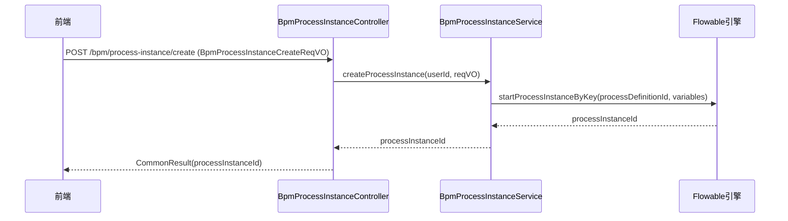

# 流程实例管理子模块（Process Instance）

## 1. 模块概述

流程实例管理子模块负责处理业务流程中**流程实例（Process Instance）**的生命周期管理。流程实例是流程定义的一次执行，代表一个具体的业务申请或事务。

## 2. 核心组件

### 2.1 控制器：`BpmProcessInstanceController`

**路径**：`yudao-module-bpm/src/main/java/cn/iocoder/yudao/module/bpm/controller/admin/task/BpmProcessInstanceController.java`

**职责**：提供流程实例的 RESTful API，包括：
- 获取我的流程实例分页（`/my-page`）
- 获取管理流程实例分页（`/manager-page`）
- 创建流程实例（`/create`）
- 获取指定流程实例（`/get`）
- 用户取消流程实例（`/cancel-by-start-user`）
- 管理员取消流程实例（`/cancel-by-admin`）
- 获取审批详情（`/get-approval-detail`）
- 获取下一个执行的审批节点（`/get-next-approval-nodes`）
- 获取 BPMN 模型视图（`/get-bpmn-model-view`）
- 获取打印数据（`/get-print-data`）

### 2.2 服务：`BpmProcessInstanceService`

**路径**：`yudao-module-bpm/src/main/java/cn/iocoder/yudao/module/bpm/service/task/BpmProcessInstanceServiceImpl.java`

**职责**：实现流程实例的业务逻辑，包括：
- 分页查询流程实例（支持当前用户和管理员）
- 创建流程实例（启动流程）
- 取消流程实例（发起人或管理员）
- 获取审批详情（包含流程变量、历史任务等）
- 获取下一个审批节点
- 获取 BPMN 模型视图
- 获取打印数据

### 2.3 抄送控制器：`BpmProcessInstanceCopyController`

**路径**：`yudao-module-bpm/src/main/java/cn/iocoder/yudao/module/bpm/controller/admin/task/BpmProcessInstanceCopyController.java`

**职责**：提供流程实例抄送相关的 API：
- 获取抄送流程实例分页（`/page`）

### 2.4 抄送服务：`BpmProcessInstanceCopyService`

**路径**：`yudao-module-bpm/src/main/java/cn/iocoder/yudao/module/bpm/service/task/BpmProcessInstanceCopyServiceImpl.java`

**职责**：管理流程实例的抄送关系，包括：
- 分页查询抄送记录
- 关联流程实例、用户和流程定义信息

## 3. 数据对象

### 3.1 请求对象（VO）

| 类名 | 用途 |
|------|------|
| `BpmProcessInstancePageReqVO` | 流程实例分页查询请求 |
| `BpmProcessInstanceCreateReqVO` | 创建流程实例请求（包含流程定义ID和变量） |
| `BpmProcessInstanceCancelReqVO` | 取消流程实例请求（包含流程实例ID） |
| `BpmApprovalDetailReqVO` | 审批详情请求（包含流程实例ID和流程变量） |
| `BpmProcessInstanceCopyPageReqVO` | 抄送流程实例分页查询请求 |

### 3.2 响应对象（VO）

| 类名 | 用途 |
|------|------|
| `BpmProcessInstanceRespVO` | 流程实例响应对象，包含实例ID、定义ID、开始时间、发起人、当前任务等信息 |
| `BpmProcessInstanceCopyRespVO` | 抄送流程实例响应对象 |
| `BpmApprovalDetailRespVO` | 审批详情响应对象，包含活动节点、流程变量等 |
| `BpmProcessInstanceBpmnModelViewRespVO` | BPMN 模型视图响应对象 |
| `BpmProcessPrintDataRespVO` | 打印数据响应对象 |

### 3.3 数据对象（DO）

- `BpmProcessInstanceCopyDO`：流程实例抄送记录，包含抄送ID、流程实例ID、抄送用户ID、开始用户ID等。

## 4. 转换器

- `BpmProcessInstanceConvert.INSTANCE`：将流程实例的 DO/VO 转换为前端展示的 VO，例如 `buildProcessInstancePage`、`buildProcessInstance`、`buildProcessInstancePrintData` 等方法。

## 5. 接口调用流程

### 5.1 获取我的流程实例分页

1. 前端调用 `GET /bpm/process-instance/my-page`，携带分页参数。
2. 控制器调用 `processInstanceService.getProcessInstancePage`，传入当前用户 ID 和分页对象。
3. 服务层查询历史流程实例，并关联任务、流程定义、分类、用户、部门等信息。
4. 通过 `BpmProcessInstanceConvert.INSTANCE.buildProcessInstancePage` 构建响应列表。
5. 返回分页结果给前端。

### 5.2 创建流程实例

**序列图**：

1. 前端调用 `POST /bpm/process-instance/create`，携带流程定义 ID 和变量。
2. 控制器调用 `processInstanceService.createProcessInstance`，传入当前用户 ID 和创建请求对象。
3. 服务层启动流程实例，返回流程实例 ID。
4. 返回成功响应。

### 5.3 审批详情

1. 前端调用 `GET /bpm/process-instance/get-approval-detail`，携带流程实例 ID 和流程变量。
2. 控制器调用 `processInstanceService.getApprovalDetail`，传入当前用户 ID 和请求对象。
3. 服务层计算审批详情，包括当前节点、历史节点、可操作节点等。
4. 返回审批详情响应。

## 6. 权限控制

所有接口均通过 `@PreAuthorize` 注解进行权限校验：
- 查询权限：`bpm:process-instance:query`（我的实例）或 `bpm:process-instance:manager-query`（管理实例）
- 取消权限：`bpm:process-instance:cancel`（发起人取消）或 `bpm:process-instance:cancel-by-admin`（管理员取消）
- 抄送权限：`bpm:process-instance-cc:query`

## 7. 依赖关系

- 依赖 `BpmTaskService` 获取任务信息
- 依赖 `BpmProcessDefinitionService` 获取流程定义信息
- 依赖 `BpmCategoryService` 获取分类信息
- 依赖系统模块的 `AdminUserApi` 和 `DeptApi` 获取用户和部门信息
