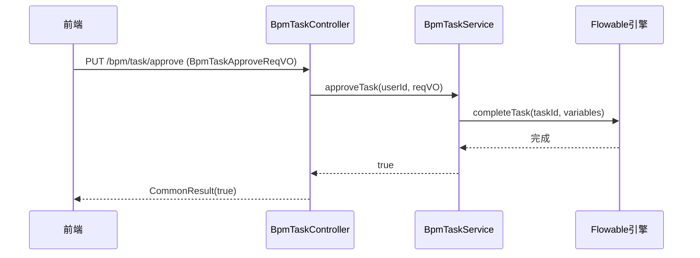

# 流程任务管理子模块（Task Management）

## 1. 模块概述

流程任务管理子模块负责处理业务流程中**流程任务（Task）**的分配、审批和管理。任务是流程实例中的一个节点，需要用户进行人工干预（如审批、填写表单等）。

## 2. 核心组件

### 2.1 控制器：`BpmTaskController`

**路径**：`yudao-module-bpm/src/main/java/cn/iocoder/yudao/module/bpm/controller/admin/task/BpmTaskController.java`

**职责**：提供任务相关的 RESTful API，包括：
- 获取待办任务分页（`/todo-page`）
- 获取已办任务分页（`/done-page`）
- 获取全部任务分页（`/manager-page`）
- 获取指定流程实例的任务列表（`/list-by-process-instance-id`）
- 审批任务（`/approve`）
- 拒绝任务（`/reject`）
- 退回任务（`/return`）
- 委派任务（`/delegate`）
- 转派任务（`/transfer`）
- 加签任务（`/create-sign`）
- 减签任务（`/delete-sign`）
- 抄送任务（`/copy`）
- 撤回任务（`/withdraw`）
- 获取父级任务的子任务列表（`/list-by-parent-task-id`）

### 2.2 服务：`BpmTaskService`

**路径**：`yudao-module-bpm/src/main/java/cn/iocoder/yudao/module/bpm/service/task/BpmTaskServiceImpl.java`

**职责**：实现任务的业务逻辑，包括：
- 分页查询待办、已办、全部任务
- 任务的各种操作（审批、拒绝、退回、委派、转派、加签、减签、抄送、撤回）
- 获取指定流程实例的任务列表
- 获取父任务的子任务
- 获取任务附件

## 3. 数据对象

### 3.1 请求对象（VO）

| 类名 | 用途 |
|------|------|
| `BpmTaskPageReqVO` | 任务分页查询请求（包含状态、流程定义ID等） |
| `BpmTaskApproveReqVO` | 审批任务请求（taskId, 变量等） |
| `BpmTaskRejectReqVO` | 拒绝任务请求（taskId, 原因等） |
| `BpmTaskReturnReqVO` | 退回任务请求（taskId, 目标节点等） |
| `BpmTaskDelegateReqVO` | 委派任务请求（taskId, 被委派人等） |
| `BpmTaskTransferReqVO` | 转派任务请求（taskId, 接收人等） |
| `BpmTaskSignCreateReqVO` | 加签任务请求（taskId, 加签人等） |
| `BpmTaskSignDeleteReqVO` | 减签任务请求（taskId, 减签任务ID等） |
| `BpmTaskCopyReqVO` | 抄送任务请求（taskId, 抄送人等） |

### 3.2 响应对象（VO）

| 类名 | 用途 |
|------|------|
| `BpmTaskRespVO` | 任务响应对象，包含任务ID、名称、流程实例ID、发起人、创建时间、附件等信息 |

### 3.3 数据对象（DO）

- 任务相关的数据对象主要在 Flowable 引擎中存储，本模块不直接定义 DO，但会使用 `HistoricTaskInstance`、`Task` 等 Flowable 对象。

## 4. 转换器

- `BpmTaskConvert.INSTANCE`：将任务数据转换为前端展示的 VO，例如 `buildTodoTaskPage`、`buildTaskPage`、`buildTaskListByProcessInstanceId`、`buildTaskListByParentTaskId` 等方法。

## 5. 接口调用流程

### 5.1 获取待办任务分页

1. 前端调用 `GET /bpm/task/todo-page`，携带分页参数。
2. 控制器调用 `taskService.getTaskTodoPage`，传入当前用户 ID 和分页对象。
3. 服务层查询当前用户的待办任务，并关联流程实例、流程定义信息。
4. 通过 `BpmTaskConvert.INSTANCE.buildTodoTaskPage` 构建响应列表。
5. 返回分页结果给前端。

### 5.2 审批任务

**序列图**：

1. 前端调用 `PUT /bpm/task/approve`，携带 taskId 和审批变量。
2. 控制器调用 `taskService.approveTask`，传入当前用户 ID 和审批请求对象。
3. 服务层执行审批操作，完成任务并可能触发下一个任务。
4. 返回成功响应。

### 5.3 退回任务

1. 前端调用 `PUT /bpm/task/return`，携带 taskId 和退回目标节点。
2. 控制器调用 `taskService.returnTask`，传入当前用户 ID 和退回请求对象。
3. 服务层执行退回操作，将流程回退到指定节点。
4. 返回成功响应。

## 6. 权限控制

所有接口均通过 `@PreAuthorize` 注解进行权限校验：
- 查询权限：`bpm:task:query`（待办/已办）或 `bpm:task:manager-query`（全部任务）
- 更新权限：`bpm:task:update`（审批、拒绝、退回、委派、转派、加签、减签、抄送、撤回）

## 7. 依赖关系

- 依赖 `BpmProcessInstanceService` 获取流程实例信息
- 依赖 `BpmFormService` 获取表单配置
- 依赖 `BpmProcessDefinitionService` 获取流程定义信息
- 依赖系统模块的 `AdminUserApi` 和 `DeptApi` 获取用户和部门信息

## 8. 特殊功能说明

### 8.1 加签与减签

- **加签**：在当前任务基础上增加一个额外的任务，由指定人员先完成，然后原任务继续。支持“前加签”和“后加签”。
- **减签**：移除之前加签的子任务。

### 8.2 委派与转派

- **委派**：将任务临时委托给他人，原任务拥有者仍可收回。
- **转派**：将任务永久转移给他人，原任务拥有者不再拥有该任务。

### 8.3 抄送

- 为任务添加抄送人，抄送人可以查看任务但不能操作。

### 8.4 撤回

- 在任务被处理之前，可以撤回任务（仅适用于当前用户自己发起的任务）。
