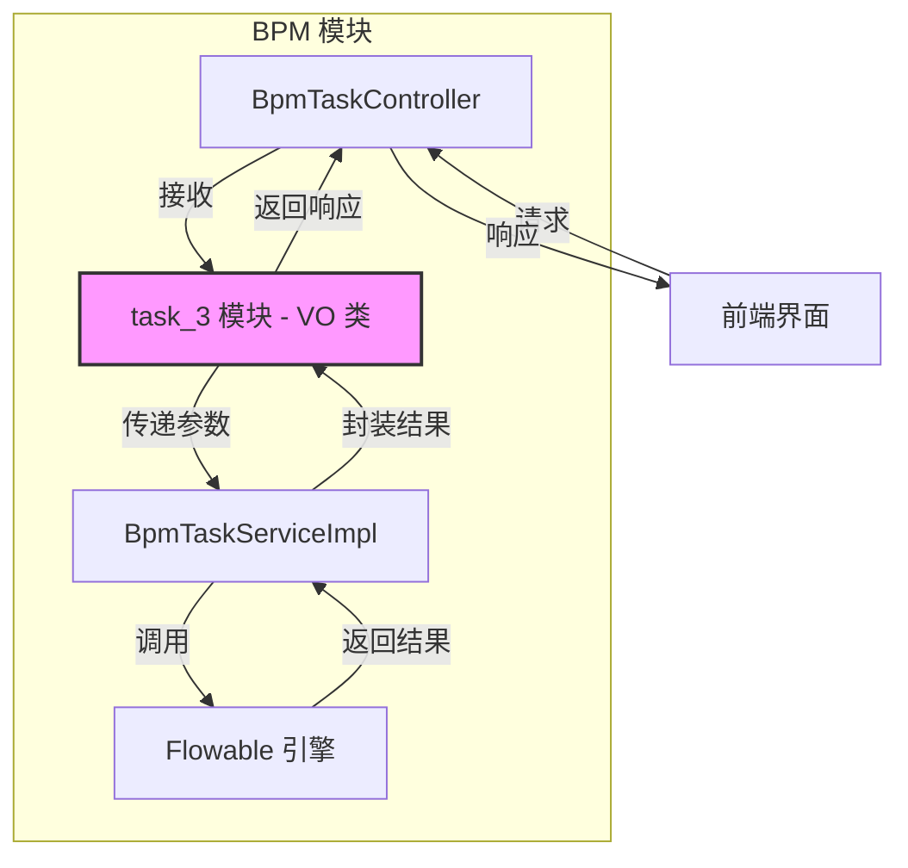
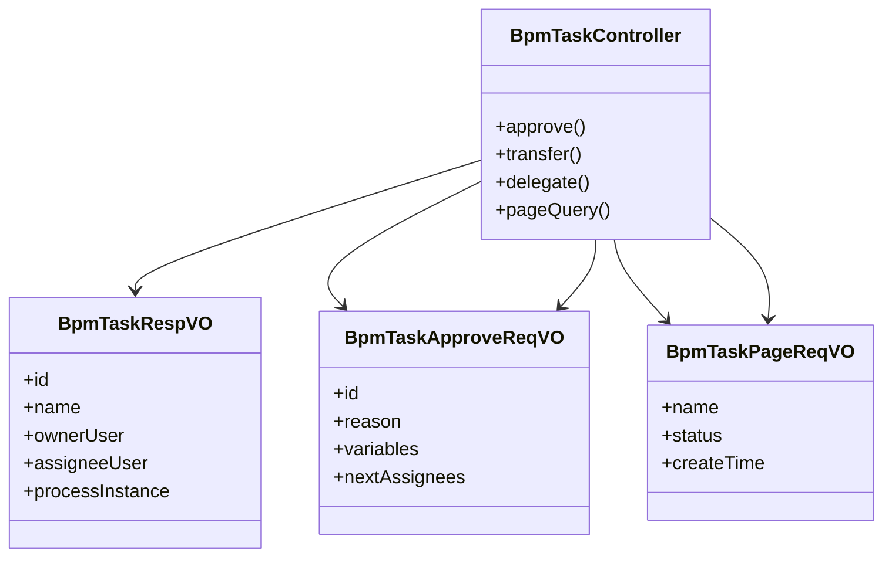
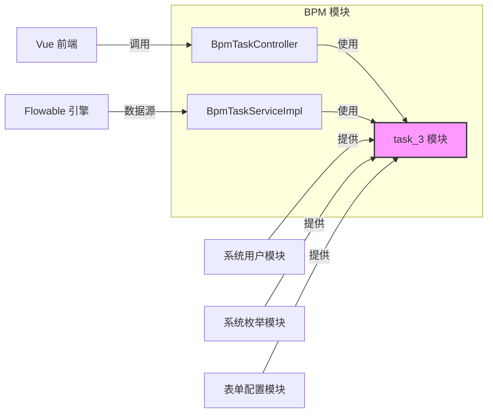
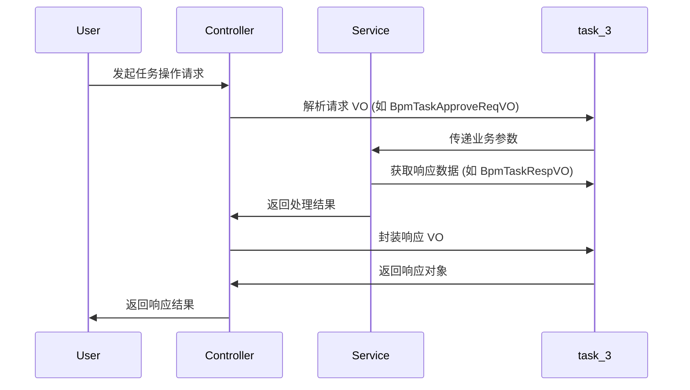

# task_3 模块文档

## 1. 模块概述

task_3 模块是 BPM（业务流程管理）模块中的一个子模块，主要负责处理流程任务相关的请求和响应对象（VO）。该模块定义了各种任务操作（如转办、抄送、退回、审批、加签、减签、委派、拒绝、分页查询等）的输入输出对象，以及任务响应对象。

## 2. 架构概览

task_3 模块是 BPM 模块中负责数据传输对象（VO）的层，与控制器层和服务层紧密协作。以下是模块的架构示意图：



### 2.1 模块分层关系



## 3. 子模块文档

- [task3 子模块文档](task3.md)：包含 task_3 模块中所有 VO 类的详细说明，包括任务操作请求 VO、任务响应 VO 和分页查询 VO 的完整 API 文档。

## 4. 与其他模块的集成

task_3 模块作为 BPM 模块的 VO 层，与多个模块紧密协作：

### 4.1 BPM 核心模块

- **BpmTaskController**：接收前端请求，调用 task_3 模块的 VO 进行参数绑定和结果封装。
- **BpmTaskServiceImpl**：执行业务逻辑，使用 task_3 模块的 VO 作为数据传输对象。
- **Flowable 引擎**：底层流程引擎，task_3 模块的 VO 用于封装引擎返回的任务数据。

### 4.2 系统模块

- **系统用户模块**：BpmTaskRespVO 中包含 UserSimpleBaseVO 用于展示用户信息。
- **系统枚举模块**：BpmTaskPageReqVO 中引用 BpmTaskStatusEnum 进行状态验证。
- **表单配置模块**：BpmTaskRespVO 中包含表单相关字段（formId, formConf, formFields 等）。

### 4.3 前端模块

- **Vue 前端**：通过 API 接口与 task_3 模块的 VO 进行数据交互，前端 TypeScript 接口定义与 Java VO 保持一致。

### 4.4 依赖关系图



## 5. 核心功能说明

### 5.1 任务操作请求 VO

| VO 类 | 功能描述 |
|-------|----------|
| BpmTaskTransferReqVO | 任务转办请求，包含任务编号、新审批人编号和转办原因 |
| BpmTaskCopyReqVO | 任务抄送请求，包含任务编号、抄送用户列表和抄送意见 |
| BpmTaskReturnReqVO | 任务退回请求，包含任务编号、退回目标任务键和退回意见 |
| BpmTaskApproveReqVO | 任务审批请求，包含任务编号、审批意见、签名、附件、变量和下一个节点审批人 |
| BpmTaskSignDeleteReqVO | 减签请求，包含任务编号和减签原因 |
| BpmTaskDelegateReqVO | 任务委派请求，包含任务编号、被委派人编号和委派原因 |
| BpmTaskRejectReqVO | 任务拒绝请求，包含任务编号、审批意见和附件 |
| BpmTaskSignCreateReqVO | 加签请求，包含任务编号、加签用户列表、加签类型和加签原因 |

### 5.2 任务响应 VO

- **BpmTaskRespVO**：任务响应对象，包含任务详细信息、操作按钮设置、流程实例信息等。

### 5.3 分页查询 VO

- **BpmTaskPageReqVO**：任务分页查询请求，支持按任务名、流程分类、流程定义标识、状态和创建时间进行筛选。

## 6. 数据流说明



## 7. 使用示例

### 7.1 审批任务

```java
BpmTaskApproveReqVO approveReq = new BpmTaskApproveReqVO();
approveReq.setId("task123");
approveReq.setReason("审批通过");
approveReq.setSignPicUrl("https://example.com/sign.png");
approveReq.setVariables(Map.of("amount", 1000));
// 调用服务层方法处理审批
```

### 7.2 查询任务列表

```java
BpmTaskPageReqVO pageReq = new BpmTaskPageReqVO();
pageReq.setCurrent(1);
pageReq.setSize(10);
pageReq.setStatus(BpmTaskStatusEnum.PENDING.getValue());
// 调用服务层方法获取任务列表
```

## 8. 注意事项

- 所有请求 VO 都包含任务编号（id）字段，且为非空验证。
- 审批和拒绝操作支持附件和签名功能。
- 加签和减签操作支持多用户操作。
- 任务响应对象包含嵌套的流程实例信息和操作按钮设置。
