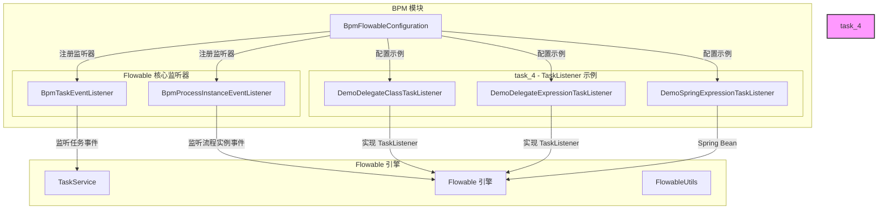
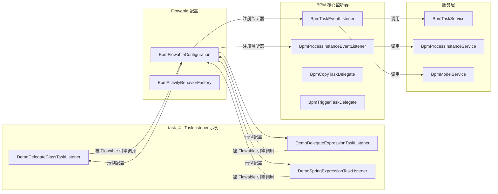

# task_4 模块文档 - Flowable 任务监听器示例

## 1. 模块概述

**task_4** 是 BPM（业务流程管理）模块中的一个子模块，专门用于提供 Flowable 引擎中 **TaskListener（任务监听器）** 的三种实现方式的示例代码。该模块位于 `yudao-module-bpm/src/main/java/cn/iocoder/yudao/module/bpm/framework/flowable/core/listener/demo/task/` 路径下。

在 Flowable 工作流引擎中，TaskListener 用于在任务生命周期中的特定时机（如任务创建、分配、完成等）执行自定义的业务逻辑。本模块提供了三种注册 TaskListener 的标准方式，供开发者参考和扩展。

## 2. 架构概览



## 3. 核心组件详解

### 3.1 DemoDelegateClassTaskListener

**文件路径**: `yudao-module-bpm/src/main/java/cn/iocoder/yudao/module/bpm/framework/flowable/core/listener/demo/task/DemoDelegateClassTaskListener.java`

**实现方式**: `class` 方式（直接实现 TaskListener 接口）

```java
@Slf4j
public class DemoDelegateClassTaskListener implements TaskListener {

    @Override
    public void notify(DelegateTask delegateTask) {
        log.info("[execute][task({}) 被调用]", delegateTask.getId());
    }
}
```

**特点**:
- 直接实现 Flowable 的 `TaskListener` 接口
- 在 BPMN 流程图中通过 `delegateExpression` 属性指定类的全限定名
- **优点**: 简单直接，无需 Spring 容器管理
- **缺点**: 无法使用 Spring 的依赖注入（@Resource, @Autowired 等）

**适用场景**: 简单的任务监听逻辑，不需要注入 Spring Bean 的情况。

### 3.2 DemoDelegateExpressionTaskListener

**文件路径**: `yudao-module-bpm/src/main/java/cn/iocoder/yudao/module/bpm/framework/flowable/core/listener/demo/task/DemoDelegateExpressionTaskListener.java`

**实现方式**: `delegateExpression` 方式（Spring Bean + 实现 TaskListener 接口）

```java
@Component
@Slf4j
public class DemoDelegateExpressionTaskListener implements TaskListener {

    @Override
    public void notify(DelegateTask delegateTask) {
        log.info("[execute][task({}) 被调用]", delegateTask.getId());
    }
}
```

**特点**:
- 使用 `@Component` 注解注册为 Spring Bean
- 同样实现 `TaskListener` 接口
- 在 BPMN 流程图中通过 `delegateExpression` 属性指定 Spring Bean 的名称
- **优点**: 可以使用 Spring 的依赖注入，功能更强大
- **缺点**: 需要 Spring 容器管理

**适用场景**: 任务监听器需要注入其他 Spring Bean 的情况。

### 3.3 DemoSpringExpressionTaskListener

**文件路径**: `yudao-module-bpm/src/main/java/cn/iocoder/yudao/module/bpm/framework/flowable/core/listener/demo/task/DemoSpringExpressionTaskListener.java`

**实现方式**: `expression` 方式（Spring Bean + 普通方法）

```java
@Slf4j
@Component
public class DemoSpringExpressionTaskListener {

    public void notify(DelegateTask delegateTask) {
        log.info("[execute][task({}) 被调用]", delegateTask.getId());
    }
}
```

**特点**:
- 使用 `@Component` 注解注册为 Spring Bean
- **不实现**任何接口，只是一个普通的 Spring Bean
- 在 BPMN 流程图中通过 `expression` 属性指定 Spring Bean 的名称和方法名（如 `${demoSpringExpressionTaskListener.notify}`）
- **优点**: 最灵活，不需要实现任何接口，方法名可自定义
- **缺点**: BPMN 配置稍复杂

**适用场景**: 需要高度灵活的任务监听逻辑，或者方法名需要自定义的情况。

## 4. 三种注册方式对比

| 特性 | `class` 方式 | `delegateExpression` 方式 | `expression` 方式 |
|------|-------------|--------------------------|------------------|
| BPMN 属性 | `class` | `delegateExpression` | `expression` |
| 实现接口 | 实现 `TaskListener` | 实现 `TaskListener` | 无需实现接口 |
| Spring Bean | 不需要 | 需要 | 需要 |
| 依赖注入 | ❌ 不支持 | ✅ 支持 | ✅ 支持 |
| 方法名固定 | `notify()` | `notify()` | 可自定义 |
| 复杂度 | 低 | 中 | 高 |
| 推荐度 | ⭐⭐ | ⭐⭐⭐⭐ | ⭐⭐⭐⭐ |

## 5. 与 BPM 模块其他组件的关系

task_4 模块与 BPM 模块的其他组件紧密协作：



### 5.1 与 BpmFlowableConfiguration 的关系

`BpmFlowableConfiguration` 是 BPM 模块的核心配置类，负责：
- 注册 TaskExecutor（线程池）
- 注册各种 Flowable 监听器（包括 BpmTaskEventListener 和 BpmProcessInstanceEventListener）
- 配置自定义的 ActivityBehaviorFactory
- 注册自定义的函数委托

虽然 task_4 中的示例监听器不直接由 `BpmFlowableConfiguration` 注册，但它们展示了如何在实际业务流程中使用这些监听器。

### 5.2 与 BpmTaskEventListener 的关系

`BpmTaskEventListener` 是 BPM 模块实际使用的任务监听器，监听任务生命周期事件（创建、分配、完成、取消、定时器等），并调用相应的服务类处理业务逻辑。task_4 中的示例监听器展示了如何在 BPMN 流程图中自定义任务监听器，与 BpmTaskEventListener 形成互补。

## 6. 使用示例

### 6.1 在 BPMN 流程图中配置 TaskListener

#### 方式一：class 方式

```xml
<userTask id="userTask1" name="审批任务">
    <extensionElements>
        <flowable:taskListener class="cn.iocoder.yudao.module.bpm.framework.flowable.core.listener.demo.task.DemoDelegateClassTaskListener" event="create"/>
    </extensionElements>
</userTask>
```

#### 方式二：delegateExpression 方式

```xml
<userTask id="userTask1" name="审批任务">
    <extensionElements>
        <flowable:taskListener expression="${demoDelegateExpressionTaskListener}" event="create"/>
    </extensionElements>
</userTask>
```

#### 方式三：expression 方式

```xml
<userTask id="userTask1" name="审批任务">
    <extensionElements>
        <flowable:taskListener expression="${demoSpringExpressionTaskListener.notify}" event="create"/>
    </extensionElements>
</userTask>
```

### 6.2 监听事件类型

TaskListener 支持的事件类型包括：
- `create`：任务创建时触发
- `assign`：任务分配时触发
- `complete`：任务完成时触发
- `delete`：任务删除时触发

## 7. 相关模块参考

- [bpm_flowable_config](bpm_flowable_configuration.md) - Flowable 引擎配置
- [bpm_task_listener](bpm_task_listener.md) - 实际使用的任务监听器
- [bpm_process_instance](bpm_process_instance.md) - 流程实例管理
- [bpm_util](bpm_util.md) - BPM 工具类

## 8. 总结

task_4 模块作为 BPM 模块中的示例模块，提供了 Flowable TaskListener 的三种实现方式，帮助开发者理解如何在业务流程中自定义任务监听逻辑。虽然这些示例类本身不直接参与生产环境的业务处理，但它们展示了正确的实现模式，是开发者扩展 BPM 功能的重要参考。
