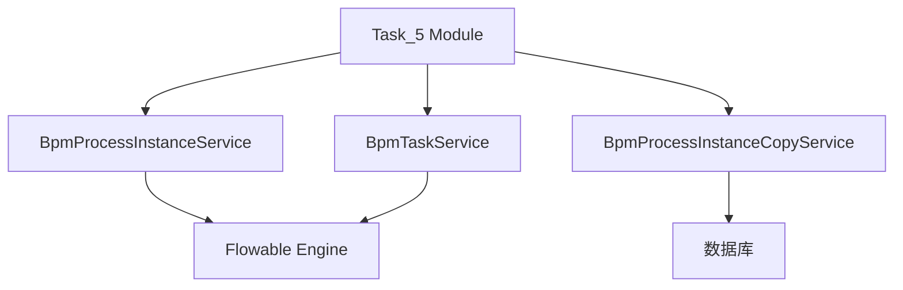
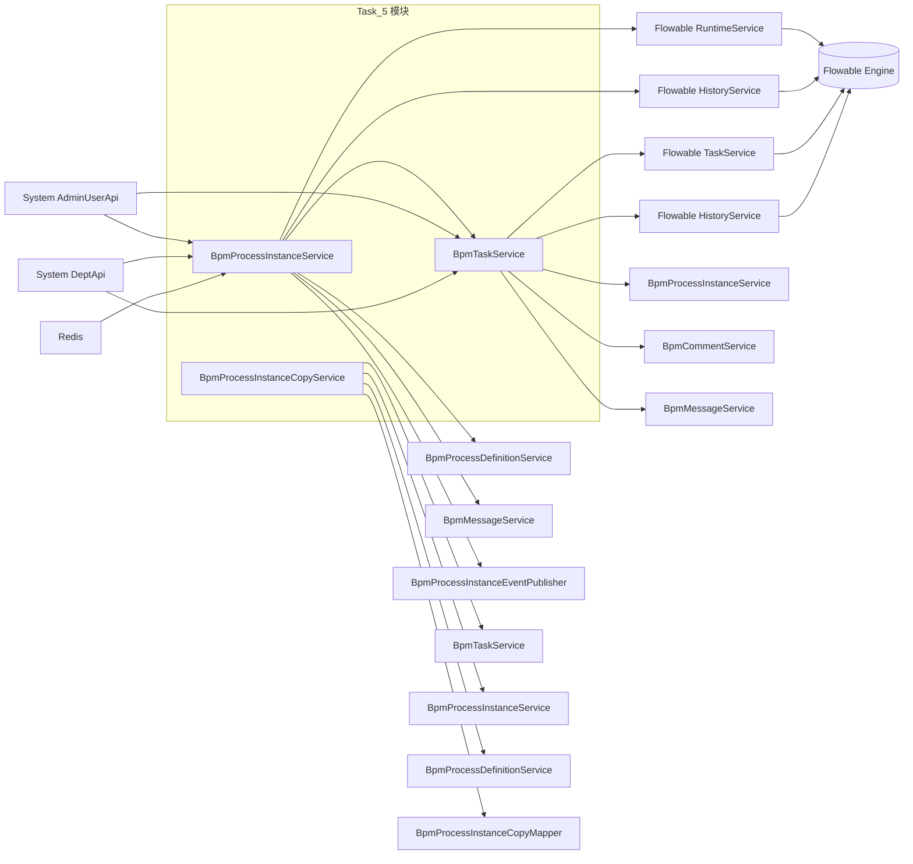

# Task_5 模块文档

## 1. 模块概述

Task_5 模块是 BPM（业务流程管理）系统中的核心任务处理模块，主要负责流程实例（Process Instance）和任务（Task）的管理。该模块提供了流程实例的创建、查询、取消、审批详情等接口，以及任务的待办、已办、审批、驳回、转派、加签、减签等操作。

## 2. 架构概览

### 2.1 模块结构

Task_5 模块包含以下三个核心服务：

- **BpmProcessInstanceService**: 流程实例服务，负责流程实例的生命周期管理。
- **BpmProcessInstanceCopyService**: 流程抄送服务，负责流程实例的抄送管理。
- **BpmTaskService**: 任务服务，负责流程任务的各种操作。

### 2.2 组件关系图

### 2.3 数据流

- 流程实例的创建和查询通过 `BpmProcessInstanceService` 与 Flowable 引擎交互。
- 任务的操作通过 `BpmTaskService` 与 Flowable 引擎交互。
- 流程抄送信息存储在数据库中，由 `BpmProcessInstanceCopyService` 管理。

## 3. 子模块文档

### 3.1 BpmProcessInstanceService - 流程实例管理

负责流程实例的全生命周期管理，包括流程创建、查询、审批详情、取消等操作。

- [详细文档](task_5_process_instance.md)

### 3.2 BpmProcessInstanceCopyService - 流程抄送管理

负责流程抄送管理，记录流程抄送信息并提供查询接口。

- [详细文档](task_5_process_instance_copy.md)

### 3.3 BpmTaskService - 任务管理

负责流程任务的各种操作，包括待办/已办查询、审批、驳回、转派、加签、减签等。

- [详细文档](task_5_task.md)

## 3.4 模块交互关系

## 4. 与其他模块的集成

- **BPM 模块**: Task_5 模块是 BPM 模块的一部分，与 BPM 模块的其他子模块（如流程定义、表单等）紧密集成。
- **系统模块**: 与系统模块的用户、部门等基础数据进行交互，用于审批人、抄送人等权限控制。
- **消息模块**: 在流程实例状态变更时，通过消息模块发送通知。

## 5. 参考文档

- [BPM 模块总文档](../bpm.md)
- [系统模块文档](../system.md)