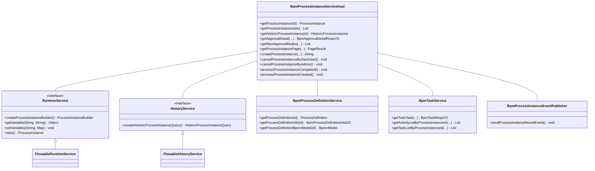
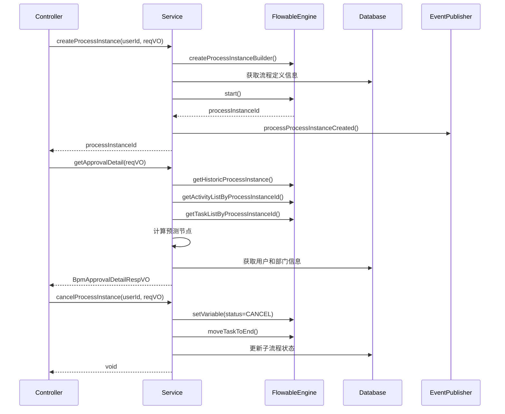
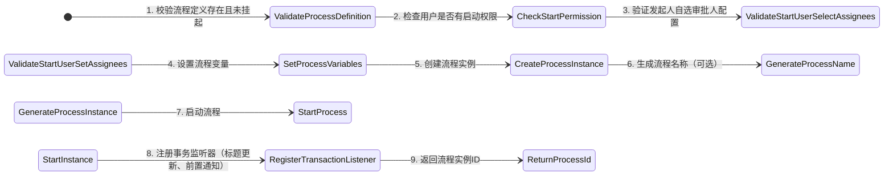
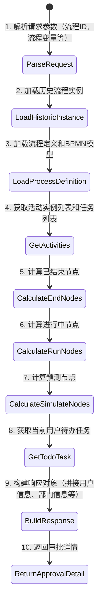
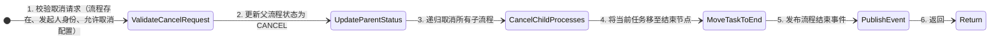

# Task 5 Process Instance Module Documentation

## 1. 模块概述

**Task 5 Process Instance** 是 Yudao BPM 模块中的核心组件，负责业务流程实例的全生命周期管理。该模块基于 Flowable 工作流引擎，提供了流程实例的创建、查询、审批、取消、状态跟踪等完整功能，支持 BPMN 和 SIMPLE 两种流程定义模型。

### 1.1 模块定位

```
┌─────────────────────────────────────────────────────────────┐
│                    BPM 模块                                  │
│  ┌───────────────────────────────────────────────────────┐  │
│  │              Task 5 Process Instance                  │  │
│  │   (流程实例管理服务)                                 │  │
│  ├───────────────────────────────────────────────────────┤  │
│  │ • 流程实例创建 (createProcessInstance)                │  │
│  │ • 流程实例查询 (getProcessInstance, getHistoric...)   │  │
│  │ • 审批详情获取 (getApprovalDetail)                    │  │
│  │ • 流程取消 (cancelProcessInstance)                    │  │
│  │ • 流程状态更新 (updateProcessInstanceReject)          │  │
│  │ • 事件监听处理 (processProcessInstanceCompleted/...)  │  │
│  │ • 预测节点计算 (getNextApprovalNodes)                 │  │
│  └───────────────────────────────────────────────────────┘  │
└─────────────────────────────────────────────────────────────┘
```

### 1.2 核心功能

| 功能类别 | 描述 |
|---------|------|
| **流程实例管理** | 创建、查询、取消、更新流程实例状态 |
| **审批详情** | 获取流程审批历史、进行中节点、预测未来节点 |
| **事件处理** | 流程完成、创建后的事件通知和处理 |
| **权限控制** | 数据权限过滤、发起人验证、管理员权限校验 |
| **模型支持** | 支持 BPMN 和 SIMPLE 两种流程定义模型 |

## 2. 架构设计

### 2.1 组件关系图



### 2.2 数据流图



## 3. 核心类说明

### 3.1 BpmProcessInstanceServiceImpl

这是流程实例服务的核心实现类，实现了 `BpmProcessInstanceService` 接口。

#### 3.1.1 主要职责

- **流程实例查询**: 提供运行中和历史流程实例的查询方法
- **审批详情**: 构建完整的审批流程视图，包括已结束、进行中和预测节点
- **流程创建**: 启动新的流程实例，设置初始变量和权限
- **流程取消**: 支持发起人和管理员取消流程
- **事件处理**: 监听流程生命周期事件并执行后续操作

#### 3.1.2 关键方法

| 方法名 | 描述 | 返回值 |
|-------|------|--------|
| `getProcessInstance` | 获取指定ID的运行中流程实例 | `ProcessInstance` |
| `getHistoricProcessInstance` | 获取指定ID的历史流程实例（含已结束） | `HistoricProcessInstance` |
| `getApprovalDetail` | 获取流程审批详情，包含所有节点状态 | `BpmApprovalDetailRespVO` |
| `getNextApprovalNodes` | 获取当前任务之后的下一个审批节点 | `List<ActivityNode>` |
| `getProcessInstancePage` | 分页查询历史流程实例 | `PageResult<HistoricProcessInstance>` |
| `createProcessInstance` | 创建并启动一个新的流程实例 | `String` (流程ID) |
| `cancelProcessInstanceByStartUser` | 由发起人取消流程 | `void` |
| `cancelProcessInstanceByAdmin` | 由管理员强制取消流程 | `void` |
| `processProcessInstanceCompleted` | 流程完成时的后置处理 | `void` |
| `processProcessInstanceCreated` | 流程创建时的前置处理 | `void` |

#### 3.1.3 依赖注入

```java
@Resource private RuntimeService runtimeService;      // Flowable运行时服务
@Resource private HistoryService historyService;       // Flowable历史服务
@Resource private BpmProcessDefinitionService processDefinitionService; // 流程定义服务
@Resource @Lazy private BpmTaskService taskService;    // 任务服务
@Resource private BpmMessageService messageService;    // 消息服务
@Resource private AdminUserApi adminUserApi;           // 用户API
@Resource private DeptApi deptApi;                     // 部门API
@Resource private BpmProcessInstanceEventPublisher processInstanceEventPublisher; // 事件发布器
@Resource private BpmTaskCandidateInvoker taskCandidateInvoker; // 候选人计算
@Resource private BpmProcessIdRedisDAO processIdRedisDAO; // Redis流程ID生成器
```

### 3.2 相关辅助类

#### 3.2.1 BpmApprovalDetailRespVO

审批详情响应对象，包含：

- `activityNodes`: 所有审批活动节点列表（已结束、进行中、预测）
- `processInstance`: 流程实例基本信息
- `processDefinition`: 流程定义信息
- `todoTask`: 当前用户的待办任务

#### 3.2.2 ActivityNode

单个审批活动节点的信息：

- `id`: 节点ID
- `name`: 节点名称
- `nodeType`: 节点类型（开始节点、审批节点、结束节点、子流程等）
- `status`: 节点状态（未开始、进行中、已完成、已拒绝等）
- `candidateStrategy`: 候选策略（会签、或签、发起人自选等）
- `candidateUserIds`: 候选人用户ID列表
- `tasks`: 具体任务信息列表

#### 3.2.3 ActivityNodeTask

单个任务的详细信息：

- `assignee`: 承办人
- `owner`: 原负责人（加签场景）
- `status`: 任务状态
- `reason`: 拒绝原因

## 4. 核心流程详解

### 4.1 创建流程实例流程



**关键代码片段：**

```java
// 设置流程变量
variables.put(BpmnVariableConstants.PROCESS_INSTANCE_VARIABLE_START_USER_ID, userId);
variables.put(BpmnVariableConstants.PROCESS_INSTANCE_VARIABLE_STATUS, 
              BpmProcessInstanceStatusEnum.RUNNING.getStatus());
variables.put(BpmnVariableConstants.PROCESS_INSTANCE_SKIP_EXPRESSION_ENABLED, true);

// 创建流程实例
ProcessInstanceBuilder processInstanceBuilder = runtimeService.createProcessInstanceBuilder()
    .processDefinitionId(definition.getId())
    .businessKey(businessKey)
    .variables(variables);

// 预定义流程ID（如果启用）
if (processIdRule != null && Boolean.TRUE.equals(processIdRule.getEnable())) {
    processInstanceBuilder.predefineProcessInstanceId(
        processIdRedisDAO.generate(processIdRule));
}

ProcessInstance instance = processInstanceBuilder.start();
```

### 4.2 审批详情获取流程



**三种节点类型的计算逻辑：**

1. **已结束节点 (`getEndActivityNodeList`)**:
   - 遍历 HistoricTaskInstance，筛选 endTime 不为空的任务
   - 处理 StartEvent、EndEvent、CallActivity 等事件
   - 获取任务附件信息

2. **进行中节点 (`getRunApproveNodeList`)**:
   - 按 activityId 分组 HistoricActivityInstance
   - 处理会签/或签场景
   - 依次审批时预测后续候选人

3. **预测节点 (`getSimulateApproveNodeList`)**:
   - BPMN 模型：使用 `BpmnModelUtils.simulateProcess()` 模拟流程走向
   - SIMPLE 模型：使用 `SimpleModelUtils.simulateProcess()` 模拟
   - 排除已运行的节点，根据回退变量重新计算需要预测的节点

### 4.3 流程取消流程



**取消逻辑要点：**

- 只能取消自己的流程（除非是管理员）
- 需检查流程定义是否允许取消运行中的流程
- 子流程不允许单独取消
- 使用事务监听确保在事务提交后执行结束操作

## 5. 数据类型与常量

### 5.1 流程状态枚举

```java
public enum BpmProcessInstanceStatusEnum {
    NOT_START(0, "未开始"),     // 流程尚未启动
    RUNNING(1, "审批中"),       // 流程正在处理中
    APPROVE(2, "已通过"),       // 流程审批通过
    REJECT(3, "已拒绝"),        // 流程被拒绝
    CANCEL(4, "已取消");        // 流程被取消
}
```

### 5.2 节点类型枚举

```java
public enum BpmSimpleModelNodeTypeEnum {
    START_USER_NODE("start_user", "开始节点"),     // 开始用户节点
    APPROVE_NODE("approve", "审批节点"),          // 普通审批节点
    END_NODE("end", "结束节点"),                  // 结束节点
    COPY_NODE("copy", "抄送节点"),               // 抄送节点
    TRANSACTOR_NODE("transactor", "办理节点"),    // 办理节点
    CHILD_PROCESS("child_process", "子流程");     // 子流程节点
}
```

### 5.3 候选策略枚举

```java
public enum BpmTaskCandidateStrategyEnum {
    USER("user", "指定用户"),                   // 指定具体用户
    DEPT_LEADER("dept_leader", "部门领导"),     // 部门领导
    START_USER("start_user", "发起人自选"),     // 发起人自选审批人
    EXPRESSION("expression", "表达式");         // 表达式计算
}
```

## 6. 与其他模块的交互

### 6.1 BPM 模块内部交互

| 模块 | 交互方式 | 说明 |
|------|---------|------|
| **BpmTaskService** | 依赖注入 | 获取任务列表、待办任务、活动实例等 |
| **BpmProcessDefinitionService** | 依赖注入 | 获取流程定义、BPMN模型、流程信息 |
| **BpmMessageService** | 依赖注入 | 发送流程审批通过/拒绝的消息通知 |
| **BpmProcessInstanceEventPublisher** | 依赖注入 | 发布流程状态变更事件 |

### 6.2 System 模块交互

| API | 用途 |
|-----|------|
| `AdminUserApi.getUserMap()` | 批量获取用户信息，用于审批节点显示 |
| `DeptApi.getDeptMap()` | 批量获取部门信息，用于显示审批人部门 |

### 6.3 Redis 模块交互

- **BpmProcessIdRedisDAO**: 用于生成自定义的流程实例ID，支持基于规则的配置（如时间戳+随机数）

## 7. 异常处理

模块使用统一的异常处理机制，通过 `ErrorCodeConstants` 定义错误码：

| 错误码 | 含义 |
|-------|------|
| `PROCESS_INSTANCE_NOT_EXISTS` | 流程实例不存在 |
| `PROCESS_DEFINITION_NOT_EXISTS` | 流程定义不存在 |
| `PROCESS_DEFINITION_IS_SUSPENDED` | 流程定义已挂起 |
| `PROCESS_INSTANCE_START_USER_CAN_START` | 用户无权限启动该流程 |
| `PROCESS_INSTANCE_START_USER_SELECT_ASSIGNEES_NOT_CONFIG` | 发起人自选审批人未配置 |
| `PROCESS_INSTANCE_START_USER_SELECT_ASSIGNEES_NOT_EXISTS` | 发起人自选审批人不存在 |
| `PROCESS_INSTANCE_CANCEL_FAIL_NOT_EXISTS` | 取消失败：流程实例不存在 |
| `PROCESS_INSTANCE_CANCEL_FAIL_NOT_SELF` | 取消失败：非本人流程 |
| `PROCESS_INSTANCE_CANCEL_FAIL_NOT_ALLOW` | 取消失败：不允许取消运行中的流程 |
| `PROCESS_INSTANCE_CANCEL_CHILD_FAIL_NOT_ALLOW` | 取消失败：子流程不允许取消 |

## 8. 性能优化要点

1. **批量查询**: 使用 `getUserMap()`、`getDeptMap()` 等方法批量获取用户和部门信息，避免 N+1 查询问题
2. **缓存策略**: 流程定义信息、BPMN 模型等在服务层有缓存，减少数据库访问
3. **事务优化**: 使用 `TransactionSynchronizationManager` 注册事务监听器，确保在事务提交后再执行某些操作（如更新流程标题）
4. **懒加载**: 使用 `@Lazy` 注解避免循环依赖（如 BpmProcessInstanceServiceImpl 依赖 BpmTaskService）
5. **分页查询**: 流程实例列表查询支持分页，使用 `PageUtils` 工具类

## 9. 测试要点

### 9.1 单元测试重点

1. **流程创建测试**: 验证不同模型类型（BPMN/SIMPLE）的流程创建逻辑
2. **审批详情测试**: 验证已结束、进行中、预测节点的计算准确性
3. **取消流程测试**: 验证取消权限检查和级联取消逻辑
4. **事件处理测试**: 验证流程完成和创建后的事件通知是否正确触发

### 9.2 集成测试建议

1. 使用 Testcontainers 搭建 Flowable 引擎进行端到端测试
2. 测试各种边界情况（如会签、或签、子流程、驳回场景等）
3. 验证数据权限对流程查询的影响

## 10. 扩展点

1. **流程ID生成**: 通过 `BpmModelMetaInfoVO.ProcessIdRule` 配置自定义流程ID生成策略
2. **流程标题生成**: 通过 `BpmModelMetaInfoVO.TitleSetting` 配置流程标题模板
3. **前后置通知**: 通过 `BpmModelMetaInfoVO.HttpRequestSetting` 配置流程启动前/后的HTTP通知
4. **数据权限**: 通过 `@DataPermission` 注解控制流程实例的数据权限访问

## 11. 参考文档

- [BPM 模块整体设计](bpm_module_overview.md)
- [BpmTaskServiceImpl 文档](task_5_task.md)
- [BpmProcessInstanceCopyServiceImpl 文档](task_5_process_instance_copy.md)
- [Flowable 官方文档](https://flowable.org/open-source/docs/)
- [BPMN 2.0 规范](https://www.omg.org/spec/BPMN/2.0/)

---

*文档生成日期: 2024年 | 维护团队: Yudao BPM 开发组*
