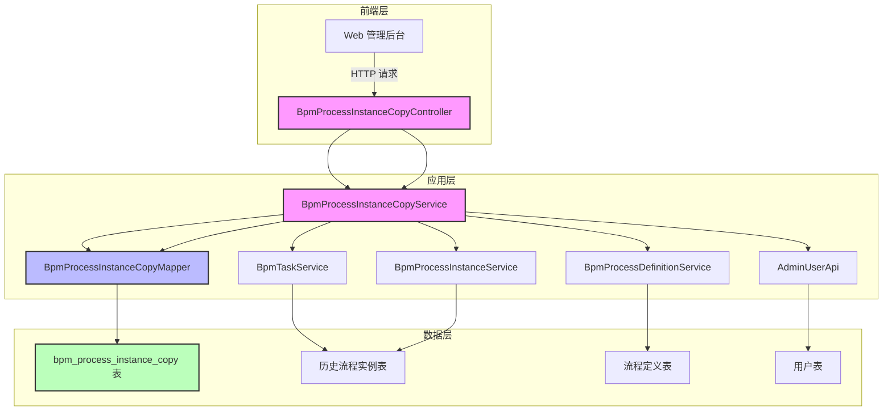
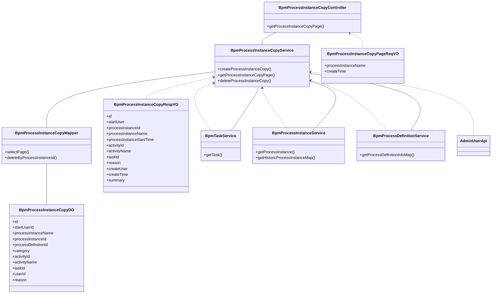
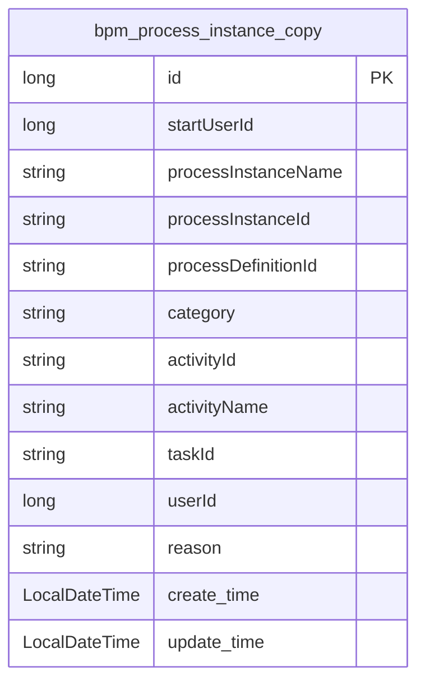
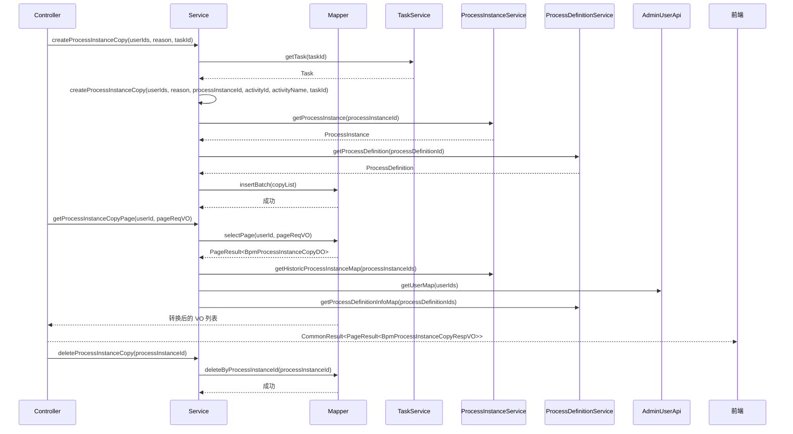
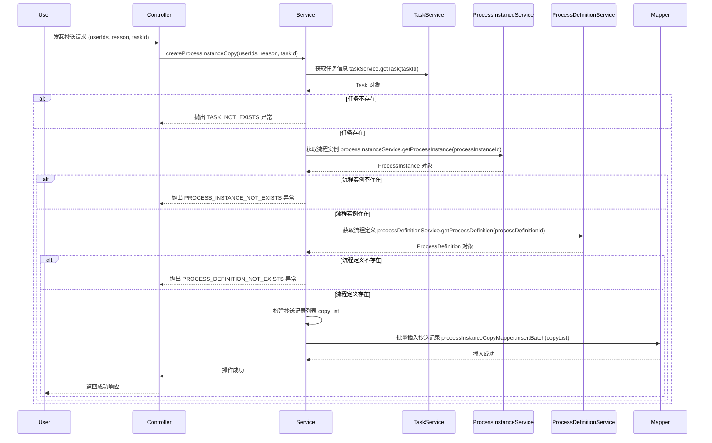
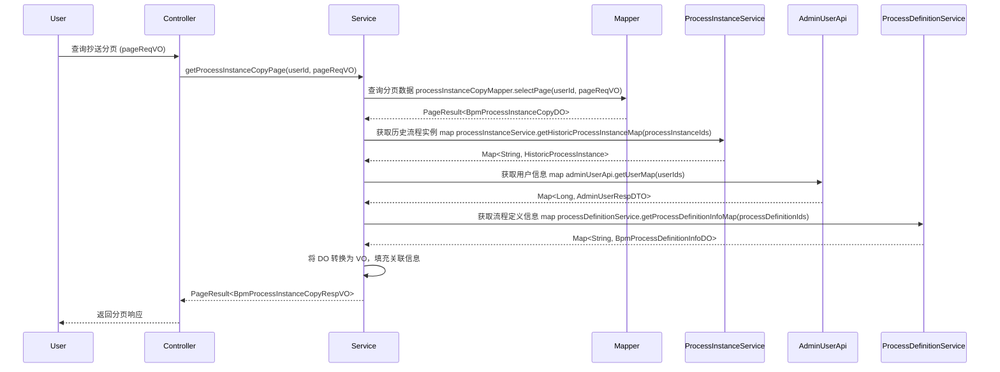
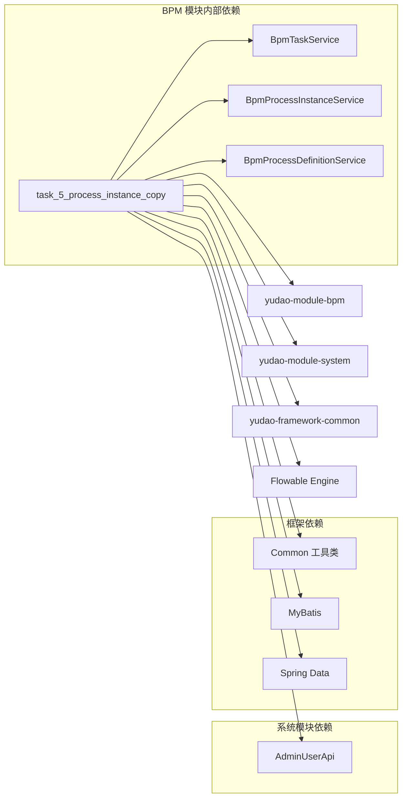

# 流程实例抄送模块 (task_5_process_instance_copy)

## 1. 模块概述

流程实例抄送模块是 BPM（业务流程管理）系统中的核心功能之一，用于在流程执行过程中将当前任务抄送给其他用户，实现流程的透明化和协同处理。该模块支持管理员在审批流程时，将任务抄送给指定用户，并记录抄送信息以便后续追踪和审计。

**核心功能：**
- 创建流程实例抄送记录
- 查询抄送流程分页列表
- 删除指定流程实例的抄送记录

**模块定位：**
- 属于 `yudao-module-bpm` 模块下的任务管理子模块
- 与 `BpmProcessInstanceService`（流程实例服务）、`BpmTaskService`（流程任务服务）、`BpmProcessDefinitionService`（流程定义服务）紧密协作
- 为前端提供 RESTful API 接口，支持 Web 管理后台操作

## 2. 架构设计

### 2.1 系统架构



### 2.2 组件关系



## 3. 核心组件说明

### 3.1 数据对象 (DO)

**BpmProcessInstanceCopyDO** - 流程实例抄送数据对象



**字段说明：**

| 字段名 | 类型 | 说明 |
|--------|------|------|
| id | Long | 主键 |
| startUserId | Long | 发起人 ID（冗余 ProcessInstance 的 startUserId 字段） |
| processInstanceName | String | 流程实例名称（冗余 ProcessInstance 的 name 字段） |
| processInstanceId | String | 流程实例编号，关联 ProcessInstance 的 id |
| processDefinitionId | String | 流程定义编号，关联 ProcessInstance 的 processDefinitionId |
| category | String | 流程分类（冗余 ProcessInstance 的 category 字段） |
| activityId | String | 流程活动编号，对应 BPMN XML 节点编号 |
| activityName | String | 流程活动名字 |
| taskId | String | 任务编号，关联 HistoricTaskInstance 的 id |
| userId | Long | 被抄送用户编号，关联 system_users 的 id |
| reason | String | 抄送意见 |
| create_time | LocalDateTime | 创建时间 |
| update_time | LocalDateTime | 更新时间 |

### 3.2 服务接口 (Service)

**BpmProcessInstanceCopyService** - 流程实例抄送服务接口



**主要方法：**

| 方法名 | 参数 | 说明 |
|--------|------|------|
| createProcessInstanceCopy | Collection<Long> userIds, String reason, String taskId | 管理员创建流程实例抄送（从任务发起） |
| createProcessInstanceCopy | Collection<Long> userIds, String reason, String processInstanceId, String activityId, String activityName, String taskId | 自动创建流程实例抄送 |
| getProcessInstanceCopyPage | Long userId, BpmProcessInstanceCopyPageReqVO pageReqVO | 获得抄送流程的分页列表 |
| deleteProcessInstanceCopy | String processInstanceId | 删除指定流程实例的抄送记录 |

### 3.3 控制器 (Controller)

**BpmProcessInstanceCopyController** - 流程实例抄送控制器

提供 RESTful API 接口，主要端点：

| HTTP 方法 | 端点 | 说明 |
|-----------|------|------|
| GET | /bpm/process-instance/copy/page | 获得抄送流程分页列表 |

**权限控制：** 使用 `@PreAuthorize("@ss.hasPermission('bpm:process-instance-cc:query')")` 进行权限校验，只有拥有 `bpm:process-instance-cc:query` 权限的用户才能访问。

### 3.4 视图对象 (VO)

**BpmProcessInstanceCopyRespVO** - 抄送响应视图对象

包含抄送记录的详细信息，经过与历史流程实例、流程定义、用户信息的关联查询后返回给前端。

**BpmProcessInstanceCopyPageReqVO** - 分页请求对象

| 字段 | 类型 | 说明 |
|------|------|------|
| processInstanceName | String | 流程名称（模糊查询） |
| createTime | LocalDateTime[] | 创建时间范围 |

### 3.5 数据访问层 (Mapper)

**BpmProcessInstanceCopyMapper** - 数据访问接口

继承自 `BaseMapperX<BpmProcessInstanceCopyDO>`，提供扩展方法：

| 方法名 | 说明 |
|--------|------|
| selectPage | 分页查询，支持按用户ID、流程名称、创建时间范围过滤 |
| deleteByProcessInstanceId | 按流程实例ID删除所有抄送记录 |

## 4. 业务流程

### 4.1 创建抄送流程



### 4.2 查询抄送列表



## 5. 数据库设计

### 5.1 bpm_process_instance_copy 表

```sql
CREATE TABLE `bpm_process_instance_copy` (
  `id` BIGINT NOT NULL AUTO_INCREMENT,
  `start_user_id` BIGINT NOT NULL COMMENT '发起人ID',
  `process_instance_name` VARCHAR(255) NOT NULL COMMENT '流程实例名称',
  `process_instance_id` VARCHAR(255) NOT NULL COMMENT '流程实例编号',
  `process_definition_id` VARCHAR(255) NOT NULL COMMENT '流程定义编号',
  `category` VARCHAR(255) COMMENT '流程分类',
  `activity_id` VARCHAR(255) NOT NULL COMMENT '流程活动编号',
  `activity_name` VARCHAR(255) NOT NULL COMMENT '流程活动名字',
  `task_id` VARCHAR(255) COMMENT '任务编号',
  `user_id` BIGINT NOT NULL COMMENT '被抄送用户ID',
  `reason` VARCHAR(500) COMMENT '抄送意见',
  `create_time` DATETIME NOT NULL COMMENT '创建时间',
  `update_time` DATETIME NOT NULL COMMENT '更新时间',
  PRIMARY KEY (`id`),
  KEY `idx_process_instance_id` (`process_instance_id`),
  KEY `idx_user_id` (`user_id`),
  KEY `idx_process_definition_id` (`process_definition_id`)
) ENGINE=DEFAULT AUTO_INCREMENT=1 DEFAULT CHARSET=utf8mb4 COMMENT='流程实例抄送';
```

**索引说明：**
- `idx_process_instance_id`：按流程实例编号查询
- `idx_user_id`：按用户编号查询（当前登录用户）
- `idx_process_definition_id`：按流程定义编号查询

## 6. 依赖关系

### 6.1 模块依赖



### 6.2 核心依赖组件

| 依赖组件 | 作用 | 说明 |
|----------|------|------|
| BpmTaskService | 获取任务信息 | 通过 taskId 获取 Task 对象，获取流程实例ID和活动信息 |
| BpmProcessInstanceService | 获取流程实例 | 验证流程实例是否存在，获取流程实例详情 |
| BpmProcessDefinitionService | 获取流程定义 | 验证流程定义是否存在，获取流程分类等信息 |
| AdminUserApi | 获取用户信息 | 获取发起人和抄送用户的详细信息 |
| BpmProcessInstanceCopyMapper | 数据持久化 | 执行数据库的插入、查询、删除操作 |

## 7. 错误处理

模块使用统一的异常处理机制，通过 `ErrorCodeConstants` 定义错误码：

| 错误码 | 错误信息 | 触发场景 |
|--------|----------|----------|
| TASK_NOT_EXISTS | 流程任务不存在 | 通过 taskId 查询不到任务 |
| PROCESS_INSTANCE_NOT_EXISTS | 流程实例不存在 | 通过 processInstanceId 查询不到流程实例 |
| PROCESS_DEFINITION_NOT_EXISTS | 流程定义不存在 | 通过 processDefinitionId 查询不到流程定义 |

所有异常通过 `ServiceExceptionUtil.exception()` 抛出，统一由全局异常处理器返回标准化响应。

## 8. 权限控制

使用 Spring Security 的 `@PreAuthorize` 注解进行方法级权限控制：

```java
@PreAuthorize("@ss.hasPermission('bpm:process-instance-cc:query')")
```

权限字符串 `bpm:process-instance-cc:query` 表示"流程实例抄送-查询"权限，需要在系统管理-权限管理-菜单中配置对应权限。

## 9. 与其他模块的集成

### 9.1 与任务管理模块集成

抄送功能与任务管理紧密相关，当用户处理任务时，可以将任务抄送给其他用户。抄送记录与任务（Task）和活动（Activity）关联，便于追踪抄送的具体位置。

### 9.2 与流程实例模块集成

抄送记录关联具体的流程实例，通过 `processInstanceId` 可以查询到该流程的完整信息，包括流程定义、历史流程实例等。

### 9.3 与系统用户模块集成

通过 `AdminUserApi` 获取用户信息，将用户ID映射为用户姓名，便于在界面展示。抄送记录中的 `userId` 和 `startUserId` 都关联系统用户表。

## 10. 使用示例

### 10.1 创建抄送（管理员操作）

```java
// 从任务获取抄送信息
Task task = taskService.getTask(taskId);
if (task != null) {
    processInstanceCopyService.createProcessInstanceCopy(
        userIds, // 抄送用户ID列表
        "需要协同处理", // 抄送意见
        taskId // 任务ID
    );
}
```

### 10.2 创建抄送（自动抄送）

```java
processInstanceCopyService.createProcessInstanceCopy(
    userIds,
    "自动抄送",
    processInstanceId,
    activityId,
    activityName,
    taskId
);
```

### 10.3 查询抄送列表

```java
PageResult<BpmProcessInstanceCopyRespVO> pageResult = processInstanceCopyService.getProcessInstanceCopyPage(
    loginUserId,
    pageReqVO // 包含分页参数和查询条件
);
```

### 10.4 删除抄送记录

```java
// 流程结束时清理抄送记录
processInstanceCopyService.deleteProcessInstanceCopy(processInstanceId);
```

## 11. 总结

流程实例抄送模块是 BPM 系统中实现流程透明化和协同处理的重要功能。通过该模块，管理员可以在任务处理过程中将任务抄送给其他相关人员，所有抄送操作都会被完整记录，便于后续审计和追踪。

**设计特点：**
- 采用分层架构，职责清晰
- 使用批量操作提高性能
- 完善的错误处理和权限控制
- 与现有 BPM 模块深度集成
- 支持灵活的查询条件

该模块为复杂业务流程中的协同工作提供了有力支持，是企业级工作流管理系统的重要组成部分。
