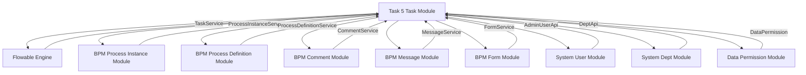
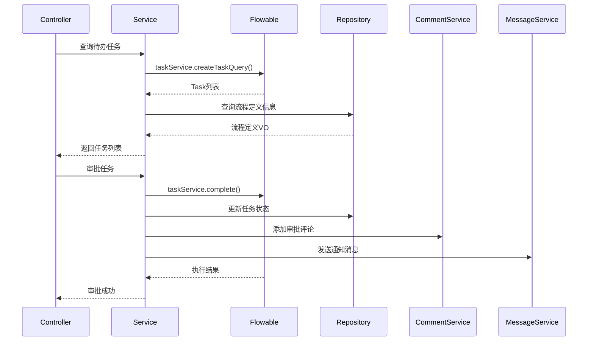
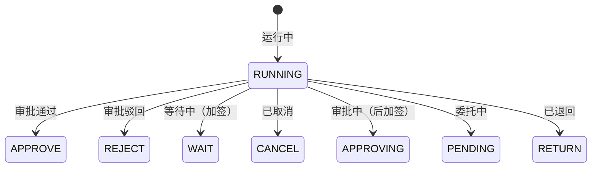
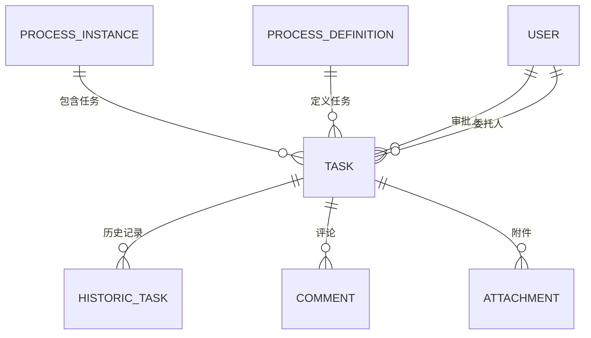

# Task 5 Task Module Documentation

## 模块概述

Task 5 Task 模块是 BPM（业务流程管理）模块的核心组件，负责处理流程任务的各种操作，包括待办任务查询、任务审批、驳回、委托、转派、加签、撤回等。该模块基于 Flowable 引擎构建，提供了丰富的任务管理功能，支持复杂的业务流程审批场景。

## 核心功能

### 1. 任务查询功能

- **待办任务查询**：获取用户当前待审批的任务列表
- **已办任务查询**：获取用户已完成的审批任务历史
- **通用任务查询**：获取所有任务历史记录
- **按流程实例查询任务**：根据流程实例ID获取相关任务列表

### 2. 任务操作功能

- **任务审批**：批准任务，支持加签、后加签等复杂场景
- **任务驳回**：拒绝任务，支持退回指定节点或结束流程
- **任务委托**：将任务委托给其他用户处理
- **任务转派**：将任务转交给其他审批人
- **任务加签**：向前加签或向后加签，增加额外审批环节
- **任务减签**：取消已添加的加签任务
- **任务撤回**：撤回已完成的审批操作
- **任务结束**：强制结束流程实例

### 3. 任务事件处理

- **任务创建事件**：任务创建时的前置通知和自动审批逻辑
- **任务取消事件**：处理任务被取消的场景
- **任务分配事件**：任务分配时的自动审批和通知
- **任务完成事件**：任务完成后的后置通知
- **任务超时事件**：处理任务超时的自动审批/拒绝逻辑
- **子流程超时事件**：处理子流程超时的逻辑

## 架构设计

### 模块依赖关系



### 组件交互流程图



## 核心类说明

### BpmTaskServiceImpl

**功能描述**：任务服务实现类，提供所有任务操作的核心逻辑。

**主要方法**：

| 方法名 | 描述 |
|--------|------|
| getTaskTodoPage | 获取用户待办任务分页列表 |
| getTodoTask | 获取用户指定任务或首个待办任务 |
| getTaskDonePage | 获取用户已办任务分页列表 |
| getTaskPage | 获取用户所有任务历史分页列表 |
| approveTask | 审批任务（支持加签、委托等场景） |
| rejectTask | 驳回任务（支持退回节点或结束流程） |
| returnTask | 退回任务到指定节点 |
| delegateTask | 委托任务给其他用户 |
| transferTask | 转派任务给其他用户 |
| createSignTask | 创建加签任务（向前/向后加签） |
| deleteSignTask | 删除加签任务（减签） |
| withdrawTask | 撤回已完成的审批 |
| moveTaskToEnd | 强制结束流程 |
| processTaskCreated | 任务创建事件处理 |
| processTaskCanceled | 任务取消事件处理 |
| processTaskAssigned | 任务分配事件处理 |
| processTaskCompleted | 任务完成事件处理 |
| processTaskTimeout | 任务超时处理 |
| processChildProcessTimeout | 子流程超时处理 |
| triggerTask | 触发接收任务 |

### 任务状态枚举



## 数据模型

### 任务实体关系



### 任务表结构

| 字段名 | 类型 | 描述 |
|--------|------|------|
| ID_ | VARCHAR(64) | 任务ID |
| NAME_ | VARCHAR(255) | 任务名称 |
| DESCRIPTION_ | VARCHAR(255) | 任务描述 |
| TASK_DEF_KEY_ | VARCHAR(255) | 任务定义Key |
| PROCESS_DEF_ID_ | VARCHAR(64) | 流程定义ID |
| PROCESS_INSTANCE_ID_ | VARCHAR(64) | 流程实例ID |
| EXECUTION_ID_ | VARCHAR(64) | 执行ID |
| ASSIGNEE_ | VARCHAR(255) | 审批人 |
| OWNER_ | VARCHAR(255) | 所有人 |
| DELEGATION_STATE_ | VARCHAR(255) | 委托状态 |
| PARENT_TASK_ID_ | VARCHAR(64) | 父任务ID（用于加签） |
| SCOPE_TYPE_ | VARCHAR(255) | 加签类型（BEFORE/AFTER） |
| COUNT_ | INT | 子任务计数 |
| FORM_KEY_ | VARCHAR(255) | 表单Key |

## 使用示例

### 1. 获取待办任务

```java
// 前端请求
BpmTaskPageReqVO pageVO = new BpmTaskPageReqVO();
pageVO.setUserId(currentUserId);
pageVO.setPageSize(20);

// 服务调用
PageResult<Task> taskPage = bpmTaskService.getTaskTodoPage(currentUserId, pageVO);
```

### 2. 审批任务

```java
// 审批请求
BpmTaskApproveReqVO approveReqVO = new BpmTaskApproveReqVO();
approveReqVO.setId(taskId);
approveReqVO.setReason("同意");
approveReqVO.setVariables(processVariables);

// 审批操作
bpmTaskService.approveTask(currentUserId, approveReqVO);
```

### 3. 驳回任务

```java
// 驳回请求
BpmTaskRejectReqVO rejectReqVO = new BpmTaskRejectReqVO();
rejectReqVO.setId(taskId);
rejectReqVO.setReason("不同意，资料不全");

// 驳回操作（退回指定节点）
bpmTaskService.returnTask(currentUserId, new BpmTaskReturnReqVO()
    .setId(taskId)
    .setTargetTaskDefinitionKey("previousTaskKey")
    .setReason(rejectReqVO.getReason()));

// 或者驳回并结束流程
bpmTaskService.rejectTask(currentUserId, rejectReqVO);
```

### 4. 加签操作

```java
// 向前加签
BpmTaskSignCreateReqVO signReqVO = new BpmTaskSignCreateReqVO();
signReqVO.setId(taskId);
signReqVO.setType(BpmTaskSignTypeEnum.BEFORE.getType());
signReqVO.setUserIds(Arrays.asList(userId1, userId2));
signReqVO.setReason("需要额外审批");

bpmTaskService.createSignTask(currentUserId, signReqVO);
```

## 扩展点

### 1. 任务前置/后置通知

支持在任务创建和完成后执行HTTP请求，实现与其他系统的集成：

```java
// 流程定义中配置
BpmModelMetaInfoVO.HttpRequestSetting setting = processDefinitionInfo.getTaskBeforeTriggerSetting();
BpmHttpRequestUtils.executeBpmHttpRequest(processInstance, setting.getUrl(), setting.getHeader(), setting.getBody(), true, setting.getResponse());
```

### 2. 自动审批策略

支持多种自动审批策略，减少人工干预：

- 发起人自选审批人
- 审批人自选下一节点审批人
- 审批人为空时自动通过/拒绝
- 连续审批自动通过
- 发起人自动跳过

### 3. 数据权限控制

通过 `@DataPermission` 注解控制任务的数据权限，支持部门级数据过滤。

## 注意事项

1. **事务管理**：所有任务修改操作都使用 `@Transactional` 注解，确保数据一致性。

2. **租户隔离**：所有查询和操作都自动过滤租户ID，实现多租户隔离。

3. **性能优化**：
   - 使用分页查询避免大数据量查询
   - 合理使用索引提高查询性能
   - 异步处理通知和消息

4. **异常处理**：所有操作都进行严格的参数校验和权限检查，抛出业务异常。

5. **历史追踪**：所有任务操作都记录评论和日志，便于审计和追溯。

## 相关模块

- [BPM Process Instance Module](bpm_process_instance.md) - 流程实例管理
- [BPM Process Definition Module](bpm_process_definition.md) - 流程定义管理
- [BPM Comment Module](bpm_comment.md) - 流程评论管理
- [BPM Message Module](bpm_message.md) - 消息通知管理
- [System User Module](system_user.md) - 用户管理
- [System Dept Module](system_dept.md) - 部门管理

## 版本信息

- **模块名称**：task_5_task
- **所属模块**：bpm
- **核心类**：BpmTaskServiceImpl
- **依赖版本**：Flowable 7.x, Spring Boot 2.x