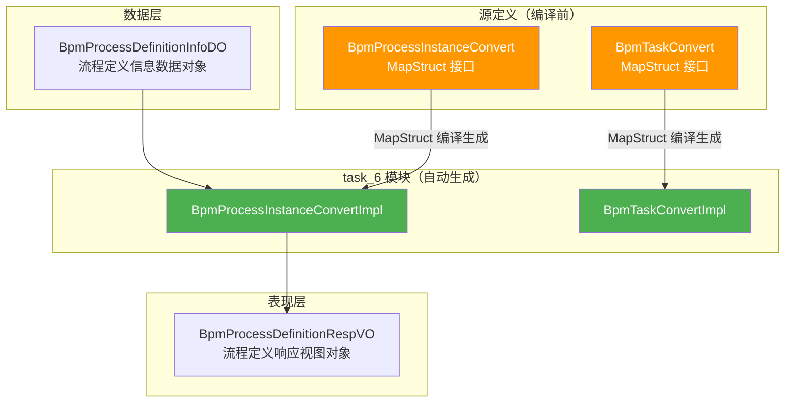
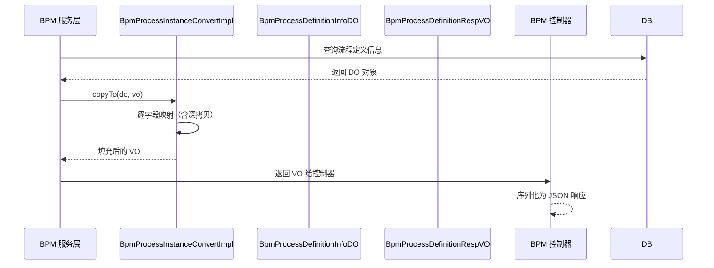
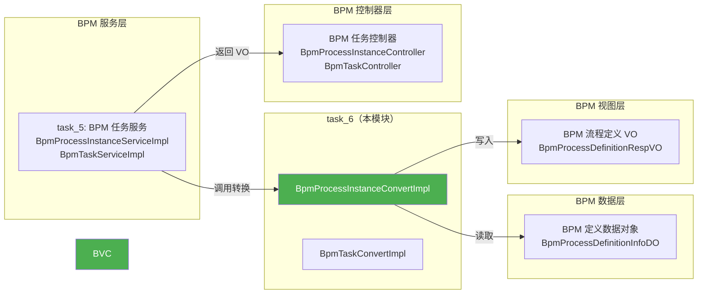

# task_6 — BPM 任务转换器（MapStruct 自动生成）

## 概述

`task_6` 模块是 **BPM 流程任务转换层** 的 MapStruct 自动生成实现，位于 `yudao-module-bpm/target/generated-sources/annotations/` 路径下。该模块包含两个核心转换器实现类，负责 BPM 流程实例和任务相关的数据对象（DO）与视图对象（VO）之间的自动映射转换。

> **注意**：本模块的所有代码由 MapStruct 注解处理器在编译期自动生成，不应手动修改。源代码定义位于 `cn.iocoder.yudao.module.bpm.convert.task` 包下的 MapStruct 接口中。

## 架构概览



## 核心组件

### 1. BpmProcessInstanceConvertImpl

**文件路径**：`yudao-module-bpm/target/generated-sources/annotations/cn/iocoder/yudao/module/bpm/convert/task/BpmProcessInstanceConvertImpl.java`

**职责**：实现 `BpmProcessInstanceConvert` 接口，将 `BpmProcessDefinitionInfoDO`（流程定义信息数据对象）的属性复制到 `BpmProcessDefinitionRespVO`（流程定义响应视图对象）中。

**核心方法**：`copyTo(BpmProcessDefinitionInfoDO from, BpmProcessDefinitionRespVO to)`

**映射字段一览**：

| 源字段 (DO) | 目标字段 (VO) | 说明 |
|---|---|---|
| `icon` | `icon` | 流程图标 |
| `description` | `description` | 流程描述 |
| `formType` | `formType` | 表单类型 |
| `formId` | `formId` | 表单 ID |
| `formCustomCreatePath` | `formCustomCreatePath` | 自定义表单创建路径 |
| `formCustomViewPath` | `formCustomViewPath` | 自定义表单查看路径 |
| `visible` | `visible` | 是否可见 |
| `startUserIds` | `startUserIds` | 发起人用户 ID 列表（深拷贝） |
| `startDeptIds` | `startDeptIds` | 发起部门 ID 列表（深拷贝） |
| `managerUserIds` | `managerUserIds` | 管理员用户 ID 列表（深拷贝） |
| `allowCancelRunningProcess` | `allowCancelRunningProcess` | 是否允许取消运行中的流程 |
| `allowWithdrawTask` | `allowWithdrawTask` | 是否允许撤回任务 |
| `processIdRule` | `processIdRule` | 流程 ID 规则 |
| `autoApprovalType` | `autoApprovalType` | 自动审批类型 |
| `titleSetting` | `titleSetting` | 标题设置 |
| `summarySetting` | `summarySetting` | 摘要设置 |
| `processBeforeTriggerSetting` | `processBeforeTriggerSetting` | 流程前置触发器设置 |
| `processAfterTriggerSetting` | `processAfterTriggerSetting` | 流程后置触发器设置 |
| `taskBeforeTriggerSetting` | `taskBeforeTriggerSetting` | 任务前置触发器设置 |
| `taskAfterTriggerSetting` | `taskAfterTriggerSetting` | 任务后置触发器设置 |
| `printTemplateSetting` | `printTemplateSetting` | 打印模板设置 |
| `category` | `category` | 流程分类 |
| `modelType` | `modelType` | 模型类型 |
| `modelId` | `modelId` | 模型 ID |
| `formConf` | `formConf` | 表单配置 |
| `formFields` | `formFields` | 表单字段列表（深拷贝） |
| `simpleModel` | `simpleModel` | 简单模型 |
| `sort` | `sort` | 排序 |

**关键实现细节**：

- 对 `List<Long>` 类型的集合字段（`startUserIds`、`startDeptIds`、`managerUserIds`）和 `List<String>` 类型的 `formFields` 字段，采用**深拷贝**策略：若目标对象已有集合则清空后填充，否则创建新的 `ArrayList` 进行复制。
- 对 `null` 源对象进行防御性检查，直接返回不做处理。
- 使用 MapStruct 1.6.3 版本，由 JDK 25.0.3 编译生成。

### 2. BpmTaskConvertImpl

**文件路径**：`yudao-module-bpm/target/generated-sources/annotations/cn/iocoder/yudao/module/bpm/convert/task/BpmTaskConvertImpl.java`

**职责**：实现 `BpmTaskConvert` 接口。当前为空实现，不包含任何映射方法，作为未来扩展的占位符。

```java
public class BpmTaskConvertImpl implements BpmTaskConvert {
    // 当前无映射方法，预留扩展
}
```

## 数据流



## 与其他模块的关系



### 依赖关系说明

| 关联模块 | 关系 | 说明 |
|---|---|---|
| [task_5](task_5.md) | 调用方 | BPM 任务服务层（`BpmProcessInstanceServiceImpl`、`BpmTaskServiceImpl`）调用本模块的转换器进行 DO↔VO 转换 |
| [definition_2](definition_2.md) | 数据源 | `BpmProcessDefinitionInfoDO` 作为转换的源数据对象 |
| [process](process.md) | 目标 | `BpmProcessDefinitionRespVO` 作为转换的目标视图对象 |
| [task_2](task_2.md) | 消费者 | BPM 任务控制器接收转换后的 VO 对象并返回给前端 |

## 技术说明

- **框架**：MapStruct 1.6.3
- **编译环境**：JDK 25.0.3 (Ubuntu)
- **注解处理器**：`org.mapstruct.ap.MappingProcessor`
- **生成策略**：编译期自动生成，位于 `target/generated-sources/annotations/` 目录
- **映射策略**：对于集合类型字段采用深拷贝（`new ArrayList<>(source)`），避免引用共享导致的副作用