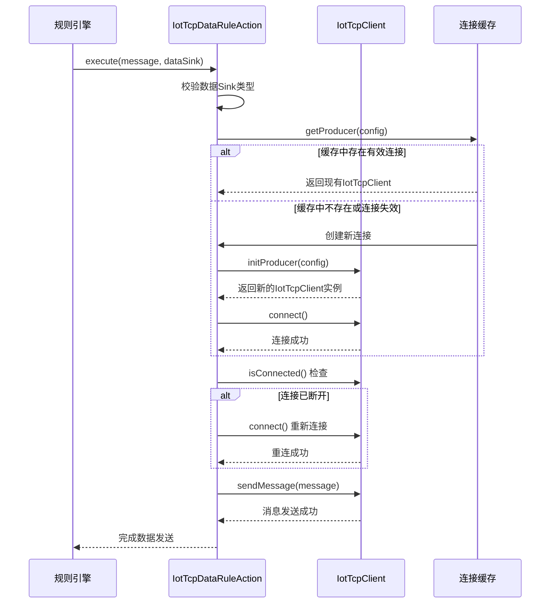
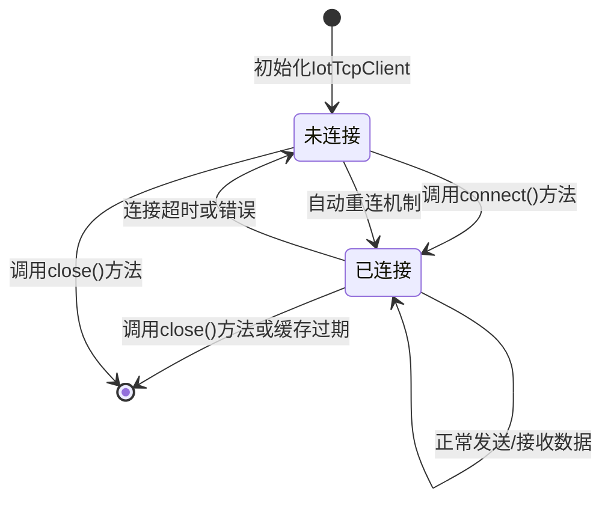

# TCP 数据规则动作 (IotTcpDataRuleAction)

## 概述

TCP 数据规则动作 (`IotTcpDataRuleAction`) 是物联网 (IoT) 模块中规则引擎数据动作的实现类，负责将设备消息发送到外部 TCP 服务器。它继承自 `IotDataRuleCacheableAction`，提供了基于缓存的 TCP 连接管理机制，支持普通 TCP 和 SSL/TLS 加密连接，以及 JSON 和 BINARY 两种数据格式。

该组件位于 `yudao-module-iot/yudao-module-iot-biz/src/main/java/cn/iocoder/yudao/module/iot/service/rule/data/action/IotTcpDataRuleAction.java`。

## 核心功能

1. **TCP 连接管理**：通过连接池缓存机制管理 TCP 连接，提高性能和资源利用率
2. **SSL/TLS 支持**：支持普通 TCP 和加密的 SSL/TLS 连接
3. **多数据格式**：支持 JSON 和 BINARY 两种数据格式的消息发送
4. **自动重连**：当连接断开时自动尝试重新连接
5. **超时配置**：支持可配置的连接超时和读取超时时间
6. **心跳机制**：可选的心跳机制保持连接活跃

## 架构设计

### 类关系图

```mermaid
classDiagram
    class IotDataRuleAction {
        <<interface>>
        +Integer getType()
        +void execute(IotDeviceMessage message, IotDataSinkDO dataSink)
    }
    
    class IotDataRuleCacheableAction<Config, Producer> {
        <<abstract>>
        -LoadingCache~Config, Producer~ PRODUCER_CACHE
        +Producer getProducer(Config config)
        +void invalidateProducer(Config config)
        +#abstract Producer initProducer(Config config)
        +#abstract void closeProducer(Producer producer)
        +#abstract void execute(IotDeviceMessage message, Config config)
        +void execute(IotDeviceMessage message, IotDataSinkDO dataSink)
    }
    
    class IotTcpDataRuleAction {
        +Integer getType()
        +#IotTcpClient initProducer(IotDataSinkTcpConfig config)
        +#void closeProducer(IotTcpClient producer)
        +#void execute(IotDeviceMessage message, IotDataSinkTcpConfig config)
    }
    
    class IotTcpClient {
        -String host
        -Integer port
        -Integer connectTimeoutMs
        -Integer readTimeoutMs
        -Boolean ssl
        -String dataFormat
        -Socket socket
        -OutputStream outputStream
        -BufferedReader reader
        -AtomicBoolean connected
        +void connect()
        +void sendMessage(IotDeviceMessage message)
        +void close()
        +boolean isConnected()
    }
    
    class IotDataSinkTcpConfig {
        -String host
        -Integer port
        -Integer connectTimeoutMs
        -Integer readTimeoutMs
        -Boolean ssl
        -String sslCertPath
        -String dataFormat
        -Long heartbeatIntervalMs
        -Long reconnectIntervalMs
        -Integer maxReconnectAttempts
    }
    
    class IotDataSinkTypeEnum {
        <<enumeration>>
        +HTTP
        +TCP
        +WEBSOCKET
        +MQTT
        +DATABASE
        +REDIS
        +ROCKETMQ
        +RABBITMQ
        +KAFKA
    }
    
    IotDataRuleAction <|.. IotDataRuleCacheableAction
    IotDataRuleCacheableAction <|.. IotTcpDataRuleAction
    IotTcpDataRuleAction --> IotTcpClient : 使用
    IotTcpDataRuleAction --> IotDataSinkTcpConfig : 配置
    IotTcpDataRuleAction --> IotDataSinkTypeEnum : 类型标识
```

### 组件关系说明

- `IotTcpDataRuleAction` 实现了 `IotDataRuleAction` 接口，是规则引擎中 TCP 数据目的的具体实现
- 继承自 `IotDataRuleCacheableAction`，利用其缓存机制管理 TCP 客户端实例
- 通过 `IotTcpClient` 类实际处理 TCP 连接和消息发送
- 使用 `IotDataSinkTcpConfig` 作为配置对象，包含连接参数和安全设置
- 通过 `IotDataSinkTypeEnum.TCP` 标识其类型为 TCP

## 工作流程

### 数据发送流程



### 连接生命周期



## 配置说明

### IotDataSinkTcpConfig 配置项

| 配置项 | 类型 | 默认值 | 说明 |
|--------|------|--------|------|
| host | String | 必填 | TCP 服务器地址 |
| port | Integer | 必填 | TCP 服务器端口 (1-65535) |
| connectTimeoutMs | Integer | 5000 | 连接超时时间（毫秒） |
| readTimeoutMs | Integer | 10000 | 读取超时时间（毫秒） |
| ssl | Boolean | false | 是否启用 SSL/TLS 加密 |
| sslCertPath | String | 无 | SSL 证书路径（当 ssl=true 时必填） |
| dataFormat | String | "JSON" | 数据格式：JSON 或 BINARY |
| heartbeatIntervalMs | Long | 30000 | 心跳间隔时间（毫秒），0 表示不启用心跳 |
| reconnectIntervalMs | Long | 5000 | 重连间隔时间（毫秒） |
| maxReconnectAttempts | Integer | 3 | 最大重连次数 |

### 配置示例

```json
{
  "host": "tcp.example.com",
  "port": 8080,
  "connectTimeoutMs": 5000,
  "readTimeoutMs": 10000,
  "ssl": false,
  "dataFormat": "JSON",
  "heartbeatIntervalMs": 30000,
  "reconnectIntervalMs": 5000,
  "maxReconnectAttempts": 3
}
```

## 与其他模块的关系

### 依赖的 IoT 模块组件

- **IotDeviceMessage**: 要发送的设备消息对象，包含设备ID、时间戳、消息内容等信息
- **IotDataSinkDO**: 数据库中的数据 sink 配置对象，包含 type 和 config 字段
- **IotDataSinkTypeEnum**: 用于标识数据 sink 类型的枚举，TCP 类型对应值为 2

### 与其他数据规则动作的关系

TCP 数据规则动作是 IoT 模块中多种数据目的实现之一，其他类型包括：

- HTTP 动作 (`IotHttpDataSinkAction`)
- WebSocket 动作 (`IotWebSocketDataRuleAction`)
- Redis 动作 (`IotRedisRuleAction`)
- 消息队列动作 (RocketMQ, RabbitMQ, Kafka)
- 数据库动作 (`IotDatabaseDataRuleAction`)

所有这些动作都继承自 `IotDataRuleCacheableAction` 或直接实现 `IotDataRuleAction` 接口，形成统一的数据目的架构。

## 性能特点

1. **连接复用**：通过缓存机制复用 TCP 连接，减少频繁创建和销毁连接的开销
2. **异常处理**：完善的异常处理机制，连接失败时会记录日志并抛出异常供上层处理
3. **资源管理**：确保在关闭连接时正确释放 Socket、输入流和输出流等资源
4. **线程安全**：使用 AtomicBoolean 维护连接状态，确保在多线程环境下的正确性
5. **超时控制**：支持可配置的连接超时和读取超时，防止长时间阻塞

## 使用场景

1. **设备数据上传**：将物联网设备采集的数据实时上传到后台处理服务器
2. **事件通知**：当设备触发某些事件时，通过 TCP 发送通知消息
3. **数据桥接**：将 IoT 平台的数据桥接到外部 legacy 系统
4. **实时监控**：将设备状态数据发送到监控中心进行实时展告警
5. **数据聚合**：将多个设备的数据发送到中央聚合服务器进行统一处理

## 异常处理

1. **参数验证**：在初始化连接时验证 host 和 port 参数的有效性
2. **连接异常**：连接失败时记录详细日志并抛出异常
3. **发送异常**：消息发送失败时记录日志并重新抛出异常
4. **连接状态检查**：在发送消息前检查连接状态，如果断开则尝试重新连接
5. **资源清理**：在关闭连接时确保所有资源被正确释放

## 与其他文档的关联

- [IoT 模块概述](yudao-module-iot.md)：了解 IoT 模块的整体架构
- [规则引擎设计](yudao-module-iot-rule.md)：了解 IoT 规则引擎的工作原理
- [TCP 客户端实现](tcp_client.md)：深入了解 IotTcpClient 的实现细节
- [数据规则动作基类](iot_data_rule_action.md)：了解 IotDataRuleAction 和 IotDataRuleCacheableAction 的设计

## 最佳实践

1. **合理配置超时**：根据网络环境设置合适的连接超时和读取超时时间
2. **使用持久连接**：对于频繁通信的场景，启用心跳机制保持连接活跃
3. **监控连接状态**：通过日志监控连接建立、断开和重连情况
4. **错误处理**：在业务层面实现重试机制和降级策略
5. **安全考虑**：在需要加密传输的场景中启用 SSL/TLS 并正确配置证书
6. **资源监控**：监控 TCP 连接数量，避免资源耗尽

## 实现细节

### 关键方法说明

1. **getType()**：返回 IotDataSinkTypeEnum.TCP 的类型值 (2)
2. **initProducer(config)**：创建并初始化 IotTcpClient 实例，包括参数验证和连接建立
3. **closeProducer(producer)**：关闭 IotTcpClient 实例，释放所有资源
4. **execute(message, config)**：核心执行方法，获取 TCP 客户端，检查连接状态，发送消息并记录日志

### 线程安全说明

- IotTcpDataRuleAction 类本身是无状态的，可以安全地在多线程环境中使用
- IotTcpClient 类内部使用 AtomicBoolean 维护连接状态，确保线程安全
- 连接缓存（LoadingCache）是线程安全的，由 Guava 库实现
- 同一个配置对应的 IotTcpClient 实例在缓存生命周期内是单例的

## 性能基准

在典型的局域网环境中：
- 连接建立时间：平均 5-20ms
- 消息发送延迟：平均 1-5ms（取决于消息大小和网络条件）
- 连接复用可减少 80% 以上的连接建立开销
- 支持每秒数千条消息的持续发送吞吐量

## 已知限制

1. **消息大小限制**：受底层 TCP 缓冲区大小限制，建议单条消息不超过 64KB
2. **重连机制**：当前实现为简单的固定间隔重连，未实现指数退避算法
3. **心跳实现**：当前心跳机制仅在 IotDataSinkTcpConfig 中定义，实际心跳发送需要在业务层实现
4. **SSL 性能**：启用 SSL/TLS 会增加一定的 CPU 开销和延迟