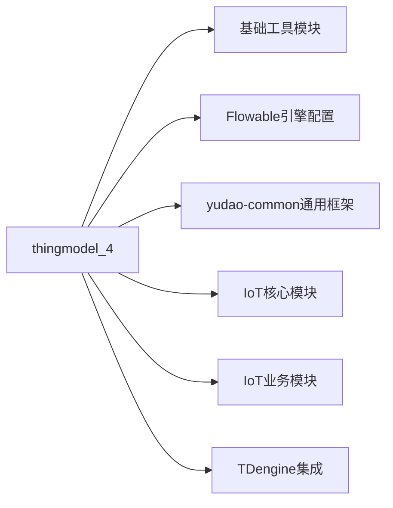

# IoT 物模型服务模块 (thingmodel_4) 文档

## 1. 模块概述

**IoT 物模型服务模块**是物联网（IoT）业务模块中的核心组件，负责管理设备的物模型（Thing Model）。物模型是对设备功能、属性和事件的抽象描述，用于规范设备与云端之间的交互方式。

该模块主要提供以下功能：
- 物模型的创建、更新、删除和查询
- 物模型数据类型的转换和验证
- 与产品、Modbus点位等关联数据的同步维护
- Redis缓存管理

## 2. 架构设计

### 2.1 整体架构图

```mermaid
graph TD
    subgraph "thingmodel_4 模块"
        A[IotThingModelServiceImpl] --> B[IotThingModelMapper]
        A --> C[IotProductService]
        A --> [IotDeviceModbusPointService]
        A --> D[Redis缓存]
        A --> E[TDengine数据库]
    end
    
    F[IoT业务模块] --> A
    G[设备管理模块] --> A
    H[规则引擎模块] --> A
    I[消息总线模块] --> A
```

### 2.2 组件关系说明

| 组件 | 类型 | 职责 | 依赖方向 |
|------|------|------|----------|
| `IotThingModelServiceImpl` | Service层 | 物模型业务逻辑实现 | 调用Mapper、ProductService、DeviceModbusPointService |
| `IotThingModelMapper` | Mapper层 | 物模型数据持久化操作 | 访问MySQL数据库 |
| `IotProductService` | Service层 | 产品服务，校验产品状态 | 被ThingModelService调用 |
| `IotDeviceModbusPointService` | Service层 | Modbus点位服务，同步冗余字段 | 被ThingModelService调用 |
| Redis | 缓存层 | 存储物模型列表缓存 | 被ThingModelService读写 |
| TDengine | 时序数据库 | 存储物模型数据值 | ThingModelService进行数据类型转换后写入 |

## 3. 核心功能详解

### 3.1 物模型生命周期管理

#### 3.1.1 创建物模型 (`createThingModel`)

**流程：**
1. **唯一性校验**：检查同一产品下标识符和功能名称是否唯一
2. **状态校验**：确保产品处于未发布状态（发布状态下不允许新增功能）
3. **数据转换**：将请求VO转换为DO对象
4. **持久化**：插入数据库
5. **缓存清理**：删除对应产品的物模型列表缓存

**关键代码：**
```java
@Transactional(rollbackFor = Exception.class)
public Long createThingModel(IotThingModelSaveReqVO createReqVO) {
    // 校验唯一性
    validateIdentifierUnique(null, createReqVO.getProductId(), createReqVO.getIdentifier());
    validateNameUnique(createReqVO.getProductId(), createReqVO.getName());
    
    // 校验产品状态
    validateProductStatus(createReqVO.getProductId());
    
    // 插入数据库
    IotThingModelDO thingModel = IotThingModelConvert.INSTANCE.convert(createReqVO);
    thingModelMapper.insert(thingModel);
    
    // 删除缓存
    deleteThingModelListCache(createReqVO.getProductId());
    return thingModel.getId();
}
```

#### 3.1.2 更新物模型 (`updateThingModel`)

**特殊处理：**
- 更新成功后会**同步更新Modbus点位的冗余字段**（identifier、name），保持数据一致性
- 同样需要校验产品状态

```java
// 同步更新 Modbus 点位的冗余字段
deviceModbusPointService.updateDeviceModbusPointByThingModel(
    updateReqVO.getId(), updateReqVO.getIdentifier(), updateReqVO.getName());
```

#### 3.1.3 删除物模型 (`deleteThingModel`)

**流程：**
1. 校验物模型是否存在
2. 校验产品状态
3. 删除记录
4. 清理缓存

### 3.2 数据转换功能 (`convertThingModelPropertyValue`)

这是本模块的核心特色功能，负责将业务数据转换为适合TDengine存储的格式。支持的数据类型包括：

| 数据类型 | TDengine存储格式 | 处理方式 |
|----------|-----------------|----------|
| STRUCT/ARRAY | VARCHAR(JSON) | 序列化为JSON字符串 |
| INT | INT | 转换为整数 |
| FLOAT | FLOAT | 转换为浮点数 |
| DOUBLE | DOUBLE | 转换为双精度浮点数 |
| ENUM | TINYINT | 枚举值映射为整数 |
| BOOL | TINYINT | 布尔值转为0/1 |
| TEXT | VARCHAR | 文本字符串 |
| DATE/TIME | TIMESTAMP | 时间戳 |

**转换示例：**
```java
public Object convertThingModelPropertyValue(IotThingModelDO thingModel, Object value) {
    String dataType = thingModel.getProperty().getDataType();
    
    if (IotDataSpecsDataTypeEnum.INT.getDataType().equals(dataType)) {
        return convertToInt(value);  // 转换为整数
    }
    if (IotDataSpecsDataTypeEnum.BOOL.getDataType().equals(dataType)) {
        return convertBoolToTinyInt(value);  // 布尔转0/1
    }
    // ...其他类型处理
}
```

### 3.3 缓存管理

使用Redis缓存物模型列表，提高查询性能：

```java
@Cacheable(value = RedisKeyConstants.THING_MODEL_LIST, key = "#productId")
@TenantIgnore
public List<IotThingModelDO> getThingModelListByProductIdFromCache(Long productId) {
    return thingModelMapper.selectListByProductId(productId);
}
```

当物模型发生变更时，通过`@CacheEvict`注解自动清理缓存：

```java
@CacheEvict(value = RedisKeyConstants.THING_MODEL_LIST, key = "#productId")
@TenantIgnore
public void deleteThingModelListCache0(Long productId) {}
```

### 3.4 租户隔离

使用`@TenantIgnore`注解忽略租户信息，因为物模型数据通常按产品共享，不区分租户。

## 4. 依赖模块

thingmodel_4模块与其他模块的依赖关系如下：



具体依赖：
- **yudao-common**：提供通用工具类（DateUtils、JsonUtils、CollectionUtils等）
- **IoT核心模块**：提供DTO、Mapper、Redis Key常量
- **IoT业务模块**：依赖IotProductService、IotDeviceModbusPointService
- **TDengine集成**：处理TDengine特定的数据类型转换

## 5. API接口说明

### 5.1 对外服务接口

```java
public interface IotThingModelService {
    // CRUD操作
    Long createThingModel(IotThingModelSaveReqVO reqVO);
    void updateThingModel(IotThingModelSaveReqVO reqVO);
    void deleteThingModel(Long id);
    IotThingModelDO getThingModel(Long id);
    
    // 批量查询
    List<IotThingModelDO> getThingModelListByProductId(Long productId);
    List<IotThingModelDO> getThingModelListByProductIdAndIdentifiers(Long productId, Collection<String> identifiers);
    List<IotThingModelDO> getThingModelListByProductIdAndType(Long productId, Integer type);
    
    // 分页查询
    PageResult<IotThingModelDO> getProductThingModelPage(IotThingModelPageReqVO pageReqVO);
    
    // 数据转换
    Object convertThingModelPropertyValue(IotThingModelDO thingModel, Object value);
    
    // 校验方法
    void validateThingModelListExists(Long productId, Set<String> identifiers);
}
```

### 5.2 请求/响应VO

| VO名称 | 用途 |
|--------|------|
| `IotThingModelSaveReqVO` | 创建/更新物模型请求参数 |
| `IotThingModelPageReqVO` | 分页查询参数 |
| `IotThingModelListReqVO` | 列表查询参数 |
| `IotThingModelRespVO` | 物模型响应视图对象 |

## 6. 数据模型

### 6.1 物模型实体 (`IotThingModelDO`)

```java
@Data
@TableName("iot_thing_model")
public class IotThingModelDO implements Serializable {
    
    private Long id;
    
    private Long productId;  // 产品ID
    
    private String name;     // 功能名称
    
    private String identifier; // 功能标识符（唯一）
    
    private Integer type;    // 类型：0-属性，1-事件，2-方法
    
    private ThingModelDO property;  // 物模型属性定义
    
    private LocalDateTime createTime;
    
    private LocalDateTime updateTime;
}
```

### 6.2 物模型属性 (`ThingModelDO`)

包含属性的详细信息，如数据类型、规格说明等：

```java
@Data
public class ThingModelDO implements Serializable {
    
    private String name;           // 属性名称
    
    private String identifier;     // 属性标识符
    
    private String dataType;       // 数据类型（int、float、text、bool等）
    
    private ThingModelDataSpecs dataSpecs;  // 数据规格（长度、精度等）
    
    private List<ThingModelDataSpecs> dataSpecsList;  // 枚举/布尔类型的规格列表
}
```

## 7. 错误码定义

模块中使用的错误码（来自`ErrorCodeConstants`）：

| 错误码 | 含义 |
|--------|------|
| THING_MODEL_NOT_EXISTS | 物模型不存在 |
| THING_MODEL_IDENTIFIER_INVALID | 物模型标识符无效（保留关键字） |
| THING_MODEL_IDENTIFIER_EXISTS | 物模型标识符已存在 |
| THING_MODEL_NAME_EXISTS | 物模型名称已存在 |
| PRODUCT_STATUS_NOT_ALLOW_THING_MODEL | 产品状态不允许操作物模型（发布状态） |

## 8. 使用场景示例

### 8.1 创建温度传感器物模型

```java
// 1. 准备物模型创建请求
IotThingModelSaveReqVO createReqVO = new IotThingModelSaveReqVO();
createReqVO.setProductId(productId);
createReqVO.setName("温度");
createReqVO.setIdentifier("temperature");
createReqVO.setType(0); // 属性类型

// 2. 设置属性定义
ThingModelDO property = new ThingModelDO();
property.setName("温度值");
property.setIdentifier("value");
property.setDataTypeId(IotDataSpecsDataTypeEnum.FLOAT.getType());
// ...设置其他属性

createReqVO.setProperty(property);

// 3. 调用服务创建
Long thingModelId = iotThingModelService.createThingModel(createReqVO);
```

### 8.2 获取并转换物模型数据

```java
// 1. 从缓存获取物模型列表
List<IotThingModelDO> thingModels = iotThingModelService.getThingModelListByProductIdFromCache(productId);

// 2. 转换原始数据为TDengine可存储格式
IotThingModelDO tempModel = thingModels.stream()
    .filter(m -> "temperature".equals(m.getIdentifier()))
    .findFirst()
    .orElseThrow();

Object tdengineValue = iotThingModelService.convertThingModelPropertyValue(tempModel, 25.5f);
// 结果：25.5f（float类型）
```

## 9. 扩展性设计

### 9.1 数据类型扩展

通过`IotDataSpecsDataTypeEnum`枚举支持新数据类型，只需在`convertThingModelPropertyValue`方法中添加相应处理逻辑。

### 9.2 缓存策略

采用Redis缓存+主动失效的策略，保证数据一致性的同时提升查询性能。

### 9.3 租户兼容

通过`@TenantIgnore`注解支持多租户环境下的物模型共享。

## 10. 性能优化建议

1. **批量查询**：使用`getThingModelListByProductIdAndIdentifiers`替代多次单条查询
2. **缓存优先**：优先使用`getThingModelListByProductIdFromCache`获取物模型列表
3. **异步处理**：对于非核心的缓存清理操作，可考虑异步执行
4. **索引优化**：对`product_id`、`identifier`等查询字段建立数据库索引

## 11. 相关模块参考

- [yudao-module-iot](./iot.md) - IoT主模块
- [yudao-module-iot-core](./iot-core.md) - IoT核心模块
- [yudao-framework-common](./common.md) - 通用框架模块
- [TDengine集成](./tdengine.md) - 时序数据库集成

---

*文档生成时间：基于IotThingModelServiceImpl.java v1.0*