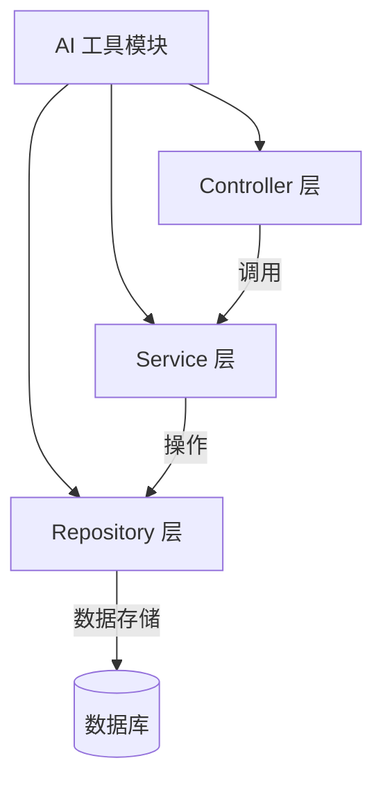
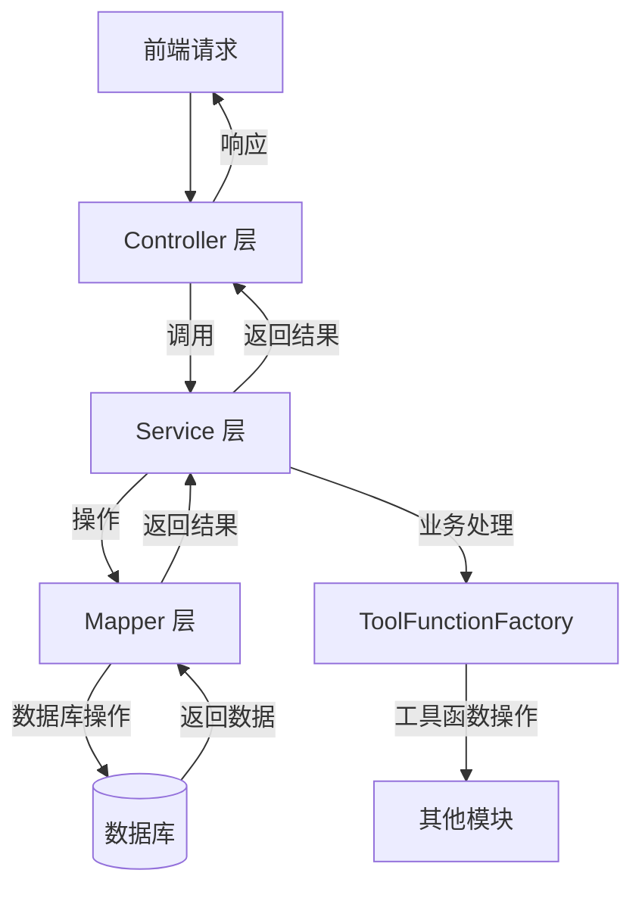
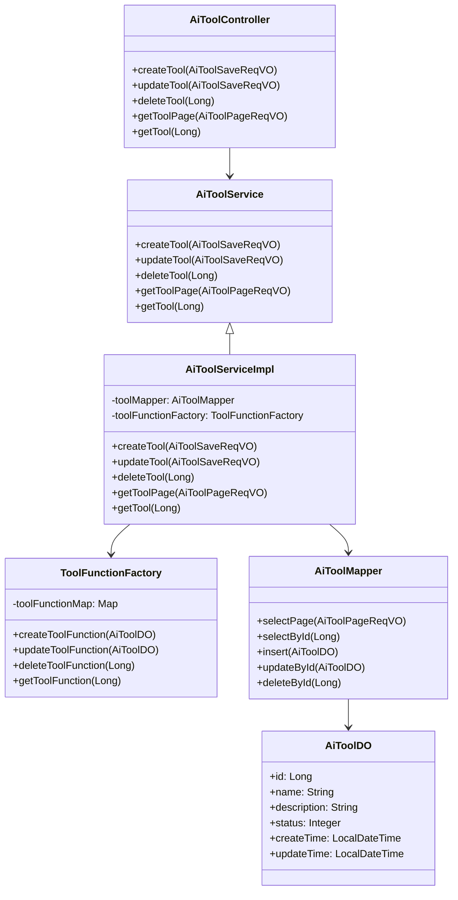
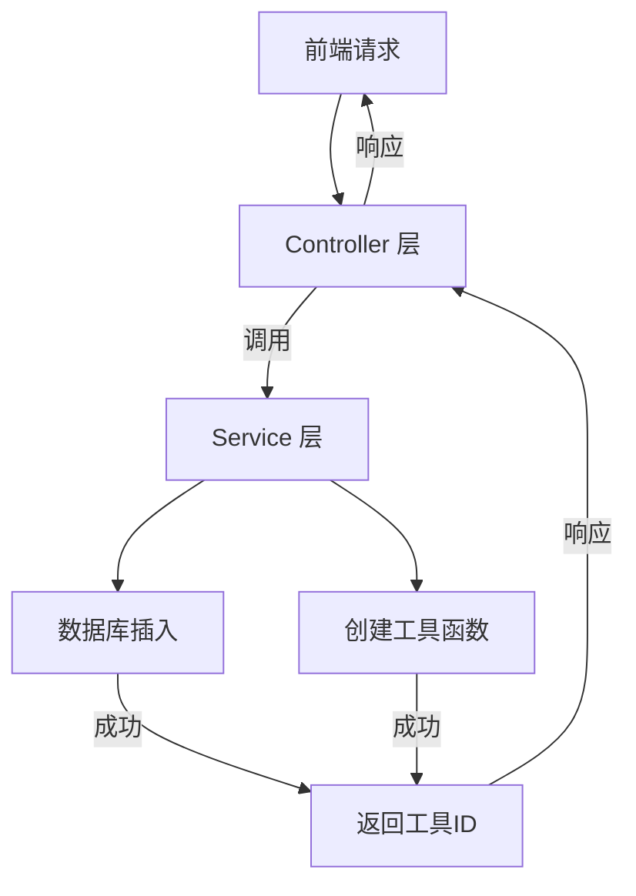
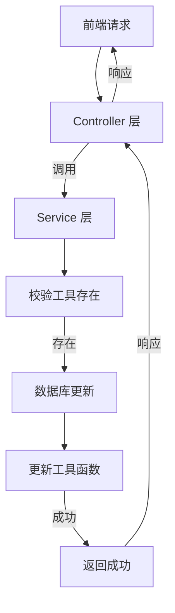
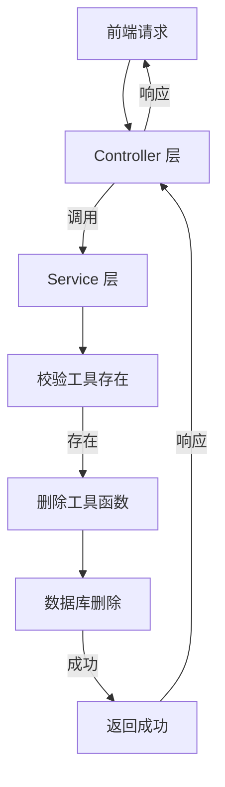

# AI 工具模块文档

## 模块概述

AI 工具模块是系统中用于管理和配置 AI 工具的核心模块。该模块提供了对 AI 工具的增删改查、状态管理等功能，为其他 AI 相关功能提供基础支撑。

### 主要功能

- **工具管理**：支持 AI 工具的创建、编辑、删除和状态管理
- **分页查询**：提供工具列表的分页查询功能
- **状态控制**：支持工具的启用/禁用状态切换
- **权限控制**：集成系统权限框架，确保工具管理的安全性

### 模块架构



## 核心组件

### 1. 请求 VO 类

#### AiToolPageReqVO
- **文件路径**: `yudao-module-ai/src/main/java/cn/iocoder/yudao/module/ai/controller/admin/model/vo/tool/AiToolPageReqVO.java`
- **功能**: 工具分页查询请求参数
- **核心字段**:
  - `name`: 工具名称
  - `description`: 工具描述
  - `status`: 工具状态
  - `createTime`: 创建时间范围

```java
package cn.iocoder.yudao.module.ai.controller.admin.model.vo.tool;

import cn.iocoder.yudao.framework.common.enums.CommonStatusEnum;
import cn.iocoder.yudao.framework.common.pojo.PageParam;
import cn.iocoder.yudao.framework.common.validation.InEnum;
import io.swagger.v3.oas.annotations.media.Schema;
import lombok.Data;
import lombok.EqualsAndHashCode;
import lombok.ToString;
import org.springframework.format.annotation.DateTimeFormat;

import java.time.LocalDateTime;

import static cn.iocoder.yudao.framework.common.util.date.DateUtils.FORMAT_YEAR_MONTH_DAY_HOUR_MINUTE_SECOND;

@Schema(description = "管理后台 - AI 工具分页 Request VO")
@Data
public class AiToolPageReqVO extends PageParam {

    @Schema(description = "工具名称", example = "王五")
    private String name;

    @Schema(description = "工具描述", example = "你猜")
    private String description;

    @Schema(description = "状态", example = "1")
    @InEnum(CommonStatusEnum.class)
    private Integer status;

    @Schema(description = "创建时间")
    @DateTimeFormat(pattern = FORMAT_YEAR_MONTH_DAY_HOUR_MINUTE_SECOND)
    private LocalDateTime[] createTime;

}
```

#### AiToolSaveReqVO
- **文件路径**: `yudao-module-ai/src/main/java/cn/iocoder/yudao/module/ai/controller/admin/model/vo/tool/AiToolSaveReqVO.java`
- **功能**: 工具新增/修改请求参数
- **核心字段**:
  - `id`: 工具编号（修改时必填）
  - `name`: 工具名称（必填）
  - `description`: 工具描述
  - `status`: 工具状态（必填）

```java
package cn.iocoder.yudao.module.ai.controller.admin.model.vo.tool;

import cn.iocoder.yudao.framework.common.enums.CommonStatusEnum;
import cn.iocoder.yudao.framework.common.validation.InEnum;
import io.swagger.v3.oas.annotations.media.Schema;
import jakarta.validation.constraints.NotEmpty;
import lombok.Data;

@Schema(description = "管理后台 - AI 工具新增/修改 Request VO")
@Data
public class AiToolSaveReqVO {

    @Schema(description = "工具编号", requiredMode = Schema.RequiredMode.REQUIRED, example = "19661")
    private Long id;

    @Schema(description = "工具名称", requiredMode = Schema.RequiredMode.REQUIRED, example = "王五")
    @NotEmpty(message = "工具名称不能为空")
    private String name;

    @Schema(description = "工具描述", example = "你猜")
    private String description;

    @Schema(description = "状态", requiredMode = Schema.RequiredMode.REQUIRED, example = "1")
    @InEnum(CommonStatusEnum.class)
    private Integer status;

}
```

### 2. 业务实现类

#### AiToolServiceImpl
- **文件路径**: `yudao-module-ai/src/main/java/cn/iocoder/yudao/module/ai/service/model/AiToolServiceImpl.java`
- **功能**: 工具业务逻辑实现
- **核心方法**:
  - `createTool(AiToolSaveReqVO createReqVO)`: 创建工具
  - `updateTool(AiToolSaveReqVO updateReqVO)`: 更新工具
  - `deleteTool(Long id)`: 删除工具
  - `getToolPage(AiToolPageReqVO pageReqVO)`: 分页查询工具
  - `getTool(Long id)`: 查询单个工具

```java
// 核心业务逻辑实现
@Service
@RequiredArgsConstructor
@Tag(name = "管理后台 - AI 工具")
public class AiToolServiceImpl implements AiToolService {

    private final AiToolMapper toolMapper;
    private final ToolFunctionFactory toolFunctionFactory;

    @Override
    public Long createTool(AiToolSaveReqVO createReqVO) {
        // 1. 插入
        AiToolDO tool = AiToolConvert.INSTANCE.convert(createReqVO);
        toolMapper.insert(tool);
        // 2. 创建工具函数
        toolFunctionFactory.createToolFunction(tool);
        // 3. 返回
        return tool.getId();
    }

    @Override
    public void updateTool(AiToolSaveReqVO updateReqVO) {
        // 1. 校验存在
        validateToolExists(updateReqVO.getId());
        // 2. 更新
        AiToolDO updateObj = AiToolConvert.INSTANCE.convert(updateReqVO);
        toolMapper.updateById(updateObj);
        // 3. 更新工具函数
        toolFunctionFactory.updateToolFunction(updateObj);
    }

    @Override
    public void deleteTool(Long id) {
        // 1. 校验存在
        validateToolExists(id);
        // 2. 删除
        toolMapper.deleteById(id);
        // 3. 删除工具函数
        toolFunctionFactory.deleteToolFunction(id);
    }

    private void validateToolExists(Long id) {
        if (toolMapper.selectById(id) == null) {
            throw exception(TOOL_NOT_EXISTS);
        }
    }

    @Override
    @Transactional(readOnly = true)
    public PageResult<AiToolDO> getToolPage(AiToolPageReqVO pageReqVO) {
        return toolMapper.selectPage(pageReqVO);
    }

    @Override
    @Transactional(readOnly = true)
    public AiToolDO getTool(Long id) {
        return toolMapper.selectById(id);
    }
}
```

#### ToolFunctionFactory
- **文件路径**: `yudao-module-ai/src/main/java/cn/iocoder/yudao/module/ai/tool/function/ToolFunctionFactory.java`
- **功能**: 工具函数工厂，负责创建、更新和删除工具函数
- **核心方法**:
  - `createToolFunction(AiToolDO tool)`: 创建工具函数
  - `updateToolFunction(AiToolDO tool)`: 更新工具函数
  - `deleteToolFunction(Long toolId)`: 删除工具函数
  - `getToolFunction(Long toolId)`: 获取工具函数

```java
@Component
@RequiredArgsConstructor
public class ToolFunctionFactory {

    private final Map<String, ToolFunction> toolFunctionMap;
    private final AiToolMapper toolMapper;

    public void createToolFunction(AiToolDO tool) {
        ToolFunction toolFunction = buildToolFunction(tool);
        toolFunctionMap.put(tool.getId().toString(), toolFunction);
    }

    public void updateToolFunction(AiToolDO tool) {
        ToolFunction toolFunction = buildToolFunction(tool);
        toolFunctionMap.put(tool.getId().toString(), toolFunction);
    }

    public void deleteToolFunction(Long toolId) {
        toolFunctionMap.remove(toolId.toString());
    }

    public ToolFunction getToolFunction(Long toolId) {
        return toolFunctionMap.get(toolId.toString());
    }

    private ToolFunction buildToolFunction(AiToolDO tool) {
        // 根据工具类型构建对应的工具函数
        // ...
    }
}
```

### 3. 数据访问层

#### AiToolMapper
- **文件路径**: `yudao-module-ai/src/main/java/cn/iocoder/yudao/module/ai/dal/dataobject/model/AiToolDO.java`
- **功能**: 工具数据库访问接口
- **核心方法**:
  - `selectPage(AiToolPageReqVO pageReqVO)`: 分页查询
  - `selectById(Long id)`: 根据ID查询
  - `insert(AiToolDO entity)`: 插入
  - `updateById(AiToolDO entity)`: 更新
  - `deleteById(Long id)`: 删除

```java
@Mapper
public interface AiToolMapper extends BaseMapperX<AiToolDO> {

    default PageResult<AiToolDO> selectPage(AiToolPageReqVO reqVO) {
        return selectPage(reqVO, new LambdaQueryWrapperX<AiToolDO>()
                .likeIfPresent(AiToolDO::getName, reqVO.getName())
                .eqIfPresent(AiToolDO::getStatus, reqVO.getStatus())
                .betweenIfPresent(AiToolDO::getCreateTime, reqVO.getCreateTime())
                .orderByDesc(AiToolDO::getId));
    }
}
```

#### AiToolDO
- **文件路径**: `yudao-module-ai/src/main/java/cn/iocoder/yudao/module/ai/dal/dataobject/model/AiToolDO.java`
- **功能**: 工具数据库实体
- **核心字段**:
  - `id`: 主键
  - `name`: 工具名称
  - `description`: 工具描述
  - `status`: 工具状态
  - `createTime`: 创建时间
  - `updateTime`: 更新时间

```java
@TableName("ai_tool")
@Data
@Builder
@AllArgsConstructor
@NoArgsConstructor
@Schema(description = "AI 工具")
public class AiToolDO implements Serializable {

    private static final long serialVersionUID = 1L;

    @Schema(description = "工具编号", requiredMode = Schema.RequiredMode.REQUIRED, example = "19661")
    @TableId
    private Long id;

    @Schema(description = "工具名称", requiredMode = Schema.RequiredMode.REQUIRED, example = "王五")
    private String name;

    @Schema(description = "工具描述", example = "你猜")
    private String description;

    @Schema(description = "状态", requiredMode = Schema.RequiredMode.REQUIRED, example = "1")
    private Integer status;

    @Schema(description = "创建时间", requiredMode = Schema.RequiredMode.REQUIRED)
    @TableField(fill = FieldFill.INSERT)
    private LocalDateTime createTime;

    @Schema(description = "更新时间", requiredMode = Schema.RequiredMode.REQUIRED)
    @TableField(fill = FieldFill.INSERT_UPDATE)
    private LocalDateTime updateTime;

}
```

### 4. 控制器层

#### AiToolController
- **文件路径**: `yudao-module-ai/src/main/java/cn/iocoder/yudao/module/ai/controller/admin/model/AiToolController.java`
- **功能**: 工具 API 控制器
- **核心端点**:
  - `POST /admin-api/ai/tool/create`: 创建工具
  - `POST /admin-api/ai/tool/update`: 更新工具
  - `DELETE /admin-api/ai/tool/delete`: 删除工具
  - `GET /admin-api/ai/tool/page`: 分页查询工具
  - `GET /admin-api/ai/tool/get`: 查询单个工具

```java
@RestController
@RequestMapping("/admin-api/ai/tool")
@Tag(name = "管理后台 - AI 工具")
@RequiredArgsConstructor
public class AiToolController {

    private final AiToolService toolService;

    @PostMapping("/create")
    @Operation(summary = "创建 AI 工具")
    public CommonResult<Long> createTool(@Valid @RequestBody AiToolSaveReqVO createReqVO) {
        return success(toolService.createTool(createReqVO));
    }

    @PutMapping("/update")
    @Operation(summary = "更新 AI 工具")
    public CommonResult<Boolean> updateTool(@Valid @RequestBody AiToolSaveReqVO updateReqVO) {
        toolService.updateTool(updateReqVO);
        return success(true);
    }

    @DeleteMapping("/delete")
    @Operation(summary = "删除 AI 工具")
    @Parameter(name = "id", description = "编号", required = true)
    public CommonResult<Boolean> deleteTool(@RequestParam("id") Long id) {
        toolService.deleteTool(id);
        return success(true);
    }

    @GetMapping("/page")
    @Operation(summary = "获得 AI 工具分页")
    public CommonResult<PageResult<AiToolDO>> getToolPage(AiToolPageReqVO pageReqVO) {
        return success(toolService.getToolPage(pageReqVO));
    }

    @GetMapping("/get")
    @Operation(summary = "获得 AI 工具")
    @Parameter(name = "id", description = "编号", required = true)
    public CommonResult<AiToolDO> getTool(@RequestParam("id") Long id) {
        return success(toolService.getTool(id));
    }
}
```

## 数据流图



## 组件交互关系



## 业务流程

### 工具创建流程



### 工具更新流程



### 工具删除流程



## API 接口文档

### 1. 创建工具

**请求路径**: `POST /admin-api/ai/tool/create`

**请求参数**:
```json
{
  "name": "工具名称",
  "description": "工具描述",
  "status": 1
}
```

**响应参数**:
```json
{
  "code": 0,
  "data": 19661,
  "msg": "成功"
}
```

### 2. 更新工具

**请求路径**: `POST /admin-api/ai/tool/update`

**请求参数**:
```json
{
  "id": 19661,
  "name": "工具名称",
  "description": "工具描述",
  "status": 1
}
```

**响应参数**:
```json
{
  "code": 0,
  "data": true,
  "msg": "成功"
}
```

### 3. 删除工具

**请求路径**: `DELETE /admin-api/ai/tool/delete?id=19661`

**请求参数**:
```
id: 19661
```

**响应参数**:
```json
{
  "code": 0,
  "data": true,
  "msg": "成功"
}
```

### 4. 分页查询工具

**请求路径**: `GET /admin-api/ai/tool/page`

**请求参数**:
```
pageNo: 1
pageSize: 10
name: 工具名称
status: 1
createTime: [2023-01-01 00:00:00, 2023-12-31 23:59:59]
```

**响应参数**:
```json
{
  "code": 0,
  "data": {
    "list": [
      {
        "id": 19661,
        "name": "工具名称",
        "description": "工具描述",
        "status": 1,
        "createTime": "2023-01-01 00:00:00",
        "updateTime": "2023-01-01 00:00:00"
      }
    ],
    "total": 1
  },
  "msg": "成功"
}
```

### 5. 查询单个工具

**请求路径**: `GET /admin-api/ai/tool/get?id=19661`

**请求参数**:
```
id: 19661
```

**响应参数**:
```json
{
  "code": 0,
  "data": {
    "id": 19661,
    "name": "工具名称",
    "description": "工具描述",
    "status": 1,
    "createTime": "2023-01-01 00:00:00",
    "updateTime": "2023-01-01 00:00:00"
  },
  "msg": "成功"
}
```

## 与其他模块的关系

### 与 AI 模块的关系

AI 工具模块为 AI 模块提供工具管理功能，包括：
- 工具的创建、编辑、删除
- 工具状态管理
- 工具函数的注册和管理

### 与系统权限模块的关系

AI 工具模块集成了系统权限框架，确保工具管理的安全性：
- 通过 `@PreAuthorize` 注解实现权限控制
- 使用 `SecurityFrameworkUtils` 获取当前用户信息

```java
@PreAuthorize("@ss.hasPermission('ai:tool:create')")
@PostMapping("/create")
@Operation(summary = "创建 AI 工具")
public CommonResult<Long> createTool(@Valid @RequestBody AiToolSaveReqVO createReqVO) {
    return success(toolService.createTool(createReqVO));
}
```

## 最佳实践

### 1. 工具函数的注册

在创建或更新工具时，需要同时注册或更新对应的工具函数。可以通过 `ToolFunctionFactory` 来管理工具函数的生命周期。

```java
@Component
@RequiredArgsConstructor
public class ToolFunctionFactory {
    // ...
    
    public void createToolFunction(AiToolDO tool) {
        ToolFunction toolFunction = buildToolFunction(tool);
        toolFunctionMap.put(tool.getId().toString(), toolFunction);
    }
    
    private ToolFunction buildToolFunction(AiToolDO tool) {
        // 根据工具类型构建对应的工具函数
        switch (tool.getType()) {
            case "WEATHER_QUERY":
                return new WeatherQueryToolFunction(tool);
            case "USER_PROFILE_QUERY":
                return new UserProfileQueryToolFunction(tool);
            // ...
            default:
                throw new IllegalArgumentException("Unknown tool type: " + tool.getType());
        }
    }
}
```

### 2. 工具状态管理

工具状态通过 `CommonStatusEnum` 进行管理，支持启用和禁用两种状态。在业务逻辑中，可以根据工具状态来决定是否执行对应的功能。

```java
public enum CommonStatusEnum {
    ENABLE(1, "启用"),
    DISABLE(2, "禁用");
    
    private final Integer status;
    private final String name;
    // ...
}
```

### 3. 分页查询优化

在分页查询时，可以通过 `LambdaQueryWrapperX` 来构建动态查询条件，提高查询效率。

```java
public PageResult<AiToolDO> selectPage(AiToolPageReqVO reqVO) {
    return selectPage(reqVO, new LambdaQueryWrapperX<AiToolDO>()
            .likeIfPresent(AiToolDO::getName, reqVO.getName())
            .eqIfPresent(AiToolDO::getStatus, reqVO.getStatus())
            .betweenIfPresent(AiToolDO::getCreateTime, reqVO.getCreateTime())
            .orderByDesc(AiToolDO::getId));
}
```

## 常见问题

### 1. 工具函数如何注册？

工具函数通过 `ToolFunctionFactory` 进行注册和管理。在创建或更新工具时，会自动调用 `createToolFunction` 或 `updateToolFunction` 方法来注册或更新对应的工具函数。

### 2. 工具状态如何管理？

工具状态通过 `CommonStatusEnum` 进行管理，支持启用和禁用两种状态。在业务逻辑中，可以根据工具状态来决定是否执行对应的功能。

### 3. 如何确保工具管理的安全性？

AI 工具模块集成了系统权限框架，通过 `@PreAuthorize` 注解实现权限控制。只有具有相应权限的用户才能执行工具管理操作。

## 总结

AI 工具模块为系统提供了完整的工具管理功能，包括工具的创建、编辑、删除、状态管理和分页查询。通过集成系统权限框架和工具函数工厂，确保了工具管理的安全性和灵活性。

该模块遵循了系统的整体架构设计，采用了分层架构和依赖注入等最佳实践，为其他 AI 相关功能提供了基础支撑。