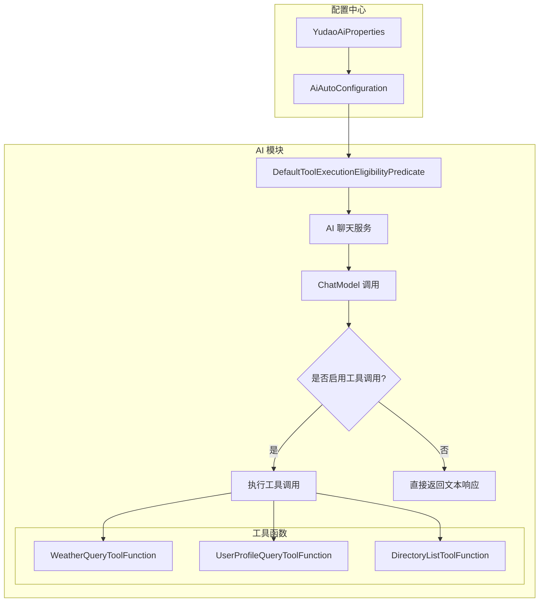
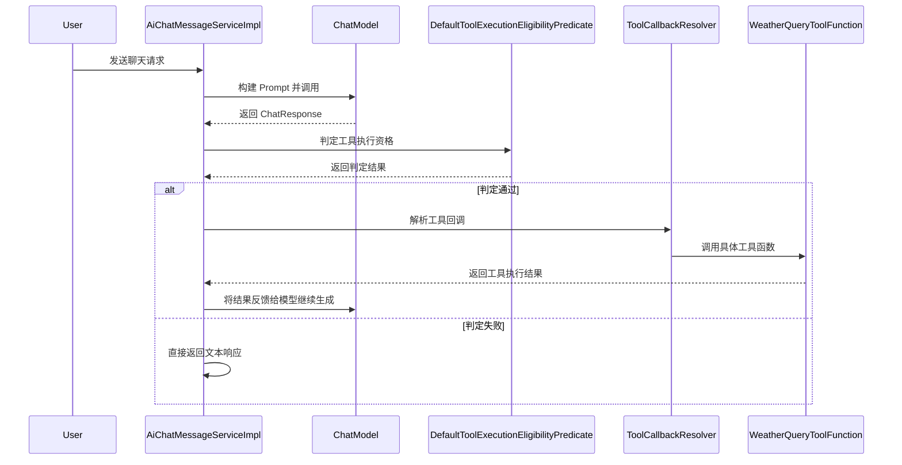
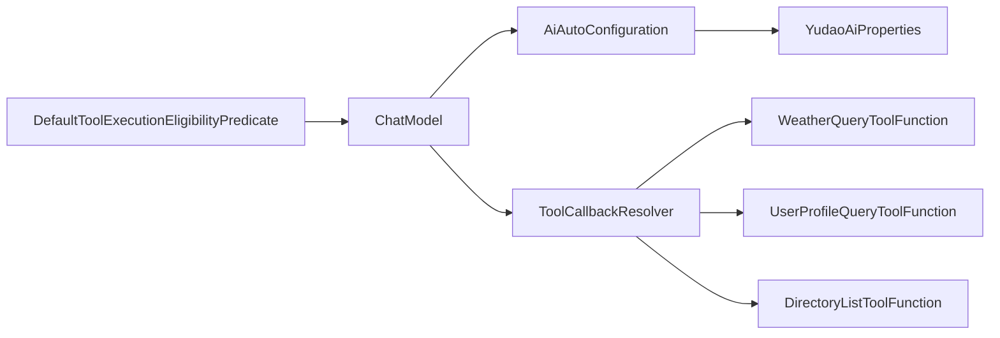

# AI 工具执行 Eligibility 判定模块文档

## 1. 模块概述

`tool_2` 模块是 **Yudao AI 模块**中的核心组件之一，负责处理 AI 工具调用的执行资格判定。该模块主要解决 Spring AI 2.0.0 版本与旧版本之间的兼容性问题，确保 AI 模型在对话过程中能够正确判断是否应该执行工具调用（Tool Calls）。

在 Yudao 的 AI 聊天系统中，当用户发起对话时，AI 模型可能会根据需求调用外部工具（如查询天气、获取用户信息、文件列表等）。`DefaultToolExecutionEligibilityPredicate` 类作为工具执行资格的判定器，决定了在什么情况下允许 AI 模型执行这些工具调用。

## 2. 核心组件

### 2.1 DefaultToolExecutionEligibilityPredicate

**文件路径**: `yudao-module-ai/src/main/java/org/springframework/ai/model/tool/DefaultToolExecutionEligibilityPredicate.java`

**类说明**: 实现 `ToolExecutionEligibilityPredicate` 接口，用于判定 AI 模型是否应该执行工具调用。

```java
public class DefaultToolExecutionEligibilityPredicate implements ToolExecutionEligibilityPredicate {

    @Override
    public boolean test(ChatOptions promptOptions, ChatResponse chatResponse) {
        return isInternalToolExecutionEnabled(promptOptions) 
            && chatResponse != null 
            && chatResponse.hasToolCalls();
    }

    private static boolean isInternalToolExecutionEnabled(ChatOptions promptOptions) {
        try {
            Method method = promptOptions.getClass().getMethod("getInternalToolExecutionEnabled");
            Object result = method.invoke(promptOptions);
            return result == null || Boolean.TRUE.equals(result);
        } catch (ReflectiveOperationException | SecurityException ignored) {
            return true;
        }
    }

}
```

**功能说明**:
- **判定条件**: 只有同时满足以下三个条件时，才允许执行工具调用：
  1. 内部工具执行已启用（通过反射检查 `promptOptions` 中的 `getInternalToolExecutionEnabled` 方法）
  2. `chatResponse` 不为空
  3. `chatResponse` 包含工具调用（`hasToolCalls()` 返回 true）
- **兼容性处理**: 由于 spring-ai-alibaba 2.0.0-M1.1 仍依赖旧的 Spring AI `ToolExecutionEligibilityPredicate`，该类作为临时补齐方案。待升级到兼容 Spring AI 2.0.0 的版本后，将删除此 shim 层。
- **反射调用**: 使用反射动态调用 `ChatOptions` 的方法，以兼容不同版本的 Spring AI API。

## 3. 模块架构与交互

### 3.1 整体架构



### 3.2 组件交互流程

1. **配置初始化**: `AiAutoConfiguration` 初始化 AI 相关的 Bean，包括工具调用管理器（`ToolCallingManager`）
2. **对话请求**: 用户发起聊天请求，`AiChatMessageServiceImpl` 构建 Prompt 并调用 ChatModel
3. **工具判定**: 在 ChatModel 返回响应后，`DefaultToolExecutionEligibilityPredicate` 判定是否执行工具调用
4. **工具执行**: 如果判定通过，则根据工具名称调用相应的工具函数（如天气查询、用户信息等）
5. **结果返回**: 工具执行结果返回给 AI 模型，继续生成最终响应

### 3.3 与 AI 模块其他组件的关系



## 4. 配置说明

### 4.1 YudaoAiProperties

**文件路径**: `yudao-module-ai/src/main/java/cn/iocoder/yudao/module/ai/framework/ai/config/YudaoAiProperties.java`

AI 模块的全局配置类，通过 `@ConfigurationProperties(prefix = "yudao.ai")` 绑定配置属性。虽然该类不直接控制工具执行资格，但它配置了各种 AI 服务提供商（如 DashScope、XingHuo、SiliconFlow 等），这些服务都可能涉及工具调用功能。

**关键配置项**:
```yaml
yudao:
  ai:
    dashscope:
      api-key: your-api-key
      model: qwen-max
    xinghuo:
      enable: true
      api-key: your-api-key
    siliconflow:
      enable: true
      api-key: your-api-key
    # 其他 AI 服务提供商配置...
```

### 4.2 AiAutoConfiguration

**文件路径**: `yudao-module-ai/src/main/java/cn/iocoder/yudao/module/ai/framework/ai/config/AiAutoConfiguration.java`

AI 模块的自动配置类，负责创建各种 AI Client Bean、工具调用管理器（`ToolCallingManager`）等。该类通过 `@Bean` 注解声明了多个与工具调用相关的 Bean，为 `DefaultToolExecutionEligibilityPredicate` 提供运行环境。

## 5. 工具函数示例

AI 模块支持多种工具函数，这些函数通过 `@Component` 注解注册为 Spring Bean，并在需要时被 `DefaultToolExecutionEligibilityPredicate` 判定后调用。

### 5.1 WeatherQueryToolFunction

**功能**: 查询指定城市的天气信息

**请求参数**:
- `city` (String, 必填): 城市名称，例如：北京、上海、广州

**响应数据**:
- `city` (String): 城市名称
- `weatherInfo` (WeatherInfo): 天气信息，包含温度、天气状况、湿度、风速、查询时间

### 5.2 UserProfileQueryToolFunction

**功能**: 查询用户信息

**请求参数**:
- `id` (Long, 可选): 用户编号。如果为空，则查询当前登录用户

**特殊处理**:
- 通过 `ToolContext` 获取租户 ID 和登录用户信息
- 支持多租户环境下的用户信息查询

### 5.3 DirectoryListToolFunction

**功能**: 列出指定目录的文件列表

**请求参数**:
- `path` (String, 必填): 目录路径，例如：/Users/yunai

**响应数据**:
- `files` (List<File>): 文件列表，每个文件包含目录标识、名称、大小、最后修改时间

## 6. 使用场景

### 6.1 智能客服助手

在智能客服场景中，AI 模型需要查询用户信息以提供个性化服务。通过 `UserProfileQueryToolFunction`，AI 可以安全地获取用户的历史订单、偏好设置等信息，同时通过 `DefaultToolExecutionEligibilityPredicate` 确保只有在明确需要时才执行工具调用。

### 6.2 天气查询机器人

当用户询问天气时，AI 模型通过 `WeatherQueryToolFunction` 获取实时天气信息。`DefaultToolExecutionEligibilityPredicate` 确保只有在 ChatResponse 包含工具调用请求时才触发天气查询，避免不必要的 API 调用。

### 6.3 文件管理系统

在文件管理场景中，用户可以通过自然语言指令查询文件目录。`DirectoryListToolFunction` 结合 `DefaultToolExecutionEligibilityPredicate` 实现了安全的文件目录访问控制。

## 7. 依赖关系

### 7.1 直接依赖

| 依赖项 | 说明 |
|--------|------|
| `spring-ai-core` | 提供 `ChatOptions`、`ChatResponse`、`ToolExecutionEligibilityPredicate` 等核心接口 |
| `spring-context` | 提供反射操作支持 |
| `yudao-module-ai` | AI 模块的其他组件，如工具函数、配置类 |

### 7.2 间接依赖



## 8. 注意事项

1. **版本兼容性**: 该类是为兼容旧版 Spring AI 而设计的临时 shim，待 spring-ai-alibaba 升级到完全兼容 Spring AI 2.0.0 的版本后需要删除。

2. **反射调用**: 使用反射调用 `ChatOptions` 的方法可能存在安全风险，建议在后续版本中改为直接调用。

3. **工具启用控制**: 工具执行的启用状态由 `ChatOptions` 中的 `internalToolExecutionEnabled` 属性控制，开发者在构建 Prompt 时需要正确设置该属性。

4. **多租户支持**: 在 `UserProfileQueryToolFunction` 中，工具执行会考虑租户上下文，确保数据隔离。

5. **性能考量**: 每次对话都会执行工具资格判定，判定逻辑简单，性能影响较小。但在高并发场景下，建议关注反射调用的性能开销。

## 9. 相关模块参考

- [AI 模块](ai_module.md) - AI 功能整体架构
- [系统模块](system_module.md) - 用户权限和租户管理
- [配置模块](config_module.md) - Spring Boot 自动配置机制
- [工具函数](tool_functions.md) - 各种 AI 工具函数的实现
