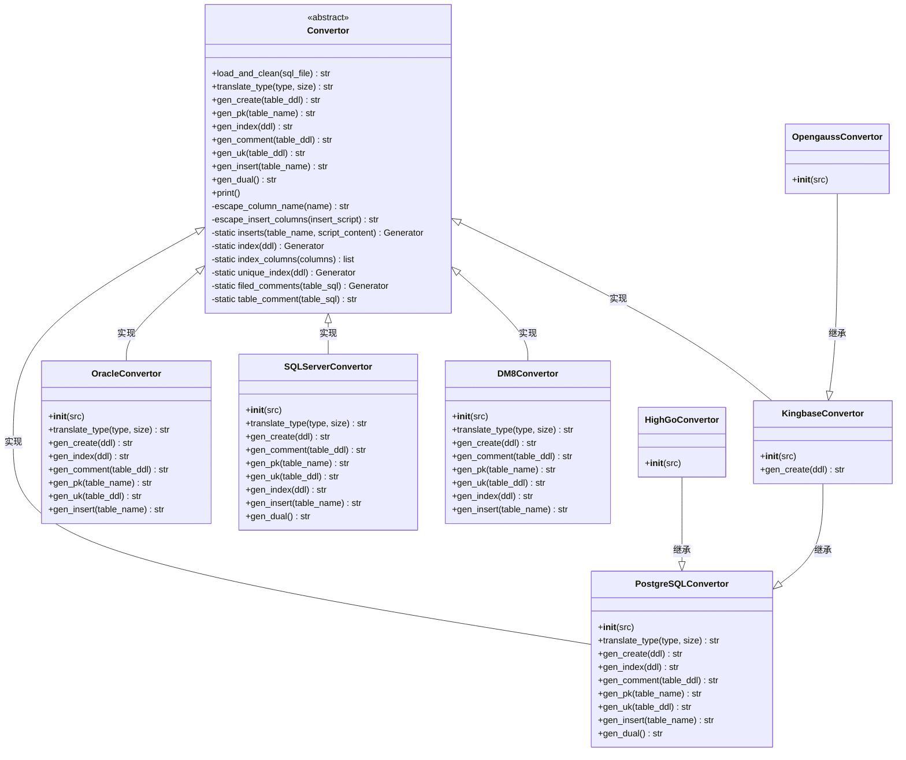

# Tools 模块文档

## 概述

Tools 模块是芋道系统的数据库迁移工具，用于将 MySQL 数据库脚本转换为其他数据库系统的兼容脚本。该工具基于 `simple-ddl-parser` 库解析 MySQL DDL（数据定义语言），并生成目标数据库（如 PostgreSQL、Oracle、SQL Server、DM8、Kingbase、OpenGauss、HighGo）的建表语句、索引、注释和初始化数据。

该工具主要解决在不同数据库之间迁移时的 SQL 方言差异问题，包括数据类型转换、关键字转义、注释处理、主键和唯一约束生成以及插入语句的适配。

## 核心组件

Tools 模块包含以下核心组件，所有组件均位于 `sql/tools/convertor.py` 文件中：

### 抽象基类：Convertor

所有具体数据库转换器的基类，定义了转换过程的通用框架和抽象方法。

**主要职责：**
- 加载并预处理源 MySQL SQL 文件（移除不兼容的字符集、排序规则等）
- 解析表结构（使用 `simple-ddl-parser`）
- 生成目标数据库的建表语句（`gen_create`）
- 生成主键约束（`gen_pk`）
- 生成唯一约束（`gen_uk`）
- 生成索引（`gen_index`）
- 生成表和字段注释（`gen_comment`）
- 生成插入语句（`gen_insert`）
- 生成虚拟 dual 表（`gen_dual`，某些数据库需要）

**关键方法：**
- `translate_type(type, size)`：抽象方法，由子类实现具体的数据类型转换
- `escape_column_name(name)`：转义目标数据库的保留字列名
- `inserts(table_name, script_content)`：静态方法，提取指定表的 INSERT 语句
- `index(ddl)` 和 `index_columns(columns)`：静态方法，生成索引定义
- `unique_index(ddl)`：静态方法，处理唯一约束
- `filed_comments(table_sql)`：静态方法，提取字段注释
- `table_comment(table_sql)`：提取表注释

### 具体转换器实现

#### 1. PostgreSQLConvertor
- 目标数据库：PostgreSQL
- 特点：
  - 将 `varchar` 转换为 `varchar(size)`
  - 整数类型：`int` → `int4`, `bigint` → `int8`, `tinyint/smallint` → `int2`
  - 时间类型：`datetime/timestamp` → `timestamp`, `date` → `date`
  - JSON 类型：`json` → `jsonb`
  - 浮点类型：`double` → `double precision`
  - 位类型：`bit` → `bool`
  - 文本类型：`text/longtext` → `text`, 二进制大对象：`blob/mediumblob/longblob` → `bytea`
  - 小数类型：`decimal` → `numeric`
  - 主键：使用序列（sequence）自动生成 ID
  - 注释：使用 `COMMENT ON COLUMN` 和 `COMMENT ON TABLE`

#### 2. OracleConvertor
- 目标数据库：Oracle
- 特点：
  - 保留字转义：`level`, `size` 等需要加双引号
  - 数据类型：
    - `varchar` → `varchar2`（长度超过 4000 时截断为 4000）
    - 整数类型：`int` → `number`, `bigint` → `number`
    - 时间类型：`datetime` → `date`, `timestamp` → `timestamp(size)`
    - 位类型：`bit` → `number(1,0)`
    - 小整数：`tinyint/smallint` → `smallint`
    - 文本类型：`text/longtext` → `clob`
    - 二进制大对象：`blob/mediumblob` → `blob`
    - 小数类型：`decimal` → `number`（指定精度和 scale）
  - 主键：使用序列和触发器（或在 INSERT 时使用序列）
  - 注释：同样使用 `COMMENT ON COLUMN` 和 `COMMENT ON TABLE`
  - 特殊处理：Oracle 不允许在 NOT NULL 列上使用空字符串默认值，因此将 `DEFAULT '' NOT NULL` 转换为 `DEFAULT '' NULL`

#### 3. SQLServerConvertor
- 目标数据库：Microsoft SQL Server
- 特点：
  - 数据类型：
    - `varchar` → `nvarchar`（长度超过 4000 时截断为 4000，使用 Unicode）
    - 整数类型：`int` → `int`, `bigint` → `bigint`
    - 时间类型：`datetime/timestamp` → `datetime2`
    - 位类型：`bit` → `varchar(1)`（SQL Server 的 bit 类型在某些版本中有限制）
    - 小整数：`tinyint/smallint` → `tinyint`
    - 文本类型：`text/longtext` → `nvarchar(max)`
    - 二进制大对象：`blob/mediumblob` → `varbinary(max)`
    - 小数类型：`decimal` → `numeric`
  - 主键：使用 `IDENTITY` 属性（自增列）
  - 注释：使用扩展属性 `sp_addextendedproperty` 存储 MS_Description
  - 插入语句：需要设置 `IDENTITY_INSERT` 以显式插入 ID 值
  - 字符串前缀：所有字符串字面量前加 `N` 以表示 Unicode

#### 4. DM8Convertor
- 目标数据库：DM8（达梦数据库）
- 特点：
  - 数据类型：
    - `varchar` → `varchar(size char)`（显式指定字符语义）
    - 整数类型：`int` → `int`, `bigint` → `bigint`
    - 时间类型：`datetime` → `datetime`, `timestamp` → `timestamp(size)`
    - 位类型：`bit` → `bit`
    - 小整数：`tinyint/smallint` → `smallint`
    - 文本类型：`text/longtext` → `text`
    - 二进制大对象：`blob/mediumblob` → `blob`
    - 小数类型：`decimal` → `decimal`
  - 主键：使用 `IDENTITY`（类似 SQL Server）
  - 注释：使用 `COMMENT ON COLUMN` 和 `COMMENT ON TABLE`
  - 插入语句：同样需要管理 `IDENTITY_INSERT`

#### 5. HighGoConvertor
- 目标数据库：HighGo（高斯数据库）
- 特点：
  - 继承自 PostgreSQLConvertor，因此大部分行为与 PostgreSQL 相同
  - 目标数据库名称设置为 "HighGo"
  - 保留字集合为空（继承自 PostgreSQLConvertor，但 PostgreSQLConvertor 没有定义保留字，而 KingbaseConvertor 添加了 `level`）
  - 实际上 HighGoConvertor 直接继承 PostgreSQLConvertor 并仅修改了数据库名称

#### 6. OpengaussConvertor
- 目标数据库：OpenGauss（openGauss 数据库）
- 特点：
  - 继承自 KingbaseConvertor（而 KingbaseConvertor 又继承自 PostgreSQLConvertor）
  - 目标数据库名称设置为 "OpenGauss"
  - 保留字集合为空（覆盖了 KingbaseConvertor 中的 `level` 保留字）
  - 在 KingbaseConvertor 中，对 `text` 类型的可空性进行了特殊处理（强制设为 NULL 以避免 NOT NULL 冲突）

## 架构设计

Tools 模块采用模板方法设计模式，通过抽象基类 `Convertor` 定义转换流程的骨架，由具体的转换器子类实现数据库特定的细节。

以下是转换器类的继承关系图：



## 工作流程

转换过程遵循以下步骤：

1. **文件加载与预处理**：
   - 读取源 MySQL SQL 文件
   - 移除不兼容的字符集和排序规则（如 `CHARACTER SET utf8mb4 COLLATE utf8mb4_unicode_ci`）
   - 转换特定语法（如将 `KEY` 改为 `INDEX`, 处理布尔字面量 `b'0'`/`b'1'`）
   - 移除索引长度前缀和 `USING BTREE COMMENT` 子句

2. **表结构解析**：
   - 使用 `simple-ddl-parser` 解析预处理后的 SQL，提取每个表的 DDL 信息（表名、列、索引、约束等）
   - 忽略以 `qrtz` 开头的表（Quartz 调度表）

3. **注释提取**：
   - 从原始 SQL 中提取表和字段注释（以支持中文等 `simple-ddl-parser` 无法处理的内容）
   - 将注释附加到解析得到的表结构上

4. **目标 SQL 生成**：
   - 对每个表，依次生成：
     - 建表语句（`CREATE TABLE`）
     - 主键约束（如果存在 `id` 列）
     - 唯一约束
     - 索引
     - 表和字段注释
     - 插入语句（如果存在）
   - 为需要序列的数据库（PostgreSQL、Oracle）生成序列定义
   - 生成虚拟 `dual` 表（某些数据库如 Oracle、SQL Server 需要）

5. **输出**：
   - 将生成的 SQL 脚本打印到标准输出
   - 解析失败的表结构会被打印到标准错误输出以供排查

## 使用说明

该工具作为命令行脚本运行，使用方法如下：

```bash
# 基本用法
python convertor.py <目标数据库类型> [源SQL文件路径]

# 目标数据库类型选项：
#   postgres   -> PostgreSQL
#   oracle     -> Oracle
#   sqlserver  -> Microsoft SQL Server
#   dm8        -> DM8
#   kingbase   -> Kingbase
#   opengauss  -> OpenGauss
#   highgo     -> HighGo

# 示例：
# 转换为 PostgreSQL
python convertor.py postgres ../mysql/ruoyi-vue-pro.sql

# 转换为 Oracle
python convertor.py oracle ../mysql/ruoyi-vue-pro.sql

# 转换为 SQL Server
python convertor.py sqlserver ../mysql/ruoyi-vue-pro.sql

# 转换为 DM8
python convertor.py dm8 ../mysql/ruoyi-vue-pro.sql

# 转换为 HighGo
python convertor.py highgo ../mysql/ruoyi-vue-pro.sql

# 转换为 OpenGauss
python convertor.py opengauss ../mysql/ruoyi-vue-pro.sql

# 转换为 Kingbase
python convertor.py kingbase ../mysql/ruoyi-vue-pro.sql
```

如果未指定源 SQL 文件路径，则默认使用 `../mysql/ruoyi-vue-pro.sql`（相对于脚本所在目录）。

## 与其他模块的关系

Tools 模块是芋道系统中的一个独立工具模块，主要用于系统初始化和数据库迁移场景。它不直接依赖于系统的其他业务模块，但为系统在不同数据库上的部署提供了必要的支持。

- **输入**：依赖于 MySQL 格式的数据库脚本（通常是系统的初始化 SQL 文件）
- **输出**：生成目标数据库兼容的 SQL 脚本，可用于在目标数据库中初始化系统表结构和数据
- **关联**：该工具的输出通常用于部署文档或自动化部署脚本中，以支持系统在多种数据库环境下的运行

通过使用此工具，开发人员和运维人员可以轻松将芋道系统从 MySQL 迁移到其他主流数据库，而无需手动修改 SQL 脚本，从而提高了系统的可移植性和部署灵活性。