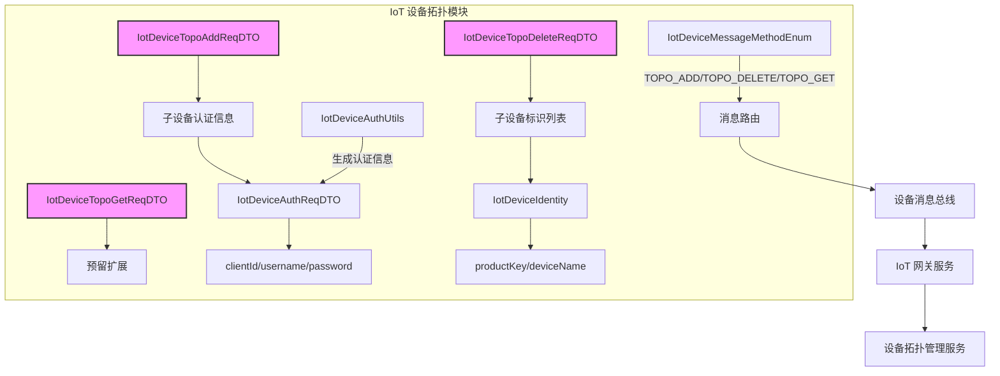
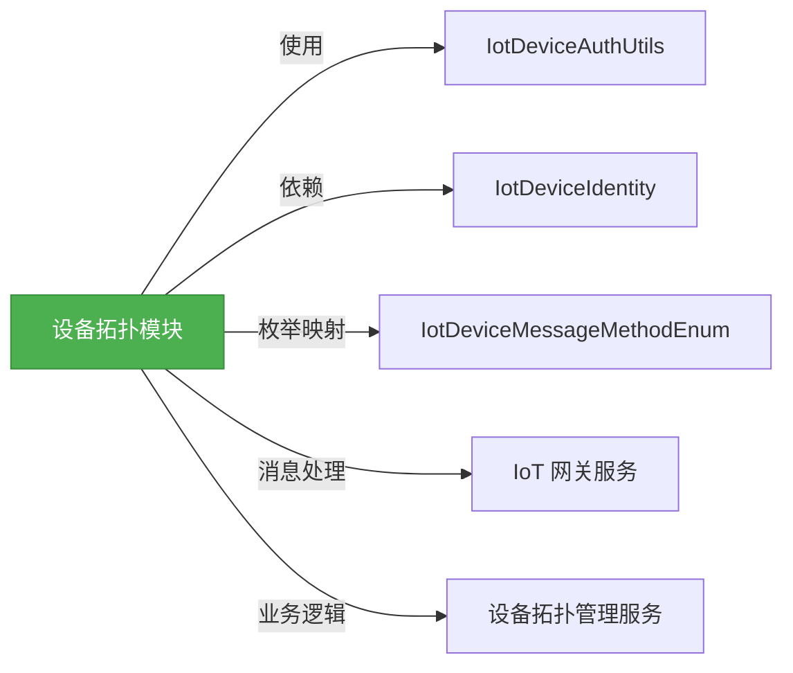
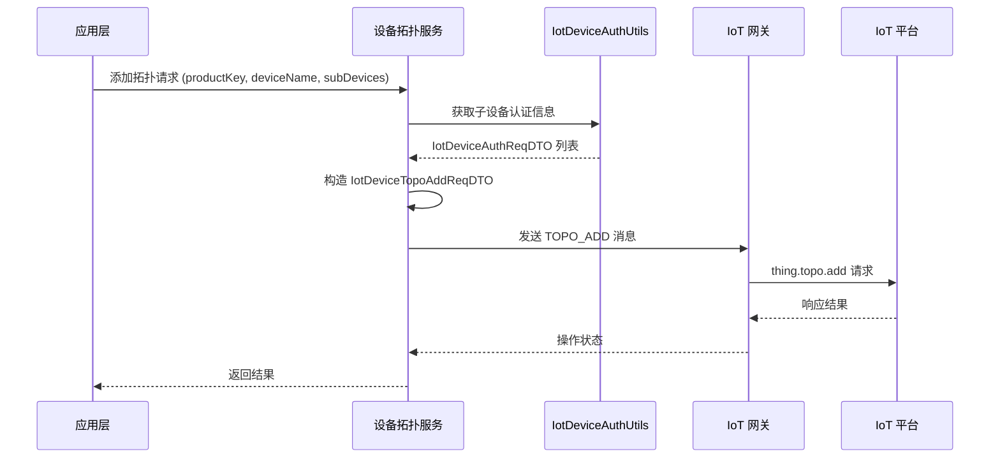
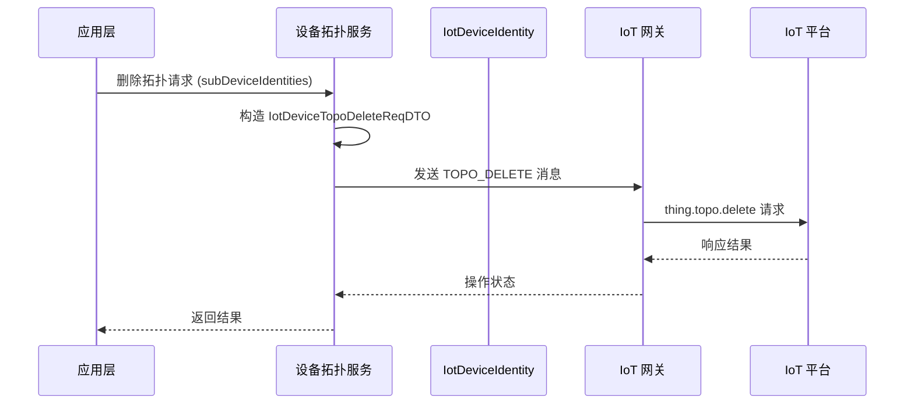
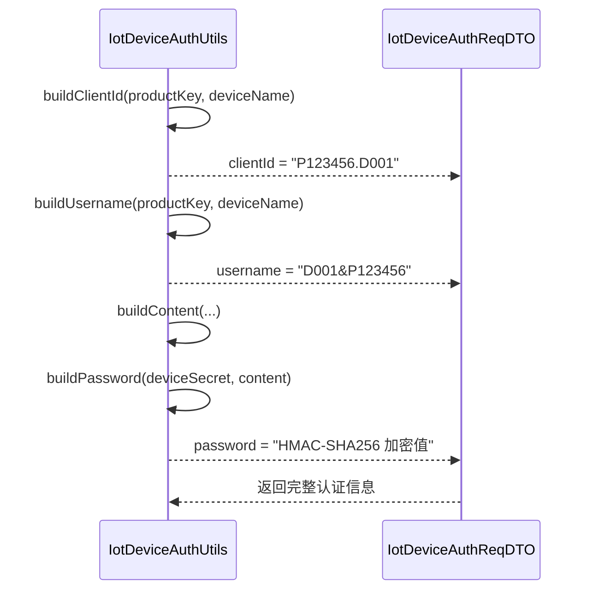

# IoT 设备拓扑模块 (Topo Module)

## 1. 概述

IoT 设备拓扑模块负责管理物联网设备之间的父子层级关系，实现网关与子设备的拓扑结构维护。该模块基于阿里云 IoT 平台的拓扑管理理念，提供了添加、删除和查询设备拓扑关系的完整功能。

在物联网场景中，网关设备（Gateway）通常连接多个子设备（Sub Device），形成树状的拓扑结构。通过拓扑管理，系统可以：
- 识别设备间的物理/逻辑连接关系
- 实现子设备的统一管理和配置下发
- 支持网关对子设备消息的代理转发
- 便于故障定位和网络拓扑可视化

本模块的核心是围绕 **设备拓扑关系** 的数据传输对象（DTO），定义了添加、删除和获取拓扑关系的请求参数格式，并与设备认证、身份标识等核心组件紧密集成。

## 2. 架构概览



### 模块关系图

拓扑模块作为 IoT 核心模块的一部分，与其他关键模块的协作关系如下：



## 3. 核心组件详解

### 3.1 设备拓扑请求 DTO

#### IotDeviceTopoAddReqDTO - 添加拓扑请求

用于向 IoT 平台发起添加设备拓扑关系的请求，主要包含子设备的认证信息。

```java
@Data
public class IotDeviceTopoAddReqDTO {
    
    /**
     * 子设备认证信息列表
     * 复用 IotDeviceAuthReqDTO，包含 clientId、username、password
     */
    @NotEmpty(message = "子设备认证信息列表不能为空")
    private List<IotDeviceAuthReqDTO> subDevices;
}
```

**字段说明：**
- `subDevices`: 子设备认证信息列表，每个子设备包含完整的认证凭据，用于在 IoT 平台注册或验证身份

**使用场景：**
当网关需要向云端注册其连接的子设备时，构造此 DTO 并通过 `TOPO_ADD` 方法发送消息。

#### IotDeviceTopoDeleteReqDTO - 删除拓扑请求

用于删除设备之间的拓扑关系。

```java
@Data
public class IotDeviceTopoDeleteReqDTO {
    
    /**
     * 子设备标识列表
     */
    @Valid
    @NotEmpty(message = "子设备标识列表不能为空")
    private List<IotDeviceIdentity> subDevices;
}
```

**字段说明：**
- `subDevices`: 子设备标识列表，仅包含 productKey 和 deviceName，用于唯一标识要解除拓扑关系的设备

**使用场景：**
当子设备从网关移除或需要解除与云端的关联时，通过 `TOPO_DELETE` 方法发送删除请求。

#### IotDeviceTopoGetReqDTO - 获取拓扑请求

用于查询设备拓扑关系，当前为预留空类，未来可能扩展查询条件。

```java
@Data
public class IotDeviceTopoGetReqDTO {
    // 预留扩展字段
}
```

**使用场景：**
通过 `TOPO_GET` 方法查询指定设备及其子设备的拓扑结构，用于拓扑展示或故障排查。

### 3.2 辅助实体

#### IotDeviceIdentity - 设备身份标识

表示设备的唯一身份，由产品密钥（Product Key）和设备名称（Device Name）组成。

```java
@Data
@NoArgsConstructor
@AllArgsConstructor
public class IotDeviceIdentity {
    
    /**
     * 产品标识 - 阿里云 IoT 概念中的 ProductKey
     */
    @NotEmpty(message = "产品标识不能为空")
    private String productKey;
    
    /**
     * 设备名称 - 阿里云 IoT 概念中的 DeviceName
     */
    @NotEmpty(message = "设备名称不能为空")
    private String deviceName;
}
```

**特点：**
- 轻量级标识对象，不包含敏感认证信息
- 用于设备间关系的描述和操作
- 在拓扑删除操作中作为子设备的唯一标识

#### IotDeviceAuthReqDTO - 设备认证信息

包含设备连接到 IoT 平台所需的完整认证凭据。

```java
@Data
@NoArgsConstructor
@AllArgsConstructor
public class IotDeviceAuthReqDTO {
    
    /**
     * 客户端 ID - 通常为 productKey.deviceName 格式
     */
    @NotEmpty(message = "客户端 ID 不能为空")
    private String clientId;
    
    /**
     * 用户名 - 通常为 deviceName&productKey 格式
     */
    @NotEmpty(message = "用户名不能为空")
    private String username;
    
    /**
     * 密码 - 基于 deviceSecret HMAC-SHA256 计算得出
     */
    @NotEmpty(message = "密码不能为空")
    private String password;
}
```

**认证原理：**
- `clientId`: 构建方式为 `${productKey}.${deviceName}`
- `username`: 构建方式为 `${deviceName}&${productKey}`
- `password`: 使用 deviceSecret 对特定内容进行 HMAC-SHA256 加密

### 3.3 工具类：IotDeviceAuthUtils

提供设备认证信息的生成和解析工具方法。

```java
public class IotDeviceAuthUtils {
    
    /**
     * 根据产品信息生成认证信息 DTO
     */
    public static IotDeviceAuthReqDTO getAuthInfo(String productKey, String deviceName, String deviceSecret);
    
    /**
     * 构建 clientId
     */
    public static String buildClientId(String productKey, String deviceName);
    
    /**
     * 从 username 解析出 clientId
     */
    public static String buildClientIdFromUsername(String username);
    
    /**
     * 构建 username
     */
    public static String buildUsername(String productKey, String deviceName);
    
    /**
     * 基于 deviceSecret 生成密码
     */
    public static String buildPassword(String deviceSecret, String content);
    
    /**
     * 从 username 解析出设备身份信息
     */
    public static IotDeviceIdentity parseUsername(String username);
}
```

**核心方法说明：**

| 方法 | 用途 | 示例 |
|------|------|------|
| `getAuthInfo` | 一次性生成完整认证信息 | `getAuthInfo("P123456", "D001", "secret123")` |
| `buildClientId` | 构建客户端 ID | `"P123456.D001"` |
| `buildUsername` | 构建用户名 | `"D001&P123456"` |
| `buildPassword` | 生成加密密码 | HMAC-SHA256 计算结果 |
| `parseUsername` | 反向解析设备身份 | 从 `"D001&P123456"` 得到 `{productKey:P123456, deviceName:D001}` |

### 3.4 枚举：IotDeviceMessageMethodEnum

定义设备消息的方法类型，其中拓扑相关的方法包括：

```java
public enum IotDeviceMessageMethodEnum {
    
    // ========== 拓扑管理 ==========
    TOPO_ADD("thing.topo.add", "添加拓扑关系", true),      // 上行：需要回复
    TOPO_DELETE("thing.topo.delete", "删除拓扑关系", true), // 上行：需要回复
    TOPO_GET("thing.topo.get", "获取拓扑关系", true),       // 上行：需要回复
    TOPO_CHANGE("thing.topo.change", "拓扑关系变更通知", false); // 下行：无需回复
}
```

**属性说明：**
- `method`: 消息方法标识符，遵循阿里云 IoT 平台规范
- `name`: 中文显示名称
- `upstream`: 是否为上行消息（true=设备→云端，false=云端→设备）

拓扑相关的三个方法均为上行消息，意味着它们由设备或网关主动发送给云端，并期望收到响应。

## 4. 数据流分析

### 4.1 添加拓扑流程



### 4.2 删除拓扑流程



### 4.3 认证信息生成流程



## 5. 模块集成

### 5.1 与消息总线的集成

拓扑请求 DTO 通过 `IotDeviceMessageMethodEnum` 中定义的方法名，与 IoT 消息总线进行关联。当设备或网关需要执行拓扑操作时，会构造对应的方法名和请求体，通过消息通道发送到云端。

### 5.2 与设备服务的集成

拓扑操作通常与设备注册、设备管理等业务流程紧密相关。在设备首次上线或网关发现新子设备时，会自动触发拓扑添加操作。

### 5.3 与网关协议的集成

在 IoT 网关侧，不同协议（MQTT、CoAP、HTTP 等）的上行消息会被转换为标准的拓扑请求 DTO，再由网关服务统一处理。

## 6. 参考文档

- [阿里云 IoT 平台 - 添加拓扑关系](http://help.aliyun.com/zh/marketplace/add-topological-relationship)
- [阿里云 IoT 平台 - 删除拓扑关系](https://help.aliyun.com/zh/marketplace/delete-a-topological-relationship)
- [阿里云 IoT 平台 - 获取拓扑关系](https://help.aliyun.com/zh/marketplace/obtain-topological-relationship)

## 7. 相关模块

- [设备身份模块](yudao-module-iot-core.md#IotDeviceIdentity): 设备唯一标识的定义
- [设备认证模块](yudao-module-iot-core.md#IotDeviceAuthUtils): 设备认证信息的生成和管理
- [消息方法枚举](yudao-module-iot-core.md#IotDeviceMessageMethodEnum): 设备消息类型的统一定义
- [IoT 核心模块](yudao-module-iot-core.md): 设备消息总线、Topic 构建等核心能力
