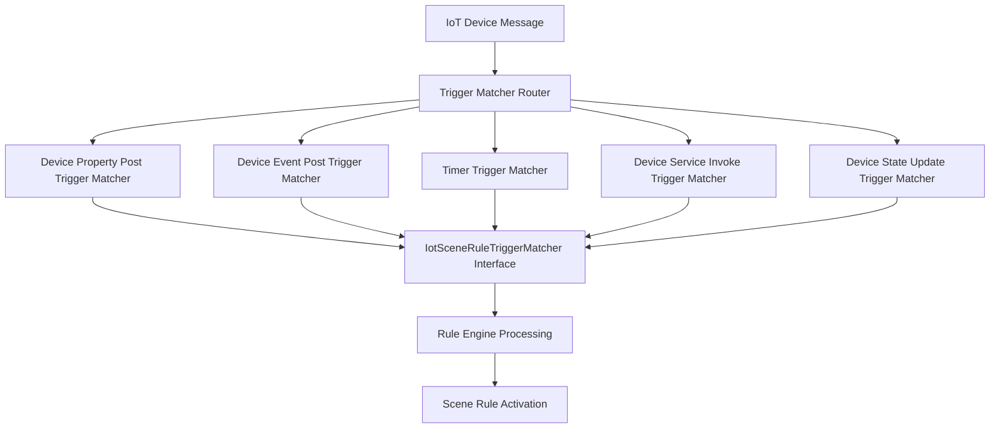

# Trigger Module Documentation

## Overview

The Trigger Module is a core component of the IoT rule engine in the Yudao platform. It provides the mechanism for evaluating and matching different types of triggers that can initiate automated actions in IoT scenarios. The module implements various trigger matchers that process different types of device messages and determine whether they should activate specific scene rules based on configured conditions.

## Architecture Overview

The trigger module follows a strategy pattern where each type of trigger has its own matcher implementation. All trigger matchers implement the `IotSceneRuleTriggerMatcher` interface and are registered as Spring components. The rule engine uses these matchers to evaluate incoming device messages against configured scene rule triggers.



### Trigger Matching Process Flow

```mermaid
sequenceDiagram
    participant RuleEngine
    participant TriggerMatcher
    participant Message
    participant Helper
    
    RuleEngine->>TriggerMatcher: matches(message, trigger)
    TriggerMatcher->>Helper: isBasicTriggerValid(trigger)
    Helper-->>TriggerMatcher: boolean
    TriggerMatcher->>TriggerMatcher: Validate message method
    TriggerMatcher->>TriggerMatcher: Check product/device match
    TriggerMatcher->>TriggerMatcher: Validate identifier
    TriggerMatcher->>TriggerMatcher: Evaluate condition
    TriggerMatcher-->>RuleEngine: boolean (match result)

## Module Components

The trigger module consists of five specialized trigger matchers, each handling a specific type of IoT device message:

1. [Device Property Post Trigger Matcher](trigger_device_property_post.md) - Handles device property data reporting
2. [Device Event Post Trigger Matcher](trigger_device_event_post.md) - Handles device event reporting
3. [Timer Trigger Matcher](trigger_timer.md) - Handles time-based triggers
4. [Device Service Invoke Trigger Matcher](trigger_trigger_device_service_invoke.md) - Handles device service invocation responses
5. [Device State Update Trigger Matcher](trigger_device_state_update.md) - Handles device online/offline status changes

Each matcher implements the core matching logic for its specific trigger type, including:
- Validation of trigger configuration
- Verification of message type and method
- Product and device ID consistency checks
- Identifier matching
- Condition evaluation based on operator and value

## How It Fits Into the System

The trigger module works in conjunction with other components of the IoT rule engine:

- Receives device messages from the message queue system
- Evaluates messages against configured scene rule triggers
- When a match is found, activates the corresponding scene rule actions
- Works with the matcher helper utility for common validation and logging functions

For more details on how triggers fit into the broader IoT rule engine, see the [IoT Rule Engine Documentation](iot_rule_engine.md).

## Key Features

- **Extensible Design**: New trigger types can be added by implementing the `IotSceneRuleTriggerMatcher` interface
- **Consistent Validation**: All matchers use shared helper methods for common validation tasks
- **Priority-Based Execution**: Matchers can be assigned priorities to control evaluation order
- **Comprehensive Logging**: Detailed match success/failure logging for debugging and monitoring
- **Spring Integration**: All matchers are automatically registered as Spring components

## Usage

The trigger matchers are automatically discovered and used by the IoT rule engine. To add a new trigger type:

1. Create a new class implementing `IotSceneRuleTriggerMatcher`
2. Implement the `getSupportedTriggerType()` method to return the appropriate trigger type enum
3. Implement the `matches()` method with the specific matching logic
4. Implement the `getPriority()` method to define evaluation order
5. Annotate the class with `@Component` for Spring auto-detection

## Related Modules

- [IoT Rule Engine](iot_rule_engine.md) - Core rule processing logic
- [IoT Device Service](iot_device_service.md) - Device management and communication
- [IoT Message Bus](iot_message_bus.md) - Message handling and routing