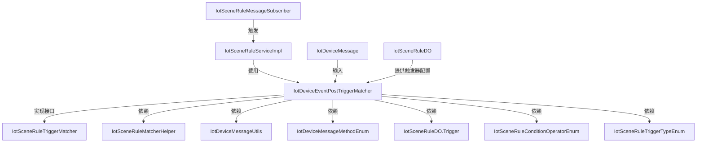

# trigger_device_event_post 模块文档

## 概述

`trigger_device_event_post` 模块是物联网（IoT）模块中的一个触发器匹配器，用于处理设备事件上报（Device Event Post）的触发逻辑。它是场景规则（Scene Rule）引擎的一部分，负责匹配设备上报的事件消息，并根据预定义的触发条件决定是否触发对应的场景规则。

该模块位于以下路径：
```
yudao-module-iot/yudao-module-iot-biz/src/main/java/cn/iocoder/yudao/module/iot/service/rule/scene/matcher/trigger/IotDeviceEventPostTriggerMatcher.java
```

## 核心功能

该模块的主要职责是：
1. 接收设备上报的事件消息（`IotDeviceMessage`）。
2. 验证触发器的基本参数是否有效。
3. 检查消息方法是否为事件上报（`EVENT_POST`）。
4. 验证产品和设备的一致性。
5. 检查消息标识符是否与触发器配置匹配。
6. 如果触发器配置了操作符和值，则进一步匹配事件数据条件。
7. 记录匹配结果（成功或失败）并返回布尔值表示是否匹配。

## 架构与组件关系

### 组件关系图

以下是 `IotDeviceEventPostTriggerMatcher` 与相关组件的交互关系：



### 说明：
- `IotDeviceEventPostTriggerMatcher` 实现了 `IotSceneRuleTriggerMatcher` 接口，是场景规则触发器匹配器的具体实现。
- 它依赖多个工具类和枚举来完成参数验证、消息解析和条件判断。
- 场景规则服务 (`IotSceneRuleServiceImpl`) 会在处理规则时使用此匹配器。
- 消息订阅者 (`IotSceneRuleMessageSubscriber`) 负责从消息队列中接收设备消息，并触发规则匹配流程。
- 输入包括设备消息 (`IotDeviceMessage`) 和触发器配置 (`IotSceneRuleDO.Trigger`)，输出是匹配结果（布尔值）。

## 在系统中的角色

在物联网平台的场景规则引擎中，当设备上报事件消息时，该消息会被路由到规则引擎。规则引擎会遍历所有与该设备和产品关联的场景规则，并对每个规则的触发条件使用对应的匹配器进行匹配。

`IotDeviceEventPostTriggerMatcher` 专门处理类型为 `DEVICE_EVENT_POST` 的触发器。当设备上报事件消息（如温度超过阈值、门开关状态变化等）时，此匹配器会被调用来判断该事件是否满足特定规则的触发条件。

如果匹配成功，规则引擎将执行该规则关联的动作（如发送通知、触发设备操作等）。

## 依赖关系

基于源码中的导入语句，该模块依赖以下组件：

| 依赖组件 | 包路径 | 作用 |
|----------|--------|------|
| `IotSceneRuleMatcherHelper` | `cn.iocoder.yudao.module.iot.service.rule.scene.matcher` | 提供触发器匹配的辅助方法，如基础验证、产品/设备一致性检查、标识符匹配、条件评估和日志记录。 |
| `IotDeviceMessageUtils` | `cn.iocoder.yudao.module.iot.core.util` | 提供设备消息的工具方法，如提取标识符和事件值。 |
| `IotDeviceMessageMethodEnum` | `cn.iocoder.yudao.module.iot.core.enums` | 枚举设备消息方法类型，用于验证消息方法是否为事件上报。 |
| `IotSceneRuleDO` | `cn.iocoder.yudao.module.iot.dal.dataobject.rule` | 数据访问对象，表示场景规则，包含触发器配置。 |
| `IotSceneRuleConditionOperatorEnum` | `cn.iocoder.yudao.module.iot.enums.rule` | 枚举条件操作符（如等于、不等于、大于等），用于条件匹配。 |
| `IotSceneRuleTriggerTypeEnum` | `cn.iocoder.yudao.module.iot.enums.rule` | 枚举触发器类型，用于声明此匹配器支持的触发器类型。 |

## 关键方法说明

### 1. `getSupportedTriggerType()`
```java
@Override
public IotSceneRuleTriggerTypeEnum getSupportedTriggerType() {
    return IotSceneRuleTriggerTypeEnum.DEVICE_EVENT_POST;
}
```
**作用**：返回此匹配器支持的触发器类型。  
**返回值**：`IotSceneRuleTriggerTypeEnum.DEVICE_EVENT_POST`，表示仅处理设备事件上报类型的触发器。

### 2. `matches(IotDeviceMessage message, IotSceneRuleDO.Trigger trigger)`
```java
@Override
public boolean matches(IotDeviceMessage message, IotSceneRuleDO.Trigger trigger) {
    // 1.1 基础参数校验
    if (!IotSceneRuleMatcherHelper.isBasicTriggerValid(trigger)) {
        IotSceneRuleMatcherHelper.logTriggerMatchFailure(message, trigger, "触发器基础参数无效");
        return false;
    }

    // 1.2 检查消息方法是否匹配
    if (!IotDeviceMessageMethodEnum.EVENT_POST.getMethod().equals(message.getMethod())) {
        IotSceneRuleMatcherHelper.logTriggerMatchFailure(message, trigger, "消息方法不匹配，期望: " +
                IotDeviceMessageMethodEnum.EVENT_POST.getMethod() + ", 实际: " + message.getMethod());
        return false;
    }

    // 1.3 验证产品和设备的一致性
    if (IotSceneRuleMatcherHelper.productAndDeviceNotMatched(message, trigger.getProductId(),trigger.getDeviceId())){
        IotSceneRuleMatcherHelper.logTriggerMatchFailure(message,trigger,"触发器中产品或设备不匹配");
        return false;
    }

    // 1.4 检查标识符是否匹配
    String messageIdentifier = IotDeviceMessageUtils.getIdentifier(message);
    if (!IotSceneRuleMatcherHelper.isIdentifierMatched(trigger.getIdentifier(), messageIdentifier)) {
        IotSceneRuleMatcherHelper.logTriggerMatchFailure(message, trigger, "标识符不匹配，期望: " +
                trigger.getIdentifier() + ", 实际: " + messageIdentifier);
        return false;
    }

    // 2. 条件匹配（如果配置了操作符和值）
    if (StrUtil.isNotBlank(trigger.getOperator()) && StrUtil.isNotBlank(trigger.getValue())) {
        Object eventValue = IotDeviceMessageUtils.extractEventValue(message);
        if (eventValue == null) {
            IotSceneRuleMatcherHelper.logTriggerMatchFailure(message, trigger, "消息中事件值为空");
            return false;
        }

        boolean matched;
        if (eventValue instanceof Map || eventValue instanceof Collection) {
            // 结构体／数组事件值：按 JSON 解析后整体相等比较
            matched = matchStructuredEventValue(eventValue, trigger);
        } else {
            // 标量事件值：使用 SpEL 评估条件
            matched = IotSceneRuleMatcherHelper.evaluateCondition(eventValue, trigger.getOperator(), trigger.getValue());
        }
        if (!matched) {
            IotSceneRuleMatcherHelper.logTriggerMatchFailure(message, trigger, "事件数据条件不匹配");
            return false;
        }
    }

    IotSceneRuleMatcherHelper.logTriggerMatchSuccess(message, trigger);
    return true;
}
```
**作用**：核心匹配方法，判断给定的设备消息是否满足触发器条件。  
**参数**：
- `message`: 设备上报的消息对象。
- `trigger`: 触发器配置对象，包含产品ID、设备ID、标识符、操作符、值等。
**返回值**：布尔值，`true` 表示匹配成功，`false` 表示匹配失败。

**执行流程**：
1. 基础验证：检查触发器的基本参数（如产品ID、设备ID、标识符是否为空）。
2. 方法验证：确保消息方法是 `EVENT_POST`。
3. 产品/设备一致性检查：验证消息所属的产品和设备是否与触发器配置的一致。
4. 标识符匹配：比较消息标识符（由 `IotDeviceMessageUtils.getIdentifier` 提取）与触发器配置的标识符。
5. 条件匹配（可选）：如果触发器配置了操作符和值，则提取事件值并进行条件匹配：
   - 对于结构体或集合类型的事件值，将触发器的值解析为 JSON 对象并进行整体相等比较（仅支持 `=` 和 `!=`）。
   - 对于标量值（字符串、数字、布尔），使用 SpEL 表达式评估条件（支持 `=`, `!=`, `>`, `<` 等操作符）。
6. 日志记录：根据匹配结果记录成功或失败日志。
7. 返回结果。

### 3. `matchStructuredEventValue(Object eventValue, IotSceneRuleDO.Trigger trigger)`
```java
private boolean matchStructuredEventValue(Object eventValue, IotSceneRuleDO.Trigger trigger) {
    // 比较值非合法 JSON 时返回 null，结构体场景下视为不匹配
    Object expected = JsonUtils.parseObjectQuietly(trigger.getValue(), Object.class);
    if (expected == null) {
        return false;
    }
    boolean equal = Objects.equals(eventValue, expected);
    return IotSceneRuleConditionOperatorEnum.NOT_EQUALS.getOperator().equals(trigger.getOperator()) != equal;
}
```
**作用**：处理结构体（Map）或数组（Collection）类型的事件值匹配。  
**说明**：
- 将触发器配置的 `value` 字段解析为 JSON 对象。
- 使用 `Objects.equals` 比较事件值和解析后的期望值（对于 Map，顺序无关）。
- 如果操作符是 `NOT_EQUALS`，则取反比较结果；否则直接返回相等结果。
- 仅支持 `=` 和 `!=` 操作符（通过检查是否为 `NOT_EQUALS` 来实现）。

### 4. `getPriority()`
```java
@Override
public int getPriority() {
    return 30; // 中等优先级
}
```
**作用**：返回匹配器的优先级。在多个匹配器可能适用的情况下，优先级较高的匹配器会先被执行。  
**返回值**：30，表示中等优先级。

## 数据流示例

以下是设备事件上报触发器匹配的典型数据流：

```mermaid
sequenceDiagram
    participant 设备 as 设备
    participant 消息中间件 as 消息中间件 (如 RocketMQ/Kafka)
    participant 消费者 as IotSceneRuleMessageSubscriber
    participant 服务 as IotSceneRuleServiceImpl
    participant 匹配器 as IotDeviceEventPostTriggerMatcher
    participant 辅助 as IotSceneRuleMatcherHelper
    participant 工具 as IotDeviceMessageUtils
    participant 触发器配置 as IotSceneRuleDO.Trigger

    设备->>消息中间件: 上报事件消息 (EVENT_POST)
    消息中间件->>消费者: 投递消息
    消费者->>服务: 触发规则匹配
    服务->>匹配器: 调用 matches(message, trigger)
    匹配器->>辅助: isBasicTriggerValid(trigger)
    alt 验证失败
        辅助-->>匹配器: 返回 false
        匹配器-->>服务: 返回 false
    else 验证通过
        匹配器->>工具: getIdentifier(message)
        匹配器->>辅助: isIdentifierMatched(trigger.identifier, messageIdentifier)
        alt 标识符不匹配
            辅助-->>匹配器: 返回 false
            匹配器-->>服务: 返回 false
        else 标识符匹配
            匹配器->>辅助: productAndDeviceNotMatched(message, productId, deviceId)
            alt 产品/设备不匹配
                辅助-->>匹配器: 返回 true
                匹配器-->>服务: 返回 false
            else 产品/设备匹配
                匹配器->>工具: extractEventValue(message)
                alt 事件值为空
                    工具-->>匹配器: 返回 null
                    匹配器-->>服务: 返回 false
                else 事件值不为空
                    alt 是否配置了操作符和值
                        是->匹配器: 判断事件值类型
                        alt 结构体/集合
                            匹配器->>工具: parseObjectQuietly(trigger.value)
                            alt 解析失败
                                工具-->>匹配器: 返回 null
                                匹配器-->>服务: 返回 false
                            else 解析成功
                                匹配器: 比较 eventValue 和 expected
                                匹配器-->>服务: 返回匹配结果
                        else 标量
                            匹配器->>辅助: evaluateCondition(eventValue, trigger.operator, trigger.value)
                            辅助-->>匹配器: 返回评估结果
                            匹配器-->>服务: 返回评估结果
                    else 无操作符和值
                        匹配器-->>服务: 返回 true
                    end
                end
            end
        end
    end
    服务-->>消费者: 返回匹配结果
    消费者->>后续处理: 根据匹配结果决定是否执行规则动作
```

## 异常处理与日志

该模块通过 `IotSceneRuleMatcherHelper` 记录详细的匹配过程日志，便于排查问题。日志内容包括：
- 匹配失败的原因（如基础参数无效、方法不匹配、产品/设备不匹配、标识符不匹配、事件值为空、事件数据条件不匹配）。
- 匹配成功的记录。

所有依赖的工具类和助手类均应具备良好的容错机制，例如：
- `IotDeviceMessageUtils.getIdentifier` 和 `extractEventValue` 在解析失败时返回默认值或 null。
- `JsonUtils.parseObjectQuietly` 在解析失败时返回 null。
- `IotSceneRuleMatcherHelper.evaluateCondition` 处理 SpEL 表达式评估异常。

## 与其他模块的关系

### 上游模块
- **设备消息上报模块**：设备通过 MQTT/CoAP/HTTP 等协议上报事件消息，消息格式遵循 `IotDeviceMessage` 规范。
- **消息中间件**：负责将设备消息可靠地传递给规则引擎消费者。

### 下游模块
- **场景规则服务**：根据匹配结果决定是否执行规则关联的动作。
- **规则动作执行器**：如设备控制、通知发送、数据持久化等。

### 相关触发器匹配器
在同一包下，还有其他类型的触发器匹配器，如：
- `IotDevicePropertyPostTriggerMatcher`：处理属性上报触发器。
- `IotTimerTriggerMatcher`：处理定时触发器。
- `IotDeviceServiceInvokeTriggerMatcher`：处理设备服务调用触发器。
- `IotDeviceStateUpdateTriggerMatcher`：处理设备状态更新触发器。

这些匹配器共同构成了场景规则引擎的触发器匹配体系。

## 配置示例

触发器配置（在 `IotSceneRuleDO.Trigger` 中）示例：
```json
{
  "productId": 123,
  "deviceId": "device_001",
  "identifier": "temperature_alarm",
  "operator": ">",
  "value": "30.0",
  "type": "DEVICE_EVENT_POST"
}
```
该配置表示：当产品ID为123、设备ID为device_001的设备上报标识符为`temperature_alarm`的事件，且事件值大于30.0时，触发规则。

## 性能考虑

- 该匹配器设计为无状态，线程安全，可并发使用。
- 依赖的工具类（如 `IotSceneRuleMatcherHelper`、`DeviceMessageUtils`）应优化以减少延迟。
- 条件评估中的 SpEL 表达式应尽量简单，避免复杂表达式导致性能下降。
- 对于结构体/集合类型的值，JSON 解析操作可能带来一定开销，建议在可能的情况下使用标量值。

## 结论

`IotDeviceEventPostTriggerMatcher` 是物联网平台场景规则引擎中处理设备事件上报触发器的关键组件。它通过严格的参数验证、消息属性匹配和条件评估，确保只有在精确匹配预定义条件时才触发对应的规则。该模块设计简洁、职责单一，易于维护和扩展，为平台的智能联动功能提供了可靠的基础。