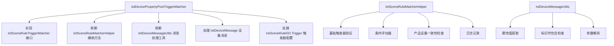
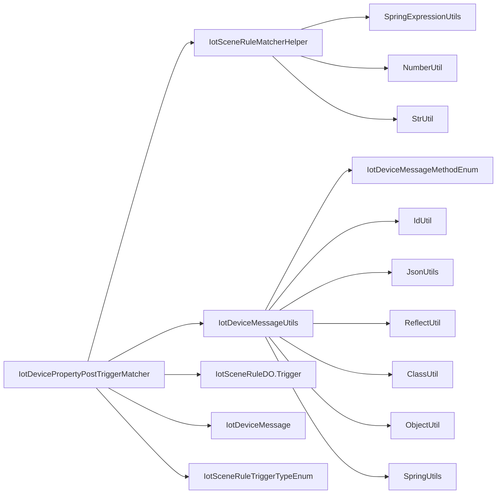
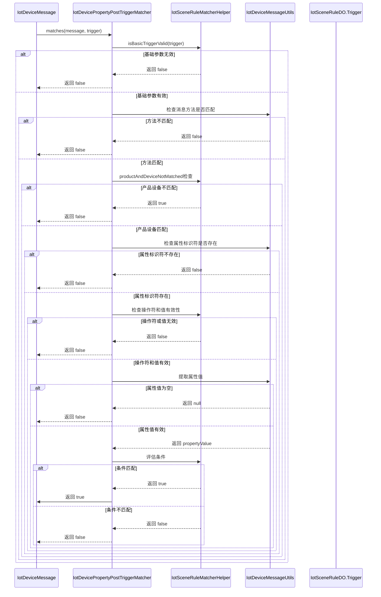
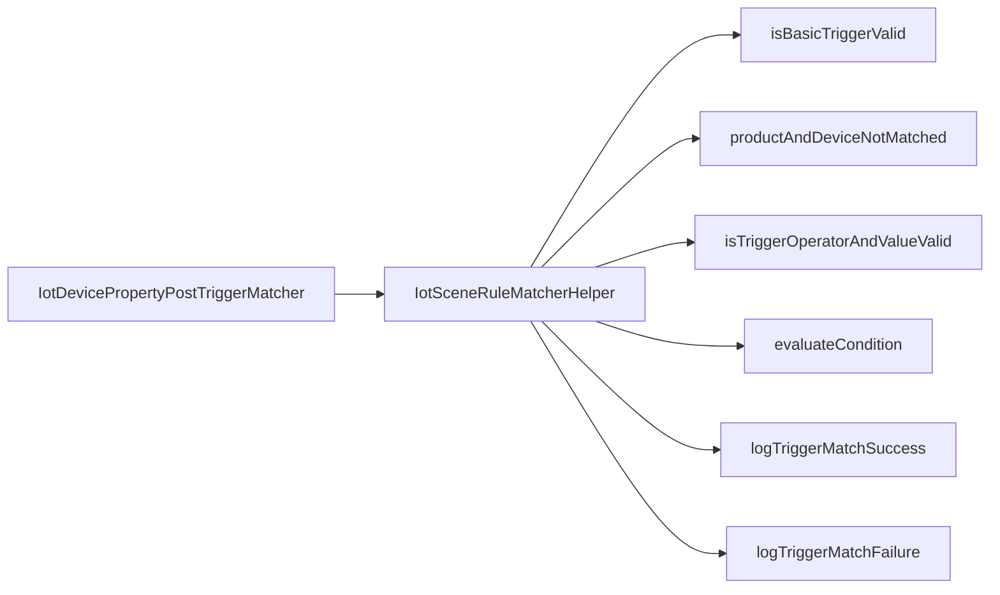
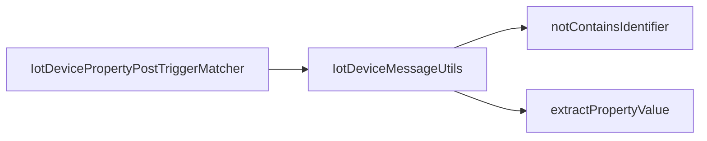
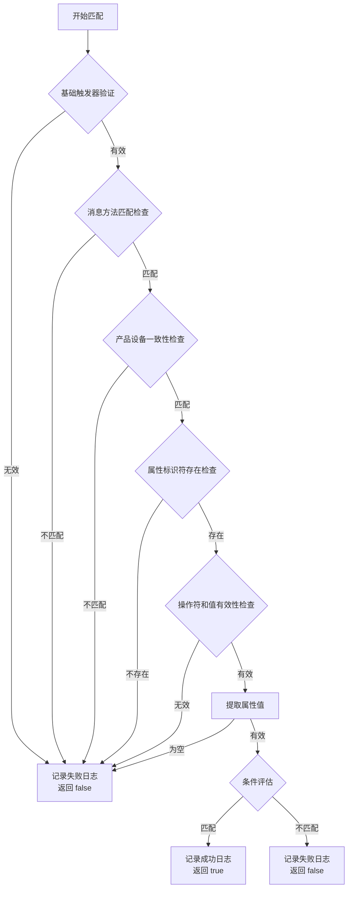

# 设备属性上报触发器匹配器 (IotDevicePropertyPostTriggerMatcher)

## 概述

`IotDevicePropertyPostTriggerMatcher` 是物联网(IoT)模块中的一个关键组件，负责处理设备属性数据上报的触发器匹配逻辑。当设备上报属性数据时，该匹配器会根据预定义的场景规则触发条件来判断是否需要执行对应的场景联动动作。

该匹配器实现了 `IotSceneRuleTriggerMatcher` 接口，专门处理 `DEVICE_PROPERTY_POST` 类型的触发器，即设备属性上报事件。

## 核心功能

1. **触发器类型识别**：支持 `DEVICE_PROPERTY_POST` 类型的触发器匹配
2. **消息验证**：验证设备消息的方法类型是否为属性上报
3. **产品设备一致性检查**：确保触发器配置的产品和设备与实际消息匹配
4. **属性标识符匹配**：检查消息中是否包含触发器指定的属性标识符
5. **条件评估**：根据操作符和值评估属性值是否满足触发条件
6. **日志记录**：提供详细的匹配成功和失败日志，便于调试和监控

## 架构设计

### 组件关系



### 依赖关系



## 数据流



## 详细实现

### 类定义

```java
@Component
public class IotDevicePropertyPostTriggerMatcher implements IotSceneRuleTriggerMatcher {
```

- 使用 `@Component` 注解将该类注册为Spring组件，实现自动装配
- 实现 `IotSceneRuleTriggerMatcher` 接口，表明它是一个场景规则触发器匹配器

### 方法实现

#### 1. getSupportedTriggerType()

```java
@Override
public IotSceneRuleTriggerTypeEnum getSupportedTriggerType() {
    return IotSceneRuleTriggerTypeEnum.DEVICE_PROPERTY_POST;
}
```

- 返回该匹配器支持的触发器类型：`DEVICE_PROPERTY_POST`
- 对应枚举值为 2，表示设备属性上报触发器

#### 2. matches(IotDeviceMessage message, IotSceneRuleDO.Trigger trigger)

核心匹配逻辑，分为以下步骤：

1. **基础参数校验**
   ```java
   if (!IotSceneRuleMatcherHelper.isBasicTriggerValid(trigger)) {
       IotSceneRuleMatcherHelper.logTriggerMatchFailure(message, trigger, "触发器基础参数无效");
       return false;
   }
   ```
   - 检查触发器对象和类型是否有效
   - 记录失败日志并返回 false

2. **消息方法匹配检查**
   ```java
   if (!IotDeviceMessageMethodEnum.PROPERTY_POST.getMethod().equals(message.getMethod())) {
       IotSceneRuleMatcherHelper.logTriggerMatchFailure(message, trigger, "消息方法不匹配，期望: " +
               IotDeviceMessageMethodEnum.PROPERTY_POST.getMethod() + ", 实际: " + message.getMethod());
       return false;
   }
   ```
   - 验证设备消息的方法类型是否为属性上报（PROPERTY_POST）
   - 记录失败日志并返回 false

3. **产品设备一致性检查**
   ```java
   if (IotSceneRuleMatcherHelper.productAndDeviceNotMatched(message, trigger.getProductId(),trigger.getDeviceId())){
       IotSceneRuleMatcherHelper.logTriggerMatchFailure(message,trigger,"触发器中产品或设备不匹配");
       return false;
   }
   ```
   - 确保触发器配置的产品ID和设备ID与实际消息匹配
   - 特殊处理：如果设备ID为 `DEVICE_ID_ALL`，则匹配所有设备
   - 记录失败日志并返回 false

4. **属性标识符存在检查**
   ```java
   if (IotDeviceMessageUtils.notContainsIdentifier(message, trigger.getIdentifier())) {
       IotSceneRuleMatcherHelper.logTriggerMatchFailure(message, trigger, "消息中不包含属性: " +
               trigger.getIdentifier());
       return false;
   }
   ```
   - 检查消息中是否包含触发器指定的属性标识符
   - 属性上报可能同时上报多个属性，只需判断触发器的标识符是否在消息参数中
   - 记录失败日志并返回 false

5. **操作符和值有效性检查**
   ```java
   if (!IotSceneRuleMatcherHelper.isTriggerOperatorAndValueValid(trigger)) {
       IotSceneRuleMatcherHelper.logTriggerMatchFailure(message, trigger, "操作符或值无效");
       return false;
   }
   ```
   - 验证触发器的操作符和值是否有效（非空）
   - 记录失败日志并返回 false

6. **属性值提取**
   ```java
   Object propertyValue = IotDeviceMessageUtils.extractPropertyValue(message, trigger.getIdentifier());
   if (propertyValue == null) {
       IotSceneRuleMatcherHelper.logTriggerMatchFailure(message, trigger, "消息中属性值为空或未找到指定属性");
       return false;
   }
   ```
   - 使用工具类从消息中提取指定属性的值
   - 支持多种数据结构：直接值、标识符字段、properties结构、data结构、value字段等
   - 记录失败日志并返回 false

7. **条件评估**
   ```java
   boolean matched = IotSceneRuleMatcherHelper.evaluateCondition(propertyValue, trigger.getOperator(), trigger.getValue());
   if (matched) {
       IotSceneRuleMatcherHelper.logTriggerMatchSuccess(message, trigger);
   } else {
       IotSceneRuleMatcherHelper.logTriggerMatchFailure(message, trigger, "属性值条件不匹配");
   }
   return matched;
   ```
   - 使用条件评估器判断属性值是否满足触发条件
   - 支持多种操作符：等于、不等于、大于、小于、在范围内等
   - 记录匹配成功或失败日志
   - 返回匹配结果

#### 3. getPriority()

```java
@Override
public int getPriority() {
    return 20; // 中等优先级
}
```

- 返回匹配器的优先级：20（中等优先级）
- 数值越小优先级越高，用于在多个匹配器支持同一类型时确定执行顺序

## 与其他组件的交互

### 与 IotSceneRuleMatcherHelper 的交互



### 与 IotDeviceMessageUtils 的交互



## 工作流程



## 错误处理和日志

该匹配器提供了详细的错误处理和日志记录机制，便于问题排查和系统监控：

1. **基础参数验证失败**：记录"触发器基础参数无效"
2. **消息方法不匹配**：记录期望和实际的方法类型
3. **产品设备不匹配**：记录"触发器中产品或设备不匹配"
4. **属性标识符不存在**：记录缺失的属性标识符
5. **操作符或值无效**：记录"操作符或值无效"
6. **属性值为空**：记录"消息中属性值为空或未找到指定属性"
7. **条件不匹配**：记录"属性值条件不匹配"
8. **匹配成功**：记录匹配成功日志

所有日志都使用debug级别，避免在生产环境中产生过多输出，同时提供足够的信息用于故障排除。

## 性能考虑

1. **早期退出机制**：在验证过程中，只要任一条件不满足，立即返回false，避免不必要的计算
2. **工具类复用**：充分利用已有的工具类方法，减少重复代码
3. **条件评估优化**：条件评估器使用Spring表达式，提供灵活且高效的条件判断
4. **优先级设置**：中等优先级（20）确保在触发器匹配过程中有合理的执行顺序

## 使用场景

该匹配器主要用于物联网平台的场景联动功能，典型使用场景包括：

1. **智能家居**：当温度传感器上报温度超过阈值时，自动打开空调
2. **工业监控**：当设备振动值超过安全范围时，触发告警并停机
3. **环境监测**：当PM2.5浓度达到某个值时，自动开启空气净化器
4. **农业物联网**：当土壤湿度低于设定值时，自动启动灌溉系统

## 配置示例

在场景规则配置中，设备属性上报触发器的配置示例：

```json
{
  "triggers": [
    {
      "type": 2, // DEVICE_PROPERTY_POST
      "productId": 1001,
      "deviceId": 5001,
      "identifier": "temperature",
      "operator": ">",
      "value": "30"
    }
  ],
  "actions": [
    {
      "type": 1, // DEVICE_PROPERTY_SET
      "productId": 1001,
      "deviceId": 5001,
      "identifier": "ac_switch",
      "params": "{\"status\":\"on\"}"
    }
  ]
}
```

上述配置表示：当产品ID为1001、设备ID为5001的设备上报温度属性（identifier: "temperature"）大于30时，触发动作：设置同一产品和设备的空调开关属性（identifier: "ac_switch"）为开启状态。

## 与其他触发器的关系

在场景规则中，可以同时配置多种类型的触发器，系统会根据触发条件的满足情况来决定是否执行场景动作：

```mermaid
graph TD
    A[场景规则] --> B[触发器列表]
    B --> C[设备属性上报触发器<br>(DEVICE_PROPERTY_POST)]
    B --> D[设备事件上报触发器<br>(DEVICE_EVENT_POST)]
    B --> E[设备服务调用触发器<br>(DEVICE_SERVICE_INVOKE)]
    B --> F[设备状态变更触发器<br>(DEVICE_STATE_UPDATE)]
    B --> G[定时触发器<br>(TIMER)]
    
    C --> H[IotDevicePropertyPostTriggerMatcher]
    D --> I[IotDeviceEventPostTriggerMatcher]
    E --> J[IotDeviceServiceInvokeTriggerMatcher]
    F --> K[IotDeviceStateUpdateTriggerMatcher]
    G --> L[IotTimerTriggerMatcher]
    
    H & I & J & K & L --> M[条件评估器]
    M --> N{所有触发器条件满足?}
    N -->|是| O[执行场景动作]
    N -->|否| P[不执行动作]
```

## 注意事项

1. **属性上报特性**：设备属性上报可能同时包含多个属性，匹配器只需要确保触发器指定的属性存在于上报数据中即可
2. **数据类型处理**：属性值可以是各种类型（数字、字符串、布尔等），条件评估器会自动处理类型转换和比较
3. **产品设备一致性**：触发器必须与具体的产品和设备关联，不能跨产品或跨设备匹配
4. **操作符支持**：支持常见的比较操作符（=, !=, >, <, >=, <=, IN, BETWEEN 等）
5. **优先级设置**：中等优先级确保在触发器匹配过程中不会被不相关的匹配器干扰

## 待改进点

1. **异常处理**：目前主要通过返回false处理异常情况，可以考虑添加更细粒度的异常分类
2. **性能监控**：可以添加匹配耗时监控，帮助识别性能瓶颈
3. **可配置日志级别**：目前日志级别固定为debug，可以考虑使其可配置
4. **单元测试覆盖**：建议增加更全面的单元测试，特别是边界情况和异常情况的测试

## 结论

`IotDevicePropertyPostTriggerMatcher` 是物联网平台场景联动功能中的重要组件，专门处理设备属性上报触发器的匹配逻辑。通过严格的验证步骤和灵活的条件评估机制，它能够准确判断何时应该触发对应的场景联动动作。该实现遵循了单一职责原则，专注于属性上报触发器的匹配，同时与其他组件良好解耦，便于维护和扩展。