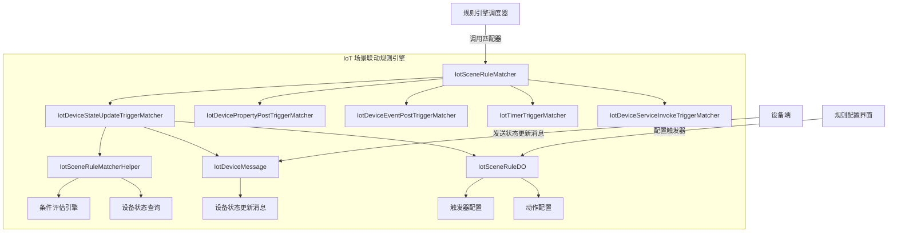
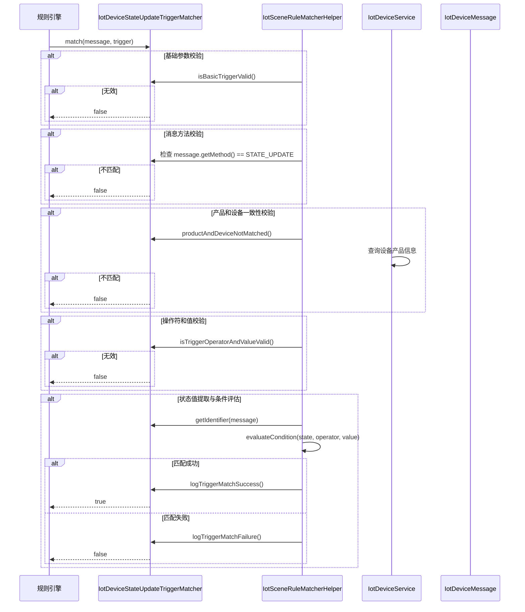
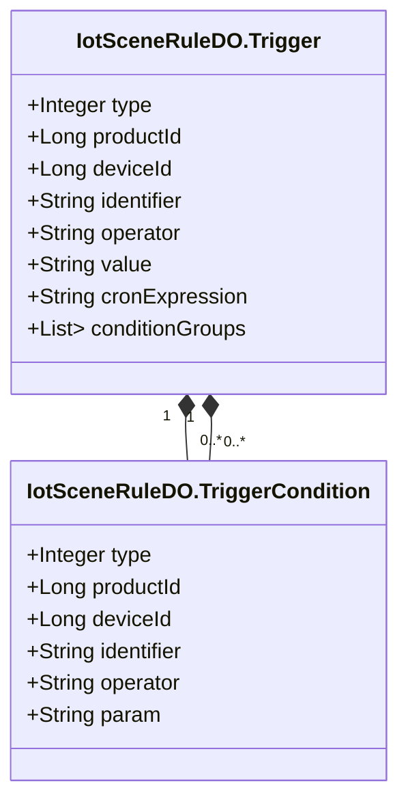
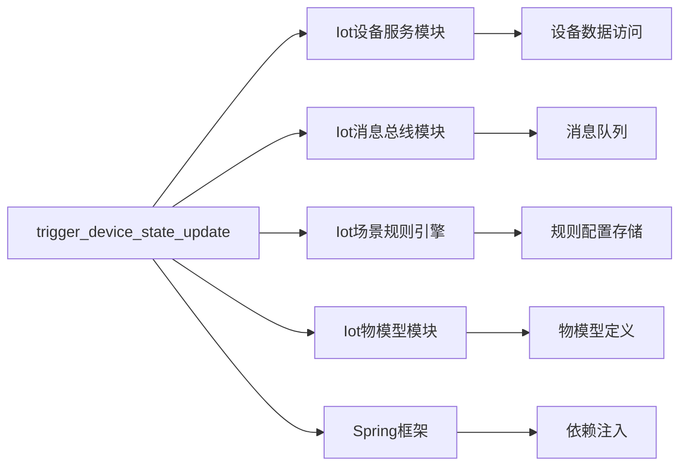

# trigger_device_state_update 模块文档

## 1. 概述

`trigger_device_state_update` 模块是 IoT 场景联动规则引擎中的核心组件之一，负责处理设备状态更新（上线/下线）事件的触发器匹配逻辑。当设备状态发生变化时，该模块会判断当前设备状态是否符合预设的场景规则条件，从而触发相应的联动动作。

该模块实现了 `IotSceneRuleTriggerMatcher` 接口，专门处理 `DEVICE_STATE_UPDATE` 类型的触发器，是 IoT 场景联动系统中设备状态监控与自动化响应的基础。

## 2. 模块架构

### 2.1 整体架构



### 2.2 核心组件关系

| 组件 | 职责 | 关联 |
|------|------|------|
| `IotDeviceStateUpdateTriggerMatcher` | 设备状态更新触发器匹配逻辑 | 实现 `IotSceneRuleTriggerMatcher` |
| `IotSceneRuleMatcherHelper` | 匹配器工具类，提供条件评估、日志记录等 | 被所有触发器匹配器调用 |
| `IotDeviceMessage` | 设备消息载体，包含状态更新信息 | 匹配器的输入参数 |
| `IotSceneRuleDO` | 场景规则数据对象，包含触发器和动作配置 | 匹配器的配置数据 |
| `IotDeviceService` | 设备服务，用于查询设备信息 | 用于产品和设备一致性校验 |

## 3. 核心功能

### 3.1 触发器匹配流程



### 3.2 匹配逻辑详解

1. **基础参数校验**：检查触发器配置是否包含有效类型
2. **消息方法校验**：确保消息方法为 `STATE_UPDATE`（设备状态更新）
3. **产品和设备一致性校验**：验证消息中的设备与触发器配置的产品、设备是否匹配
4. **操作符和值校验**：确保触发器配置的操作符和值有效
5. **状态值提取**：从设备消息中提取状态标识符（`state` 字段）
6. **条件评估**：使用 Spring Expression 评估状态值是否满足条件

### 3.3 支持的操作符

`IotDeviceStateUpdateTriggerMatcher` 通过 `IotSceneRuleMatcherHelper` 支持以下操作符：

| 操作符 | 说明 | Spring 表达式示例 |
|--------|------|------------------|
| `=` | 等于 | `${source} == 'value'` |
| `!=` | 不等于 | `${source} != 'value'` |
| `>` | 大于 | `${source} > 10` |
| `>=` | 大于等于 | `${source} >= 10` |
| `<` | 小于 | `${source} < 10` |
| `<=` | 小于等于 | `${source} <= 10` |
| `IN` | 在集合中 | `${source} IN ('a','b')` |
| `NOT IN` | 不在集合中 | `${source} NOT IN ('a','b')` |
| `BETWEEN` | 在范围内 | `${source} BETWEEN 10 AND 20` |
| `NOT BETWEEN` | 不在范围内 | `${source} NOT BETWEEN 10 AND 20` |

## 4. 数据模型

### 4.1 触发器配置结构



对于 `DEVICE_STATE_UPDATE` 触发器：
- `type` = `DEVICE_STATE_UPDATE`
- `operator` 和 `value` 非空（用于匹配在线状态）
- `identifier` 为空（与属性/事件触发器不同）
- `conditionGroups` 为空（状态触发器直接使用 `operator` 和 `value`）

### 4.2 设备消息结构

```mermaid
class IotDeviceMessage {
    +String requestId
    +Long productId
    +Long deviceId
    +String method
    +Map<String, Object> params
    +String timestamp
    +String source
}
```

对于状态更新消息：
- `method` = `STATE_UPDATE`
- `params` 中包含 `state` 字段，表示设备状态（如 `ONLINE`、`OFFLINE`）

## 5. 代码实现

### 5.1 类结构

```java
@Component
public class IotDeviceStateUpdateTriggerMatcher implements IotSceneRuleTriggerMatcher {
    
    @Resource
    private IotDeviceService iotDeviceService;

    @Override
    public IotSceneRuleTriggerTypeEnum getSupportedTriggerType() {
        return IotSceneRuleTriggerTypeEnum.DEVICE_STATE_UPDATE;
    }

    @Override
    public boolean matches(IotDeviceMessage message, IotSceneRuleDO.Trigger trigger) {
        // 匹配逻辑实现
    }

    @Override
    public int getPriority() {
        return 10; // 高优先级
    }
}
```

### 5.2 关键方法说明

| 方法 | 说明 | 返回值 |
|------|------|--------|
| `getSupportedTriggerType()` | 获取支持的触发器类型 | `DEVICE_STATE_UPDATE` |
| `matches(message, trigger)` | 核心匹配逻辑 | `true`/`false` |
| `getPriority()` | 匹配器优先级（数值越小优先级越高）| `10` |

## 6. 依赖关系

### 6.1 模块依赖



### 6.2 核心依赖组件

| 依赖组件 | 作用 |
|----------|------|
| `IotDeviceService` | 查询设备信息，验证产品和设备一致性 |
| `IotDeviceMessageUtils` | 提取设备消息中的状态标识符 |
| `IotSceneRuleMatcherHelper` | 提供匹配工具方法（参数校验、条件评估、日志记录） |
| `IotDeviceMessageMethodEnum` | 定义消息方法类型（STATE_UPDATE） |
| `IotSceneRuleTriggerTypeEnum` | 定义触发器类型（DEVICE_STATE_UPDATE） |

## 7. 使用场景

### 7.1 典型应用场景

1. **设备上线通知**：当设备上线时，发送通知消息
2. **设备下线告警**：当设备下线时，触发告警规则
3. **状态联动控制**：根据设备状态自动执行其他设备操作
4. **异常状态检测**：检测设备进入异常状态时触发处理流程

### 7.2 配置示例

```json
{
  "trigger": {
    "type": "DEVICE_STATE_UPDATE",
    "productId": 123,
    "deviceId": 456,
    "operator": "=",
    "value": "ONLINE"
  },
  "actions": [
    {
      "type": "ALERT_TRIGGER",
      "alertConfigId": 789
    }
  ]
}
```

## 8. 错误处理与日志

`IotDeviceStateUpdateTriggerMatcher` 通过 `IotSceneRuleMatcherHelper` 提供完善的错误处理和日志记录：

| 日志级别 | 触发场景 | 日志内容 |
|----------|----------|----------|
| `DEBUG` | 匹配失败 | 记录失败原因（参数无效、方法不匹配、状态值不匹配等） |
| `DEBUG` | 匹配成功 | 记录匹配成功的消息和触发器信息 |
| `WARN` | 操作符无效 | 记录无效的操作符 |
| `ERROR` | 条件评估异常 | 记录评估过程中的异常 |

常见失败原因：
- 触发器基础参数无效
- 消息方法不匹配（期望 STATE_UPDATE）
- 产品或设备不匹配
- 操作符或值无效
- 消息中设备状态值为空
- 状态值条件不匹配

## 9. 性能优化

1. **高优先级**：`getPriority()` 返回 10，表示高优先级，确保状态更新触发器优先被匹配
2. **缓存机制**：通过 `IotDeviceService` 查询设备信息时，使用缓存减少数据库访问
3. **快速失败**：在参数校验阶段尽早返回，避免不必要的计算
4. **条件评估优化**：使用 Spring Expression 进行条件评估，支持复杂表达式

## 10. 扩展性设计

1. **接口设计**：实现 `IotSceneRuleTriggerMatcher` 接口，便于扩展新的触发器类型
2. **工具类封装**：匹配逻辑封装在 `IotSceneRuleMatcherHelper` 中，其他匹配器可复用
3. **操作符枚举**：支持多种操作符，通过配置灵活定义匹配条件
4. **优先级机制**：通过 `getPriority()` 方法控制匹配顺序，支持多触发器共存

## 11. 相关模块参考

- [iot_scene_rule_matcher](iot_scene_rule_matcher.md) - 场景规则匹配器总览
- [iot_device_message](iot_device_message.md) - 设备消息模块
- [iot_device_service](iot_device_service.md) - 设备服务模块
- [iot_scene_rule_engine](iot_scene_rule_engine.md) - 场景规则引擎
- [iot_rule_action](iot_rule_action.md) - 规则动作模块
