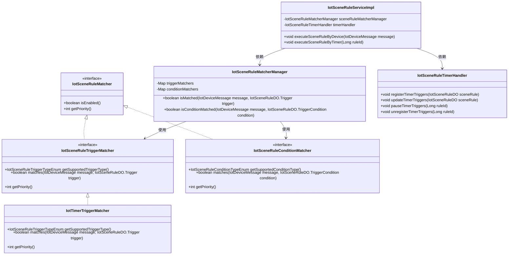
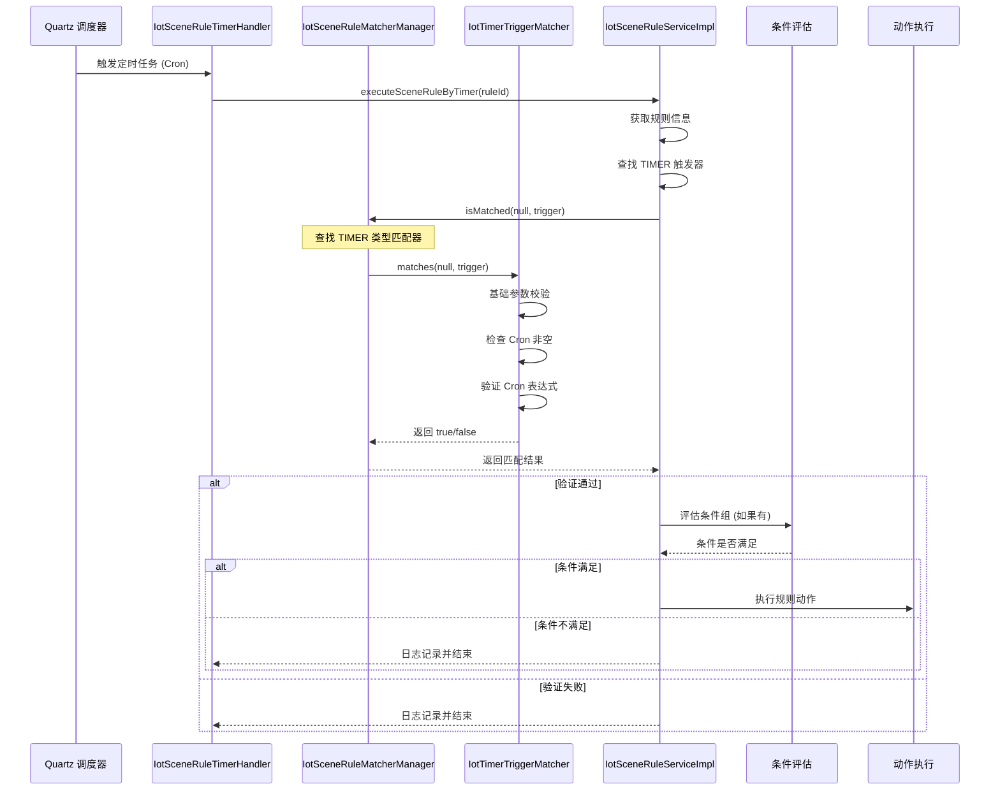

# trigger_timer 模块文档

## 概述

`IotTimerTriggerMatcher` 是物联网平台场景规则引擎中的定时触发器匹配器，负责判断定时触发器的配置是否有效。它实现了 `IotSceneRuleTriggerMatcher` 接口，由 Spring 管理为组件（`@Component`），并在 `IotSceneRuleMatcherManager` 中被注册为触发器类型 `TIMER` 的匹配器。

定时触发器不依赖于具体的设备消息，主要用于基于 Cron 表达式的定时任务场景。匹配器仅校验 Cron 表达式的有效性，并在定时任务调度器触发时由上层服务调用。

## 架构与组件关系

以下是 `IotTimerTriggerMatcher` 在场景规则引擎中的位置及其与其他组件的关系：



### 组件说明

| 组件 | 职责 |
|------|------|
| `IotSceneRuleMatcher` | 匹配器基础接口，定义是否可用及优先级。 |
| `IotSceneRuleTriggerMatcher` | 触发器匹配器接口，继承自基础匹配器，增加获取触发器类型和匹配逻辑。 |
| `IotSceneRuleConditionMatcher` | 条件匹配器接口，用于匹配场景规则中的条件。 |
| `IotTimerTriggerMatcher` | 定时触发器匹配器实现，校验 Cron 表达式有效性。 |
| `IotSceneRuleMatcherManager` | 匹配器管理器，维护触发器和条件匹配器的映射表，提供统一的匹配入口。 |
| `IotSceneRuleServiceImpl` | 场景规则服务实现，负责根据设备消息或定时触发执行规则。 |
| `IotSceneRuleTimerHandler` | 定时触发器处理器，负责与 Quartz 调度器交互，注册/更新/暂停/删除定时任务。 |

## 数据流与处理流程

### 1. 定时触发器匹配过程

当定时触发器由 `IotSceneRuleTimerHandler` 按 Cron 表达式触发时，会调用 `IotSceneRuleServiceImpl#executeSceneRuleByTimer` 方法。该方法会：

1. 获取对应的规则信息。
2. 检查规则是否包含定时触发器（类型为 `TIMER`）。
3. 调用 `evaluateTimerConditionGroups` 方法评估定时触发器的条件组（如果有）。
4. 如果条件满足，则执行规则动作。

在评估条件组时，会使用 `IotSceneRuleMatcherManager` 的 `isConditionMatched` 方法对每个条件进行匹配（条件匹配器处理），而定时触发器本身的匹配（即 Cron 表达式校验）在定时任务注册阶段已经完成。

### 2. 定时触发器注册与校验流程

当创建或更新场景规则时，服务会调用 `IotSceneRuleTimerHandler` 注册定时触发器。注册过程中会：

1. 遍历规则的所有触发器。
2. 对于类型为 `TIMER` 的触发器，调用 `IotSceneRuleMatcherManager#isMatched` 方法（传入一个空的 `IotDeviceMessage`，因为定时触发器不依赖消息）。
3. `IotSceneRuleMatcherManager` 根据触发器类型查找对应的匹配器（即 `IotTimerTriggerMatcher`）。
4. `IotTimerTriggerMatcher#matches` 方法执行：
   - 基础参数校验（触发器非空且类型非空）。
   - 检查 Cron 表达式是否非空。
   - 使用 `CronExpression.isValidExpression` 验证 Cron 表达式格式。
   - 记录匹配成功或失败的日志。
   - 返回验证结果。

如果校验通过，则将该定时触发器注册到 Quartz 调度器；否则，记录错误并不进行注册。

### 3. 时序图：定时触发器匹配与执行



## 详细实现说明

### 核心方法

#### `getSupportedTriggerType`

```java
@Override
public IotSceneRuleTriggerTypeEnum getSupportedTriggerType() {
    return IotSceneRuleTriggerTypeEnum.TIMER;
}
```
- 返回该匹配器支持的触发器类型为 `TIMER`。

#### `matches`

```java
@Override
public boolean matches(IotDeviceMessage message, IotSceneRuleDO.Trigger trigger) {
    // 1.1 基础参数校验
    if (!IotSceneRuleMatcherHelper.isBasicTriggerValid(trigger)) {
        IotSceneRuleMatcherHelper.logTriggerMatchFailure(message, trigger, "触发器基础参数无效");
        return false;
    }

    // 1.2 检查 CRON 表达式是否存在
    if (StrUtil.isBlank(trigger.getCronExpression())) {
        IotSceneRuleMatcherHelper.logTriggerMatchFailure(message, trigger, "定时触发器缺少 CRON 表达式");
        return false;
    }

    // 1.3 定时触发器通常不依赖具体的设备消息
    // 它是通过定时任务调度器触发的，这里主要是验证配置的有效性
    if (!CronExpression.isValidExpression(trigger.getCronExpression())) {
        IotSceneRuleMatcherHelper.logTriggerMatchFailure(message, trigger, "CRON 表达式格式无效: " + trigger.getCronExpression());
        return false;
    }

    IotSceneRuleMatcherHelper.logTriggerMatchSuccess(message, trigger);
    return true;
}
```
- **参数**：
  - `message`: 设备消息（对定时触发器通常为 `null`，因为不依赖具体消息）。
  - `trigger`: 触发器配置对象，包含 `type`, `cronExpression` 等字段。
- **流程**：
  1. 调用 `IotSceneRuleMatcherHelper.isBasicTriggerValid` 检查触发器对象及其类型是否有效。
  2. 检查 `cronExpression` 是否为空白。
  3. 使用 Quartz 的 `CronExpression.isValidExpression` 验证 Cron 表达式格式。
  4. 通过 `IotSceneRuleMatcherHelper` 记录匹配成功或失败的日志。
  5. 返回验证结果（`true` 表示配置有效，`false` 表示无效）。

#### `getPriority`

```java
@Override
public int getPriority() {
    return 50; // 最低优先级，因为定时触发器不依赖消息
}
```
- 返回优先级 `50`，在匹配器管理器中数值越小优先级越高。定时触发器不依赖消息，因此设置为最低优先级，确保在有其他触发器匹配器时，它们会被优先尝试。

## 在系统中的角色

`IotTimerTriggerMatcher` 负责确保定时触发器的配置在系统中是合法的，从而防止由于错误的 Cron 表达式导致调度器异常。它不参与实际的触发判断（触发由 Quartz 调度器根据时间触发），而是在注册和更新阶段进行预校验。

通过与 `IotSceneRuleMatcherManager` 和 `IotSceneRuleTimerHandler` 的协作，它确保只有配置正确的定时触发器才会被调度系统接受，从而保证定时任务的可靠性。

## 与其他模块的关联

- **依赖**：
  - `cn.hutool.core.util.StrUtil`：用于字符串空白检查。
  - `org.quartz.CronExpression`：用于 Cron 表达式验证。
  - `cn.iocoder.yudao.module.iot.service.rule.scene.matcher.IotSceneRuleMatcherHelper`：提供通用的参数校验和日志记录方法。
- **被依赖**：
  - `IotSceneRuleMatcherManager`：在初始化时会将本类作为 `TIMER` 类型的触发器匹配器注入。
  - `IotSceneRuleServiceImpl`：在定时触发器注册/更新时间接使用本类的匹配能力。

## 使用示例

以下是一个典型的定时触发器配置在场景规则中的 JSON 表示（存储在数据库中的 `triggers` 字段）：

```json
[
  {
    "type": 100, // 对应 IotSceneRuleTriggerTypeEnum.TIMER 的值
    "productId": null,
    "deviceId": null,
    "identifier": null,
    "operator": null,
    "value": null,
    "cronExpression": "0 0/5 * * * ?" // 每5分钟触发一次
  }
]
```

当后台定时任务根据此 Cron 表达式触发时，系统会调用 `IotSceneRuleServiceImpl#executeSceneRuleByTimer`，进而验证条件并执行对应的动作。

## 小结

- `IotTimerTriggerMatcher` 是一个轻量级的匹配器，专注于定时触发器的配置校验。
- 它不依赖具体的设备消息，优先级最低。
- 通过与匹配器管理器和定时处理器的协作，确保定时任务的安全注册和有效执行。
- 在场景规则的生命周期中（创建、更新、删除），它发挥着关键的配置验证作用。