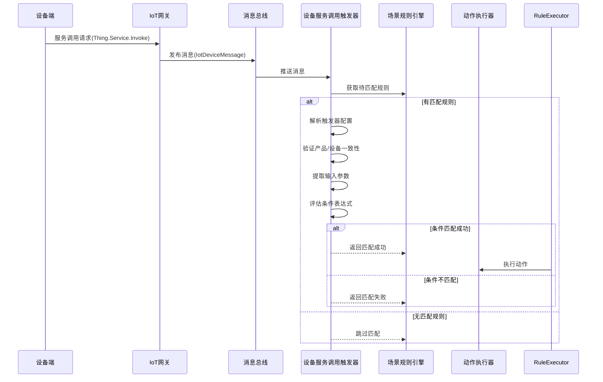
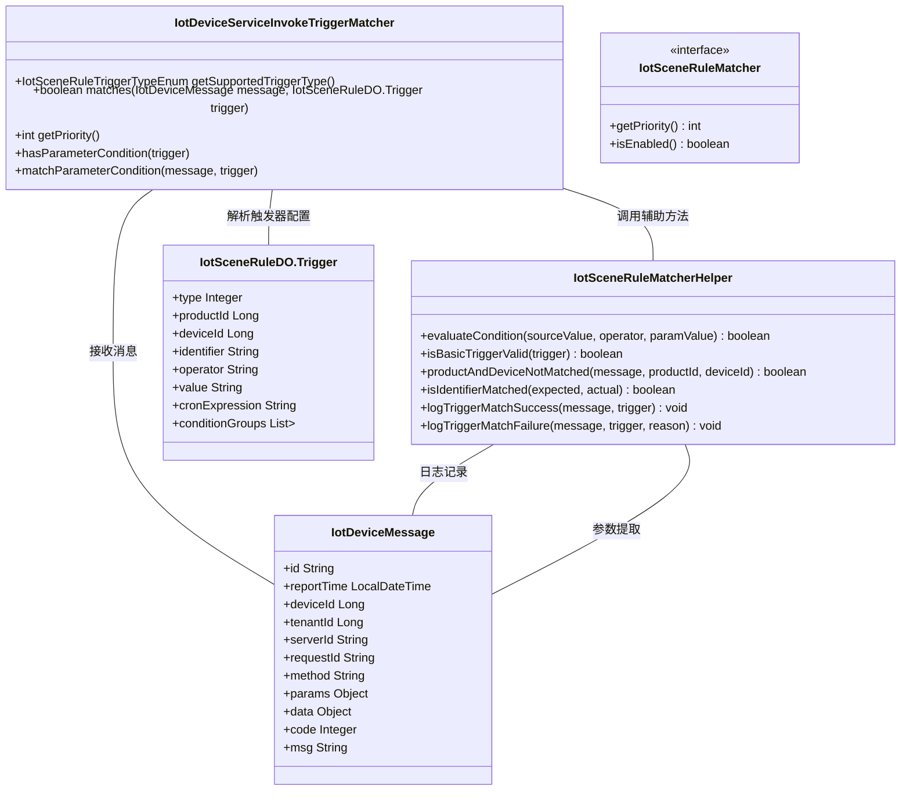
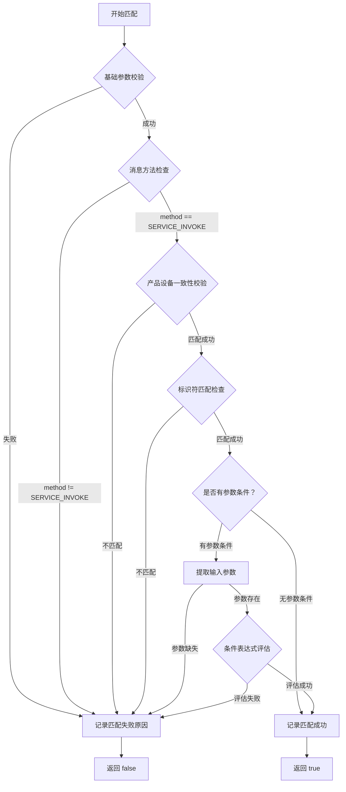
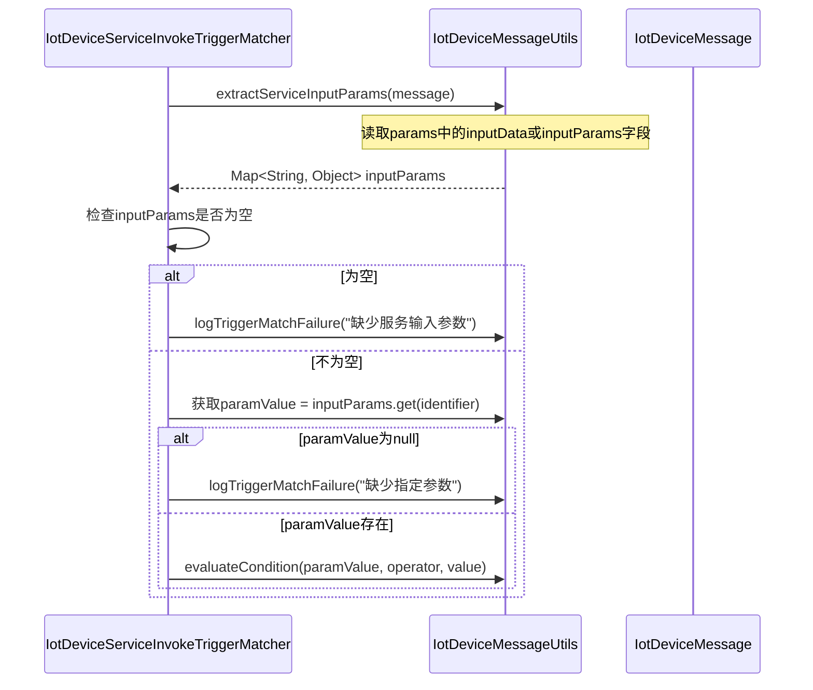
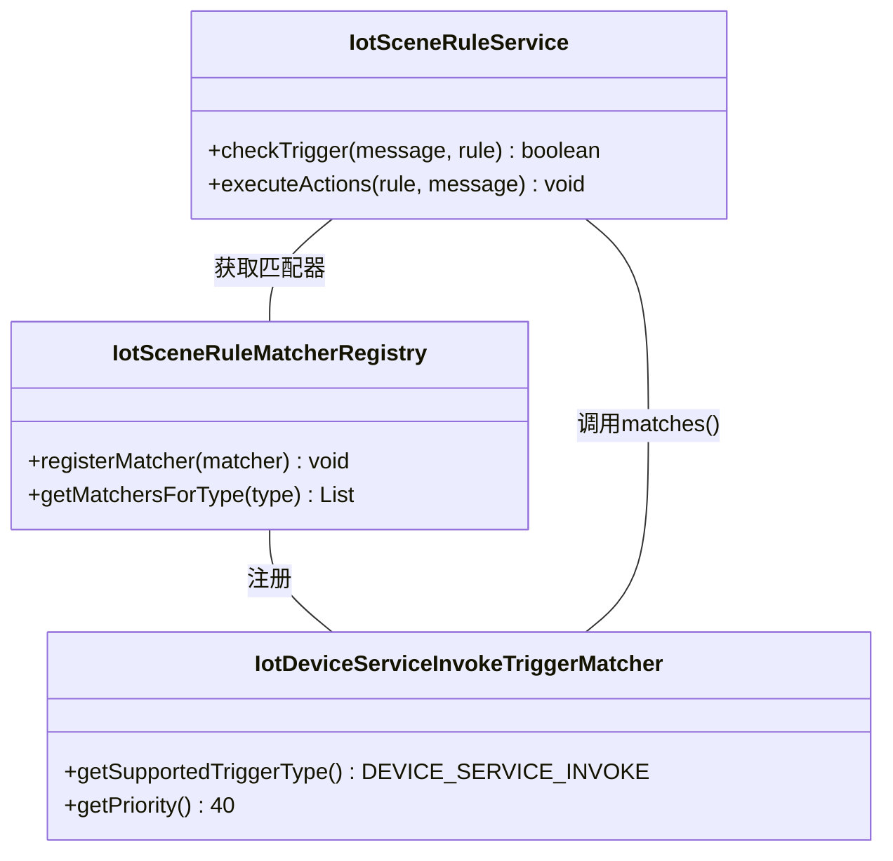

# 设备服务调用触发器模块文档 (trigger_trigger_device_service_invoke)

## 1. 模块概述

`trigger_trigger_device_service_invoke` 模块是 IoT 场景联动规则引擎中的核心组件，负责处理 **设备服务调用（Device Service Invoke）** 类型的触发器匹配逻辑。当设备通过消息总线发送服务调用请求时，该模块会判断当前消息是否符合预设的场景规则触发条件，从而决定是否触发后续的动作执行。

### 核心功能

- **触发器识别**：识别类型为 `DEVICE_SERVICE_INVOKE` 的设备消息
- **参数校验**：验证触发器的基础配置是否有效
- **消息匹配**：检查消息的方法、产品、设备、标识符等关键属性
- **条件评估**：支持对服务输入参数的条件表达式匹配
- **优先级管理**：在多个触发器匹配器中确定执行顺序

### 业务场景



---

## 2. 架构设计

### 2.1 组件关系图



### 2.2 模块依赖关系

| 依赖模块 | 依赖组件 | 用途说明 |
|---------|---------|---------|
| `iot-core` | `IotDeviceMessage` | 设备消息数据结构 |
| `iot-core` | `IotDeviceMessageUtils` | 消息工具方法（提取标识符、参数等） |
| `iot-core` | `IotDeviceMessageMethodEnum` | 消息方法枚举（SERVICE_INVOKE） |
| `iot-biz` | `IotSceneRuleDO` | 场景规则触发器配置数据对象 |
| `iot-biz` | `IotSceneRuleTriggerTypeEnum` | 触发器类型枚举 |
| `iot-biz` | `IotSceneRuleMatcher` | 触发器匹配器接口 |
| `iot-biz` | `IotSceneRuleMatcherHelper` | 匹配器辅助工具类 |
| `iot-biz` | `IotDeviceService` | 设备服务查询（用于产品/设备一致性校验） |

---

## 3. 核心组件详解

### 3.1 IotDeviceServiceInvokeTriggerMatcher

**文件路径**: `yudao-module-iot/yudao-module-iot-biz/src/main/java/cn/iocoder/yudao/module/iot/service/rule/scene/matcher/trigger/IotDeviceServiceInvokeTriggerMatcher.java`

该类实现了 `IotSceneRuleMatcher` 接口，专门处理设备服务调用类型的触发器匹配。

#### 主要方法

| 方法名 | 返回值 | 描述 |
|-------|--------|------|
| `getSupportedTriggerType()` | `IotSceneRuleTriggerTypeEnum` | 返回支持的触发器类型：`DEVICE_SERVICE_INVOKE` |
| `matches(IotDeviceMessage, IotSceneRuleDO.Trigger)` | `boolean` | 核心匹配逻辑，返回是否匹配成功 |
| `getPriority()` | `int` | 匹配器优先级，数值越小优先级越高（此处为40，较低优先级） |

#### 匹配流程



#### 详细匹配步骤

1. **基础参数校验**：检查触发器配置是否非空且类型有效
2. **消息方法验证**：确认消息的 `method` 字段等于 `SERVICE_INVOKE`（即 `"thing.service.invoke"`）
3. **产品设备一致性**：验证消息中的设备属于触发器指定的产品，且设备ID匹配（支持通配符全部设备）
4. **标识符匹配**：从消息中提取 `identifier` 与触发器配置的 `identifier` 进行精确匹配
5. **参数条件评估**（可选）：如果配置了 `operator` 和 `value`，则进一步评估输入参数是否满足条件

### 3.2 IotSceneRuleMatcher（接口）

**文件路径**: `yudao-module-iot/yudao-module-iot-biz/src/main/java/cn/iocoder/yudao/module/iot/service/rule/scene/matcher/IotSceneRuleMatcher.java`

所有触发器匹配器必须实现的接口，定义了两个默认方法：

- `getPriority()`：返回匹配优先级，默认100。数值越小优先级越高，用于解决多个匹配器支持同一类型时的冲突。
- `isEnabled()`：控制匹配器是否启用，默认true。可用于动态开关某些匹配器。

### 3.3 IotSceneRuleMatcherHelper（工具类）

**文件路径**: `yudao-module-iot/yudao-module-iot-biz/src/main/java/cn/iocoder/yudao/module/iot/service/rule/scene/matcher/IotSceneRuleMatcherHelper.java`

静态工具类，提供匹配过程中的通用辅助方法：

| 方法 | 功能 |
|------|------|
| `evaluateCondition()` | 使用Spring表达式评估条件匹配 |
| `isBasicTriggerValid()` | 检查触发器基础配置有效性 |
| `productAndDeviceNotMatched()` | 验证消息中的产品/设备是否与触发器配置一致 |
| `isIdentifierMatched()` | 比较两个标识符是否相等 |
| `logTriggerMatchSuccess()` / `logTriggerMatchFailure()` | 记录匹配成功/失败的调试日志 |

### 3.4 IotDeviceMessage（消息对象）

**文件路径**: `yudao-module-iot/yudao-module-iot-core/src/main/java/cn/iocoder/yudao/module/iot/core/mq/message/IotDeviceMessage.java`

设备消息的核心数据载体，包含以下关键字段：

| 字段 | 类型 | 说明 |
|-----|------|------|
| `id` | String | 消息唯一编号 |
| `reportTime` | LocalDateTime | 上报时间 |
| `deviceId` | Long | 设备编号 |
| `tenantId` | Long | 租户编号 |
| `serverId` | String | 消息来源服务器标识 |
| `requestId` | String | 设备请求ID（对应阿里云IoT的request_id） |
| `method` | String | 消息方法（如 `thing.service.invoke`） |
| `params` | Object | 请求参数（Map或DTO对象） |
| `data` | Object | 响应结果 |
| `code` | Integer | 响应码 |
| `msg` | String | 响应信息 |

### 3.5 IotSceneRuleDO.Trigger（触发器配置）

**文件路径**: `yudao-module-iot/yudao-module-iot-biz/src/main/java/cn/iocoder/yudao/module/iot/dal/dataobject/rule/IotSceneRuleDO.java`

场景规则中的触发器配置对象，针对 `DEVICE_SERVICE_INVOKE` 类型的关键字段：

| 字段 | 说明 | 约束 |
|------|------|------|
| `type` | 触发器类型，固定为 `4` (`DEVICE_SERVICE_INVOKE`) | 必填 |
| `productId` | 产品编号，关联 `IotProductDO` | 可为null（表示任意产品） |
| `deviceId` | 设备编号，关联 `IotDeviceDO`；特殊值 `-1` 表示全部设备 | 可为null |
| `identifier` | 物模型中的服务标识符，必填 | 必填 |
| `operator` | 操作符（如 `==`, `>`, `IN` 等），可选 | 有参数条件时必填 |
| `value` | 参数值，多个值用逗号分隔，可选 | 有参数条件时必填 |
| `conditionGroups` | 触发条件分组（嵌套列表），用于更复杂的条件组合 | 可选 |

---

## 4. 参数条件匹配机制

当触发器配置了 `operator` 和 `value` 时，`IotDeviceServiceInvokeTriggerMatcher` 会进一步检查服务调用的输入参数是否满足条件。

### 4.1 参数提取流程



### 4.2 条件表达式评估

使用 `IotSceneRuleMatcherHelper.evaluateCondition()` 方法进行条件评估，内部基于 **Spring Expression Language (SpEL)**：

1. **操作符解析**：将字符串操作符（如 `==`, `>`, `IN` 等）转换为 `IotSceneRuleConditionOperatorEnum` 枚举
2. **变量构建**：构建SpEL表达式所需的变量映射：
   - `source`：源值（来自消息的参数值）
   - `value`：目标值（来自触发器配置）
   - `valueList`：目标值列表（当操作符为IN/BETWEEN时）
3. **数字类型转换**：如果是数字比较操作符，自动将字符串转换为数字类型避免比较错误
4. **表达式计算**：使用 `SpringExpressionUtils.parseExpression()` 执行SpEL表达式并返回布尔结果

**示例**：
- 触发器配置：`operator="=="`, `value="123"`
- 消息参数：`{"myService": {"inputData": {"threshold": 123}}}`
- 评估过程：`source=123, value=123` → SpEL: `source == value` → `true`

---

## 5. 与其他模块的集成

### 5.1 与场景规则引擎集成

`IotDeviceServiceInvokeTriggerMatcher` 作为触发器匹配器之一，被注册到场景规则引擎中。当设备消息到达时，规则引擎会遍历所有匹配的触发器匹配器，按优先级顺序尝试匹配。



### 5.2 与设备服务模块交互

在验证产品/设备一致性时，会通过 `IotDeviceService` 查询设备缓存信息：

```java
// 在 IotSceneRuleMatcherHelper.productAndDeviceNotMatched() 中
IotDeviceDO device = SpringUtils.getBean(IotDeviceService.class).getDeviceFromCache(message.getDeviceId());
return device == null || ObjectUtil.notEqual(device.getProductId(), productId);
```

### 5.3 与消息总线协作

设备服务调用消息通过消息总线（MQ/本地总线）传递，消息Topic为 `iot_device_message`。触发器匹配器消费该Topic的消息进行规则匹配。

---

## 6. 配置示例

### 6.1 触发器配置JSON示例

```json
{
  "type": 4,
  "productId": 1001,
  "deviceId": 2001,
  "identifier": "turnOnLight",
  "operator": "==",
  "value": "true",
  "conditionGroups": []
}
```

**说明**：
- `type`: 4 表示 DEVICE_SERVICE_INVOKE
- `productId`: 1001 指定产品ID（可为null表示任意产品）
- `deviceId`: 2001 指定设备ID（可为-1表示全部设备）
- `identifier`: turnOnLight 服务标识符
- `operator` 和 `value`: 可选，用于对输入参数做进一步过滤

### 6.2 完整场景规则示例

```json
{
  "name": "灯光自动控制场景",
  "description": "当设备调用turnOnLight服务且参数为true时触发",
  "status": 1,
  "triggers": [
    {
      "type": 4,
      "productId": 1001,
      "deviceId": -1,
      "identifier": "turnOnLight",
      "operator": "==",
      "value": "true"
    }
  ],
  "actions": [
    {
      "type": 1,
      "productId": 1001,
      "deviceId": 2001,
      "identifier": "setBrightness",
      "params": "{\"brightness\": 80}"
    }
  ]
}
```

---

## 7. 异常处理与日志

### 7.1 常见匹配失败原因

| 失败原因 | 日志级别 | 可能原因 |
|---------|---------|---------|
| 触发器基础参数无效 | DEBUG | 触发器配置为空或类型无效 |
| 消息方法不匹配 | DEBUG | 消息method不是SERVICE_INVOKE |
| 触发器中产品或设备不匹配 | DEBUG | 消息中的设备不属于指定产品或设备ID不匹配 |
| 标识符不匹配 | DEBUG | 消息中的identifier与触发器配置不一致 |
| 消息中缺少服务输入参数 | DEBUG | params中找不到inputData或inputParams |
| 服务输入参数中缺少指定参数 | DEBUG | inputParams中不存在trigger.getIdentifier()对应的键 |
| 服务输入参数条件不匹配 | DEBUG | 参数值不满足operator和value定义的条件 |

### 7.2 日志输出格式

```
[isMatched][message({reqId}) trigger({DEVICE_SERVICE_INVOKE}) reason({标识符不匹配，期望: turnOnLight, 实际: dimLight}] 匹配触发器失败
[isMatched][message({reqId}) trigger({DEVICE_SERVICE_INVOKE}) 匹配触发器成功] 匹配触发器成功
```

---

## 8. 性能优化要点

1. **缓存机制**：设备产品信息通过 `IotDeviceService.getDeviceFromCache()` 从缓存获取，减少数据库查询
2. **快速失败**：在早期阶段（方法校验、产品设备校验）就失败，避免不必要的参数解析
3. **优先级设置**：设置为40（较低优先级），确保其他更具体的触发器优先匹配
4. **参数提取优化**：`extractServiceInputParams()` 同时兼容Map和POJO两种params形态，避免重复解析

---

## 9. 参考文档

- [场景联动规则引擎](scene_rule_engine.md)
- [设备消息总线](message_bus.md)
- [物模型定义](thing_model.md)
- [IotSceneRuleDO](../dal/dataobject/rule/IotSceneRuleDO.md)
- [IotDeviceMessage](../../core/mq/message/IotDeviceMessage.md)
