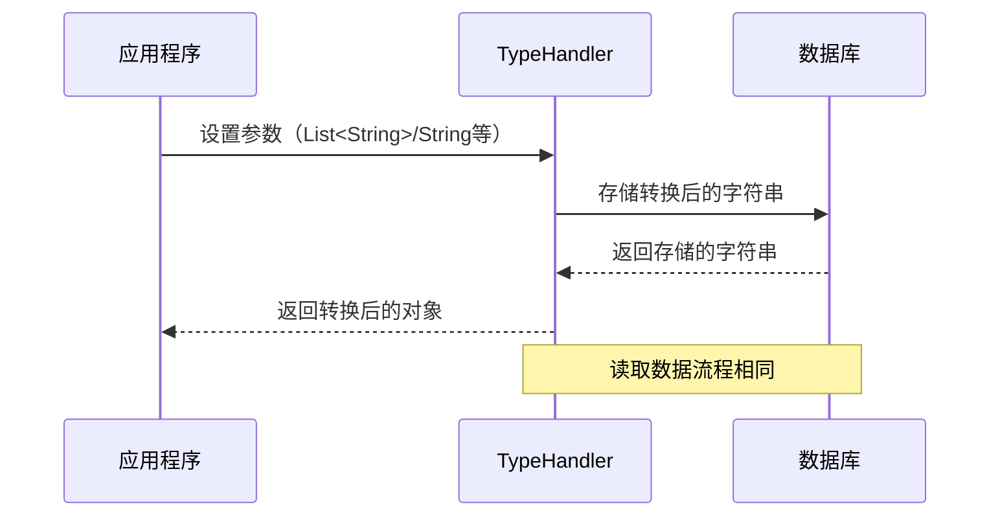

# Type 模块文档

## 模块概述

Type 模块是 Yudao 框架的一个核心组件，主要提供 MyBatis 类型处理器（TypeHandler）的实现，用于处理 Java 对象与数据库字段之间的类型转换。这些类型处理器能够将 Java 中的集合类型（如 List、Set）与数据库中的字符串类型（VARCHAR）进行双向转换，同时还提供了字段加密解密的功能。

## 架构设计

### 模块结构

```
type/
├── core/
│   └── yudao-framework/yudao-spring-boot-starter-mybatis/src/main/java/cn/iocoder/yudao/framework/mybatis/core/type/
│       ├── StringListTypeHandler.java
│       ├── EncryptTypeHandler.java
│       ├── LongSetTypeHandler.java
│       ├── LongListTypeHandler.java
│       └── IntegerListTypeHandler.java
```

### 核心组件关系

Type 模块包含以下核心组件，它们都实现了 MyBatis 的 TypeHandler 接口：

- **StringListTypeHandler**: 处理 `List<String>` 与数据库 VARCHAR 类型转换
- **EncryptTypeHandler**: 提供字段加密解密功能
- **LongSetTypeHandler**: 处理 `Set<Long>` 与数据库 VARCHAR 类型转换
- **LongListTypeHandler**: 处理 `List<Long>` 与数据库 VARCHAR 类型转换
- **IntegerListTypeHandler**: 处理 `List<Integer>` 与数据库 VARCHAR 类型转换

这些组件共同构成了 Type 模块的核心功能。

## 核心组件详解

### 1. StringListTypeHandler

**功能描述**：处理 `List<String>` 与数据库 VARCHAR 类型之间的转换。

**实现原理**：
- 将 `List<String>` 转换为逗号分隔的字符串存储到数据库
- 从数据库读取时，将逗号分隔的字符串转换回 `List<String>`

**代码实现**：
```java
@MappedJdbcTypes(JdbcType.VARCHAR)
@MappedTypes(List.class)
public class StringListTypeHandler implements TypeHandler<List<String>> {
    private static final String COMMA = ",";

    @Override
    public void setParameter(PreparedStatement ps, int i, List<String> strings, JdbcType jdbcType) throws SQLException {
        // 设置占位符
        ps.setString(i, CollUtil.join(strings, COMMA));
    }

    @Override
    public List<String> getResult(ResultSet rs, String columnName) throws SQLException {
        String value = rs.getString(columnName);
        return getResult(value);
    }

    private List<String> getResult(String value) {
        if (value == null) {
            return null;
        }
        return StrUtil.splitTrim(value, COMMA);
    }
}
```

**使用场景**：
- 需要将多个字符串值存储为单个字段时
- 例如：用户标签、权限列表等

---

### 2. EncryptTypeHandler

**功能描述**：提供字段加密解密功能，基于 AES 对称加密算法。

**实现原理**：
- 使用 AES 加密算法对字段值进行加密存储
- 从数据库读取时自动解密
- 密钥通过 `mybatis-plus.encryptor.password` 配置项指定

**代码实现**：
```java
public class EncryptTypeHandler extends BaseTypeHandler<String> {
    private static final String ENCRYPTOR_PROPERTY_NAME = "mybatis-plus.encryptor.password";
    private static AES aes;

    @Override
    public void setNonNullParameter(PreparedStatement ps, int i, String parameter, JdbcType jdbcType) throws SQLException {
        ps.setString(i, encrypt(parameter));
    }

    @Override
    public String getNullableResult(ResultSet rs, String columnName) throws SQLException {
        String value = rs.getString(columnName);
        return decrypt(value);
    }

    public static String encrypt(String rawValue) {
        if (rawValue == null) {
            return null;
        }
        return getEncryptor().encryptBase64(rawValue);
    }

    private static AES getEncryptor() {
        if (aes != null) {
            return aes;
        }
        String password = SpringUtil.getProperty(ENCRYPTOR_PROPERTY_NAME);
        Assert.notEmpty(password, "配置项({}) 不能为空", ENCRYPTOR_PROPERTY_NAME);
        aes = SecureUtil.aes(password.getBytes());
        return aes;
    }
}
```

**使用场景**：
- 需要保护敏感数据（如密码、API密钥等）时
- 符合数据安全合规要求

---

### 3. LongSetTypeHandler

**功能描述**：处理 `Set<Long>` 与数据库 VARCHAR 类型之间的转换。

**实现原理**：
- 将 `Set<Long>` 转换为逗号分隔的字符串存储到数据库
- 从数据库读取时，将逗号分隔的字符串转换回 `Set<Long>`

**代码实现**：
```java
@MappedJdbcTypes(JdbcType.VARCHAR)
@MappedTypes(List.class)
public class LongSetTypeHandler implements TypeHandler<Set<Long>> {
    private static final String COMMA = ",";

    @Override
    public void setParameter(PreparedStatement ps, int i, Set<Long> strings, JdbcType jdbcType) throws SQLException {
        // 设置占位符
        ps.setString(i, CollUtil.join(strings, COMMA));
    }

    @Override
    public Set<Long> getResult(ResultSet rs, String columnName) throws SQLException {
        String value = rs.getString(columnName);
        return getResult(value);
    }

    private Set<Long> getResult(String value) {
        if (value == null) {
            return null;
        }
        return StrUtils.splitToLongSet(value, COMMA);
    }
}
```

**使用场景**：
- 需要存储唯一的长整型集合时
- 例如：用户ID集合、权限ID集合等

---

### 4. LongListTypeHandler

**功能描述**：处理 `List<Long>` 与数据库 VARCHAR 类型之间的转换。

**实现原理**：
- 将 `List<Long>` 转换为逗号分隔的字符串存储到数据库
- 从数据库读取时，将逗号分隔的字符串转换回 `List<Long>`

**代码实现**：
```java
@MappedJdbcTypes(JdbcType.VARCHAR)
@MappedTypes(List.class)
public class LongListTypeHandler implements TypeHandler<List<Long>> {
    private static final String COMMA = ",";

    @Override
    public void setParameter(PreparedStatement ps, int i, List<Long> strings, JdbcType jdbcType) throws SQLException {
        ps.setString(i, CollUtil.join(strings, COMMA));
    }

    @Override
    public List<Long> getResult(ResultSet rs, String columnName) throws SQLException {
        String value = rs.getString(columnName);
        return getResult(value);
    }

    private List<Long> getResult(String value) {
        if (value == null) {
            return null;
        }
        return StrUtils.splitToLong(value, COMMA);
    }
}
```

**使用场景**：
- 需要存储有序的长整型列表时
- 例如：排序的ID列表、分页数据等

---

### 5. IntegerListTypeHandler

**功能描述**：处理 `List<Integer>` 与数据库 VARCHAR 类型之间的转换。

**实现原理**：
- 将 `List<Integer>` 转换为逗号分隔的字符串存储到数据库
- 从数据库读取时，将逗号分隔的字符串转换回 `List<Integer>`

**代码实现**：
```java
@MappedJdbcTypes(JdbcType.VARCHAR)
@MappedTypes(List.class)
public class IntegerListTypeHandler implements TypeHandler<List<Integer>> {
    private static final String COMMA = ",";

    @Override
    public void setParameter(PreparedStatement ps, int i, List<Integer> strings, JdbcType jdbcType) throws SQLException {
        ps.setString(i, CollUtil.join(strings, COMMA));
    }

    @Override
    public List<Integer> getResult(ResultSet rs, String columnName) throws SQLException {
        String value = rs.getString(columnName);
        return getResult(value);
    }

    private List<Integer> getResult(String value) {
        if (value == null) {
            return null;
        }
        return StrUtils.splitToInteger(value, COMMA);
    }
}
```

**使用场景**：
- 需要存储有序的整型列表时
- 例如：状态码列表、枚举值列表等

## 数据流图



## 与其他模块的关系

Type 模块主要与以下模块有依赖关系：

1. **MyBatis Starter**：作为 MyBatis 的类型处理器扩展
2. **Common Util**：使用了 `StrUtils`、`CollUtil` 等工具类
3. **Security**：`EncryptTypeHandler` 与安全模块配合使用

## 配置说明

### EncryptTypeHandler 配置

需要在 `application.yml` 中配置加密密钥：

```yaml
mybatis-plus:
  encryptor:
    password: your-encryption-key
```

## 使用示例

### 1. 使用 StringListTypeHandler

```java
// 实体类定义
public class UserDO {
    @TableField(typeHandler = StringListTypeHandler.class)
    private List<String> tags;
}

// 使用示例
UserDO user = new UserDO();
user.setTags(Arrays.asList("vip", "premium", "active"));
userMapper.insert(user);

// 查询时自动转换
UserDO result = userMapper.selectById(1L);
System.out.println(result.getTags()); // ["vip", "premium", "active"]
```

### 2. 使用 EncryptTypeHandler

```java
// 实体类定义
public class UserDO {
    @TableField(typeHandler = EncryptTypeHandler.class)
    private String apiKey;
}

// 使用示例
UserDO user = new UserDO();
user.setApiKey("sk-1234567890");
userMapper.insert(user);

// 查询时自动解密
UserDO result = userMapper.selectById(1L);
System.out.println(result.getApiKey()); // "sk-1234567890"
```

## 最佳实践

1. **选择合适的 TypeHandler**：
   - 根据数据特性选择合适的处理器
   - 字符串集合使用 `StringListTypeHandler`
   - 数值集合使用对应的 `LongListTypeHandler` 或 `IntegerListTypeHandler`
   - 敏感数据使用 `EncryptTypeHandler`

2. **性能优化**：
   - 避免在大数据量字段上使用集合类型处理器
   - 对于频繁查询的字段，考虑使用单独的表存储

3. **安全考虑**：
   - 为 `EncryptTypeHandler` 配置强密钥
   - 定期轮换加密密钥
   - 避免在日志中输出加密前的原始数据

## 常见问题

1. **Q: 为什么使用 VARCHAR 存储集合？**
   A: 这是一种简单的方式来存储集合数据，避免创建额外的关联表。但需要注意数据长度限制。

2. **Q: EncryptTypeHandler 的性能如何？**
   A: 加密解密会增加一定的性能开销，建议只对敏感数据使用。

3. **Q: 如何处理数据库字段长度限制？**
   A: 对于大型集合，可以考虑使用 TEXT 类型，或拆分为多个字段存储。

## 总结

Type 模块通过提供一系列 MyBatis 类型处理器，简化了 Java 集合类型与数据库字段之间的转换，同时提供了字段加密功能，为 Yudao 框架提供了灵活的数据存储解决方案。开发者可以根据具体需求选择合适的 TypeHandler，提高开发效率并确保数据安全。