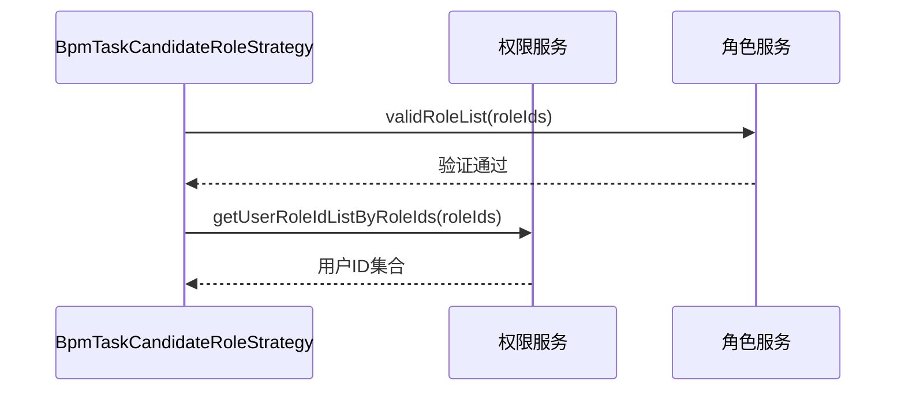
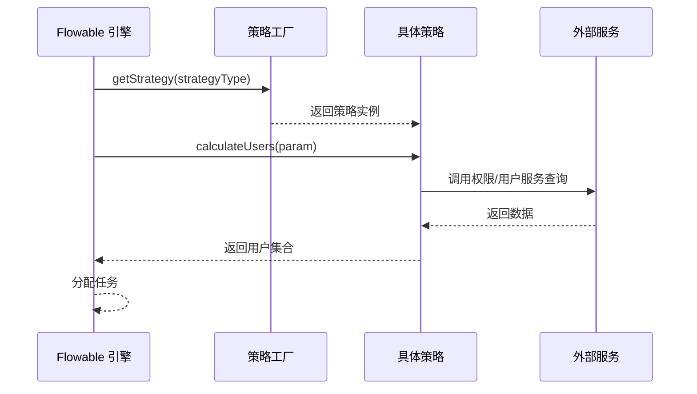

# 用户模块（User Module）

## 1. 模块概述

用户模块是 BPM（业务流程管理）模块的核心子模块，负责提供基于**用户、角色、用户组、岗位、发起人**等多种维度的任务候选人计算策略。该模块与 Flowable 工作流引擎深度集成，支持在流程定义中动态指定任务的审批人/参与人。

### 核心功能
- 实现多种任务候选人分配策略（User、Role、Group、Post、StartUser）
- 提供统一的策略接口，支持扩展新的候选人计算逻辑
- 与系统权限模块（用户、角色、岗位、用户组）进行数据交互
- 支持在流程节点配置中灵活选择候选人分配方式

### 模块定位
```
┌─────────────────────────────────────────────────────────┐
│                    BPM 模块                              │
│  ┌───────────────────────────────────────────────────┐  │
│  │  Flowable 核心框架                               │  │
│  │  ┌─────────────────────────────────────────────┐  │  │
│  │  │  候选人策略框架（Candidate Strategies）     │  │  │
│  │  │  ┌───────────────────────────────────────┐  │  │  │
│  │  │  │  User 策略模块（当前模块）            │  │  │  │
│  │  │  │  ├─ BpmTaskCandidateUserStrategy      │  │  │  │
│  │  │  │  ├─ BpmTaskCandidateRoleStrategy      │  │  │  │
│  │  │  │  ├─ BpmTaskCandidateGroupStrategy     │  │  │  │
│  │  │  │  ├─ BpmTaskCandidatePostStrategy      │  │  │  │
│  │  │  │  └─ BpmTaskCandidateStartUserStrategy │  │  │  │
│  │  │  └───────────────────────────────────────┘  │  │  │
│  │  └─────────────────────────────────────────────┘  │  │
│  └───────────────────────────────────────────────────┘  │
└─────────────────────────────────────────────────────────┘
```

## 2. 架构设计

### 2.1 整体架构

用户模块采用**策略模式（Strategy Pattern）**设计，通过统一的 `BpmTaskCandidateStrategy` 接口实现多种候选人计算逻辑。架构层次如下：

```
┌─────────────────────────────────────────────────────────────────────┐
│                    流程定义配置（BPMN XML）                         │
│  ┌─────────────────────────────────────────────────────────────┐  │
│  │  用户选择策略：ROLE/USER/GROUP/POST/START_USER              │  │
│  │  参数：roleIds/userIds/groupIds/postIds/startUser           │  │
│  └─────────────────────────────────────────────────────────────┘  │
│                            ↓                                    │
┌─────────────────────────────────────────────────────────────────────┐
│              BpmTaskCandidateStrategy 接口（策略抽象）            │
│  ┌─────────────────────────────────────────────────────────────┐  │
│  │ + getStrategy(): BpmTaskCandidateStrategyEnum              │  │
│  │ + validateParam(String param): void                        │  │
│  │ + calculateUsers(String param): Set<Long>                  │  │
│  │ + calculateUsersByTask(...): Set<Long>                     │  │
│  │ + calculateUsersByActivity(...): Set<Long>                 │  │
│  └─────────────────────────────────────────────────────────────┘  │
│                            ↓                                    │
┌─────────────────────────────────────────────────────────────────────┐
│                    具体策略实现类                                 │
│  ┌──────────────┬──────────────┬──────────────┬──────────────┐  │
│  │  User策略    │  Role策略    │  Group策略   │  Post策略    │  │
│  │  User        │  Role        │  User Group  │  Post        │  │
│  └──────────────┴──────────────┴──────────────┴──────────────┘  │
│                            ↓                                    │
┌─────────────────────────────────────────────────────────────────────┐
│                    外部服务依赖                                   │
│  ┌──────────────┬──────────────┬──────────────┬──────────────┐  │
│  │ AdminUserApi │ RoleApi      │ BpmUserGroupService │ PostApi  │  │
│  │ 用户服务     │ 角色服务     │ 用户组服务     │ 岗位服务     │  │
│  └──────────────┴──────────────┴──────────────┴──────────────┘  │
└─────────────────────────────────────────────────────────────────────┘
```

### 2.2 类图

```mermaid
classDiagram
    class BpmTaskCandidateStrategy {
        <<interface>>
        +BpmTaskCandidateStrategyEnum getStrategy()
        +void validateParam(String param)
        +boolean isParamRequired()
        +Set<Long> calculateUsers(String param)
        +Set<Long> calculateUsersByTask(DelegateExecution, String)
        +Set<Long> calculateUsersByActivity(BpmnModel, String, String, Long, String, Map)
    }

    class BpmTaskCandidateUserStrategy {
        +AdminUserApi adminUserApi
        +BpmTaskCandidateStrategyEnum getStrategy()
        +void validateParam(String param)
        +LinkedHashSet<Long> calculateUsers(String param)
    }

    class BpmTaskCandidateRoleStrategy {
        +RoleApi roleApi
        +PermissionApi permissionApi
        +BpmTaskCandidateStrategyEnum getStrategy()
        +void validateParam(String param)
        +Set<Long> calculateUsers(String param)
    }

    class BpmTaskCandidateGroupStrategy {
        +BpmUserGroupService userGroupService
        +BpmTaskCandidateStrategyEnum getStrategy()
        +void validateParam(String param)
        +Set<Long> calculateUsers(String param)
    }

    class BpmTaskCandidatePostStrategy {
        +PostApi postApi
        +AdminUserApi adminUserApi
        +BpmTaskCandidateStrategyEnum getStrategy()
        +void validateParam(String param)
        +Set<Long> calculateUsers(String param)
    }

    class BpmTaskCandidateStartUserStrategy {
        +BpmProcessInstanceService processInstanceService
        +BpmTaskCandidateStrategyEnum getStrategy()
        +void validateParam(String param)
        +boolean isParamRequired()
        +Set<Long> calculateUsersByTask(DelegateExecution, String)
        +Set<Long> calculateUsersByActivity(BpmnModel, String, String, Long, String, Map)
    }

    BpmTaskCandidateStrategy <|-- BpmTaskCandidateUserStrategy
    BpmTaskCandidateStrategy <|-- BpmTaskCandidateRoleStrategy
    BpmTaskCandidateStrategy <|-- BpmTaskCandidateGroupStrategy
    BpmTaskCandidateStrategy <|-- BpmTaskCandidatePostStrategy
    BpmTaskCandidateStrategy <|-- BpmTaskCandidateStartUserStrategy
```



## 3. 核心组件说明

### 3.1 BpmTaskCandidateStrategy（策略接口）

**文件路径**: `yudao-module-bpm/src/main/java/cn/iocoder/yudao/module/bpm/framework/flowable/core/candidate/BpmTaskCandidateStrategy.java`

**职责**: 定义任务候选人计算的统一接口，所有具体策略类必须实现该接口。

**核心方法**:
| 方法名 | 描述 |
|--------|------|
| `getStrategy()` | 返回策略枚举类型，标识当前策略属于哪种候选人计算方式 |
| `validateParam(String param)` | 校验传入的参数是否合法（如角色ID、用户ID等是否存在） |
| `calculateUsers(String param)` | 根据参数计算候选用户集合（默认实现） |
| `calculateUsersByTask(DelegateExecution, String)` | 基于当前执行任务计算候选用户 |
| `calculateUsersByActivity(BpmnModel, String, String, Long, String, Map)` | 基于流程活动节点计算候选用户（用于未执行节点） |

### 3.2 BpmTaskCandidateStrategyEnum（策略枚举）

**文件路径**: `yudao-module-bpm/src/main/java/cn/iocoder/yudao/module/bpm/framework/flowable/core/enums/BpmTaskCandidateStrategyEnum.java`

**职责**: 定义所有支持的候选人策略类型，包括用户模块中的策略和其他模块的策略。

**用户模块支持的策略**:
| 枚举值 | 策略类型 | 描述 |
|--------|----------|------|
| `USER` | 用户策略 | 指定具体的用户列表 |
| `ROLE` | 角色策略 | 指定角色，获取该角色下的所有用户 |
| `USER_GROUP` | 用户组策略 | 指定用户组，获取该用户组下的所有用户 |
| `POST` | 岗位策略 | 指定岗位，获取该岗位下的所有用户 |
| `START_USER` | 发起人策略 | 使用流程发起人作为候选人 |

### 3.3 BpmTaskCandidateUserStrategy（用户策略）

**文件路径**: `yudao-module-bpm/src/main/java/cn/iocoder/yudao/module/bpm/framework/flowable/core/candidate/strategy/user/BpmTaskCandidateUserStrategy.java`

**职责**: 直接指定用户列表作为任务候选人。

**参数格式**: 逗号分隔的用户ID字符串，如 `"1,2,3"`

**核心逻辑**:
1. `validateParam()`: 调用 `AdminUserApi.validateUserList()` 验证用户ID是否存在
2. `calculateUsers()`: 将参数字符串按逗号分割，返回 `LinkedHashSet<Long>` 保持顺序

### 3.4 BpmTaskCandidateRoleStrategy（角色策略）

**文件路径**: `yudao-module-bpm/src/main/java/cn/iocoder/yudao/module/bpm/framework/flowable/core/candidate/strategy/user/BpmTaskCandidateRoleStrategy.java`

**职责**: 通过角色间接指定候选人，获取指定角色下的所有用户。

**参数格式**: 逗号分隔的角色ID字符串，如 `"10,20"`

**核心逻辑**:
1. `validateParam()`: 调用 `RoleApi.validRoleList()` 验证角色ID是否存在
2. `calculateUsers()`: 
   - 解析角色ID列表
   - 调用 `PermissionApi.getUserRoleIdListByRoleIds()` 获取属于这些角色的所有用户ID

### 3.5 BpmTaskCandidateGroupStrategy（用户组策略）

**文件路径**: `yudao-module-bpm/src/main/java/cn/iocoder/yudao/module/bpm/framework/flowable/core/candidate/strategy/user/BpmTaskCandidateGroupStrategy.java`

**职责**: 通过用户组间接指定候选人，获取指定用户组下的所有用户。

**参数格式**: 逗号分隔的用户组ID字符串，如 `"5,10"`

**核心逻辑**:
1. `validateParam()`: 调用 `BpmUserGroupService.validUserGroups()` 验证用户组ID是否存在
2. `calculateUsers()`: 
   - 解析用户组ID列表
   - 查询用户组详情（`BpmUserGroupDO`）
   - 提取每个用户组的用户ID列表并合并

### 3.6 BpmTaskCandidatePostStrategy（岗位策略）

**文件路径**: `yudao-module-bpm/src/main/java/cn/iocoder/yudao/module/bpm/framework/flowable/core/candidate/strategy/user/BpmTaskCandidatePostStrategy.java`

**职责**: 通过岗位间接指定候选人，获取指定岗位下的所有用户。

**参数格式**: 逗号分隔的岗位ID字符串，如 `"100,101"`

**核心逻辑**:
1. `validateParam()`: 调用 `PostApi.validPostList()` 验证岗位ID是否存在
2. `calculateUsers()`: 
   - 解析岗位ID列表
   - 调用 `AdminUserApi.getUserListByPostIds()` 获取该岗位下的所有用户
   - 提取用户ID并返回

### 3.7 BpmTaskCandidateStartUserStrategy（发起人策略）

**文件路径**: `yudao-module-bpm/src/main/java/cn/iocoder/yudao/module/bpm/framework/flowable/core/candidate/strategy/user/BpmTaskCandidateStartUserStrategy.java`

**职责**: 将流程发起人（启动流程的用户）作为任务候选人，常用于发起人复核场景。

**参数**: 无需参数（`isParamRequired()` 返回 `false`）

**核心逻辑**:
1. `calculateUsersByTask()`: 从当前流程执行实例中获取启动用户ID
2. `calculateUsersByActivity()`: 直接使用传入的 `startUserId`

**适用场景**: 需要发起人信息复核、发起人确认等紧挨开始节点的场景。

## 4. 模块交互关系

### 4.1 与系统权限模块的交互

用户模块依赖系统模块提供的权限相关 API：



### 4.2 与 BPM 流程定义的交互

```mermaid
classDiagram
    class BpmProcessDefinition {
        +String getAssignee()
        +String getCandidateUsers()
        +String getCandidateGroups()
        +String getCandidateRoles()
    }
    
    class BpmTaskCandidateStrategy {
        <<interface>>
        +BpmTaskCandidateStrategyEnum getStrategy()
    }
    
    class BpmTaskCandidateStrategyFactory {
        +BpmTaskCandidateStrategy getStrategy(String strategyType)
    }
    
    BpmProcessDefinition --| BpmTaskCandidateStrategyFactory
    BpmTaskCandidateStrategyFactory --> BpmTaskCandidateStrategy
```

流程定义在 BPMN 配置中指定候选人策略类型和参数，运行时通过策略工厂获取对应策略实例进行计算。

### 4.3 与其他候选人策略模块的关系

用户模块只是 BPM 候选人策略体系的一部分，完整的策略体系还包括：

| 模块 | 策略类型 | 说明 |
|------|----------|------|
| **user**（当前模块） | USER、ROLE、GROUP、POST、START_USER | 基于用户、角色、组、岗位、发起人的静态策略 |
| dept | DEPT_MEMBER、DEPT_LEADER、START_USER_DEPT_LEADER 等 | 基于部门的动态策略 |
| form | FORM_USER、FORM_DEPT_LEADER | 基于表单字段的策略 |
| expression | EXPRESSION | 基于 SpEL 表达式的策略 |
| other | ASSIGN_EMPTY、APPROVE_USER_SELECT、START_USER_SELECT | 特殊策略 |

这些策略共同构成了完整的 Flowable 候选人分配体系。

## 5. 使用示例

### 5.1 BPMN 配置示例

在 BPMN 流程图中配置任务节点时，可以选择不同的候选人策略：

```xml
<!-- 用户策略：指定具体用户 -->
<userTask id="task1" name="用户审批">
    <extensionElements>
        <flowable:candidateUsers userIds="100,101,102"/>
    </extensionElements>
</userTask>

<!-- 角色策略：指定角色 -->
<userTask id="task2" name="角色审批">
    <extensionElements>
        <flowable:candidateRoles roleIds="10,20"/>
    </extensionElements>
</userTask>

<!-- 用户组策略：指定用户组 -->
<userTask id="task3" name="组审批">
    <extensionElements>
        <flowable:candidateGroups groupId="5"/>
    </extensionElements>
</userTask>

<!-- 岗位策略：指定岗位 -->
<userTask id="task4" name="岗位审批">
    <extensionElements>
        <flowable:candidatePostIds postIds="100"/>
    </extensionElements>
</userTask>

<!-- 发起人策略：发起人自己 -->
<userTask id="task5" name="发起人复核">
    <extensionElements>
        <flowable:candidateStartUser/>
    </extensionElements>
</userTask>
```

### 5.2 策略调用流程



## 6. 扩展指南

如需新增候选人策略，需遵循以下步骤：

1. **创建新策略类**：实现 `BpmTaskCandidateStrategy` 接口
2. **注册策略枚举**：在 `BpmTaskCandidateStrategyEnum` 中添加新策略类型
3. **实现参数校验**：在 `validateParam()` 中验证参数合法性
4. **实现用户计算**：在 `calculateUsers()` 或相关方法中返回用户集合
5. **注册 Spring Bean**：使用 `@Component` 注解注册策略类
6. **策略工厂支持**：确保策略工厂能识别并返回新策略实例

## 7. 依赖关系

### 7.1 内部依赖
- `yudao-module-bpm`: BPM 核心模块（用户组服务、流程实例服务）
- `yudao-module-system`: 系统模块（用户、角色、岗位 API）

### 7.2 外部依赖
- Flowable Engine: 工作流引擎核心
- Spring Framework: @Component、@Resource 等注解

### 7.3 被依赖模块
- BPM 模块的其他策略类通过统一接口使用该模块的策略
- 流程定义配置引用策略枚举值
