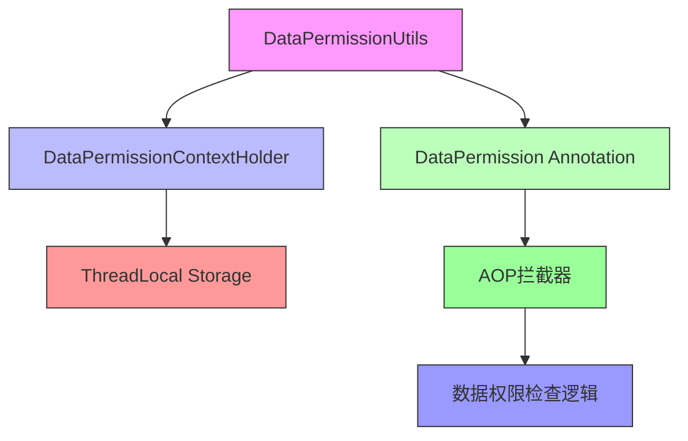
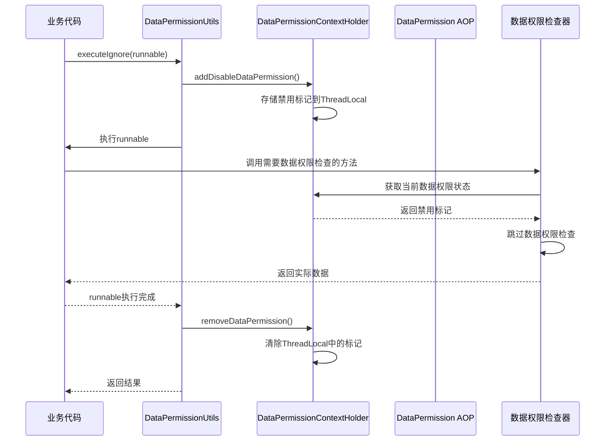
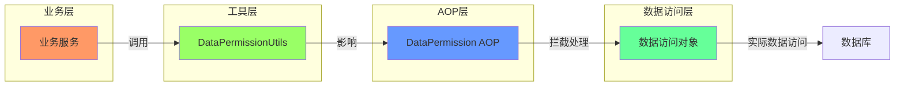

# DataPermissionUtils 模块文档

## 概述

DataPermissionUtils 是 Yudao 框架中数据权限功能的工具类，位于 `yudao-framework/yudao-spring-boot-starter-biz-data-permission` 模块下。该工具类提供了便捷的方法来临时禁用数据权限检查，以便在特定业务场景下执行需要跳过数据权限限制的操作。

在多租户和数据隔离的系统中，数据权限是一个核心功能，用于控制用户只能访问自己被授权的数据。然而，在某些系统级操作（如后台任务、数据同步、管理员操作等）中，可能需要临时绕过这些权限限制。DataPermissionUtils 正是为了解决这一需求而设计的。

## 核心功能

DataPermissionUtils 提供以下核心功能：

1. **临时禁用数据权限**：通过 `executeIgnore` 方法，在执行特定逻辑期间临时禁用数据权限检查
2. **上下文管理**：通过 `addDisableDataPermission` 和 `removeDataPermission` 方法手动管理数据权限状态
3. **支持同步和异步操作**：提供接受 `Runnable` 和 `Callable<T>` 的重载方法，以适应不同的使用场景

## 详细设计

### 类结构

```java
package cn.iocoder.yudao.framework.datapermission.core.util;

import cn.iocoder.yudao.framework.datapermission.core.annotation.DataPermission;
import cn.iocoder.yudao.framework.datapermission.core.aop.DataPermissionContextHolder;
import lombok.SneakyThrows;

import java.util.concurrent.Callable;

/**
 * 数据权限 Util
 *
 * @author 芋道源码
 */
public class DataPermissionUtils {

    private static DataPermission DATA_PERMISSION_DISABLE;

    @DataPermission(enable = false)
    @SneakyThrows
    private static DataPermission getDisableDataPermissionDisable() {
        if (DATA_PERMISSION_DISABLE == null) {
            DATA_PERMISSION_DISABLE = DataPermissionUtils.class
                    .getDeclaredMethod("getDisableDataPermissionDisable")
                    .getAnnotation(DataPermission.class);
        }
        return DATA_PERMISSION_DISABLE;
    }

    /**
     * 忽略数据权限，执行对应的逻辑
     *
     * @param runnable 逻辑
     */
    public static void executeIgnore(Runnable runnable) {
        addDisableDataPermission();
        try {
            // 执行 runnable
            runnable.run();
        } finally {
            removeDataPermission();
        }
    }

    /**
     * 忽略数据权限，执行对应的逻辑
     *
     * @param callable 逻辑
     * @return 执行结果
     */
    @SneakyThrows
    public static <T> T executeIgnore(Callable<T> callable) {
        addDisableDataPermission();
        try {
            // 执行 callable
            return callable.call();
        } finally {
            removeDataPermission();
        }
    }

    /**
     * 添加忽略数据权限
     */
    public static void addDisableDataPermission(){
        DataPermission dataPermission = getDisableDataPermissionDisable();
        DataPermissionContextHolder.add(dataPermission);
    }

    public static void removeDataPermission(){
        DataPermissionContextHolder.remove();
    }

}
```

### 关键设计点

1. **延迟初始化的禁用注解**：
   - 使用 `DATA_PERMISSION_DISABLE` 静态字段缓存一个禁用的 `DataPermission` 注解实例
   - 通过反射获取自身方法上的 `@DataPermission(enable = false)` 注解，确保只初始化一次
   - 这种设计避免了每次调用都创建新注解对象的开销

2. **线程安全的上下文管理**：
   - 依赖 `DataPermissionContextHolder` 来管理当前线程的数据权限状态
   - 使用 `ThreadLocal` 实现（推断），确保每个线程都有独立的数据权限上下文
   - 通过 `add` 和 `remove` 方法进行栈式管理，支持嵌套使用

3. **异常处理**：
   - 使用 Lombok 的 `@SneakyThrows` 注解简化异常声明
   - 在 `executeIgnore` 和 `getDisableDataPermissionDisable` 方法中使用
   - 这样可以在不声明 `throws` 子句的情况下处理检查异常

4. **资源安全**：
   - 使用 `try/finally` 块确保无论逻辑执行成功还是失败，都会移除临时的数据权限设置
   - 防止因异常导致数据权限状态泄漏

## 架构关系

DataPermissionUtils 作为数据权限功能的工具类，主要与以下组件交互：



### 组件说明

1. **DataPermissionUtils**：提供静态方法来临时禁用数据权限
2. **DataPermissionContextHolder**：管理当前线程的数据权限状态（基于ThreadLocal）
3. **DataPermission Annotation**：标记方法或类是否启用数据权限检查
4. **AOP拦截器**：在目标方法执行前检查DataPermission注解并执行相应的权限检查逻辑
5. **数据权限检查逻辑**：实际的数据过滤实现（通常通过MyBatis拦截器或Spring AOP）

## 使用场景

DataPermissionUtils 适用于以下场景：

1. **后台定时任务**：需要处理所有数据而不受当前用户数据权限限制
2. **管理员操作**：系统管理员需要查看或修改所有数据
3. **数据同步/迁移**：在不同系统或数据库之间同步数据时
4. **报表生成**：生成需要跨数据权限边界的综合报表
5. **初始化数据**：系统初始化时创建基础数据

### 使用示例

#### 示例1：使用Runnable执行无返回值操作

```java
public void syncAllUserData() {
    // 需要同步所有用户数据，不受当前用户数据权限限制
    DataPermissionUtils.executeIgnore(() -> {
        List<User> allUsers = userMapper.selectAll();
        // 处理所有用户数据...
        return null;
    });
}
```

#### 示例2：使用Callable执行有返回值操作

```java
public int countAllOrders() {
    // 需要统计所有订单数量，不受数据权限限制
    return DataPermissionUtils.executeIgnore(() -> {
        return orderMapper.countAll();
    });
}
```

#### 示例3：手动管理数据权限状态（高级用法）

```java
public void batchProcessWithCustomLogic() {
    try {
        // 手动添加禁用数据权限标记
        DataPermissionUtils.addDisableDataPermission();
        
        // 执行多个操作，所有操作都将忽略数据权限
        List<User> users = userMapper.selectAll();
        List<Order> orders = orderMapper.selectAll();
        // 处理数据...
        
    } finally {
        // 确保移除数据权限标记
        DataPermissionUtils.removeDataPermission();
    }
}
```

## 工作原理

DataPermissionUtils 的工作流程可以通过以下时序图说明：



## 与其他模块的关系

DataPermissionUtils 主要与数据权限系统的其他组件协作工作。虽然它是一个独立的工具类，但它的设计是为了与以下模块配合使用：

1. **数据权限注解模块**：提供 `@DataPermission` 注解来声明方法或类的数据权限策略
2. **AOP拦截器模块**：通过切面拦截带有 `@DataPermission` 注解的方法，执行实际的权限检查
3. **上下文管理模块**：提供线程安全的状态管理机制
4. **业务服务层**：在服务实现中使用 DataPermissionUtils 来临时禁用权限检查

在系统架构中，它通常位于工具层，被业务逻辑层调用，以影响数据访问层的行为。



## 最佳实践

1. **最小化使用范围**：只在绝对必要的情况下使用 `executeIgnore` 方法，并尽可能缩小其作用域
2. **确保资源释放**： always 使用 try/finally 或自动管理的 executeIgnore 方法，确保数据权限状态被正确恢复
3. **避免嵌套滥用**：虽然支持嵌套使用，但应避免深层嵌套，以免难以追踪权限状态
4. **明确意图**：在使用 DataPermissionUtils 时，添加注释说明为什么需要临时禁用数据权限
5. **权限审计**：考虑在关键操作中记录数据权限被禁用的情况，以便安全审计

## 性能考虑

1. **轻量级实现**：DataPermissionUtils 本身开销非常小，主要操作是ThreadLocal读写和简单的对象引用传递
2. **延迟初始化**：禁用的DataPermission注解只在首次使用时通过反射获取一次，后续直接复用缓存
3. **无锁设计**：使用ThreadLocal实现，避免了多线程竞争和锁开销
4. **方法内联**：方法简单，JVM有可能将其内联，进一步减少调用开销

## 安全注意事项

1. **权限提升风险**：使用 DataPermissionUtils 会临时提升当前线程的数据权限，应确保只在受信任的代码路径中使用
2. **上下文泄漏**：如果忘记移除数据权限标记，可能导致后续操作意外获得提升权限，因此必须确保remove操作一定执行
3. **审计要求**：在生产环境中使用此工具时，建议添加操作日志以追踪谁在何时临时禁用了数据权限
4. **最小权限原则**：应评估是否真的需要完全禁用数据权限，或者是否可以通过更细粒度的权限控制来满足需求

## 与类似功能的比较

在框架中，可能存在其他方式来影响数据权限行为：

| 方法 | 优点 | 缺点 | 适用场景 |
|------|------|------|----------|
| DataPermissionUtils.executeIgnore | 使用简单，自动管理状态，代码简洁 | 只能完全禁用或启用，无法细粒度控制 | 需要临时完全忽略数据权限的场景 |
| 手动修改DataPermissionContextHolder | 完全控制状态 | 需要手动管理添加和移除，易忘记移除 | 高级场景需要自定义状态管理 |
| 自定义DataPermission注解 | 可以声明特定的权限规则 | 需要额外定义注解和处理逻辑 | 需要特定权限规则而非完全禁用的场景 |
| 直接绕过权限检查层 | 最灵活 | 破坏分层设计，耦合性强，维护困难 | 极少数特殊底层场景 |

DataPermissionUtils 提供了一个平衡点：使用简单且安全，同时保持了良好的封装性。

## 结论

DataPermissionUtils 是 Yudao 框架数据权限系统中一个重要的工具类，它为开发者提供了一种安全、便捷的方式来临时禁用数据权限检查。通过上述设计，其设计体现了以下优点：

1. **易于使用**：静态方法调用，无需创建实例
2. **资源安全**：自动管理上下文状态，防止泄漏
3. **性能优秀**：延迟初始化和ThreadLocal设计确保低开销
4. **线程安全**：每个线程独立管理状态，无需额外同步
5. **语义清晰**：方法名称和参数清晰表达意图

在需要临时提升数据权限执行特定操作的场景中，DataPermissionUtils 是推荐的解决方案。它帮助框架在保持严格数据权限控制的同时，仍能灵活处理那些需要超越普通权限边界的合法业务需求。