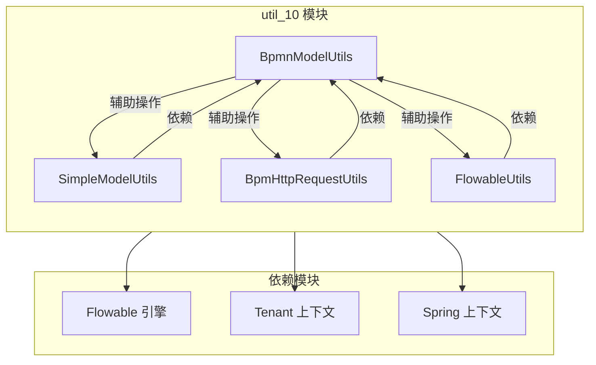
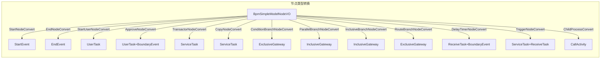
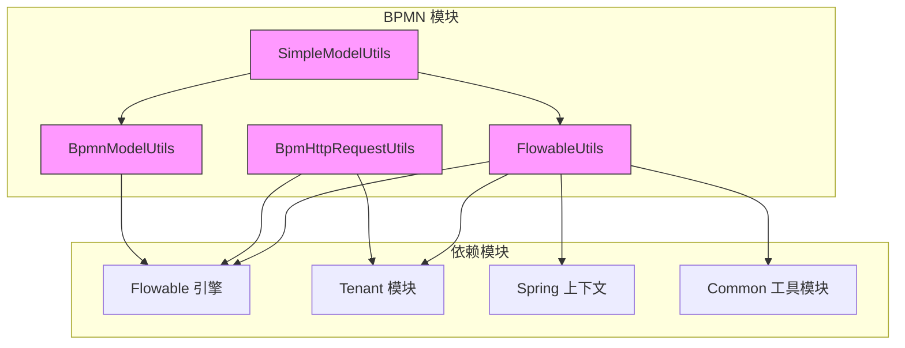

# util_10 模块文档 - BPMN 工具类

## 模块概述

`util_10` 模块是 BPMN 模块的核心工具类集合，提供了 BPMN 模型操作、简单模型转换、HTTP 请求和 Flowable 引擎相关的实用工具。该模块位于 `yudao-module-bpm/framework/flowable/core/util/` 目录下，是 BPMN 功能模块的基础支撑组件。

## 架构概览



## 核心组件

### 1. BpmnModelUtils - BPMN 模型操作工具类

详细文档参见：[util_10_bpmn_model_utils](util_10_bpmn_model_utils.md)

**文件路径**: `yudao-module-bpm/src/main/java/cn/iocoder/yudao/module/bpm/framework/flowable/core/util/BpmnModelUtils.java`

**核心功能**:
- BPMN 模型的修改与解析
- 扩展元素（Extension Element）的添加与解析
- 候选人策略、审批类型等属性的处理
- BPMN 流程预测与遍历
- 条件表达式求值

**主要方法**:

| 方法 | 描述 |
|------|------|
| `addExtensionElement` | 为 BPMN 节点添加扩展元素 |
| `parseExtensionElement` | 解析节点的扩展元素 |
| `addCandidateElements` | 添加候选人元素到任务节点 |
| `parseCandidateStrategy` | 解析候选人策略 |
| `parseApproveType` | 解析审批类型 |
| `simulateProcess` | 流程预测，返回执行路径节点列表 |
| `getNextUserTasks` | 获取下一个用户任务节点列表 |
| `evalConditionExpress` | 计算条件表达式的值 |

**使用场景**:
- 流程定义创建时的节点属性设置
- 流程执行时的条件判断
- 流程预测和路径分析

### 2. SimpleModelUtils - 简单模型转换工具类

详细文档参见：[util_10_simple_model_utils](util_10_simple_model_utils.md)

**文件路径**: `yudao-module-bpm/src/main/java/cn/iocoder/yudao/module/bpm/framework/flowable/core/util/SimpleModelUtils.java`

**核心功能**:
- 将仿钉钉/飞书的简单模型数据结构（BpmSimpleModelNodeVO）转换为标准 BPMN 模型
- 支持多种节点类型的转换：开始节点、结束节点、审批节点、分支节点等
- 流程预测（简单模型版本）

**节点类型转换**:



**主要方法**:

| 方法 | 描述 |
|------|------|
| `buildBpmnModel` | 将简单模型转换为 BPMN 模型 |
| `traverseNodeToBuildFlowNode` | 递归遍历节点构建 FlowElement |
| `traverseNodeToBuildSequenceFlow` | 递归遍历节点构建 SequenceFlow |
| `simulateProcess` | 简单模型流程预测 |
| `isSkipNode` | 判断节点是否被跳过 |

**使用场景**:
- 前端流程设计器保存流程定义
- 简单模型到标准 BPMN 的转换
- 流程设计时的可视化建模

### 3. BpmHttpRequestUtils - HTTP 请求工具类

详细文档参见：[util_10_http_request_utils](util_10_http_request_utils.md)

**文件路径**: `yudao-module-bpm/src/main/java/cn/iocoder/yudao/module/bpm/framework/flowable/core/util/BpmHttpRequestUtils.java`

**核心功能**:
- 在 BPMN 流程中发起 HTTP 请求
- 支持请求头和请求体的构建
- 支持响应结果解析并更新流程变量
- 支持租户上下文传递

**主要方法**:

| 方法 | 描述 |
|------|------|
| `executeBpmHttpRequest` | 执行 BPMN HTTP 请求，支持响应处理 |
| `sendHttpRequest` | 发送 HTTP 请求 |
| `buildHttpHeaders` | 构建 HTTP 请求头 |
| `buildHttpBody` | 构建 HTTP 请求体 |
| `getNeedUpdatedVariablesFromResponse` | 从响应中提取需要更新的流程变量 |

**使用场景**:
- 触发器节点的 HTTP 回调
- 流程中调用外部服务
- 获取外部数据并更新流程变量

### 4. FlowableUtils - Flowable 引擎工具类

详细文档参见：[util_10_flowable_utils](util_10_flowable_utils.md)

**文件路径**: `yudao-module-bpm/src/main/java/cn/iocoder/yudao/module/bpm/framework/flowable/core/util/FlowableUtils.java`

**核心功能**:
- 用户身份认证上下文管理
- 租户上下文执行
- 流程实例状态获取
- 表单变量过滤
- 表达式求值

**主要方法**:

| 方法 | 描述 |
|------|------|
| `setAuthenticatedUserId` | 设置认证用户 ID |
| `executeAuthenticatedUserId` | 以指定用户身份执行代码块 |
| `execute` | 以指定租户执行代码块 |
| `getProcessInstanceStatus` | 获取流程实例状态 |
| `getProcessInstanceFormVariable` | 获取流程实例表单变量（过滤系统字段） |
| `getSummary` | 获取流程实例摘要 |
| `getExpressionValue` | 求值表达式 |
| `formatExecutionCollectionVariable` | 格式化多实例 collectionVariable |

**使用场景**:
- 流程执行时的身份上下文设置
- 租户隔离执行
- 流程变量处理
- 表达式求值

## 模块关系图



## 使用示例

### 1. 创建 BPMN 模型

```java
// 使用 SimpleModelUtils 将简单模型转换为 BPMN 模型
BpmnModel bpmnModel = SimpleModelUtils.buildBpmnModel(
    "processId", 
    "流程名称", 
    rootNode
);
```

### 2. 流程预测

```java
// 预测流程执行路径
List<FlowElement> path = BpmnModelUtils.simulateProcess(bpmnModel, variables);
```

### 3. 执行 HTTP 请求

```java
// 在流程中调用外部服务
BpmHttpRequestUtils.executeBpmHttpRequest(
    processInstance, 
    "http://external-service/api", 
    headerParams, 
    bodyParams, 
    true, 
    response
);
```

### 4. 租户上下文执行

```java
// 以指定租户执行操作
FlowableUtils.execute(tenantIdStr, () -> {
    // 租户相关的流程操作
});
```

## 总结

`util_10` 模块提供了 BPMN 流程处理所需的核心工具类，涵盖了模型操作、转换、HTTP 请求和引擎辅助功能。这些工具类被 BPMN 模块的其他组件广泛使用，是流程引擎功能实现的基础支撑。
