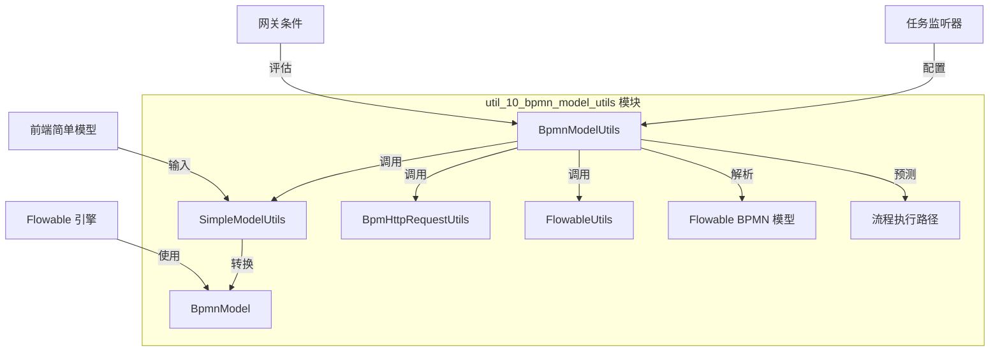
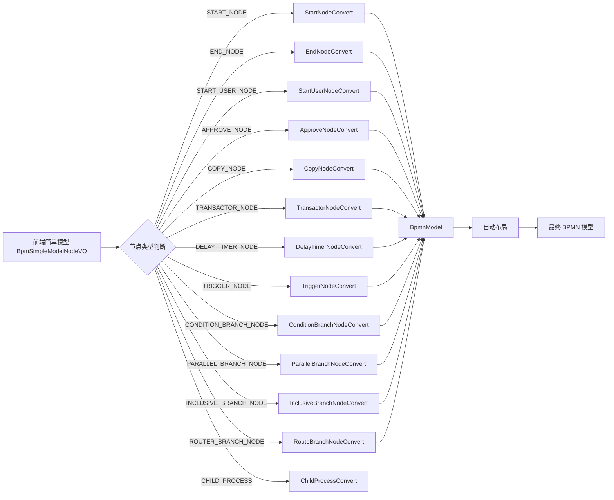
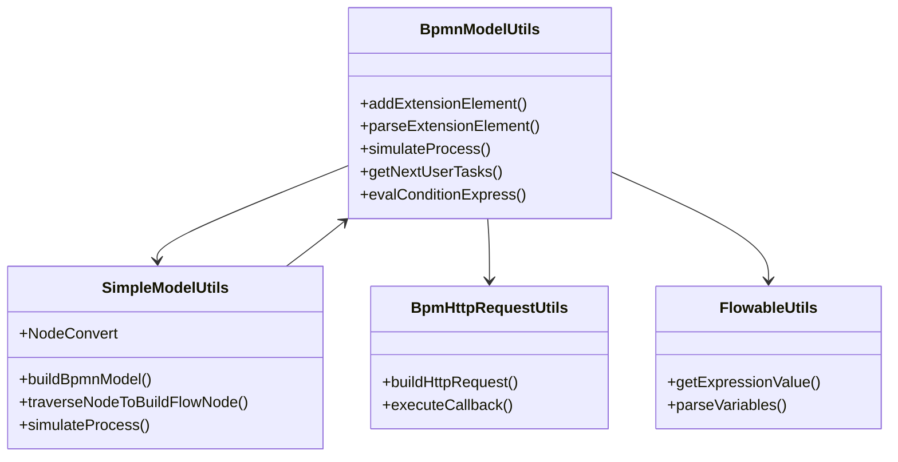

# BPMN 模型工具模块 (util_10_bpmn_model_utils)

## 模块概述

`util_10_bpmn_model_utils` 是 Yudao 项目中 BPMN 模块的核心工具包，专注于 BPMN 模型的操作、转换和流程预测。该模块提供了对 Flowable BPMN 引擎的扩展支持，实现了从前端简单模型到完整 BPMN 模型的转换，以及流程执行路径的预测功能。

模块包含四个核心工具类：

| 工具类 | 说明 |
|--------|------|
| **BpmnModelUtils** | BPMN 模型操作工具，提供节点扩展元素解析、流程遍历、流程预测等核心功能 |
| **SimpleModelUtils** | 简单模型转换工具，将仿钉钉流程设计模型（JSON 结构）转换为标准 BPMN 模型 |
| **BpmHttpRequestUtils** | HTTP 请求工具类，用于 BPMN 触发器的 HTTP 回调处理（详见 [BpmHttpRequestUtils.md](util_10_http_request_utils.md)） |
| **FlowableUtils** | Flowable 引擎通用工具类，提供流程引擎相关的辅助方法（详见 [FlowableUtils.md](util_10_flowable_utils.md)） |

## 架构关系



## 核心工具类详解

### 1. BpmnModelUtils - BPMN 模型操作工具

BpmnModelUtils 是 BPMN 模型操作的核心工具类，主要分为四大功能模块：

#### 1.1 BPMN 修改与解析元素

提供对 BPMN 节点扩展元素（Extension Element）的读写操作，支持自定义属性的存储和解析。

**主要功能：**

| 方法 | 说明 |
|------|------|
| `addExtensionElement` | 为节点添加扩展元素（支持 String、Integer、Map 类型） |
| `addExtensionElementJson` | 添加 JSON 格式的扩展元素 |
| `parseExtensionElement` | 解析指定名称的扩展元素文本 |
| `addCandidateElements` | 添加候选人策略和参数（用于任务分配） |
| `parseCandidateStrategy` | 解析候选人策略 |
| `parseCandidateParam` | 解析候选人参数 |
| `parseApproveType` | 解析审批类型 |
| `parseMultiInstanceSourceType` | 解析子流程多实例来源类型 |
| `addTaskRejectElements` | 添加任务拒绝处理配置 |
| `parseRejectHandlerType` | 解析拒绝处理类型 |
| `parseReturnTaskId` | 解析拒绝返回的任务节点 ID |
| `addAssignStartUserHandlerType` | 添加审批人与发起人相同时的处理策略 |
| `parseAssignStartUserHandlerType` | 解析该处理策略 |
| `addAssignEmptyHandlerType` | 添加审批人为空时的处理策略 |
| `parseAssignEmptyHandlerType` | 解析该处理策略 |
| `parseAssignEmptyHandlerUserIds` | 解析空处理的用户 ID 列表 |
| `addFormFieldsPermission` | 添加表单字段权限配置 |
| `parseFormFieldsPermission` | 解析表单字段权限 |
| `addButtonsSetting` | 添加操作按钮设置 |
| `parseButtonsSetting` | 解析操作按钮设置 |
| `parseBoundaryEventExtensionElement` | 解析边界事件扩展元素 |
| `addSignEnable` / `parseSignEnable` | 添加/解析是否启用签名 |
| `addReasonRequire` / `parseReasonRequire` | 添加/解析是否需要填写理由 |
| `addListenerConfig` / `parseListenerConfig` | 配置监听器 |
| `parserTriggerType` / `parserTriggerParam` | 解析触发器类型和参数 |
| `addNodeType` / `parseNodeType` | 添加/解析节点类型 |

**扩展元素存储示例：**
```java
// 添加候选人策略
addCandidateElements(BpmTaskCandidateStrategyEnum.START_USER.getStrategy(), null, userTask);

// 添加表单字段权限
addFormFieldsPermission(fieldsPermission, userTask);

// 添加操作按钮设置
addButtonsSetting(buttonsSetting, userTask);
```

#### 1.2 BPMN 简单查找

提供对 BPMN 模型中元素的快速查找功能。

| 方法 | 说明 |
|------|------|
| `getElementIncomingFlows` | 获取节点的入口连线 |
| `getElementIncomingUserTaskFlows` | 递归获取上游 UserTask 的入口连线 |
| `getElementOutgoingFlows` | 获取节点的出口连线 |
| `getFlowElementById` | 根据 ID 获取流程元素 |
| `getBpmnModelElements` | 获取指定类型的元素列表（如所有 UserTask） |
| `getStartEvent` | 获取开始事件 |
| `getEndEvent` | 获取结束事件 |

**获取上游 UserTask 连线示例：**
```java
List<SequenceFlow> upstreamFlows = BpmnModelUtils.getElementIncomingUserTaskFlows(currentNode);
```

#### 1.3 BPMN 复杂遍历

提供深度优先遍历算法，用于流程路径分析和任务查找。

| 方法 | 说明 |
|------|------|
| `getPreviousUserTaskList` | 获取目标节点之前的所有用户任务节点 |
| `findChildProcessUserTaskList` | 迭代获取子流程中的用户任务节点 |
| `isSequentialReachable` | 判断两个节点之间是否是串行关系 |
| `iteratorFindChildUserTasks` | 从运行任务向后查找子级任务节点 |

**判断串行关系示例：**
```java
boolean isSequential = BpmnModelUtils.isSequentialReachable(sourceNode, targetNode, new HashSet<>());
```

#### 1.4 BPMN 流程预测

基于流程变量预测流程执行路径，支持网关条件判断。

| 方法 | 说明 |
|------|------|
| `simulateProcess` | 流程预测，返回 StartEvent、UserTask、ServiceTask、EndEvent 的串行列表 |
| `getNextFlowNodes` | 获取当前节点的下一个节点列表 |
| `getNextUserTasks` | 获取下一个用户任务节点列表 |
| `isSkipNode` | 判断节点是否应被跳过（基于跳过表达式） |
| `evalConditionExpress` | 评估条件表达式 |

**流程预测示例：**
```java
Map<String, Object> variables = new HashMap<>();
variables.put("amount", 10000);
List<FlowElement> path = BpmnModelUtils.simulateProcess(bpmnModel, variables);
```

### 2. SimpleModelUtils - 简单模型转换工具

SimpleModelUtils 实现了仿钉钉流程设计模型（前端 JSON 结构）到标准 BPMN 模型的转换。

#### 2.1 模型转换流程



#### 2.2 节点转换器（NodeConvert）

每个节点类型都有对应的转换器实现 `NodeConvert` 接口：

| 转换器 | 节点类型 | 说明 |
|--------|----------|------|
| `StartNodeConvert` | START_NODE | 开始事件 |
| `EndNodeConvert` | END_NODE | 结束事件 |
| `StartUserNodeConvert` | START_USER_NODE | 发起人节点（自动通过） |
| `ApproveNodeConvert` | APPROVE_NODE | 审批节点（支持多实例、超时处理、监听器） |
| `CopyNodeConvert` | COPY_NODE | 抄送节点（ServiceTask） |
| `TransactorNodeConvert` | TRANSACTOR_NODE | 事务节点（继承自 ApproveNodeConvert） |
| `DelayTimerNodeConvert` | DELAY_TIMER_NODE | 延迟定时器节点（ReceiveTask + 边界事件） |
| `TriggerNodeConvert` | TRIGGER_NODE | 触发器节点（HTTP 回调等） |
| `ConditionBranchNodeConvert` | CONDITION_BRANCH_NODE | 条件分支（排他网关） |
| `ParallelBranchNodeConvert` | PARALLEL_BRANCH_NODE | 并行分支（包容网关 + 聚合网关） |
| `InclusiveBranchNodeConvert` | INCLUSIVE_BRANCH_NODE | 包容分支（包容网关 + 聚合网关） |
| `RouteBranchNodeConvert` | ROUTER_BRANCH_NODE | 路由分支（排他网关 + 路由设置） |
| `ChildProcessConvert` | CHILD_PROCESS | 子流程（CallActivity） |

#### 2.3 核心转换方法

| 方法 | 说明 |
|------|------|
| `buildBpmnModel` | 构建完整的 BPMN 模型 |
| `traverseNodeToBuildFlowNode` | 递归遍历节点，构建 FlowElement |
| `traverseNodeToBuildSequenceFlow` | 递归遍历节点，构建 SequenceFlow |
| `buildConditionExpression` | 构建条件表达式（支持表达式和规则引擎） |
| `simulateProcess` | 简单模型流程预测 |

**条件表达式构建示例：**
```java
// 规则引擎条件：age > 18 && status == "active"
String condition = buildConditionExpression(conditionType, conditionExpression, conditionGroups);
```

#### 2.4 监听器配置

审批节点支持配置三个监听器：

| 监听器类型 | 事件 | 说明 |
|------------|------|------|
| `taskCreateListener` | TaskListener.EVENTNAME_CREATE | 任务创建时触发 |
| `taskAssignListener` | TaskListener.EVENTNAME_ASSIGNMENT | 任务分配时触发 |
| `taskCompleteListener` | TaskListener.EVENTNAME_COMPLETE | 任务完成时触发 |

监听器通过 `FieldExtension` 存储配置信息，使用 JSON 格式序列化。

### 3. BpmHttpRequestUtils - HTTP 请求工具

（详见 [BpmHttpRequestUtils.md](util_10_http_request_utils.md)）

提供 BPMN 触发器相关的 HTTP 请求工具，包括：
- HTTP 请求参数构建
- 回调处理
- 请求执行工具

### 4. FlowableUtils - Flowable 引擎工具

（详见 [FlowableUtils.md](util_10_flowable_utils.md)）

提供 Flowable 引擎相关的辅助工具，包括：
- 表达式求值
- 流程变量处理
- 引擎配置工具

## 使用场景

### 场景 1：创建自定义流程

```java
// 前端传递简单模型
BpmSimpleModelNodeVO simpleModelNode = getSimpleModelFromFrontend();

// 转换为 BPMN 模型
BpmnModel bpmnModel = SimpleModelUtils.buildBpmnModel("processId", "流程名称", simpleModelNode);

// 转换为 XML 部署到 Flowable
String bpmnXml = BpmnModelUtils.getBpmnXml(bpmnModel);
```

### 场景 2：流程预测

```java
// 根据变量预测流程路径
Map<String, Object> variables = new HashMap<>();
variables.put("amount", 5000);
variables.put("department", "IT");

List<FlowElement> predictedPath = BpmnModelUtils.simulateProcess(bpmnModel, variables);
```

### 场景 3：获取下一个任务

```java
// 获取当前节点之后的下一个用户任务
List<UserTask> nextTasks = BpmnModelUtils.getNextUserTasks(currentNode, bpmnModel, variables);
```

### 场景 4：解析节点配置

```java
// 解析审批类型
Integer approveType = BpmnModelUtils.parseApproveType(userTask);

// 解析候选人策略
Integer candidateStrategy = BpmnModelUtils.parseCandidateStrategy(userTask);

// 解析操作按钮设置
Map<Integer, OperationButtonSetting> buttons = BpmnModelUtils.parseButtonsSetting(bpmnModel, taskId);
```

## 依赖关系



## 相关模块

| 模块 | 关联说明 |
|------|----------|
| [BpmnModelConstants](BpmnModelConstants.md) | BPMN 模型常量定义 |
| [BpmTaskCandidateStrategyEnum](BpmTaskCandidateStrategyEnum.md) | 候选人策略枚举 |
| [BpmUserTaskApproveTypeEnum](BpmUserTaskApproveTypeEnum.md) | 审批类型枚举 |
| [BpmUserTaskApproveMethodEnum](BpmUserTaskApproveMethodEnum.md) | 审批方式枚举 |
| [BpmSimpleModelNodeVO](BpmSimpleModelNodeVO.md) | 前端简单模型 VO |
| [BpmnAutoLayout](BpmnAutoLayout.md) | BPMN 自动布局工具 |

## 最佳实践

1. **扩展元素存储**：优先使用 ExtensionElement 存储节点自定义属性，便于 BPMN 模型的序列化和反序列化。

2. **条件表达式评估**：使用 `evalConditionExpress` 方法评估网关条件表达式，注意处理变量缺失的情况。

3. **流程预测**：在进行流程预测前，确保所有必要的流程变量已设置，否则可能导致预测结果不准确。

4. **节点转换**：在实现自定义节点转换器时，注意正确处理多实例、监听器等复杂配置。

5. **性能优化**：对于大型流程模型，遍历操作可能影响性能，建议缓存遍历结果。

## 常见问题

**Q: 为什么并行分支使用包容网关而不是并行网关？**
A: 为了解决 Flowable 中并行网关的条件表达式问题，使用包容网关并强制设置条件为 true，确保所有分支都能执行。

**Q: 流程预测如何处理子流程？**
A: 流程预测会递归进入子流程，但不会深入子流程内部的复杂逻辑，只返回子流程的入口点。

**Q: 如何自定义节点类型？**
A: 需要实现 `NodeConvert` 接口，注册到 `NODE_CONVERTS` 映射中，并在前端模型中添加对应的节点类型。
