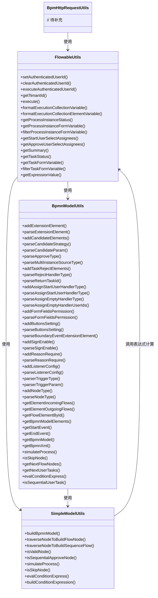
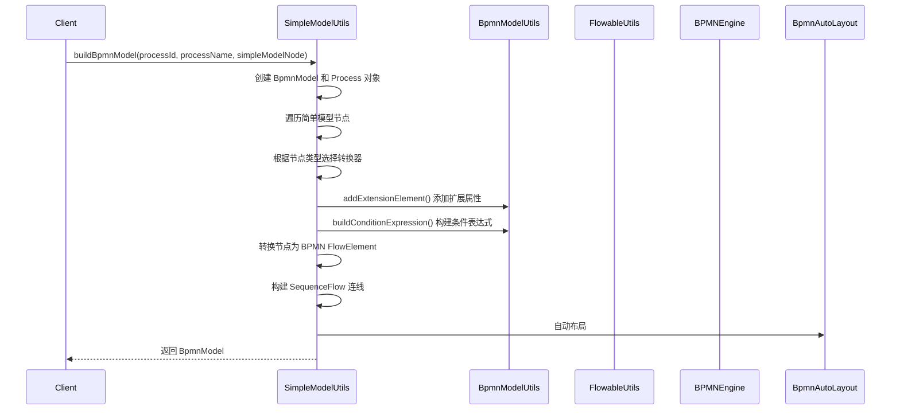
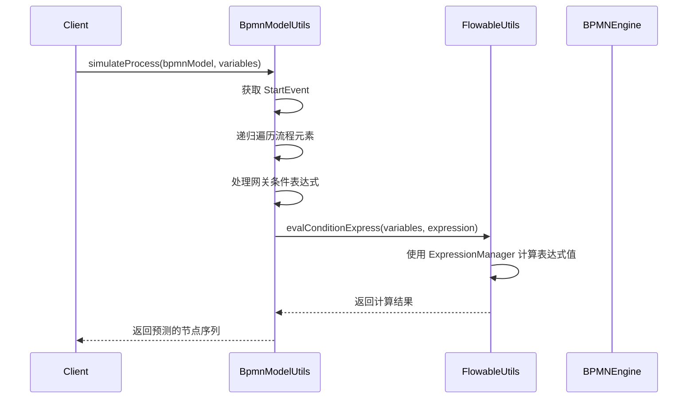

# util_10_flowable_utils 模块文档

## 概述

`util_10_flowable_utils` 模块是 BPM 模块中基于 Flowable 引擎的核心工具包，提供了一系列与流程引擎相关的实用工具类。该模块主要包含四个核心工具类，分别负责不同的功能领域：

- **FlowableUtils**: Flowable 引擎相关的通用工具方法
- **BpmnModelUtils**: BPMN 模型操作与解析工具
- **SimpleModelUtils**: 仿钉钉流程模型到 BPMN 模型的转换工具
- **BpmHttpRequestUtils**: HTTP 请求相关工具（待补充）

这些工具类共同构成了 BPM 模块与 Flowable 引擎交互的基础设施，支持流程定义、流程实例、任务处理、表达式计算等核心功能。

## 模块架构



## 核心组件详解

### 1. FlowableUtils

**文件路径**: `yudao-module-bpm/src/main/java/cn/iocoder/yudao/module/bpm/framework/flowable/core/util/FlowableUtils.java`

FlowableUtils 是 Flowable 引擎相关的工具类，提供了用户身份管理、租户上下文处理、流程实例和任务操作、表达式计算等核心功能。

#### 1.1 用户身份管理

| 方法 | 描述 |
|------|------|
| `setAuthenticatedUserId(Long userId)` | 设置当前认证用户 ID |
| `clearAuthenticatedUserId()` | 清除当前认证用户 ID |
| `executeAuthenticatedUserId(Long userId, Callable<V> callable)` | 在指定用户 ID 上下文中执行代码块 |

这些方法利用 Flowable 的 `Authentication` 类来设置和清除当前操作用户，确保流程引擎操作的正确性。

#### 1.2 租户上下文处理

| 方法 | 描述 |
|------|------|
| `getTenantId()` | 获取当前租户 ID |
| `execute(String tenantIdStr, Runnable runnable)` | 在指定租户上下文中执行任务 |
| `execute(String tenantIdStr, Callable<V> callable)` | 在指定租户上下文中执行带返回值的任务 |

这些方法实现了多租户支持，通过 `TenantContextHolder` 和 `TenantUtils` 来管理租户上下文，确保流程操作在正确的租户上下文中执行。

#### 1.3 执行上下文工具

```java
// 格式化多实例的 collectionVariable 变量（如：userTask1_assignees）
public static String formatExecutionCollectionVariable(String activityId)

// 格式化多实例的 collectionElementVariable 变量（如：userTask1_assignee）
public static String formatExecutionCollectionElementVariable(String activityId)
```

这些方法用于处理 Flowable 多实例（并签、或签）的变量命名规范。

#### 1.4 流程实例工具

| 方法 | 描述 |
|------|------|
| `getProcessInstanceStatus(ProcessInstance)` | 获取流程实例状态 |
| `getProcessInstanceStatus(HistoricProcessInstance)` | 获取历史流程实例状态 |
| `getProcessInstanceReason(HistoricProcessInstance)` | 获取流程实例的审批原因 |
| `getProcessInstanceFormVariable(ProcessInstance)` | 获取流程实例的表单数据（过滤系统字段） |
| `filterProcessInstanceFormVariable(Map<String, Object>)` | 过滤流程实例的表单数据 |
| `getStartUserSelectAssignees(ProcessInstance)` | 获取发起用户选择的审批人 |
| `getApproveUserSelectAssignees(ProcessInstance)` | 获取审批用户选择的下一个节点审批人 |
| `getSummary(BpmProcessDefinitionInfoDO, Map<String, Object>)` | 根据流程定义和表单数据生成摘要 |

这些方法提供了对流程实例数据的便捷访问，特别是表单数据的过滤和摘要生成功能。

#### 1.5 任务工具

| 方法 | 描述 |
|------|------|
| `getTaskStatus(TaskInfo)` | 获取任务状态 |
| `getTaskReason(TaskInfo)` | 获取任务审批原因 |
| `getTaskSignPicUrl(TaskInfo)` | 获取任务签名图片 URL |
| `getTaskFormVariable(TaskInfo)` | 获取任务表单数据（过滤系统字段） |
| `filterTaskFormVariable(Map<String, Object>)` | 过滤任务表单数据 |

这些方法提供了对任务数据的便捷访问，支持任务状态、原因、签名等元数据的获取。

#### 1.6 表达式计算

```java
// 从 VariableContainer 中计算表达式的值
public static Object getExpressionValue(VariableContainer variableContainer, String expressionString)

// 从 Map 中计算表达式的值
public static Object getExpressionValue(Map<String, Object> variable, String expressionString)
```

这些方法利用 Flowable 的 ExpressionManager 来解析和计算表达式，支持在流程变量上下文中执行 SpEL 表达式。

### 2. BpmnModelUtils

**文件路径**: `yudao-module-bpm/src/main/java/cn/iocoder/yudao/module/bpm/framework/flowable/core/util/BpmnModelUtils.java`

BpmnModelUtils 是 BPMN 模型操作工具类，提供了对 BPMN 模型的解析、修改、遍历和预测等功能。

#### 2.1 扩展元素操作

| 方法 | 描述 |
|------|------|
| `addExtensionElement(FlowElement, String, String)` | 为节点添加扩展元素 |
| `addExtensionElement(FlowElement, String, Integer)` | 为节点添加整数扩展元素 |
| `addExtensionElementJson(FlowElement, String, Object)` | 为节点添加 JSON 扩展元素 |
| `addExtensionElement(FlowElement, String, Map<String, String>)` | 为节点添加带属性的扩展元素 |
| `parseExtensionElement(FlowElement, String)` | 解析扩展元素的值 |

这些方法用于在 BPMN 节点上存储自定义属性，通过扩展元素（ExtensionElement）实现。

#### 2.2 候选人策略

| 方法 | 描述 |
|------|------|
| `addCandidateElements(Integer, String, FlowElement)` | 添加候选人策略和参数 |
| `parseCandidateStrategy(FlowElement)` | 解析候选人策略 |
| `parseCandidateParam(FlowElement)` | 解析候选人参数 |

这些方法用于处理用户任务的候选人分配策略，支持自定义的候选人选择逻辑。

#### 2.3 审批相关配置

| 方法 | 描述 |
|------|------|
| `parseApproType(FlowElement)` | 解析审批类型 |
| `parseMultiInstanceSourceType(FlowElement)` | 解析子流程多实例来源类型 |
| `addTaskRejectElements(RejectHandler, UserTask)` | 添加任务拒绝处理配置 |
| `parseRejectHandlerType(FlowElement)` | 解析拒绝处理类型 |
| `parseReturnTaskId(FlowElement)` | 解析拒绝返回任务 ID |
| `addAssignStartUserHandlerType(Integer, UserTask)` | 添加审批人与发起人相同时的处理类型 |
| `parseAssignStartUserHandlerType(FlowElement)` | 解析该处理类型 |
| `parseAssignEmptyHandlerType(FlowElement)` | 解析审批人为空时的处理类型 |
| `parseAssignEmptyHandlerUserIds(FlowElement)` | 解析审批人为空时的用户 ID 列表 |

这些方法处理了各种复杂的审批场景配置，包括拒绝处理、发起人处理、空处理等。

#### 2.4 表单权限和按钮配置

| 方法 | 描述 |
|------|------|
| `addFormFieldsPermission(List<Map<String, String>>, FlowElement)` | 添加表单字段权限 |
| `parseFormFieldsPermission(BpmnModel, String)` | 解析表单字段权限 |
| `addButtonsSetting(List<OperationButtonSetting>, UserTask)` | 添加操作按钮设置 |
| `parseButtonsSetting(BpmnModel, String)` | 解析操作按钮设置 |

这些方法实现了表单字段级别的权限控制和任务操作按钮的自定义配置。

#### 2.5 边界事件和节点类型

| 方法 | 描述 |
|------|------|
| `parseBoundaryEventExtensionElement(BoundaryEvent, String)` | 解析边界事件扩展元素 |
| `addSignEnable(Boolean, FlowElement)` | 添加签名启用配置 |
| `parseSignEnable(BpmnModel, String)` | 解析签名启用配置 |
| `addReasonRequire(Boolean, FlowElement)` | 添加原因必填配置 |
| `parseReasonRequire(BpmnModel, String)` | 解析原因必填配置 |
| `addListenerConfig(FlowableListener, ListenerHandler)` | 添加监听器配置 |
| `parseListenerConfig(Expression)` | 解析监听器配置 |
| `parserTriggerType(FlowElement)` | 解析触发器类型 |
| `parserTriggerParam(FlowElement)` | 解析触发器参数 |
| `addNodeType(Integer, FlowElement)` | 添加节点类型 |
| `parseNodeType(FlowElement)` | 解析节点类型 |

这些方法处理了边界事件、签名、原因、监听器、触发器等高级 BPMN 特性。

#### 2.6 模型查找和遍历

| 方法 | 描述 |
|------|------|
| `getElementIncomingFlows(FlowElement)` | 获取节点的入口连线 |
| `getElementOutgoingFlows(FlowElement)` | 获取节点的出口连线 |
| `getFlowElementById(BpmnModel, String)` | 根据 ID 获取流程元素 |
| `getBpmnModelElements(BpmnModel, Class<T>)` | 获取指定类型的元素列表 |
| `getStartEvent(BpmnModel)` | 获取开始事件 |
| `getEndEvent(BpmnModel)` | 获取结束事件 |
| `getBpmnModel(byte[])` | 从字节数组创建 BPMN 模型 |
| `getBpmnXml(BpmnModel)` | 将 BPMN 模型转换为 XML |

这些方法提供了对 BPMN 模型的基本操作，包括元素查找、模型转换等。

#### 2.7 流程预测和模拟

| 方法 | 描述 |
|------|------|
| `simulateProcess(BpmnModel, Map<String, Object>)` | 模拟流程执行路径 |
| `isSkipNode(FlowElement, Map<String, Object>)` | 判断节点是否应该被跳过 |
| `getNextFlowNodes(FlowElement, BpmnModel, Map<String, Object>)` | 获取下一个可能的节点 |
| `getNextUserTasks(FlowElement, BpmnModel, Map<String, Object>)` | 获取下一个用户任务列表 |
| `evalConditionExpress(Map<String, Object>, String)` | 评估条件表达式 |
| `isSequentialUserTask(FlowElement)` | 判断用户任务是否为串行 |

这些方法实现了流程预测功能，可以根据当前变量预测流程的执行路径，支持条件表达式的求值。

### 3. SimpleModelUtils

**文件路径**: `yudao-module-bpm/src/main/java/cn/iocoder/yudao/module/bpm/framework/flowable/core/util/SimpleModelUtils.java`

SimpleModelUtils 提供了将仿钉钉流程模型（简单模型）转换为标准 BPMN 模型的功能，支持流程的可视化设计。

#### 3.1 模型转换

```java
// 将简单模型转换为 BPMN 模型
public static BpmnModel buildBpmnModel(String processId, String processName, BpmSimpleModelNodeVO simpleModelNode)
```

这是核心转换方法，将前端传递的简单模型数据结构（JSON 格式）转换为 Flowable 可识别的 BPMN 模型。转换过程包括：
1. 创建 BpmnModel 和 Process 对象
2. 遍历简单模型节点，转换为 BPMN FlowNode 元素
3. 构建节点之间的 Sequence Flow 连线
4. 自动布局

#### 3.2 节点遍历和连线构建

| 方法 | 描述 |
|------|------|
| `traverseNodeToBuildFlowNode(BpmSimpleModelNodeVO, Process)` | 遍历节点，构建 FlowNode 元素 |
| `traverseNodeToBuildSequenceFlow(Process, BpmSimpleModelNodeVO, String)` | 遍历节点，构建 SequenceFlow 元素 |
| `traverseNormalNodeToBuildSequenceFlow(Process, BpmSimpleModelNodeVO, String)` | 遍历普通节点，构建连线 |
| `traverseBranchNodeToBuildSequenceFlow(Process, BpmSimpleModelNodeVO, String)` | 遍历分支节点，构建连线 |
| `buildAttachNodeSequenceFlow(String, String, String)` | 构建有附加节点的连线 |
| `buildBpmnSequenceFlow(String, String)` | 构建 SequenceFlow |

这些方法实现了简单模型到 BPMN 模型的完整转换逻辑，包括普通节点和分支节点的不同处理策略。

#### 3.3 节点转换器

SimpleModelUtils 使用策略模式，为不同类型的节点提供专门的转换器：

| 转换器 | 对应节点类型 |
|--------|-------------|
| `StartNodeConvert` | 开始节点 |
| `EndNodeConvert` | 结束节点 |
| `StartUserNodeConvert` | 发起人节点 |
| `ApproveNodeConvert` | 审批节点 |
| `CopyNodeConvert` | 抄送节点 |
| `TransactorNodeConvert` | 事务节点 |
| `DelayTimerNodeConvert` | 延迟定时器节点 |
| `TriggerNodeConvert` | 触发器节点 |
| `ConditionBranchNodeConvert` | 条件分支节点 |
| `ParallelBranchNodeConvert` | 并行分支节点 |
| `InclusiveBranchNodeConvert` | 包容分支节点 |
| `RouteBranchNodeConvert` | 路由分支节点 |
| `ChildProcessConvert` | 子流程节点 |

每个转换器负责将简单模型节点转换为对应的 BPMN 元素，并设置相关的属性和扩展元素。

#### 3.4 条件表达式构建

| 方法 | 描述 |
|------|------|
| `buildConditionExpression(ConditionSetting)` | 构建条件表达式 |
| `buildConditionExpression(RouterSetting)` | 构建路由条件表达式 |
| `buildConditionExpression(Integer, String, ConditionGroups)` | 构建条件表达式（通用版） |

这些方法将简单模型中的条件设置转换为 BPMN 的条件表达式，支持表达式和规则两种条件类型。

#### 3.5 流程预测

```java
// 模拟简单模型的流程执行路径
public static List<BpmSimpleModelNodeVO> simulateProcess(BpmSimpleModelNodeVO rootNode, Map<String, Object> variables)
```

该方法实现了简单模型的流程预测功能，可以根据当前变量预测流程的执行路径。

### 4. BpmHttpRequestUtils

**文件路径**: `yudao-module-bpm/src/main/java/cn/iocoder/yudao/module/bpm/framework/flowable/core/util/BpmHttpRequestUtils.java`

该工具类用于处理 BPMN 流程中的 HTTP 请求相关操作，目前文档中未提供具体实现细节。

## 组件关系

### 4.1 依赖关系

```mermaid
graph TD
    FlowableUtils -->|使用| TenantUtils
    FlowableUtils -->|使用| JsonUtils
    FlowableUtils -->|使用| CollectionUtils
    FlowableUtils -->|使用| MapUtil
    FlowableUtils -->|使用| StrUtil
    FlowableUtils -->|使用| ObjectUtil
    FlowableUtils -->|使用| SpringUtil
    FlowableUtils -->|调用| BpmnModelUtils
    FlowableUtils -->|调用| SimpleModelUtils
    
    BpmnModelUtils -->|使用| JsonUtils
    BpmnModelUtils -->|使用| CollUtil
    BpmnModelUtils -->|使用| NumberUtils
    BpmnModelUtils -->|使用| StrUtil
    BpmnModelUtils -->|使用| Assert
    BpmnModelUtils -->|使用| Optional
    BpmnModelUtils -->|使用| Convert
    BpmnModelUtils -->|使用| IdUtil
    BpmnModelUtils -->|调用| FlowableUtils.getExpressionValue()
    
    SimpleModelUtils -->|使用| JsonUtils
    SimpleModelUtils -->|使用| CollUtil
    SimpleModelUtils -->|使用| StrUtil
    SimpleModelUtils -->|使用| Assert
    SimpleModelUtils -->|使用| BooleanUtil
    SimpleModelUtils -->|使用| IdUtil
    SimpleModelUtils -->|调用| BpmnModelUtils.evalConditionExpress()
    SimpleModelUtils -->|调用| BpmnModelUtils.buildConditionExpression()
```

### 4.2 协作流程

#### 4.2.1 简单模型转 BPMN 模型



#### 4.2.2 流程预测



## 使用场景

### 5.1 流程定义管理

BpmnModelUtils 和 SimpleModelUtils 协同工作，支持流程定义的可视化设计和保存：
- 前端通过简单模型描述流程结构
- SimpleModelUtils 将简单模型转换为 BPMN 模型
- BpmnModelUtils 处理 BPMN 模型的扩展属性和复杂配置
- 转换后的 BPMN 模型保存到 Flowable 引擎

### 5.2 流程实例执行

FlowableUtils 在流程实例执行过程中提供辅助：
- 设置和清除认证用户 ID
- 管理租户上下文
- 获取流程实例和任务的数据
- 计算表达式条件

### 5.3 流程预测和模拟

BpmnModelUtils 和 SimpleModelUtils 都提供了流程预测功能：
- 在设计阶段预测流程执行路径
- 在任务处理阶段预测下一个可能的节点
- 支持条件表达式的求值

### 5.4 表单和摘要展示

FlowableUtils 提供了表单数据过滤和摘要生成功能：
- 过滤流程实例和任务中的系统字段
- 根据表单配置生成流程摘要
- 支持自定义摘要配置

## 总结

util_10_flowable_utils 模块是 BPM 模块的核心工具包，为 Flowable 引擎的集成提供了全面的工具支持。四个工具类各司其职：

- **FlowableUtils**: 提供 Flowable 引擎相关的通用工具，包括用户身份管理、租户上下文、流程实例和任务操作、表达式计算等。
- **BpmnModelUtils**: 提供 BPMN 模型的操作工具，包括扩展元素管理、候选人策略、审批配置、模型遍历和流程预测等。
- **SimpleModelUtils**: 提供简单模型到 BPMN 模型的转换工具，支持可视化流程设计的完整流程。
- **BpmHttpRequestUtils**: 提供 HTTP 请求相关的工具（待补充）。

这些工具类共同构成了 BPM 模块与 Flowable 引擎交互的基础设施，支持了从流程设计、定义、执行到预测的全流程功能。
