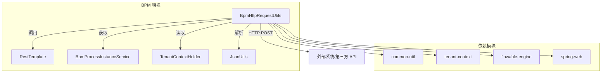
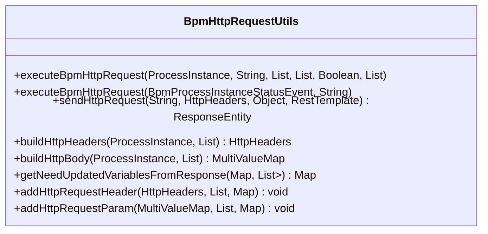
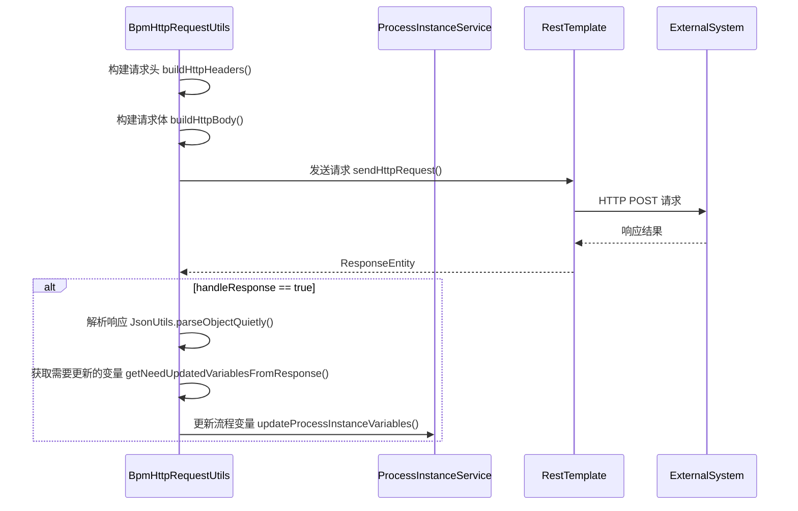
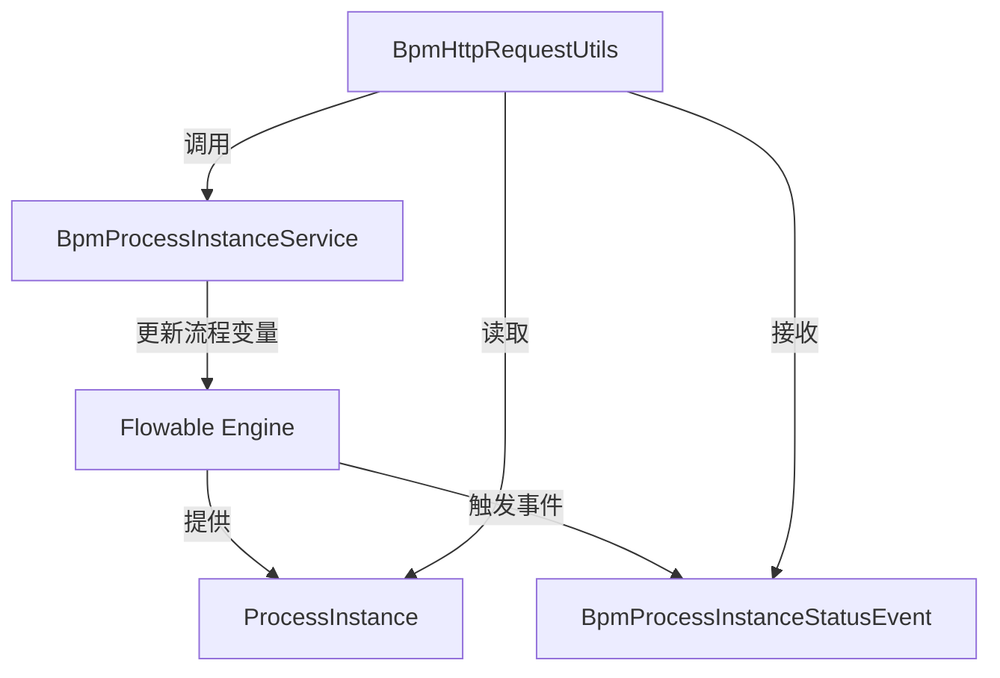
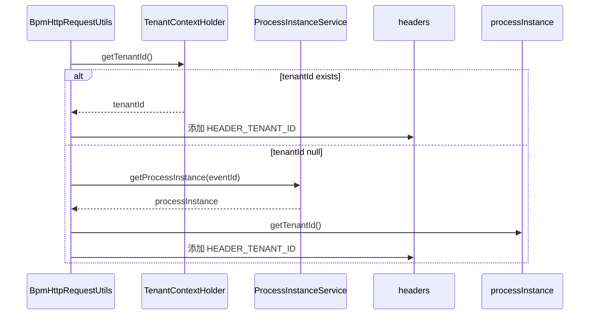
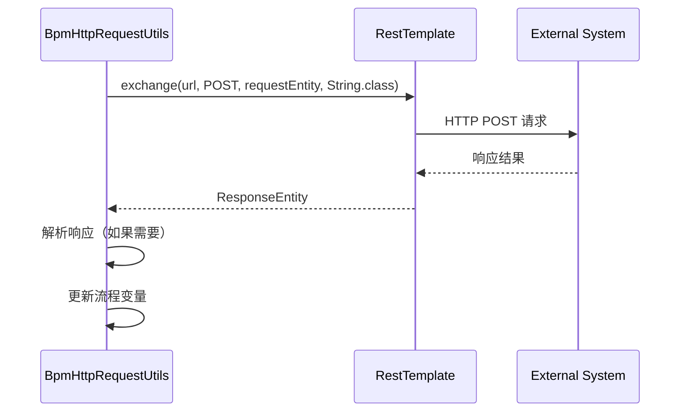
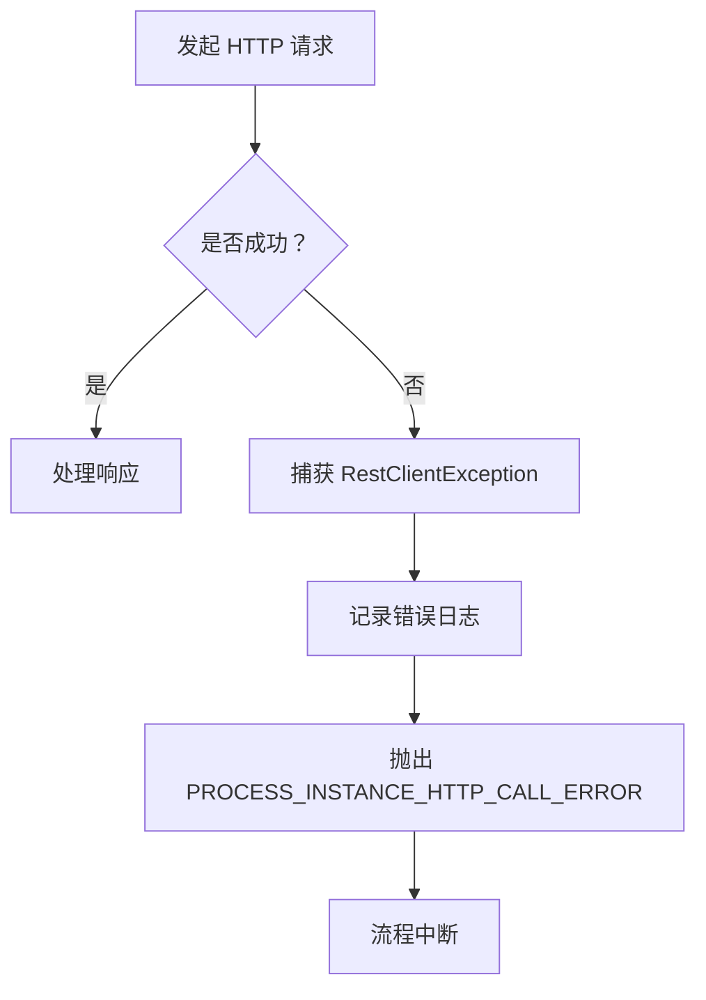

# util_10_http_request_utils 模块文档

## 1. 模块概述

`util_10_http_request_utils` 模块是 BPM（业务流程管理）框架中的核心工具类，主要负责在工作流引擎执行过程中发起 HTTP 请求，实现流程与外部系统的集成。该模块位于 `yudao-module-bpm` 模块的 `framework/flowable/core/util` 包下，核心类为 `BpmHttpRequestUtils`。

### 1.1 设计目标

- **流程集成**：在流程执行过程中，通过 HTTP 请求与外部系统（如支付系统、通知系统、第三方 API 等）进行交互。
- **变量传递**：将流程变量作为请求参数传递给外部系统，并将外部系统的响应结果更新回流程变量。
- **租户隔离**：在多租户环境下，自动携带租户 ID 请求头，确保请求的租户上下文正确。
- **错误处理**：统一处理 HTTP 请求异常，并抛出标准化的业务异常。

### 1.2 模块定位



## 2. 核心类：BpmHttpRequestUtils

### 2.1 类结构概览



### 2.2 方法详解

#### 2.2.1 `executeBpmHttpRequest` - 主入口方法

**方法签名**：
```java
public static void executeBpmHttpRequest(
    ProcessInstance processInstance,
    String url,
    List<BpmSimpleModelNodeVO.HttpRequestParam> headerParams,
    List<BpmSimpleModelNodeVO.HttpRequestParam> bodyParams,
    Boolean handleResponse,
    List<KeyValue<String, String>> response
)
```

**功能描述**：
1. 构建 HTTP 请求头（包含租户 ID、流程变量等）
2. 构建 HTTP 请求体（包含固定值或从流程变量获取的值）
3. 使用 `RestTemplate` 发起 POST 请求
4. 如果 `handleResponse` 为 true，则解析响应结果并更新流程变量

**参数说明**：

| 参数 | 类型 | 说明 |
|------|------|------|
| `processInstance` | `ProcessInstance` | Flowable 流程实例对象 |
| `url` | `String` | 目标 HTTP 地址 |
| `headerParams` | `List<HttpRequestParam>` | 请求头参数列表 |
| `bodyParams` | `List<HttpRequestParam>` | 请求体参数列表 |
| `handleResponse` | `Boolean` | 是否处理响应结果 |
| `response` | `List<KeyValue<String, String>>` | 响应映射配置（key: 流程变量名, value: 响应数据中的字段名） |

**执行流程**：


#### 2.2.2 `executeBpmHttpRequest(BpmProcessInstanceStatusEvent, String)` - 事件驱动版本

**功能描述**：
用于在流程状态变更事件（如流程启动、结束）时触发 HTTP 请求。该方法主要用于异步通知外部系统流程状态变化。

**特点**：
- 请求体为 JSON 格式（注释部分展示了可发送的字段）
- 自动处理租户 ID 的传递
- 不处理响应结果（one-way call）

#### 2.2.3 `sendHttpRequest` - HTTP 请求发送

**功能描述**：
封装 `RestTemplate` 的调用逻辑，包含统一的异常处理和日志记录。

**异常处理**：
- 捕获 `RestClientException` 异常
- 记录错误日志
- 抛出 `PROCESS_INSTANCE_HTTP_CALL_ERROR` 业务异常

#### 2.2.4 `buildHttpHeaders` - 构建请求头

**构建逻辑**：
1. 添加租户 ID 头 `HEADER_TENANT_ID`（来自流程实例的 tenantId）
2. 根据 `headerParams` 配置添加自定义请求头
   - `FIXED_VALUE`：直接添加固定值
   - `FROM_FORM`：从流程变量中获取值

#### 2.2.5 `buildHttpBody` - 构建请求体

**构建逻辑**：
1. 从流程变量中获取数据
2. 根据 `bodyParams` 配置添加参数
3. 自动添加 `processInstanceId`（如果不存在）
4. 使用 `LinkedMultiValueMap` 构建表单格式数据

#### 2.2.6 `getNeedUpdatedVariablesFromResponse` - 解析响应并提取需要更新的变量

**功能**：
将外部系统响应中的特定字段映射到流程变量中。

**示例**：
```java
// response 配置示例
List<KeyValue<String, String>> response = new ArrayList<>();
response.add(new KeyValue<>("orderStatus", "data.orderStatus")); // 将响应 data.orderStatus 映射到流程变量 orderStatus
```

#### 2.2.7 `addHttpRequestHeader` / `addHttpRequestParam` - 添加请求参数

**功能**：
将配置中的 HTTP 参数（固定值或从流程变量获取）添加到请求头或请求体中。

**参数类型说明**：
```mermaid
graph LR
    A[HttpRequestParam] --> B{type}
    B -->|1(FIXED_VALUE)| C[使用 value 字段的固定值]
    B -->|2(FROM_FORM)| D[从 processVariables 获取 value 字段的值]
```

## 3. 相关依赖组件

### 3.1 枚举：BpmHttpRequestParamTypeEnum

```java
public enum BpmHttpRequestParamTypeEnum implements ArrayValuable<Integer> {
    FIXED_VALUE(1, "固定值"),   // 直接使用 value 字段的值
    FROM_FORM(2, "表单");       // 从流程变量中获取 value 字段的值作为参数
}
```

### 3.2 内部类：BpmSimpleModelNodeVO.HttpRequestParam

```java
@Data
@Schema(description = "HTTP 请求参数设置")
public static class HttpRequestParam {
    @Schema(description = "值类型", example = "1")
    @InEnum(BpmHttpRequestParamTypeEnum.class)
    private Integer type;  // 1: FIXED_VALUE, 2: FROM_FORM
    
    @Schema(description = "键", example = "xxx")
    private String key;    // 参数名（如 Authorization, userId）
    
    @Schema(description = "值", example = "xxx")
    private String value;  // 参数值（固定值或流程变量名）
}
```

### 3.3 事件：BpmProcessInstanceStatusEvent

```java
@Data
public class BpmProcessInstanceStatusEvent extends ApplicationEvent {
    private String id;              // 流程实例 ID
    private String processDefinitionKey; // 流程定义 key
    private Integer status;         // 流程状态
    private String reason;          // 结束原因
    private String businessKey;     // 业务标识
}
```

## 4. 使用场景示例

### 4.1 简单 HTTP 请求调用

```java
// 在流程节点中调用
List<HttpRequestParam> headerParams = new ArrayList<>();
headerParams.add(new HttpRequestParam(BpmHttpRequestParamTypeEnum.FIXED_VALUE.getType(), 
    "Authorization", "Bearer token123"));

List<HttpRequestParam> bodyParams = new ArrayList<>();
bodyParams.add(new HttpRequestParam(BpmHttpRequestParamTypeEnum.FROM_FORM.getType(),
    "userId", "currentUserId"));

List<KeyValue<String, String>> response = new ArrayList<>();
response.add(new KeyValue<>("result", "data.result"));

BpmHttpRequestUtils.executeBpmHttpRequest(
    processInstance,
    "https://api.example.com/process",
    headerParams,
    bodyParams,
    true,
    response
);
```

### 4.2 流程状态变更通知

```java
// 监听流程事件
@EventListener
public void handleProcessInstanceEvent(BpmProcessInstanceStatusEvent event) {
    BpmHttpRequestUtils.executeBpmHttpRequest(event, "https://webhook.example.com/process-status");
}
```

## 5. 模块交互关系

### 5.1 与 Flowable 引擎的交互



### 5.2 与租户上下文的交互



### 5.3 与外部系统的交互



## 6. 异常处理



**异常码**：`PROCESS_INSTANCE_HTTP_CALL_ERROR`

## 7. 配置说明

在 BPM 流程定义中，HTTP 请求节点通过 `BpmSimpleModelNodeVO` 配置，包含：

- **URL**：请求目标地址
- **Header Params**：请求头参数列表（键值对 + 类型）
- **Body Params**：请求体参数列表（键值对 + 类型）
- **Handle Response**：是否处理响应
- **Response Mapping**：响应字段到流程变量的映射（key-value 对）

## 8. 依赖模块

| 模块 | 用途 |
|------|------|
| `common-util` | 提供 `JsonUtils`、`SpringUtils`、`CollUtil`、`StrUtil` 等工具类 |
| `tenant-context` | 提供租户上下文管理 `TenantContextHolder` |
| `flowable-engine` | 提供 Flowable 引擎相关的 `ProcessInstance`、`RestTemplate` 等 |
| `spring-web` | 提供 `HttpHeaders`、`HttpEntity`、`ResponseEntity` 等 HTTP 相关类 |
| `bpm-api` | 提供 `BpmProcessInstanceService`、`BpmProcessInstanceStatusEvent` 等 BPM 相关接口和事件 |

## 9. 总结

`BpmHttpRequestUtils` 是 BPM 模块中实现流程与外部系统集成的关键工具类，通过统一的 HTTP 请求封装，使得流程节点能够方便地调用外部服务，并支持将外部服务的响应结果回写到流程变量中，实现复杂业务流程的自动化处理。其设计充分考虑了租户隔离、异常处理和配置灵活性，是 Flowable 工作流引擎在企业级应用中的重要扩展。