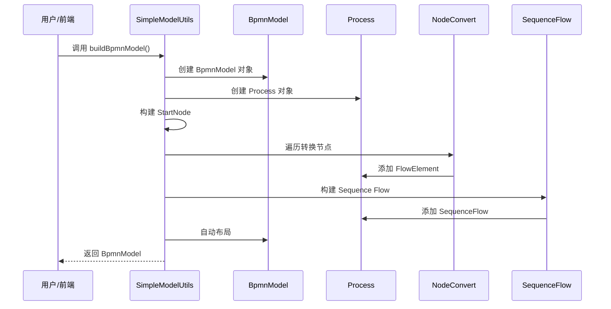
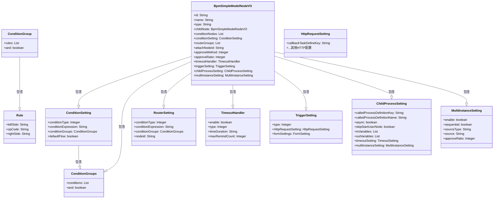
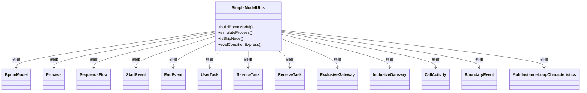

# util_10_simple_model_utils 模块文档

## 模块概述

`util_10_simple_model_utils` 是 BPM 模块中用于处理仿钉钉/飞书简易流程模型的核心工具模块。该模块主要负责将前端传递的简易流程模型数据结构（`BpmSimpleModelNodeVO`）转换为标准的 BPMN 2.0 模型，并提供流程模拟、条件表达式求值等辅助功能。

该模块位于 `yudao-module-bpm` 模块下，路径为：
```
yudao-module-bpm/src/main/java/cn/iocoder/yudao/module/bpm/framework/flowable/core/util/
```

## 核心功能

1. **简易模型转换**：将前端定义的简易流程节点结构转换为完整的 BPMN 模型
2. **节点类型支持**：支持多种流程节点类型，包括开始节点、结束节点、审批节点、分支节点等
3. **流程连线构建**：自动构建节点间的 Sequence Flow 连接
4. **流程模拟**：支持根据变量数据模拟流程执行路径
5. **条件表达式求值**：支持动态条件表达式的解析和求值

## 模块架构

```mermaid
classDiagram
    class SimpleModelUtils {
        +buildBpmnModel(String, String, BpmSimpleModelNodeVO): BpmnModel
        +simulateProcess(BpmSimpleModelNodeVO, Map): List<BpmSimpleModelNodeVO>
        +isSkipNode(BpmSimpleModelNodeVO, Map): boolean
        +evalConditionExpress(Map, ConditionSetting): boolean
        +NodeConvert interface
        +StartNodeConvert
        +EndNodeConvert
        +StartUserNodeConvert
        +ApproveNodeConvert
        +CopyNodeConvert
        +TransactorNodeConvert
        +DelayTimerNodeConvert
        +TriggerNodeConvert
        +ConditionBranchNodeConvert
        +ParallelBranchNodeConvert
        +InclusiveBranchNodeConvert
        +RouteBranchNodeConvert
        +ChildProcessConvert
    }

    class BpmSimpleModelNodeVO {
        +id: String
        +name: String
        +type: String
        +childNode: BpmSimpleModelNodeVO
        +conditionNodes: List<BpmSimpleModelNodeVO>
        +conditionSetting: ConditionSetting
        +routerGroups: List<RouterSetting>
        +attachNodeId: String
        +approveMethod: Integer
        +approveRatio: Integer
        +timeoutHandler: TimeoutHandler
        +triggerSetting: TriggerSetting
        +childProcessSetting: ChildProcessSetting
        +multiInstanceSetting: MultiInstanceSetting
    }

    class BpmnModel {
        +targetNamespace: String
        +processes: List<Process>
    }

    class Process {
        +id: String
        +name: String
        +executable: boolean
        +flowElements: List<FlowElement>
    }

    class FlowElement {
        +id: String
        +name: String
    }

    class SequenceFlow {
        +sourceId: String
        +targetId: String
        +conditionExpression: String
    }

    SimpleModelUtils --> BpmSimpleModelNodeVO : 输入模型
    SimpleModelUtils --> BpmnModel : 输出模型
    SimpleModelUtils --> Process : 创建流程
    SimpleModelUtils --> FlowElement : 添加元素
    SimpleModelUtils --> SequenceFlow : 构建连线
    BpmnModel --|contains| Process
    Process --|contains| FlowElement
    Process --|contains| SequenceFlow
    StartNodeConvert --|implements| NodeConvert
    EndNodeConvert --|implements| NodeConvert
    StartUserNodeConvert --|implements| NodeConvert
    ApproveNodeConvert --|implements| NodeConvert
    CopyNodeConvert --|implements| NodeConvert
    TransactorNodeConvert --|implements| NodeConvert
    DelayTimerNodeConvert --|implements| NodeConvert
    TriggerNodeConvert --|implements| NodeConvert
    ConditionBranchNodeConvert --|implements| NodeConvert
    ParallelBranchNodeConvert --|implements| NodeConvert
    InclusiveBranchNodeConvert --|implements| NodeConvert
    RouteBranchNodeConvert --|implements| NodeConvert
    ChildProcessConvert --|implements| NodeConvert
```

## 核心组件说明

### 1. SimpleModelUtils 主工具类

`SimpleModelUtils` 是该模块的核心工具类，提供了将简易流程模型转换为 BPMN 模型的主要方法。

#### 主要方法

| 方法签名 | 说明 |
|----------|------|
| `buildBpmnModel(String processId, String processName, BpmSimpleModelNodeVO simpleModelNode)` | 将简易流程模型转换为 BPMN 模型，是核心入口方法 |
| `simulateProcess(BpmSimpleModelNodeVO rootNode, Map<String, Object> variables)` | 根据变量数据模拟流程执行路径，用于流程预览 |
| `isSkipNode(BpmSimpleModelNodeVO currentNode, Map<String, Object> variables)` | 判断节点是否被跳过（基于 skipExpression） |
| `evalConditionExpress(Map<String, Object> variables, BpmSimpleModelNodeVO.ConditionSetting conditionSetting)` | 求值条件表达式 |

#### 转换流程

`buildBpmnModel` 方法的转换流程如下：



### 2. NodeConvert 接口及实现类

`NodeConvert` 接口定义了节点转换的规范，每个具体的节点类型都有对应的实现类。

#### NodeConvert 接口

```java
private interface NodeConvert {
    default List<? extends FlowElement> convertList(BpmSimpleModelNodeVO node);
    default FlowElement convert(BpmSimpleModelNodeVO node);
    BpmSimpleModelNodeTypeEnum getType();
}
```

#### 节点类型转换器

| 转换器类 | 节点类型 | 说明 |
|----------|----------|------|
| `StartNodeConvert` | START_NODE | 开始事件节点 |
| `EndNodeConvert` | END_NODE | 结束事件节点 |
| `StartUserNodeConvert` | START_USER_NODE | 发起人节点（UserTask） |
| `ApproveNodeConvert` | APPROVE_NODE | 审批节点（UserTask，支持超时、多实例等） |
| `TransactorNodeConvert` | TRANSACTOR_NODE | 事务节点（继承自 ApproveNodeConvert） |
| `CopyNodeConvert` | COPY_NODE | 抄送节点（ServiceTask） |
| `DelayTimerNodeConvert` | DELAY_TIMER_NODE | 延迟定时器节点（ReceiveTask + BoundaryEvent） |
| `TriggerNodeConvert` | TRIGGER_NODE | 触发器节点（ReceiveTask + ServiceTask） |
| `ConditionBranchNodeConvert` | CONDITION_BRANCH_NODE | 条件分支节点（ExclusiveGateway） |
| `ParallelBranchNodeConvert` | PARALLEL_BRANCH_NODE | 并行分支节点（InclusiveGateway + 聚合网关） |
| `InclusiveBranchNodeConvert` | INCLUSIVE_BRANCH_NODE | 包容分支节点（InclusiveGateway + 聚合网关） |
| `RouteBranchNodeConvert` | ROUTER_BRANCH_NODE | 路由分支节点（ExclusiveGateway + 路由设置） |
| `ChildProcessConvert` | CHILD_PROCESS | 子流程节点（CallActivity） |

### 3. BpmSimpleModelNodeVO 数据结构

`BpmSimpleModelNodeVO` 是前端传递的简易流程模型数据结构，采用树形结构表示整个流程。

#### 核心属性

| 属性名 | 类型 | 说明 |
|--------|------|------|
| `id` | String | 节点唯一标识 |
| `name` | String | 节点名称 |
| `type` | String | 节点类型（枚举值） |
| `childNode` | BpmSimpleModelNodeVO | 子节点（树形结构） |
| `conditionNodes` | List<BpmSimpleModelNodeVO> | 条件分支的子节点列表 |
| `conditionSetting` | ConditionSetting | 条件设置 |
| `routerGroups` | List<RouterSetting> | 路由分支设置 |
| `attachNodeId` | String | 附加节点 ID（用于触发器等） |
| `approveMethod` | Integer | 审批方式（顺序、随机、比例等） |
| `approveRatio` | Integer | 通过比例（当审批方式为比例时） |
| `timeoutHandler` | TimeoutHandler | 超时处理设置 |
| `triggerSetting` | TriggerSetting | 触发器设置 |
| `childProcessSetting` | ChildProcessSetting | 子流程设置 |
| `multiInstanceSetting` | MultiInstanceSetting | 多实例设置 |

#### 嵌套数据结构



## 使用场景

### 1. 流程定义创建

当用户在流程设计器中完成流程设计后，前端将流程模型以 JSON 形式发送到后端，后端通过 `SimpleModelUtils.buildBpmnModel()` 方法将简易模型转换为标准的 BPMN 模型，保存到数据库或部署到 Flowable 引擎。

```java
// 示例：构建 BPMN 模型
BpmnModel bpmnModel = SimpleModelUtils.buildBpmnModel(
    "process_001", 
    "请假审批流程", 
    rootNode
);
```

### 2. 流程模拟预览

在设计流程时，用户可能需要预览流程的执行路径。`SimpleModelUtils.simulateProcess()` 方法可以根据给定的变量数据模拟流程执行，返回经过的节点列表。

```java
// 示例：模拟流程执行
List<BpmSimpleModelNodeVO> resultNodes = SimpleModelUtils.simulateProcess(rootNode, variables);
```

### 3. 条件表达式求值

在流程执行过程中，需要动态判断条件分支的走向。`SimpleModelUtils.evalConditionExpress()` 方法可以根据当前变量数据求值条件表达式。

```java
// 示例：求值条件表达式
boolean isMatch = SimpleModelUtils.evalConditionExpress(variables, conditionSetting);
```

## 依赖关系

### 模块依赖

- **yudao-module-bpm**：本模块所属模块
- **flowable-bpmn-model**：Flowable BPMN 模型相关类（如 `BpmnModel`, `Process`, `SequenceFlow` 等）
- **hutool-core**：Hutool 工具包（如 `CollUtil`, `StrUtil`, `NumberUtil` 等）
- **yudao-framework-common**：Yudao 通用工具包（如 `JsonUtils`, `Assert` 等）

### 类依赖



## 相关模块

| 模块 | 说明 |
|------|------|
| [util_10_bpmn_model_utils](util_10_bpmn_model_utils.md) | BPMN 模型相关工具类 |
| [util_10_http_request_utils](util_10_http_request_utils.md) | HTTP 请求相关工具类 |
| [util_10_flowable_utils](util_10_flowable_utils.md) | Flowable 引擎相关工具类 |
| [config_29](config_29.md) | Flowable 配置类 |
| [listener_2](listener_2.md) | Flowable 监听器实现 |
| [dept_3](dept_3.md) | 部门候选人策略 |
| [form_2](form_2.md) | 表单候选人策略 |
| [user](user.md) | 用户候选人策略 |

## 注意事项

1. **命名空间设置**：在创建 `BpmnModel` 时，必须设置 `targetNamespace`，否则解析 Message 时会报 NPE 异常。

2. **节点有效性检查**：在遍历节点时，需要先检查节点是否有效（`isValidNode` 方法），避免空指针异常。

3. **分支节点处理**：不同类型的分支节点（条件分支、并行分支、包容分支、路由分支）有不同的处理逻辑，需要特别注意。

4. **条件表达式**：条件表达式支持两种模式：`EXPRESSION`（直接使用表达式）和 `RULE`（基于规则组生成表达式）。

5. **多实例审批**：审批节点支持多种多实例模式（顺序、随机、比例），需要正确设置 `MultiInstanceLoopCharacteristics`。

6. **子流程调用**：子流程节点使用 `CallActivity` 实现，需要正确配置输入输出参数和执行监听器。

7. **超时处理**：审批节点和子流程节点都可以配置超时处理，通过边界事件（BoundaryEvent）实现。

8. **触发器节点**：触发器节点（如 HTTP 回调）需要额外的 ReceiveTask 作为附加节点，用于等待回调。

## 扩展建议

1. **新增节点类型**：如果需要支持新的节点类型，只需实现 `NodeConvert` 接口，并在静态代码块中注册到 `NODE_CONVERTS` 映射中。

2. **扩展条件表达式**：如果需要支持新的条件表达式类型，可以在 `buildConditionExpression` 方法中增加新的条件类型处理逻辑。

3. **增强模拟功能**：`simulateProcess` 方法可以用于流程预览，可以根据需要增强其功能，如支持更复杂的变量解析、支持断点调试等。

4. **性能优化**：对于大型流程模型，可以考虑优化递归遍历的性能，避免栈溢出等问题。
