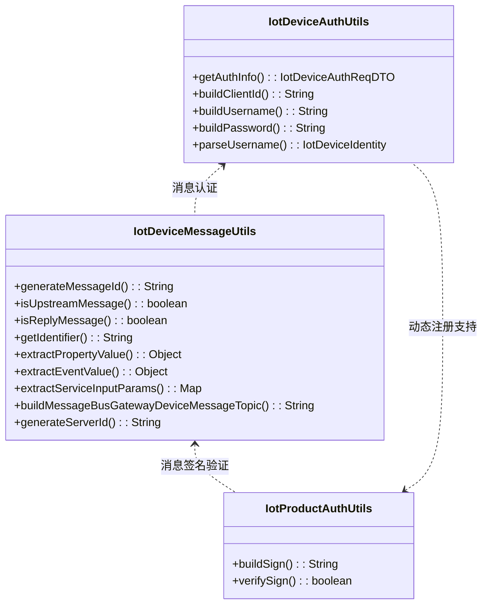

# util_13 模块文档

## 模块概述

**util_13** 是 IoT 模块的核心工具类集合，位于 `yudao-module-iot/yudao-module-iot-core/src/main/java/cn/iocoder/yudao/module/iot/core/util/` 目录下。该模块提供了设备认证、消息处理和产品动态注册等核心功能，是 IoT 设备接入和消息通信的基础支撑。

## 模块架构



## 核心组件

### 1. IotDeviceAuthUtils - 设备认证工具类

**功能描述**：提供 IoT 设备 MQTT 连接认证相关的工具方法，参考阿里云的认证机制。

**核心方法**：

| 方法名 | 参数 | 返回值 | 说明 |
|--------|------|--------|------|
| `getAuthInfo` | productKey, deviceName, deviceSecret | IotDeviceAuthReqDTO | 获取设备认证信息（clientId、username、password） |
| `buildClientId` | productKey, deviceName | String | 构建客户端ID格式：`productKey.deviceName` |
| `buildUsername` | productKey, deviceName | String | 构建用户名格式：`deviceName&productKey` |
| `buildPassword` | deviceSecret, content | String | 使用 HMAC-SHA256 生成密码 |
| `parseUsername` | username | IotDeviceIdentity | 从用户名解析设备身份信息 |

**认证流程**：
1. 使用 `productKey` 和 `deviceName` 构建 `clientId`
2. 使用 `deviceName` 和 `productKey` 构建 `username`（用 `&` 分隔）
3. 构建签名内容：`clientId + deviceName + deviceSecret + productKey`
4. 使用 `deviceSecret` 对签名内容进行 HMAC-SHA256 加密生成 `password`

### 2. IotProductAuthUtils - 产品动态注册工具类

**功能描述**：提供一型一密场景下的设备动态注册签名生成和验证功能。

**核心方法**：

| 方法名 | 参数 | 返回值 | 说明 |
|--------|------|--------|------|
| `buildSign` | productKey, deviceName, productSecret | String | 生成设备动态注册签名 |
| `verifySign` | productKey, deviceName, productSecret, sign | boolean | 验证签名是否正确 |

**签名生成**：
- 构建签名内容：`deviceName + productKey`
- 使用 `productSecret` 对签名内容进行 HMAC-SHA256 加密

### 3. IotDeviceMessageUtils - 设备消息工具类

**功能描述**：提供 IoT 设备消息处理、解析和 Topic 构建的完整工具集。

#### 消息处理功能

| 方法名 | 参数 | 返回值 | 说明 |
|--------|------|--------|------|
| `generateMessageId` | - | String | 生成唯一消息ID（UUID） |
| `isUpstreamMessage` | IotDeviceMessage | boolean | 判断是否为上行消息（设备发送） |
| `isReplyMessage` | IotDeviceMessage | boolean | 判断是否为回复消息（通过 code 非空识别） |
| `getIdentifier` | IotDeviceMessage | String | 提取消息中的标识符 |
| `containsIdentifier` | IotDeviceMessage, String | boolean | 判断消息是否包含指定标识符 |
| `notContainsIdentifier` | IotDeviceMessage, String | boolean | 判断消息是否不包含指定标识符 |
| `extractPropertyValue` | IotDeviceMessage, String | Object | 从消息中提取指定属性的值 |
| `extractEventValue` | IotDeviceMessage | Object | 从事件上报消息中提取事件值 |
| `extractServiceInputParams` | IotDeviceMessage | Map<String, Object> | 从服务调用消息中提取输入参数 |

**消息标识符提取策略**：
- `EVENT_POST` / `SERVICE_INVOKE`：提取 `params.identifier`
- `STATE_UPDATE`：提取 `params.state`
- `PROPERTY_POST`：检查 `params` 中的属性 key（支持扁平和嵌套 properties 结构）

**属性值提取优先级**：
1. 直接值（params 不是 Map 时）
2. `params[identifier]`
3. `params.properties[identifier]`（标准属性上报）
4. `params.data[identifier]`
5. `params.value`（单值消息）
6. 单值 Map（仅包含 identifier 和另一个值）

#### Topic 构建功能

| 方法名 | 参数 | 返回值 | 说明 |
|--------|------|--------|------|
| `buildMessageBusGatewayDeviceMessageTopic` | serverId | String | 构建网关设备消息 Topic |
| `generateServerId` | serverPort | String | 生成服务器编号（IP+端口，替换 . 为 _） |

## 模块依赖关系

```mermaid
graph TD
    subgraph util_13 [util_13 模块]
        IotDeviceAuthUtils
        IotProductAuthUtils
        IotDeviceMessageUtils
    end
    
    IotDeviceAuthUtils --> IotDeviceMessageUtils : 认证消息处理
    IotProductAuthUtils --> IotDeviceAuthUtils : 动态注册认证
    IotDeviceMessageUtils --> IotProductAuthUtils : 消息签名验证
    
    subgraph 依赖模块
        yudao-module-iot-core[yudao-module-iot-core]
        yudao-common[yudao-common]
        hutool[hutool-crypto]
    end
    
    IotDeviceAuthUtils --> yudao-common : 使用 DTO
    IotDeviceAuthUtils --> hutool : HMAC 加密
    IotDeviceMessageUtils --> yudao-common : JsonUtils, Assert
    IotDeviceMessageUtils --> hutool : 反射、字符串工具
```

## 使用场景

### 1. 设备 MQTT 连接认证

```java
// 获取设备认证信息
IotDeviceAuthReqDTO authInfo = IotDeviceAuthUtils.getAuthInfo(
    "productKey", 
    "deviceName", 
    "deviceSecret"
);
// authInfo 包含：clientId、username、password，用于 MQTT 连接
```

### 2. 设备动态注册（一型一密）

```java
// 生成注册签名
String sign = IotProductAuthUtils.buildSign(
    "productKey", 
    "deviceName", 
    "productSecret"
);

// 验证签名
boolean isValid = IotProductAuthUtils.verifySign(
    "productKey", 
    "deviceName", 
    "productSecret", 
    sign
);
```

### 3. 设备消息处理

```java
// 生成消息ID
String messageId = IotDeviceMessageUtils.generateMessageId();

// 判断消息方向
boolean isUpstream = IotDeviceMessageUtils.isUpstreamMessage(message);

// 提取属性值
Object value = IotDeviceMessageUtils.extractPropertyValue(message, "temperature");

// 提取服务调用参数
Map<String, Object> params = IotDeviceMessageUtils.extractServiceInputParams(message);

// 构建 Topic
String topic = IotDeviceMessageUtils.buildMessageBusGatewayDeviceMessageTopic("server1");
```

## 与其他模块的交互

| 模块 | 交互方式 | 说明 |
|------|----------|------|
| yudao-module-iot-core | 直接调用 | 核心工具类被 IoT 核心模块广泛使用 |
| yudao-module-iot-gateway | 设备认证 | 网关使用 IotDeviceAuthUtils 进行设备认证 |
| yudao-module-iot-biz | 消息处理 | 业务层使用 IotDeviceMessageUtils 解析设备消息 |
| yudao-module-system | 设备管理 | 设备信息管理模块与认证工具配合使用 |

## 设计特点

1. **工具类设计**：所有方法均为静态方法，无状态，便于直接使用
2. **兼容性设计**：IotDeviceMessageUtils 同时支持 Map 和 POJO 两种 params 形态
3. **扩展性设计**：属性值提取支持多种数据结构，易于扩展新格式
4. **安全性**：使用 HMAC-SHA256 进行签名和认证，保证消息安全性
5. **标准化**：遵循阿里云 MQTT 认证标准，便于对接主流 IoT 平台

## 参考文档

- [阿里云 MQTT 认证文档](https://help.aliyun.com/zh/iot/user-guide/how-do-i-obtain-mqtt-parameters-for-authentication)
- IotDeviceMessage 消息结构定义
- IotDeviceAuthReqDTO 认证请求 DTO
