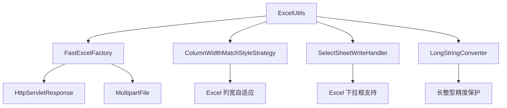

# util_3 模块文档

## 概述

`util_3` 模块是 Yudao 框架中专门用于处理 Excel 文件的工具模块。它基于 FastExcel 库，提供了便捷的 Excel 文件读写功能，支持自动列宽调整、下拉框选择、长整型精度保护等特性。

该模块主要用于系统与用户之间的 Excel 数据交互，例如导出报表、导入数据等场景。

## 架构图



## 核心组件

### ExcelUtils

位于：`yudao-framework/yudao-spring-boot-starter-excel/src/main/java/cn/iocoder/yudao/framework/excel/core/util/ExcelUtils.java`

#### 功能描述

`ExcelUtils` 是该模块的核心工具类，提供了两个主要方法：

1. **`write`**: 将数据以 Excel 形式响应给前端
2. **`read`**: 从上传的 Excel 文件中读取数据

#### 方法详解

##### 1. `write` 方法

```java
public static <T> void write(HttpServletResponse response, String filename, String sheetName,
                             Class<T> head, List<T> data) throws IOException
```

**参数说明：**
- `response`: Http 响应对象，用于设置响应头和内容类型
- `filename`: 导出的 Excel 文件名
- `sheetName`: Excel sheet 名称
- `head`: Excel 表头类，用于定义列结构
- `data`: 需要导出的数据列表

**功能特性：**
- 自动设置响应头和内容类型
- 支持自动列宽调整（最大 255 宽度）
- 支持下拉框选择（基于固定 sheet 实现）
- 支持长整型精度保护（避免 Long 类型丢失精度）
- 自动关闭流管理（避免手动关闭流导致的问题）

**使用示例：**
```java
@GetMapping("/export")
public void export(HttpServletResponse response) throws IOException {
    List<UserExportVO> data = userService.getExportData();
    ExcelUtils.write(response, "用户导出.xlsx", "用户列表", UserExportVO.class, data);
}
```

##### 2. `read` 方法

```java
public static <T> List<T> read(MultipartFile file, Class<T> head) throws IOException
```

**参数说明：**
- `file`: 上传的 Excel 文件
- `head`: Excel 表头类，用于定义列结构

**功能特性：**
- 支持从 MultipartFile 直接读取 Excel 数据
- 自动处理流关闭（兼容 Windows 场景）
- 支持批量读取所有数据

**使用示例：**
```java
@PostMapping("/import")
public String importData(@RequestParam("file") MultipartFile file) throws IOException {
    List<UserImportVO> data = ExcelUtils.read(file, UserImportVO.class);
    userService.importData(data);
    return "success";
}
```

## 依赖关系

### 直接依赖

1. **FastExcelFactory**: Excel 处理的核心工厂类
2. **HttpUtils**: 用于编码文件名的工具类
3. **ColumnWidthMatchStyleStrategy**: 列宽自适应策略
4. **SelectSheetWriteHandler**: 下拉框选择处理器
5. **LongStringConverter**: 长整型精度保护转换器

### 间接依赖

- **Jakarta Servlet API**: 提供 HttpServletResponse 和 MultipartFile 支持
- **Spring Web**: 提供文件上传和响应支持

## 使用场景

### 1. 数据导出

适用于报表导出、数据备份等场景。例如：
- 用户列表导出
- 订单明细导出
- 库存报表导出

### 2. 数据导入

适用于批量数据导入、数据迁移等场景。例如：
- 用户信息批量导入
- 产品信息批量导入
- 订单数据批量导入

### 3. 数据交换

适用于系统间数据交换的中间格式。例如：
- 与第三方系统的数据交换
- 与其他部门的数据共享

## 最佳实践

### 1. 表头类设计

表头类应包含所有需要导出的字段，并使用 `@ExcelColumn` 注解标记列名：

```java
public class UserExportVO {
    @ExcelColumn("用户编号")
    private Long id;

    @ExcelColumn("用户名")
    private String username;

    @ExcelColumn("邮箱")
    private String email;

    // 省略 getter/setter
}
```

### 2. 文件名编码

使用 `HttpUtils.encodeUtf8()` 编码文件名，避免中文乱码：

```java
response.addHeader("Content-Disposition", "attachment;filename=" + HttpUtils.encodeUtf8(filename));
```

### 3. 大数据量处理

对于大数据量导出，建议分页处理：

```java
@GetMapping("/export-large")
public void exportLargeData(HttpServletResponse response) throws IOException {
    int pageSize = 1000;
    int pageNum = 1;
    List<UserExportVO> data;
    do {
        data = userService.getExportData(pageNum, pageSize);
        ExcelUtils.write(response, "用户导出_第" + pageNum + "页.xlsx", 
                        "用户列表_第" + pageNum + "页", UserExportVO.class, data);
        pageNum++;
    } while (data.size() == pageSize);
}
```

### 4. 错误处理

建议在业务层添加异常处理：

```java
@GetMapping("/export")
public void export(HttpServletResponse response) {
    try {
        List<UserExportVO> data = userService.getExportData();
        ExcelUtils.write(response, "用户导出.xlsx", "用户列表", UserExportVO.class, data);
    } catch (IOException e) {
        log.error("导出用户数据失败", e);
        throw new ServiceException("导出失败，请重试");
    }
}
```

## 性能优化

### 1. 流式写入

`ExcelUtils` 使用流式写入方式，避免一次性加载大量数据到内存中。

### 2. 列宽自适应

`ColumnWidthMatchStyleStrategy` 会根据列内容自动调整列宽，最大宽度为 255 个字符。

### 3. 长整型精度保护

`LongStringConverter` 确保 Long 类型的数值在 Excel 中不会丢失精度。

## 安全考虑

### 1. 文件上传安全

在使用 `read` 方法读取上传文件时，应验证文件类型和大小：

```java
@PostMapping("/import")
public String importData(@RequestParam("file") MultipartFile file) throws IOException {
    // 验证文件类型
    if (!file.getContentType().equals("application/vnd.ms-excel") && 
        !file.getContentType().equals("application/vnd.openxmlformats-officedocument.spreadsheetml.sheet")) {
        throw new ServiceException("只支持 Excel 文件");
    }
    
    // 验证文件大小
    if (file.getSize() > 10 * 1024 * 1024) { // 10MB
        throw new ServiceException("文件大小不能超过 10MB");
    }
    
    List<UserImportVO> data = ExcelUtils.read(file, UserImportVO.class);
    userService.importData(data);
    return "success";
}
```

### 2. 内存控制

对于大文件导入，建议限制文件大小和处理的数据量：

```java
@PostMapping("/import")
public String importData(@RequestParam("file") MultipartFile file) throws IOException {
    // 限制文件大小
    if (file.getSize() > 5 * 1024 * 1024) { // 5MB
        throw new ServiceException("文件大小不能超过 5MB");
    }
    
    // 限制处理的行数
    List<UserImportVO> data = ExcelUtils.read(file, UserImportVO.class);
    if (data.size() > 10000) {
        throw new ServiceException("单次导入不能超过 10000 行");
    }
    
    userService.importData(data);
    return "success";
}
```

## 扩展性

### 1. 自定义转换器

可以通过实现 `cn.idev.excel.converters.Converter` 接口来自定义数据转换器。

### 2. 自定义写入处理器

可以通过实现 `com.alibaba.excel.write.handler.WriteHandler` 接口来自定义写入处理器。

### 3. 自定义读取处理器

可以通过实现 `com.alibaba.excel.read.listener.ReadListener` 接口来自定义读取处理器。

## 测试建议

### 1. 单元测试

测试 `ExcelUtils` 的两个核心方法：

```java
@Test
public void testWriteAndRead() throws IOException {
    // 准备测试数据
    List<UserExportVO> testData = List.of(
        new UserExportVO(1L, "user1", "user1@example.com"),
        new UserExportVO(2L, "user2", "user2@example.com")
    );
    
    // 测试写入
    HttpServletResponse response = new MockHttpServletResponse();
    ExcelUtils.write(response, "test.xlsx", "测试", UserExportVO.class, testData);
    
    // 验证响应头
    assertThat(response.getHeader("Content-Disposition")).contains("test.xlsx");
    assertThat(response.getContentType()).isEqualTo("application/vnd.ms-excel;charset=UTF-8");
    
    // 测试读取
    MultipartFile file = new MockMultipartFile("test.xlsx", "test.xlsx", 
        "application/vnd.ms-excel", new byte[0]);
    List<UserExportVO> readData = ExcelUtils.read(file, UserExportVO.class);
    
    // 验证读取结果
    assertThat(readData).hasSize(2);
    assertThat(readData.get(0).getUsername()).isEqualTo("user1");
}
```

### 2. 集成测试

在实际应用中测试 Excel 导入导出功能，确保与前端交互正常。

## 常见问题

### 1. 中文乱码问题

**问题描述：** Excel 文件中文显示为乱码

**解决方案：** 使用 `HttpUtils.encodeUtf8()` 编码文件名

```java
response.addHeader("Content-Disposition", "attachment;filename=" + HttpUtils.encodeUtf8(filename));
```

### 2. 长整型精度丢失

**问题描述：** Long 类型的数值在 Excel 中显示不正确

**解决方案：** 使用 `LongStringConverter` 转换器

```java
FastExcelFactory.write(response.getOutputStream(), head)
    .registerConverter(new LongStringConverter())
    .sheet(sheetName).doWrite(data);
```

### 3. 大文件导出内存溢出

**问题描述：** 导出大文件时出现内存溢出

**解决方案：** 使用分页导出或流式处理

```java
@GetMapping("/export-large")
public void exportLargeData(HttpServletResponse response) throws IOException {
    int pageSize = 1000;
    int pageNum = 1;
    List<UserExportVO> data;
    do {
        data = userService.getExportData(pageNum, pageSize);
        ExcelUtils.write(response, "用户导出_第" + pageNum + "页.xlsx", 
                        "用户列表_第" + pageNum + "页", UserExportVO.class, data);
        pageNum++;
    } while (data.size() == pageSize);
}
```

### 4. Excel 文件损坏

**问题描述：** 生成的 Excel 文件无法打开

**解决方案：** 确保响应流没有被提前关闭，检查异常处理

```java
try {
    ExcelUtils.write(response, "用户导出.xlsx", "用户列表", UserExportVO.class, data);
} catch (IOException e) {
    log.error("导出用户数据失败", e);
    throw new ServiceException("导出失败，请重试");
}
```

## 相关模块

- **yudao-framework/yudao-spring-boot-starter-excel**: Excel 处理的自动配置模块
- **yudao-framework/yudao-common**: 通用工具类模块
- **yudao-framework/yudao-spring-boot-starter-web**: Web 应用模块

## 总结

`util_3` 模块提供了便捷、高效、安全的 Excel 文件处理能力，是 Yudao 框架中数据导入导出的重要组成部分。通过合理使用该模块，可以显著提高系统的数据交互能力，同时保证数据的准确性和完整性。

在实际应用中，建议结合具体业务场景，灵活运用 `ExcelUtils` 提供的功能，并注意性能优化和安全控制。