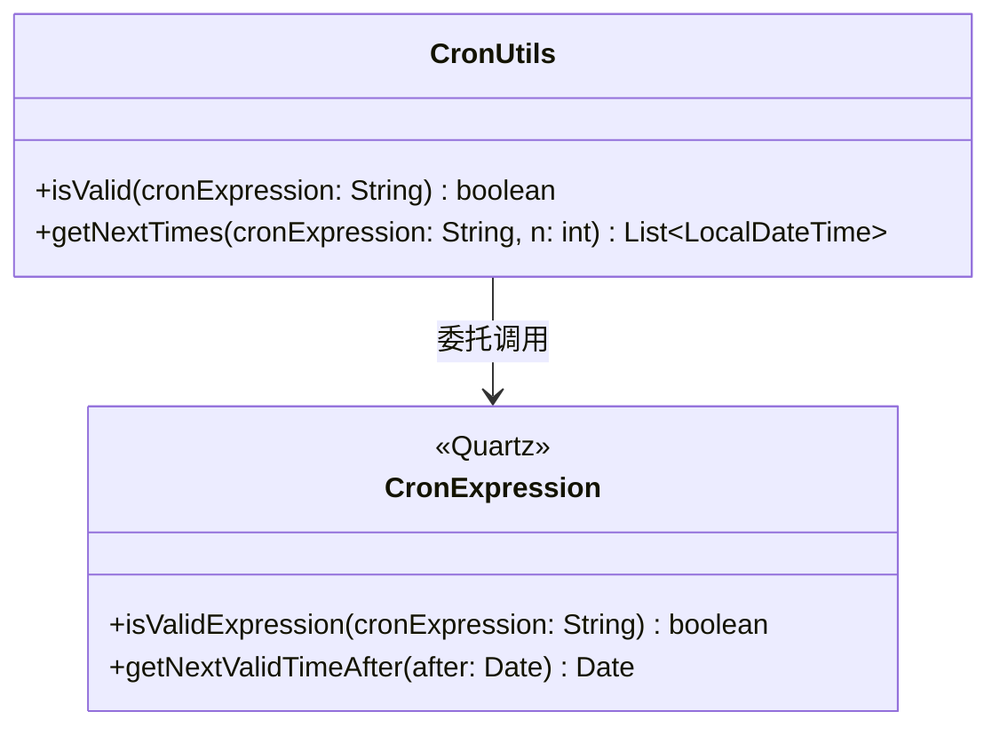
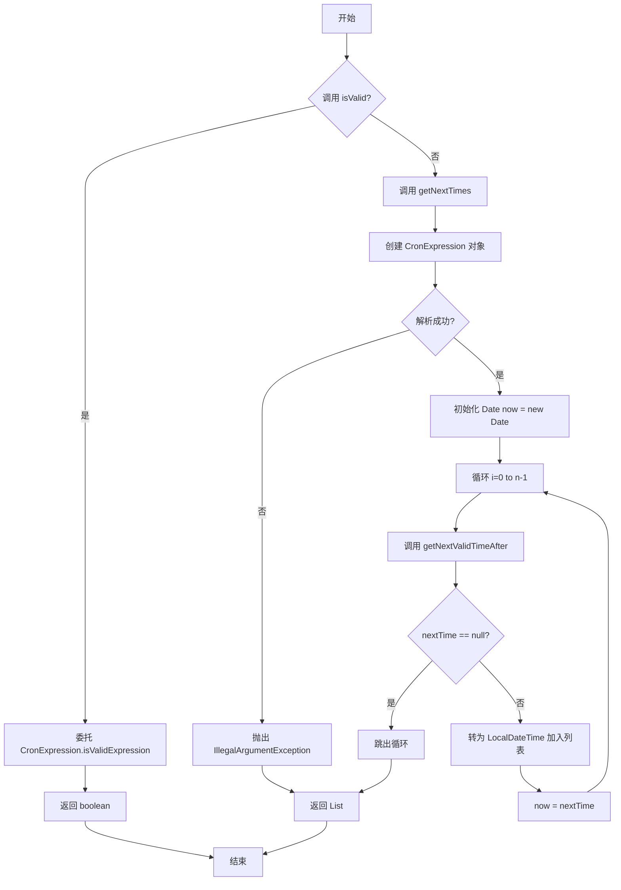
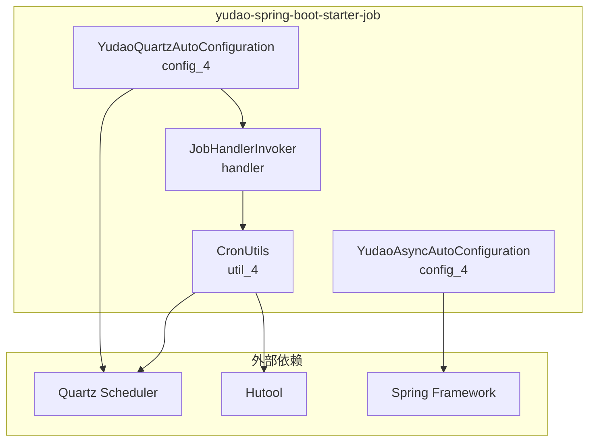

# CronUtils 工具模块文档

## 1. 模块简介

`util_4` 模块是 **定时任务调度** 模块（`yudao-spring-boot-starter-job`）中的一个核心工具类模块，主要提供 **Cron 表达式** 相关的工具方法。

该模块隶属于 `yudao-spring-boot-starter-job` 启动器，该启动器基于 Quartz 框架实现了分布式定时任务调度功能，并整合了 Spring 的 `@Scheduled` 和 `@Async` 支持。更多 Quartz 配置和异步任务配置请参考 [config_4](config_4.md) 模块文档。

### 1.1 模块定位

```
┌─────────────────────────────────────────────────────────────┐
│               yudao-spring-boot-starter-job                 │
│                                                             │
│  ┌─────────────────┐  ┌──────────────────┐  ┌───────────┐  │
│  │ YudaoQuartzAuto  │  │ YudaoAsyncAuto   │  │ JobHandler │  │
│  │ Configuration    │  │ Configuration    │  │ Invoker    │  │
│  └────────┬────────┘  └────────┬─────────┘  └─────┬─────┘  │
│           │                    │                   │        │
│           ▼                    ▼                   ▼        │
│  ┌─────────────────────────────────────────────────────┐   │
│  │               CronUtils (util_4)                    │   │
│  │          ┌───────────────────────────┐              │   │
│  │          │  Cron 表达式校验与计算工具│              │   │
│  │          └───────────────────────────┘              │   │
│  └─────────────────────────────────────────────────────┘   │
│                                                             │
│  ┌─────────────────────────────────────────────────────┐   │
│  │  外部依赖: Quartz Scheduler, Hutool, Spring TX     │   │
│  └─────────────────────────────────────────────────────┘   │
└─────────────────────────────────────────────────────────────┘
```

## 2. 核心组件

### 2.1 CronUtils 工具类

**文件路径**: `yudao-framework/yudao-spring-boot-starter-job/src/main/java/cn/iocoder/yudao/framework/quartz/core/util/CronUtils.java`

**包名**: `cn.iocoder.yudao.framework.quartz.core.util`

**职责**: 提供 Quartz Cron 表达式的校验和计算能力，是定时任务调度模块的基础工具类。

#### 2.1.1 类结构



#### 2.1.2 API 说明

| 方法 | 签名 | 说明 |
|------|------|------|
| `isValid` | `public static boolean isValid(String cronExpression)` | 校验给定的 CRON 表达式是否合法有效。内部直接委托 `CronExpression.isValidExpression()` |
| `getNextTimes` | `public static List<LocalDateTime> getNextTimes(String cronExpression, int n)` | 基于 CRON 表达式，获取从当前时间开始的 **下 n 个** 满足执行条件的时间点。如果表达式无效则抛出 `IllegalArgumentException` |

#### 2.1.3 方法详解

##### isValid

```java
public static boolean isValid(String cronExpression) {
    return CronExpression.isValidExpression(cronExpression);
}
```

- **功能**: 校验 Cron 表达式语法是否正确
- **参数**: `cronExpression` - 待校验的 Cron 表达式字符串
- **返回值**: `boolean` - 合法返回 `true`，否则返回 `false`
- **使用场景**: 在创建或修改定时任务时，前端传入的 Cron 表达式需要先经过校验

##### getNextTimes

```java
public static List<LocalDateTime> getNextTimes(String cronExpression, int n) {
    // 1. 获得 CronExpression 对象
    CronExpression cron;
    try {
        cron = new CronExpression(cronExpression);
    } catch (ParseException e) {
        throw new IllegalArgumentException(e.getMessage());
    }
    // 2. 从当前开始计算，n 个满足条件的
    Date now = new Date();
    List<LocalDateTime> nextTimes = new ArrayList<>(n);
    for (int i = 0; i < n; i++) {
        Date nextTime = cron.getNextValidTimeAfter(now);
        if (nextTime == null) break;
        nextTimes.add(LocalDateTimeUtil.of(nextTime));
        now = nextTime;
    }
    return nextTimes;
}
```

- **功能**: 计算从当前时间起，指定 Cron 表达式的下 N 次执行时间
- **参数**:
  - `cronExpression` - Cron 表达式
  - `n` - 要获取的执行时间数量
- **返回值**: `List<LocalDateTime>` - 满足条件的执行时间列表（最多 n 个，如果表达式无更多有效时间则提前结束）
- **异常**: 当 Cron 表达式无法解析时抛出 `IllegalArgumentException`
- **使用场景**: 在创建定时任务时，预览函数的执行时间，帮助用户确认 Cron 表达式是否符合预期

#### 2.1.4 流程图



## 3. 依赖关系

### 3.1 模块依赖图



### 3.2 模块内部引用关系

- `util_4` (CronUtils) 被 **handler** 模块（`JobHandlerInvoker`）在任务执行流程中间接使用
- `config_4` 模块（`YudaoQuartzAutoConfiguration`、`YudaoAsyncAutoConfiguration`）提供了 Quartz 调度器和异步任务的基础配置，是 `CronUtils` 运行的环境基础

## 4. 使用示例

### 4.1 校验 Cron 表达式

```java
// 校验一个 Cron 表达式是否合法
boolean valid = CronUtils.isValid("0 0 12 * * ?");  // true
boolean invalid = CronUtils.isValid("invalid cron"); // false
```

### 4.2 获取未来执行时间

```java
// 获取从现在开始，每天中午12点执行的下5次时间
List<LocalDateTime> times = CronUtils.getNextTimes("0 0 12 * * ?", 5);
times.forEach(time -> System.out.println(time));
// 输出示例:
// 2024-01-15T12:00:00
// 2024-01-16T12:00:00
// 2024-01-17T12:00:00
// 2024-01-18T12:00:00
// 2024-01-19T12:00:00
```

## 5. 与其他模块的关系

### 5.1 引用模块

| 目标模块 | 路径 | 关系说明 |
|---------|------|---------|
| [config_4](config_4.md) | `yudao-spring-boot-starter-job/src/main/java/.../config/` | 提供 Quartz 调度器和异步线程池的配置，是 CronUtils 的运行底座 |
| [handler](handler.md) | `yudao-spring-boot-starter-job/src/main/java/.../handler/` | `JobHandlerInvoker` 使用 Quartz 调度执行任务，间接依赖 CronUtils |

### 5.2 被引用模块

| 来源模块 | 路径 | 关系说明 |
|---------|------|---------|
| [util_6](util_6.md) | `yudao-spring-boot-starter-mybatis/.../util/` | MyBatis 工具模块，无直接依赖 |
| [util_7](util_7.md) | `yudao-spring-boot-starter-security/.../util/` | 安全框架工具模块，无直接依赖 |

> **注意**: `CronUtils` 作为基础工具类，主要被定时任务调度相关模块使用，与其他业务模块无直接耦合。

## 6. 应用场景

CronUtils 在整个系统中的典型应用场景包括：

1. **任务管理界面** - 在管理后台创建/编辑定时任务时，使用 `isValid` 校验 Cron 表达式，使用 `getNextTimes` 预览执行时间
2. **任务调度引擎** - `JobHandlerInvoker` 在执行任务时使用 Quartz 的 CronExpression 进行调度
3. **代码生成器** - 生成带有定时任务的代码时，可能用到该工具类
4. **系统监控** - 展示定时任务的执行计划
