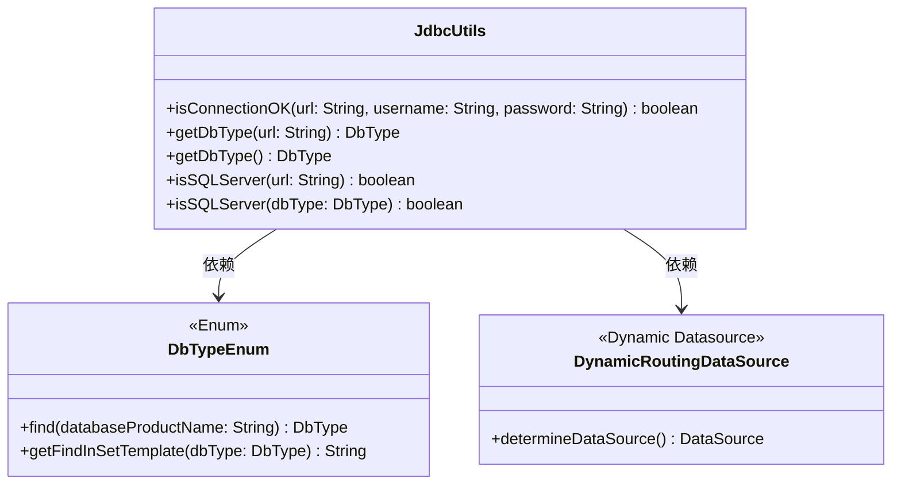

# util_6 模块文档

## 1. 模块简介

`util_6` 模块是 **MyBatis 增强** 模块（`yudao-spring-boot-starter-mybatis`）中的一个核心工具类模块，主要提供 **JDBC 工具** 和 **MyBatis 工具** 相关的功能。

该模块隶属于 `yudao-spring-boot-starter-mybatis` 启动器，该启动器基于 MyBatis Plus 框架实现了数据访问层的增强功能，提供了分页、排序、多数据源等能力。更多 MyBatis 配置请参考 [config_8](config_8.md) 和 [config_9](config_9.md) 模块文档。

### 1.1 模块定位

```
┌─────────────────────────────────────────────────────────────┐
│              yudao-spring-boot-starter-mybatis              │
│                                                             │
│  ┌─────────────────┐  ┌──────────────────┐  ┌───────────┐  │
│  │ YudaoDataSource │  │ YudaoMybatisAuto │  │ BaseMapperX │  │
│  │ AutoConfiguration│  │ Configuration    │  │           │  │
│  └────────┬────────┘  └────────┬─────────┘  └─────┬─────┘  │
│           │                    │                   │        │
│           ▼                    ▼                   ▼        │
│  ┌─────────────────────────────────────────────────────┐   │
│  │               JdbcUtils (util_6)                    │   │
│  │          ┌───────────────────────────┐              │   │
│  │          │  JDBC 连接与 DB 类型工具   │              │   │
│  │          └───────────────────────────┘              │   │
│  └─────────────────────────────────────────────────────┘   │
│                                                             │
│  ┌─────────────────────────────────────────────────────┐   │
│  │               MyBatisUtils (util_6)                 │   │
│  │          ┌───────────────────────────┐              │   │
│  │          │  MyBatis 分页排序与工具    │              │   │
│  │          └───────────────────────────┘              │   │
│  └─────────────────────────────────────────────────────┘   │
│                                                             │
│  ┌─────────────────────────────────────────────────────┐   │
│  │  外部依赖: MyBatis Plus, Hutool, Spring Framework   │   │
│  └─────────────────────────────────────────────────────┘   │
└─────────────────────────────────────────────────────────────┘
```

## 2. 核心组件

### 2.1 JdbcUtils 工具类

**文件路径**: `yudao-framework/yudao-spring-boot-starter-mybatis/src/main/java/cn/iocoder/yudao/framework/mybatis/core/util/JdbcUtils.java`

**包名**: `cn.iocoder.yudao.framework.mybatis.core.util`

**职责**: 提供 JDBC 连接测试和数据库类型检测功能，是数据库连接管理的基础工具类。

#### 2.1.1 类结构



#### 2.1.2 API 说明

##### 1. `isConnectionOK` 方法

```java
public static boolean isConnectionOK(String url, String username, String password)
```

**功能描述**：
判断数据库连接是否正常

**参数说明**：
- `url`: 数据库连接 URL
- `username`: 数据库用户名
- `password`: 数据库密码

**返回值**：
- `true`: 连接成功
- `false`: 连接失败

**使用示例**：
```java
String url = "jdbc:mysql://localhost:3306/yudao";
String username = "root";
String password = "password";

boolean isConnected = JdbcUtils.isConnectionOK(url, username, password);
if (isConnected) {
    System.out.println("数据库连接正常");
} else {
    System.out.println("数据库连接失败");
}
```

##### 2. `getDbType(String url)` 方法

```java
public static DbType getDbType(String url)
```

**功能描述**：
根据 JDBC URL 获取对应的数据库类型

**参数说明**：
- `url`: 数据库连接 URL

**返回值**：
- `DbType`: 数据库类型枚举

**使用示例**：
```java
String mysqlUrl = "jdbc:mysql://localhost:3306/yudao";
String oracleUrl = "jdbc:oracle:thin:@localhost:1521:orcl";

DbType mysqlType = JdbcUtils.getDbType(mysqlUrl); // 返回 DbType.MYSQL
DbType oracleType = JdbcUtils.getDbType(oracleUrl); // 返回 DbType.ORACLE
```

##### 3. `getDbType()` 方法

```java
public static DbType getDbType()
```

**功能描述**：
获取当前数据源对应的数据库类型

**返回值**：
- `DbType`: 当前数据源的数据库类型

**使用示例**：
```java
DbType currentDbType = JdbcUtils.getDbType();
System.out.println("当前数据库类型: " + currentDbType);
```

##### 4. `isSQLServer(String url)` 方法

```java
public static boolean isSQLServer(String url)
```

**功能描述**：
判断 JDBC 连接是否为 SQL Server 数据库

**参数说明**：
- `url`: 数据库连接 URL

**返回值**：
- `true`: 是 SQL Server 数据库
- `false`: 不是 SQL Server 数据库

**使用示例**：
```java
String sqlServerUrl = "jdbc:sqlserver://localhost:1433;databaseName=yudao";
boolean isSqlServer = JdbcUtils.isSQLServer(sqlServerUrl);
```

##### 5. `isSQLServer(DbType dbType)` 方法

```java
public static boolean isSQLServer(DbType dbType)
```

**功能描述**：
判断数据库类型是否为 SQL Server

**参数说明**：
- `dbType`: 数据库类型枚举

**返回值**：
- `true`: 是 SQL Server 数据库
- `false`: 不是 SQL Server 数据库

**使用示例**：
```java
DbType dbType = JdbcUtils.getDbType();
boolean isSqlServer = JdbcUtils.isSQLServer(dbType);
```

### 2.2 MyBatisUtils 工具类

**文件路径**: `yudao-framework/yudao-spring-boot-starter-mybatis/src/main/java/cn/iocoder/yudao/framework/mybatis/core/util/MyBatisUtils.java`

**包名**: `cn.iocoder.yudao.framework.mybatis.core.util`

**职责**: 提供 MyBatis 分页、排序、FindInSet 跨数据库实现等工具方法，是 MyBatis 查询操作的辅助工具类。

#### 2.2.1 类结构

```mermaid
classDiagram
    class MyBatisUtils {
        +buildPage(pageParam: PageParam) Page~T~
        +buildPage(pageParam: PageParam, sortingFields: Collection~SortingField~) Page~T~
        +addOrder(wrapper: Wrapper~T~, sortingFields: Collection~SortingField~) void
        +isAscOrder(order: String) boolean
        +getOrderDirection(order: String) String
        +buildSafeOrderColumn(field: String) String
        +addInterceptor(interceptor: MybatisPlusInterceptor, inner: InnerInterceptor, index: int) void
        +getTableName(table: Table) String
        +buildColumn(tableName: String, tableAlias: Alias, column: String) Column
        +findInSet(columnName: String) String
        +findInSetWithParamIndex(columnName: String, paramIndex: int) String
        +toUnderlineCase(func: Func1~T, ?~) String
    }
    
    class PageParam {
        <<POJO>>
        +pageNo: int
        +pageSize: int
    }
    
    class SortingField {
        <<POJO>>
        +field: String
        +order: String
        +static ORDER_ASC: String = "asc"
        +static ORDER_DESC: String = "desc"
    }
    
    class Page~T~ {
        <<MyBatis Plus>>
        +setOptimizeJoinOfCountSql(boolean) void
        +addOrder(OrderItem) void
    }
    
    class Wrapper~T~ {
        <<MyBatis Plus>>
        +orderBy(boolean, boolean, String) void
        +last(String) void
    }
    
    class LambdaQueryWrapper~T~ {
        <<MyBatis Plus>>
        +last(String) void
    }
    
    class MybatisPlusInterceptor {
        <<MyBatis Plus>>
        +getInterceptors() List~InnerInterceptor~
        +setInterceptors(List~InnerInterceptor~) void
    }
    
    class InnerInterceptor {
        <<MyBatis Plus>>
    }
    
    class Table {
        <<MyBatis Parser>>
        +getName() String
    }
    
    class Alias {
        <<MyBatis Parser>>
        +getName() String
    }
    
    class Column {
        <<MyBatis Parser>>
    }
    
    class Func1~T, ?~ {
        <<Hutool>>
    }
    
    MyBatisUtils --> PageParam : 依赖
    MyBatisUtils --> SortingField : 依赖
    MyBatisUtils --> Page~T~ : 依赖
    MyBatisUtils --> Wrapper~T~ : 依赖
    MyBatisUtils --> LambdaQueryWrapper~T~ : 依赖
    MyBatisUtils --> MybatisPlusInterceptor : 依赖
    MyBatisUtils --> InnerInterceptor : 依赖
    MyBatisUtils --> Table : 依赖
    MyBatisUtils --> Alias : 依赖
    MyBatisUtils --> Column : 依赖
    MyBatisUtils --> Func1~T, ?~ : 依赖
    MyBatisUtils --> JdbcUtils : 依赖
    MyBatisUtils --> DbTypeEnum : 依赖
```



#### 2.2.2 API 说明

##### 1. `buildPage(PageParam pageParam)` 方法

```java
public static <T> Page<T> buildPage(PageParam pageParam)
```

**功能描述**：
根据分页参数创建 MyBatis Plus 分页对象

**参数说明**：
- `pageParam`: 分页参数对象，包含页码和页大小

**返回值**：
- `Page<T>`: MyBatis Plus 分页对象

**使用示例**：
```java
PageParam pageParam = new PageParam(1, 10); // 第1页，每页10条
Page<User> page = MyBatisUtils.buildPage(pageParam);
// 然后可以将 page 作为参数传递给 MyBatis Plus 的查询方法
```

##### 2. `buildPage(PageParam pageParam, Collection<SortingField> sortingFields)` 方法

```java
public static <T> Page<T> buildPage(PageParam pageParam, Collection<SortingField> sortingFields)
```

**功能描述**：
根据分页参数和排序字段创建 MyBatis Plus 分页对象

**参数说明**：
- `pageParam`: 分页参数对象，包含页码和页大小
- `sortingFields`: 排序字段集合

**返回值**：
- `Page<T>`: MyBatis Plus 分页对象，已设置排序

**使用示例**：
```java
PageParam pageParam = new PageParam(1, 10);
List<SortingField> sortingFields = Arrays.asList(
    new SortingField("username", SortingField.ORDER_ASC),
    new SortingField("createTime", SortingField.ORDER_DESC)
);
Page<User> page = MyBatisUtils.buildPage(pageParam, sortingFields);
```

##### 3. `addOrder(Wrapper<T> wrapper, Collection<SortingField> sortingFields)` 方法

```java
public static <T> void addOrder(Wrapper<T> wrapper, Collection<SortingField> sortingFields)
```

**功能描述**：
为 MyBatis Plus 查询包装器添加排序条件

**参数说明**：
- `wrapper`: MyBatis Plus 查询包装器（QueryWrapper 或 LambdaQueryWrapper）
- `sortingFields`: 排序字段集合

**使用示例**：
```java
// 使用 QueryWrapper
QueryWrapper<User> queryWrapper = new QueryWrapper<>();
List<SortingField> sortingFields = Arrays.asList(
    new SortingField("username", SortingField.ORDER_ASC),
    new SortingField("createTime", SortingField.ORDER_DESC)
);
MyBatisUtils.addOrder(queryWrapper, sortingFields);

// 使用 LambdaQueryWrapper
LambdaQueryWrapper<User> lambdaQueryWrapper = new LambdaQueryWrapper<>();
MyBatisUtils.addOrder(lambdaQueryWrapper, sortingFields);
```

##### 4. `isAscOrder(String order)` 方法

```java
public static boolean isAscOrder(String order)
```

**功能描述**：
判断排序顺序是否为升序

**参数说明**：
- `order`: 排序顺序字符串

**返回值**：
- `true`: 升序
- `false`: 降序

**使用示例**：
```java
boolean isAsc = MyBatisUtils.isAscOrder("asc"); // 返回 true
boolean isDesc = MyBatisUtils.isAscOrder("desc"); // 返回 false
```

##### 5. `getOrderDirection(String order)` 方法

```java
public static String getOrderDirection(String order)
```

**功能描述**：
获取排序方向的 SQL 关键字

**参数说明**：
- `order`: 排序顺序字符串

**返回值**：
- `"ASC"`: 升序
- `"DESC"`: 降序

**使用示例**：
```java
String asc = MyBatisUtils.getOrderDirection("asc"); // 返回 "ASC"
String desc = MyBatisUtils.getOrderDirection("desc"); // 返回 "DESC"
```

##### 6. `buildSafeOrderColumn(String field)` 方法

```java
private static String buildSafeOrderColumn(String field)
```

**功能描述**：
将驼峰命名转换为下划线命名，并验证是否为安全的列名

**参数说明**：
- `field`: 驼峰命名的字段名

**返回值**：
- 安全的下划线命名列名，如果不安全则返回 null

**使用示例**：
```java
String safeColumn = MyBatisUtils.buildSafeOrderColumn("userName"); // 返回 "user_name"
String unsafeColumn = MyBatisUtils.buildSafeOrderColumn("user-name"); // 返回 null
```

##### 7. `addInterceptor(MybatisPlusInterceptor interceptor, InnerInterceptor inner, int index)` 方法

```java
public static void addInterceptor(MybatisPlusInterceptor interceptor, InnerInterceptor inner, int index)
```

**功能描述**：
将拦截器添加到 MyBatis Plus 拦截器链中指定位置

**参数说明**：
- `interceptor`: MyBatis Plus 拦截器
- `inner`: 要添加的内部拦截器
- `index`: 插入位置索引

**使用示例**：
```java
MybatisPlusInterceptor interceptor = new MybatisPlusInterceptor();
InnerInterceptor inner = new SomeInnerInterceptor();
MyBatisUtils.addInterceptor(interceptor, inner, 0); // 添加到第一个位置
```

##### 8. `getTableName(Table table)` 方法

```java
public static String getTableName(Table table)
```

**功能描述**：
获取 Table 对象对应的表名，兼容 MySQL 转义表名

**参数说明**：
- `table`: MyBatis Parser 的 Table 对象

**返回值**：
- 去除转义字符后的表名

**使用示例**：
```java
Table table = new Table("`user`"); // MySQL 转义表名
String tableName = MyBatisUtils.getTableName(table); // 返回 "user"
```

##### 9. `buildColumn(String tableName, Alias tableAlias, String column)` 方法

```java
public static Column buildColumn(String tableName, Alias tableAlias, String column)
```

**功能描述**：
构建 Column 对象

**参数说明**：
- `tableName`: 表名
- `tableAlias`: 表别名（可选）
- `column`: 列名

**返回值**：
- Column 对象

**使用示例**：
```java
Column column = MyBatisUtils.buildColumn("user", null, "username");
// 结果: user.username

Alias alias = new Alias("u");
Column columnWithAlias = MyBatisUtils.buildColumn("user", alias, "username");
// 结果: u.username
```

##### 10. `findInSet(String columnName)` 方法

```java
public static String findInSet(String columnName)
```

**功能描述**：
跨数据库的 FIND_IN_SET 实现

**参数说明**：
- `columnName`: 字段名称

**返回值**：
- 对应数据库的 FIND_IN_SET 实现 SQL 片段

**使用示例**：
```java
// 在 MySQL 中
String mysqlFis = MyBatisUtils.findInSet("status");
// 可能返回: FIND_IN_SET(#{value}, status) <> 0

// 在 Oracle 中
String oracleFis = MyBatisUtils.findInSet("status");
// 可能返回: INSTR(',' || status || ',', ',' || #{value} || ',') > 0
```

##### 11. `findInSetWithParamIndex(String columnName, int paramIndex)` 方法

```java
public static String findInSetWithParamIndex(String columnName, int paramIndex)
```

**功能描述**：
跨数据库的 FIND_IN_SET 实现，适用于同一个 apply 语句中有多个参数的场景

**参数说明**：
- `columnName`: 字段名称
- `paramIndex`: 参数索引

**返回值**：
- 对应数据库的 FIND_IN_SET 实现 SQL 片段，包含参数占位符

**使用示例**：
```java
String fisWithIndex = MyBatisUtils.findInSetWithParamIndex("status", 0);
// 可能返回: FIND_IN_SET({0}, status) <> 0
```

##### 12. `toUnderlineCase(Func1<T, ?> func)` 方法

```java
public static <T> String toUnderlineCase(Func1<T, ?> func)
```

**功能描述**：
将驼峰命名转换为下划线命名

**参数说明**：
- `func`: 字段名函数（驼峰命名）

**返回值**：
- 下划线命名的字段名

**使用示例**：
```java
String underline = MyBatisUtils.toUnderlineCase(User::getUserName);
// 返回: user_name
```

## 3. 依赖关系

### 3.1 直接依赖

1. **DbTypeEnum**: 数据库类型枚举，提供数据库类型判断和 FIND_IN_SET 模板
2. **ObjectUtils**: Hutool 工具类，用于对象比较
3. **SpringUtils**: Spring 工具类，用于获取 Bean
4. **PageParam**: 分页参数对象
5. **SortingField**: 排序字段对象
6. **MyBatis Plus 相关类**: Page、Wrapper、LambdaQueryWrapper、OrderItem 等
7. **MyBatis Parser 相关类**: Table、Alias、Column 等
8. **Hutool 相关类**: StrUtil、CollUtil、LambdaUtil、Pattern 等
9. **DynamicRoutingDataSource**: 动态数据源
10. **MybatisPlusInterceptor**: MyBatis Plus 拦截器

### 3.2 间接依赖

- **Jakarta Servlet API**: 提供 HttpServletResponse 和 MultipartFile 支持（间接通过 Spring）
- **Spring Framework**: 提供 Bean 管理和依赖注入
- **MyBatis Plus**: 提供增强的 MyBatis 功能
- **Hutool**: 提供各种工具方法

## 4. 使用场景

### 4.1 数据库连接管理

**场景描述**：在系统启动时或运行期间需要检查数据库连接是否正常

**实现方式**：
```java
@PostConstruct
public void init() {
    String url = "jdbc:mysql://localhost:3306/yudao";
    String username = "root";
    String password = "password";
    
    if (!JdbcUtils.isConnectionOK(url, username, password)) {
        throw new RuntimeException("数据库连接失败，请检查配置");
    }
    
    DbType dbType = JdbcUtils.getDbType();
    logger.info("当前数据库类型: {}", dbType);
}
```

### 4.2 分页查询

**场景描述**：在服务层实现分页查询功能

**实现方式**：
```java
@Service
public class UserService {
    
    @Autowired
    private UserMapper userMapper;
    
    public Page<UserVO> getUserPage(UserQueryReqVO reqVO) {
        // 构建分页对象
        Page<User> page = MyBatisUtils.buildPage(
            new PageParam(reqVO.getPageNo(), reqVO.getPageSize()),
            reqVO.getSortFields()
        );
        
        // 构建查询条件
        LambdaQueryWrapper<User> wrapper = new LambdaQueryWrapper<>();
        if (StringUtils.isNotEmpty(reqVO.getUsername())) {
            wrapper.like(User::getUsername, reqVO.getUsername());
        }
        if (ObjectUtils.isNotNull(reqVO.getStatus())) {
            wrapper.eq(User::getStatus, reqVO.getStatus());
        }
        
        // 添加排序
        MyBatisUtils.addOrder(wrapper, reqVO.getSortFields());
        
        // 执行查询
        Page<User> userPage = userMapper.selectPage(page, wrapper);
        
        // 转换为 VO
        return userPage.convert(UserVO::convert);
    }
}
```

### 4.3 跨数据库 FIND_IN_SET 实现

**场景描述**：在需要根据逗号分隔的字符串字段查询时，需要跨不同数据库实现 FIND_IN_SET 功能

**实现方式**：
```java
@Service
public class RoleService {
    
    @Autowired
    private RoleMapper roleMapper;
    
    public List<Role> getRoleByUserId(Long userId) {
        // 获取用户拥有的角色 ID 列表（假设是逗号分隔的字符串）
        String roleIds = userRoleMapper.getRoleIdsByUserId(userId);
        
        // 使用 MyBatis Plus 查询
        QueryWrapper<Role> wrapper = new QueryWrapper<>();
        // 使用 MyBatisUtils 生成跨数据库的 FIND_IN_SET 条件
        wrapper.apply("FIND_IN_SET({0}, role_id)", roleIds);
        
        return roleMapper.selectList(wrapper);
    }
}
```

在 XML 中的使用：
```xml
<select id="selectList" resultType="Role">
    SELECT * FROM role
    <where>
        <if test="roleIds != null">
            ${mybatisUtils.findInSet('role_id')}
        </if>
    </where>
</select>
```

### 4.4 动态排序

**场景描述**：在 API 接口中支持动态排序字段

**实现方式**：
```java
@RestController
@RequestMapping("/api/users")
public class UserController {
    
    @Autowired
    private UserService userService;
    
    @GetMapping("/page")
    public CommonResult<PageResult<UserVO>> getUserPage(
            @RequestParam(required = false, defaultValue = "1") Integer pageNo,
            @RequestParam(required = false, defaultValue = "10") Integer pageSize,
            @RequestParam(required = false) String sortField, // 排序字段，如 userName
            @RequestParam(required = false, defaultValue = "asc") String sortOrder) { // 排序方式，asc 或 desc
        
        PageParam pageParam = new PageParam(pageNo, pageSize);
        List<SortingField> sortFields = new ArrayList<>();
        if (StringUtils.isNotEmpty(sortField)) {
            sortFields.add(new SortingField(sortField, sortOrder));
        }
        
        Page<UserVO> page = userService.getUserPage(pageParam, sortFields);
        return CommonResult.success(page);
    }
}
```

## 5. 与其他模块的关系

### 5.1 引用模块

| 目标模块 | 路径 | 关系说明 |
|---------|------|----------|
| [config_8](config_8.md) | `yudao-spring-boot-starter-mybatis/src/main/java/.../config/` | 提供 MyBatis Plus 的自动配置，是 util_6 的运行环境 |
| [config_9](config_9.md) | `yudao-spring-boot-starter-mybatis/src/main/java/.../config/` | 提供 MyBatis 的自动配置，是 util_6 的运行环境 |
| [mapper](mapper.md) | `yudao-spring-boot-starter-mybatis/src/main/java/.../mapper/` | BaseMapperX 利用 MyBatisPlus 的功能，间接受益于 util_6 的工具方法 |
| [type](type.md) | `yudao-spring-boot-starter-mybatis/src/main/java/.../type/` | 各种类型处理器，与 util_6 在 MyBatis 生态中协同工作 |

### 5.2 被引用模块

| 来源模块 | 路径 | 关系说明 |
|---------|------|----------|
| 服务层实现 | 各业务模块的 service 包 | Service 类直接使用 util_6 的方法进行分页、排序等操作 |
| 控制器层 | 各业务模块的 controller 包 | Controller 间接通过 Service 使用 util_6 的功能 |
| 类型转换器 | 各模块的 type 包 | 类型处理器可能需要利用 util_6 的数据库类型判断功能 |

## 6. 应用场景

Util_6 在整个系统中的典型应用场景包括：

1. **数据库连接验证**：在应用启动时或定时任务中检查数据库连接状态
2. **分页查询**：服务层实现分页列表查询时使用 buildPage 方法
3. **动态排序**：API 接口支持前端传递排序参数时使用 addOrder 方法
4. **跨数据库兼容**：需要在不同数据库之间切换时使用 getDbType 和 findInSet 方法
5. **MyBatis Plus 拦截器扩展**：自定义 MyBatis Plus 功能时使用 addInterceptor 方法
6. **字段名转换**：在需要将实体字段名转换为数据库列名时使用 toUnderlineCase 方法
7. **动态 SQL 构建**：在 Mapper XML 或注解中构建安全的列名和表名

## 7. 最佳实践

### 7.1 数据库连接检查

**建议**：在应用启动时进行数据库连接检查，防止因配置错误导致的启动失败

```java
@Configuration
public class DatabaseConfig {
    
    @Value("${spring.datasource.url}")
    private String url;
    
    @Value("${spring.datasource.username}")
    private String username;
    
    @Value("${spring.datasource.password}")
    private String password;
    
    @PostConstruct
    public void checkConnection() {
        if (!JdbcUtils.isConnectionOK(url, username, password)) {
            throw new IllegalStateException("数据库连接失败，请检查数据库配置");
        }
    }
}
```

### 7.2 分页参数验证

**建议**：在使用分页功能时，对分页参数进行合理验证，防止过大的页码或页大小导致性能问题

```java
public Page<User> getUserPage(UserQueryReqVO reqVO) {
    // 验证分页参数
    if (reqVO.getPageNo() < 1) {
        reqVO.setPageNo(1);
    }
    if (reqVO.getPageSize() > 500) { // 设置合理的最大页大小
        reqVO.setPageSize(500);
    }
    
    Page<User> page = MyBatisUtils.buildPage(
        new PageParam(reqVO.getPageNo(), reqVO.getPageSize()),
        reqVO.getSortFields()
    );
    // ... 后续查询逻辑
}
```

### 7.3 安全的排序字段

**建议**：在使用动态排序时，对排序字段进行白名单验证，防止 SQL 注入

```java
public Page<User> getUserPage(UserQueryReqVO reqVO) {
    // 定义允许排序的字段白名单
    Set<String> allowedSortFields = Set.of("id", "username", "email", "status", "createTime");
    
    List<SortingField> safeSortFields = reqVO.getSortFields().stream()
        .filter(field -> allowedSortFields.contains(field.getField()))
        .collect(Collectors.toList());
    
    Page<User> page = MyBatisUtils.buildPage(
        new PageParam(reqVO.getPageNo(), reqVO.getPageSize()),
        safeSortFields
    );
    // ... 后续查询逻辑
}
```

### 7.4 自定义 MyBatis Plus 拦截器

**示例**：实现一个自定义的拦截器来打印 SQL 语句

```java
@Component
public class SqlPrintInterceptor implements InnerInterceptor {
    
    @Override
    public void beforeQuery(Executor executor, MappedStatement ms, Object parameter,
                           RowBounds rowBounds, ResultHandler resultHandler, BoundSql boundSql) {
        System.out.println("Executing SQL: " + boundSql.getSql());
        System.out.println("Parameters: " + parameter);
    }
    
    // 其他方法的实现...
}

// 在配置类中注册拦截器
@Configuration
public class MyBatisPlusConfig {
    
    @Autowired
    private SqlPrintInterceptor sqlPrintInterceptor;
    
    @Bean
    public MybatisPlusInterceptor mybatisPlusInterceptor() {
        MybatisPlusInterceptor interceptor = new MybatisPlusInterceptor();
        MyBatisUtils.addInterceptor(interceptor, sqlPrintInterceptor, 0);
        return interceptor;
    }
}
```

## 8. 常见问题

### 8.1 数据库类型识别失败

**问题**：getDbType() 方法返回 null 或错误的数据库类型

**原因**：
1. 数据源未正确初始化
2. 使用了不支持的数据库类型
3. 动态数据源配置问题

**解决方案**：
```java
try {
    DbType dbType = JdbcUtils.getDbType();
    if (dbType == null) {
        // 降级处理：尝试从 URL 获取
        String url = // 获取数据源 URL
        dbType = JdbcUtils.getDbType(url);
    }
    // 使用 dbType 进行后续处理
} catch (Exception e) {
    // 记录日志并使用默认值
    log.warn("获取数据库类型失败，使用默认类型 MYSQL", e);
    return DbType.MYSQL;
}
```

### 8.2 分页查询性能问题

**问题**：大数据量分页查询时性能下降明显

**原因**：
1. 使用了 OFFSET 分页（MyBatis Plus 默认方式）
2. 没有正确使用索引
3. 查询条件不够精确

**解决方案**：
```java
// 优化方案1：使用键值分页（适用于有自增ID的表）
public Page<User> getUserPageOptimized(UserQueryReqVO reqVO, Long lastId) {
    LambdaQueryWrapper<User> wrapper = new LambdaQueryWrapper<>();
    if (lastId != null) {
        wrapper.gt(User::getId, lastId); // 只查询 ID 大于 lastId 的记录
    }
    // 添加其他查询条件...
    wrapper.orderByAsc(User::getId); // 必须按 ID 排序
    
    List<User> list = userMapper.selectList(
        wrapper.last("LIMIT " + reqVO.getPageSize())
    );
    
    // 手动构建分页结果
    Page<User> page = new Page<>(reqVO.getPageNo(), reqVO.getPageSize());
    page.setRecords(list);
    // 如果需要总数，需要单独查询
    return page;
}

// 优化方案2：确保有合适的索引
// 在数据库中为常用查询字段创建索引
// CREATE INDEX idx_user_status ON user(status);
// CREATE INDEX idx_user_createTime ON user(createTime);
```

### 8.3 FIND_IN_SET 在某些数据库中不支持

**问题**：某些数据库完全不支持类似 FIND_IN_SET 的功能

**原因**：数据库类型过于特殊或古旧

**解决方案**：
```java
// 在 MyBatisUtils.findInSet 方法中添加 fallback 机制
static String findInSet(DbType dbType, String columnName, int paramIndex) {
    if (!isSafeColumnName(columnName)) {
        throw new IllegalArgumentException("Invalid column name: " + columnName);
    }
    if (paramIndex < 0) {
        throw new IllegalArgumentException("Invalid param index: " + paramIndex);
    }
    
    String template = DbTypeEnum.getFindInSetTemplate(dbType);
    if (template == null) {
        // 对于不支持 FIND_IN_SET 的数据库，使用通用的 LIKE 方案作为后备
        // 注意：这种方式可能有性能问题，且不够精确
        return "CONCAT(',', " + columnName, ",',") LIKE CONCAT('%,', {" + paramIndex + "}, ',%')";
    }
    
    return template
        .replace(FIND_IN_SET_COLUMN_PLACEHOLDER, columnName)
        .replace(FIND_IN_SET_VALUE_PLACEHOLDER, "{" + paramIndex + "}");
}
```

## 9. 性能优化

### 9.1 缓存数据库类型

**优化点**：频繁调用 getDbType() 会导致反复获取数据源和连接

**优化方案**：
```java
// 在需要频繁判断数据库类型的场景中，可以考虑缓存结果
public class DbTypeCache {
    private static volatile DbType cachedDbType;
    private static final Object lock = new Object();
    
    public static DbType getDbType() {
        if (cachedDbType == null) {
            synchronized (lock) {
                if (cachedDbType == null) {
                    cachedDbType = JdbcUtils.getDbType();
                }
            }
        }
        return cachedDbType;
    }
    
    public static void clearCache() {
        cachedDbType = null;
    }
}

// 使用方式
DbType dbType = DbTypeCache.getDbType();
```

### 9.2 批量处理分页查询

**优化点**：处理大数据量时，避免一次性加载所有数据到内存

**优化方案**：
```java
public void processAllUsers() {
    int pageSize = 1000;
    int pageNum = 1;
    boolean hasMore = true;
    
    while (hasMore) {
        Page<User> page = userService.getUserPage(
            new PageParam(pageNum, pageSize),
            Collections.emptyList()
        );
        
        List<User> users = page.getRecords();
        // 处理当前页的数据
        processUsers(users);
        
        // 判断是否还有更多数据
        hasMore = page.getSize() == pageSize;
        pageNum++;
    }
}
```

### 9.3 复合索引优化

**建议**：对于经常一起使用的查询条件，创建复合索引

```sql
-- 例如，经常按 status 和 createTime 查询
CREATE INDEX idx_user_status_createTime ON user(status, createTime);

-- 例如，经常按 department_id 和 status 查询
CREATE INDEX idx_user_dept_status ON user(department_id, status);
```

## 10. 总结

`util_6` 模块是 Yudao 框架中 MyBatis 增强功能的重要组成部分，提供了两个核心工具类：

1. **JdbcUtils**：负责数据库连接验证和数据库类型检测，为数据库操作提供基础支持
2. **MyBatisUtils**：提供分页、排序、FindInSet 跨数据库实现等 MyBatis 增强功能，是服务层实现数据查询的重要工具

通过合理使用这些工具类，开发者可以：
- 快速验证数据库连接状态
- 轻松实现分页查询功能
- 灵活处理动态排序需求
- 在不同数据库之间无缝切换
- 构建安全高效的动态 SQL 查询

该模块与 `yudao-spring-boot-starter-mybatis` 启动器紧密集成，是构建高效数据访问层的基础设施。在实际开发中，建议结合具体业务场景，选择合适的工具方法来提升开发效率和代码质量。