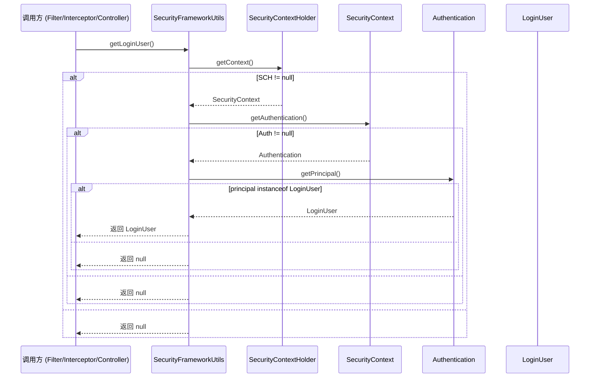
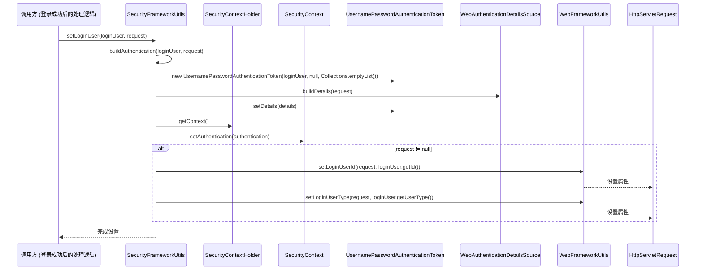
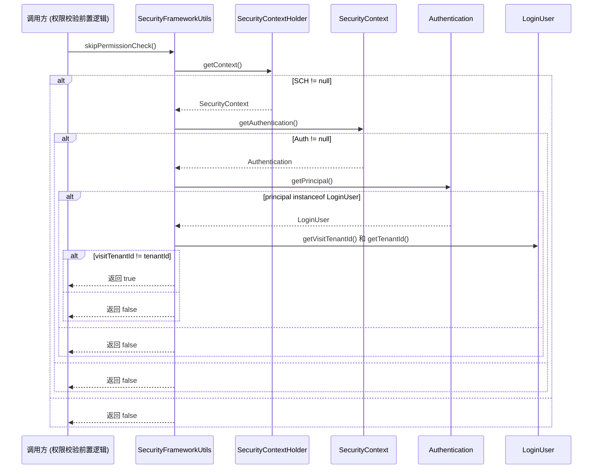

# SecurityFrameworkUtils 模块文档

## 模块概述

`SecurityFrameworkUtils` 是 Yudao 框架安全模块中的工具类，提供了一系列静态方法用于获取和设置当前登录用户的安全上下文信息，以及判断是否需要跳过权限校验。该类主要用于在过滤器、拦截器、控制器等场景中快速访问 Spring Security 的认证信息，并与框架的 Web 工具类配合，将用户信息写入请求属性以供后续日志记录（如 `ApiAccessLogFilter`）使用。

## 核心功能

1. **获取认证 Token**  
   从 `HttpServletRequest` 的 Header 或 Parameter 中提取 Token，并自动去除 `Bearer` 前缀。

2. **获取当前认证信息**  
   读取 `SecurityContextHolder` 中的 `Authentication` 对象。

3. **获取当前登录用户**  
   将 `Authentication` 的 principal 转换为 `LoginUser` 对象。

4. **获取登录用户的属性**  
   包括用户 ID、昵称、部门 ID 等，均从 `LoginUser` 的 `info` Map 中读取。

5. **设置当前登录用户**  
   将 `LoginUser` 包装为 `UsernamePasswordAuthenticationToken` 并存入 `SecurityContextHolder`，同时将用户 ID 和类型写入 `HttpServletRequest`（用于日志记录）。

6. **判断是否跳过权限校验**  
   当访问跨租户资源时（即 `visitTenantId` 与实际 `tenantId` 不一致），返回 `true` 表示跳过数据权限和功能权限的校验。

## 架构与依赖

以下 Mermaid 图展示了 `SecurityFrameworkUtils` 与其他核心组件的关系：

```mermaid
classDiagram
    class SecurityFrameworkUtils {
        <<utility>>
        +obtainAuthorization(request, headerName, parameterName): String
        +getAuthentication(): Authentication
        +getLoginUser(): LoginUser
        +getLoginUserId(): Long
        +getLoginUserNickname(): String
        +getLoginUserDeptId(): Long
        +setLoginUser(loginUser, request): void
        +skipPermissionCheck(): boolean
    }
    class LoginUser {
        <<domain>>
        -id: Long
        -tenantId: Long
        -visitTenantId: Long
        -userType: Integer
        -info: Map<String, Object>
    }
    class WebFrameworkUtils {
        <<utility>>
        +setLoginUserId(request, userId): void
        +setLoginUserType(request, userType): void
    }
    class SecurityContextHolder {
        <<framework>>
        +getContext(): SecurityContext
    }
    class SecurityContext {
        <<framework>>
        +getAuthentication(): Authentication
``` 
    class Authentication {
        <<framework>>
        +getPrincipal(): Object
        +getDetails(): Object
        +setDetails(details): void
    }
    class UsernamePasswordAuthenticationToken {
        <<framework>>
        +new UsernamePasswordAuthenticationToken(principal, credentials, authorities)
    }
    class WebAuthenticationDetailsSource {
        <<framework>>
        +buildDetails(request): Object
    }
    class HttpServletRequest {
        <<framework>>
        +getHeader(name): String
        +getParameter(name): String
    }

    SecurityFrameworkUtils --> LoginUser : 依赖
    SecurityFrameworkUtils --> WebFrameworkUtils : 依赖
    SecurityFrameworkUtils --> SecurityContextHolder : 使用
    SecurityFrameworkUtils --> SecurityContext : 使用
    SecurityFrameworkUtils --> Authentication : 使用
    SecurityFrameworkUtils --> UsernamePasswordAuthenticationToken : 使用
    SecurityFrameworkUtils --> WebAuthenticationDetailsSource : 使用
    SecurityFrameworkUtils --> HttpServletRequest : 参数
```

### 依赖说明

- **LoginUser**：安全模块中的登录用户域对象，封装了用户基本信息和扩展信息（`info` Map）。
- **WebFrameworkUtils**：Web 模块的工具类，用于向 `HttpServletRequest` 写入用户 ID 和类型，供 `ApiAccessLogFilter` 等过滤器读取。
- **Spring Security 核心类**：`SecurityContextHolder`、`SecurityContext`、`Authentication`、`UsernamePasswordAuthenticationToken`、`WebAuthenticationDetailsSource` 等，提供安全上下文的线程绑定和认证对象的构建。
- **Hutool 工具类**：`MapUtil`、`ObjUtil`、`StrUtil` 用于安全地读取 Map 值、判断对象非空和字符串处理。

## 数据流与组件交互

### 1. 获取登录用户信息的流程



### 2. 设置登录用户的流程



### 3. 判断是否跳过权限校验的流程



## 与其他模块的关系

- **安全模块（security）**：`SecurityFrameworkUtils` 依赖安全模块中的 `LoginUser` 定义，是安全模块向上层提供的工具类。
- **Web 模块（web）**：通过调用 `WebFrameworkUtils` 将用户信息写入请求，使得日志、监控等 Web 层组件能够感知当前操作的用户身份。
- **Spring Security 框架**：利用 `SecurityContextHolder` 实现基于 ThreadLocal 的安全上下文传递，与 Spring Security 的过滤器链（如 `UsernamePasswordAuthenticationFilter`、`SecurityContextPersistenceFilter`）协同工作。
- **业务模块**：在业务层（如服务类、控制器）中，可直接调用 `SecurityFrameworkUtils.getLoginUserId()` 等方法获取当前操作人，实现审计数据自动填充、数据权限过滤等功能。

## 使用示例

### 在过滤器中提取 Token 并设置登录用户

```java
public class JwtAuthenticationFilter extends OncePerRequestFilter {

    @Override
    protected void doFilterInternal(HttpServletRequest request,
                                    HttpServletResponse response,
                                    FilterChain filterChain)
            throws ServletException, IOException {
        // 从 Header 中获取 Token
        String token = SecurityFrameworkUtils.obtainAuthorization(
                request, "Authorization", "access_token");
        if (StringUtils.hasText(token)) {
            // 假设通过 token 换取 LoginUser（实际项目中可能调用认证服务）
            LoginUser loginUser = tokenService.getLoginUserByToken(token);
            if (loginUser != null) {
                // 设置到安全上下文和请求属性
                SecurityFrameworkUtils.setLoginUser(loginUser, request);
            }
        }
        filterChain.doFilter(request, response);
    }
}
```

### 在业务方法中获取当前用户 ID

```java
@Service
public class OrderService {

    public Order createOrder(OrderDTO dto) {
        Long userId = SecurityFrameworkUtils.getLoginUserId();
        if (userId == null) {
            throw new BusinessException("用户未登录");
        }
        dto.setCreatorId(userId);
        // 后续业务逻辑
        return orderRepository.save(dto.toEntity());
    }
}
```

### 判断是否跳过权限校验（例如在数据权限过滤器中）

```java
@Component
@DataPermissionHandler
public class MyDataPermissionHandler implements DataPermissionHandler {

    @Override
    public boolean skipPermissionCheck() {
        // 直接使用工具类判断
        return SecurityFrameworkUtils.skipPermissionCheck();
    }

    @Override
    public String getDataPermissionSql() {
        // 实际拼接租户或部门过滤 SQL
        Long deptId = SecurityFrameworkUtils.getLoginUserDeptId();
        return deptId != null ? "AND dept_id = " + deptId : "AND 1=0";
    }
}
```

## 注意事项

1. **线程安全**  
   `SecurityFrameworkUtils` 仅包含静态方法，内部依赖 `SecurityContextHolder`（基于 ThreadLocal），因此在多线程环境中每个线程只能看到自身设置的安全上下文。在异步处理（如 `@Async`、`CompletableFuture`）中，若需传递用户上下文，请使用 `TransmittableThreadLocal` 等机制或在子线程中重新设置。

2. **Token 提取的优先级**  
   `obtainAuthorization` 方法先尝试从 Header 读取，若为空则从 Parameter 读取。实际使用中建议统一采用 Header 方式（如 `Authorization: Bearer <token>`），以避免 URL 泄露 Token 的风险。

3. **跨租户访问的判断**  
   `skipPermissionCheck()` 仅基于 `visitTenantId` 与 `tenantId` 的不等来决定是否跳过权限校验。若业务对跨租户访问有更细粒度的控制需求（如允许特定租户间访问），请在该方法之上进行封装或扩展。

4. **LoginUser 的 info 字段**  
   昵称、部门 ID 等信息存储在 `LoginUser` 的 `info` Map 中，键值均为常量（如 `LoginUser.INFO_KEY_NICKNAME`、`LoginUser.INFO_KEY_DEPT_ID`）。获取时若键不存在将返回 `null`，调用方需自行处理空值情况。

5. **与 WebFrameworkUtils 的配合**  
   `setLoginUser` 方法会同时调用 `WebFrameworkUtils.setLoginUserId` 和 `setLoginUserType`，确保 `ApiAccessLogFilter` 等过滤器能够在记录日志时获取到正确的用户信息。若自定义过滤器依赖用户信息，请确保在安全过滤器之后执行。

## 小结

`SecurityFrameworkUtils` 作为安全模块的工具类，封装了与 Spring Security 上下文交互的常用操作，提供了便捷的方式获取和设置当前登录用户信息，并与框架的 Web 工具类协作，确保用户身份在请求生命周期内可被日志、监控等组件感知。其设计遵循单一职责原则，方法粒度细，易于在过滤器、拦截器、控制器、服务等各层复用，是 Yudao 框架安全体系中不可或缺的基础组件。