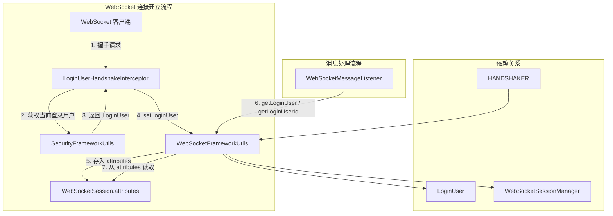
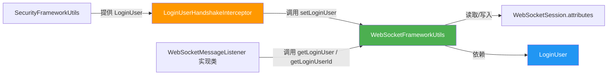
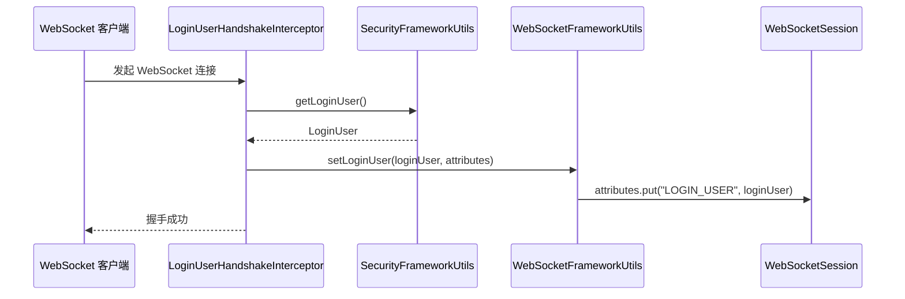
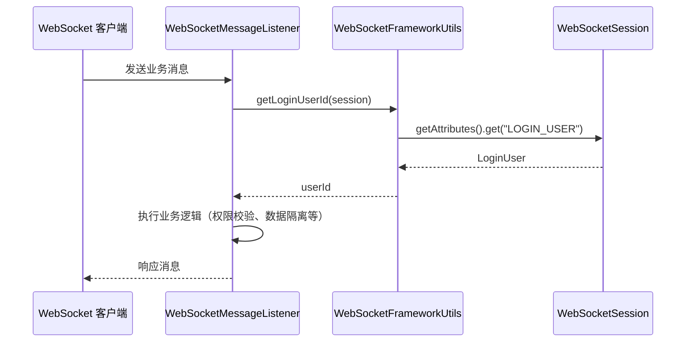

# util_8 — WebSocket 框架工具类 (WebSocketFrameworkUtils)

## 概述

`WebSocketFrameworkUtils` 是 yudao WebSocket 框架中的核心工具类，位于 `yudao-spring-boot-starter-websocket` 模块中。它提供了一组静态方法，用于在 WebSocket 会话（`WebSocketSession`）的生命周期中存取当前登录用户（`LoginUser`）信息。

该工具类作为 WebSocket 层与安全框架之间的桥梁，使得 WebSocket 消息处理器能够方便地获取当前连接用户的身份信息（用户 ID、用户类型、租户 ID 等），从而支持多租户隔离、权限校验等业务场景。

---

## 模块定位

```
yudao-spring-boot-starter-websocket
├── config/
│   └── YudaoWebSocketAutoConfiguration    ← 自动配置（WebSocket 握手、消息发送器）
├── core/
│   ├── security/
│   │   └── LoginUserHandshakeInterceptor   ← 握手拦截器（调用本工具类设置用户）
│   ├── session/
│   │   └── WebSocketSessionManager          ← 会话管理器
│   └── util/
│       └── WebSocketFrameworkUtils          ← ★ 本模块：用户信息存取工具
└── ...
```

---

## 架构图



---

## 依赖关系图



---

## 核心 API 说明

### 常量

| 常量名 | 值 | 说明 |
|---|---|---|
| `ATTRIBUTE_LOGIN_USER` | `"LOGIN_USER"` | 在 `WebSocketSession.attributes` 中存储 `LoginUser` 的键名 |

### 方法一览

| 方法 | 参数 | 返回值 | 说明 |
|---|---|---|---|
| `setLoginUser` | `LoginUser loginUser`, `Map<String, Object> attributes` | `void` | 将登录用户存入 Session 属性中 |
| `getLoginUser` | `WebSocketSession session` | `LoginUser` | 从 Session 中获取登录用户 |
| `getLoginUserId` | `WebSocketSession session` | `Long` | 获取当前用户的编号 |
| `getLoginUserType` | `WebSocketSession session` | `Integer` | 获取当前用户的类型 |
| `getTenantId` | `WebSocketSession session` | `Long` | 获取当前用户的租户编号 |

---

## 核心方法详解

### 1. `setLoginUser(LoginUser, Map<String, Object>)`

**用途**：在 WebSocket 握手阶段，将已认证的 `LoginUser` 对象存入 Session 属性 Map 中。

**调用时机**：由 `LoginUserHandshakeInterceptor.beforeHandshake()` 在握手前调用。

**实现逻辑**：
```java
attributes.put(ATTRIBUTE_LOGIN_USER, loginUser);
```

### 2. `getLoginUser(WebSocketSession)`

**用途**：从 WebSocket 会话中取出当前登录用户。

**实现逻辑**：
```java
return (LoginUser) session.getAttributes().get(ATTRIBUTE_LOGIN_USER);
```

### 3. `getLoginUserId(WebSocketSession)`

**用途**：便捷获取当前用户 ID，常用于消息处理中的用户身份识别。

**返回值**：若用户未登录则返回 `null`。

### 4. `getLoginUserType(WebSocketSession)`

**用途**：获取用户类型（如管理员、会员等），用于区分不同端（管理后台 / App）的 WebSocket 连接。

### 5. `getTenantId(WebSocketSession)`

**用途**：获取当前用户所属租户编号，支持多租户场景下的消息隔离。

---

## 使用场景与流程

### 场景一：WebSocket 握手时设置用户



### 场景二：消息处理时获取用户



---

## 与其他模块的关系

| 模块 | 关系 | 说明 |
|---|---|---|
| [SecurityFrameworkUtils](util_7.md) | 上游依赖 | 握手拦截器通过它获取当前 HTTP 请求中的 `LoginUser` |
| `LoginUserHandshakeInterceptor` | 调用者 | 在 `beforeHandshake` 中调用 `setLoginUser` 设置用户 |
| `WebSocketSessionManager` | 同级协作 | 管理 WebSocket 会话的生命周期，本工具类提供会话中的用户信息 |
| `YudaoWebSocketAutoConfiguration` | 配置层 | 注册 `LoginUserHandshakeInterceptor` 和 `WebSocketHandler` |
| `LoginUser` | 数据模型 | 本工具类存取的核心对象 |

---

## 使用示例

### 在消息监听器中获取用户信息

```java
@Component
public class DemoWebSocketMessageListener implements WebSocketMessageListener<DemoSendMessage> {

    @Override
    public void onMessage(WebSocketSession session, DemoSendMessage message) {
        // 获取当前连接的用户 ID
        Long userId = WebSocketFrameworkUtils.getLoginUserId(session);
        // 获取租户 ID
        Long tenantId = WebSocketFrameworkUtils.getTenantId(session);
        // 获取用户类型
        Integer userType = WebSocketFrameworkUtils.getLoginUserType(session);

        // 业务处理...
    }

    @Override
    public String getType() {
        return "demo-message";
    }
}
```

### 在握手拦截器中设置用户

```java
// LoginUserHandshakeInterceptor.java（框架内置，无需自定义）
@Override
public boolean beforeHandshake(ServerHttpRequest request, ServerHttpResponse response,
                               WebSocketHandler wsHandler, Map<String, Object> attributes) {
    LoginUser loginUser = SecurityFrameworkUtils.getLoginUser();
    if (loginUser == null) {
        return false; // 拒绝未认证连接
    }
    WebSocketFrameworkUtils.setLoginUser(loginUser, attributes);
    return true;
}
```

---

## 设计要点

1. **无状态工具类**：所有方法均为静态方法，不持有任何状态，线程安全。

2. **空值安全**：`getLoginUserId`、`getLoginUserType`、`getTenantId` 均对 `LoginUser` 为 `null` 的情况做了防御性处理，返回 `null` 而非抛出 NPE。

3. **关注点分离**：用户信息的存取逻辑集中在工具类中，避免在多个消息处理器中重复编写相同的属性读取代码。

4. **与安全框架解耦**：工具类本身不依赖 Spring Security 上下文，只操作 `WebSocketSession.attributes`，用户信息的来源由握手拦截器负责。

---

## 配置参考

WebSocket 功能通过 `YudaoWebSocketAutoConfiguration` 自动配置，相关配置项：

```yaml
yudao:
  websocket:
    enable: true          # 是否启用 WebSocket
    path: /ws             # WebSocket 连接路径
    sender-type: local    # 消息发送器类型：local / redis / rocketmq / rabbitmq / kafka
```

> 详细配置请参考 [config_25](config_25.md) — `YudaoWebSocketAutoConfiguration`。