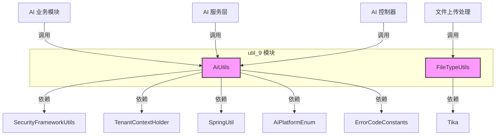

# util_9 模块文档

## 1. 模块概述

`util_9` 模块是 **AI 模块（yudao-module-ai）** 的核心工具类集合，提供 AI 相关的通用辅助功能。该模块主要包含两个工具类：

- **AiUtils**：Spring AI 相关的工具类，负责 AI 平台配置解析、消息构建、上下文管理等核心功能
- **FileTypeUtils**：文件类型识别工具，基于 Apache Tika 实现 MIME 类型检测

该模块为 AI 模块的各个功能（聊天对话、图像生成、知识库、音乐创作等）提供底层支持，是 AI 功能正常运行的基础组件。

## 2. 架构关系



## 3. 核心组件说明

### 3.1 AiUtils

**类名：** `cn.iocoder.yudao.module.ai.util.AiUtils`  
**描述：** Spring AI 工具类，提供 AI 平台相关的通用工具方法

#### 3.1.1 常量定义

| 常量名 | 值 | 说明 |
|--------|-----|------|
| `TOOL_CONTEXT_LOGIN_USER` | `"LOGIN_USER"` | 工具上下文中的登录用户键 |
| `TOOL_CONTEXT_TENANT_ID` | `"TENANT_ID"` | 工具上下文中的租户 ID 键 |
| `TONG_YI_MULTI_MODELS` | `Set<String>` | 通义千问支持多模态的模型列表 |

#### 3.1.2 核心方法

##### `resolveSpringPlaceholders(String value)`
- **功能：** 解析 DB 等动态配置里的 Spring 占位符，例如 `${OPENAI_API_KEY}`
- **参数：** `value` - 待解析的配置值
- **返回：** 解析后的配置值
- **异常：** 如果占位符无法解析，抛出 `API_CONFIG_PLACEHOLDER_NOT_RESOLVED` 错误码的异常

##### `validateApiKey(String apiKey)`
- **功能：** 校验 API Key，避免集成测试使用默认占位值发起调用
- **参数：** `apiKey` - API Key
- **异常：** 如果 API Key 为空或为 `"sk-xxxx"`，抛出 `IllegalStateException`

##### `buildChatOptions(AiPlatformEnum platform, String model, Double temperature, Integer maxTokens, List<ToolCallback> toolCallbacks, Map<String, Object> toolContext)`
- **功能：** 根据 AI 平台构建聊天选项
- **参数：**
  - `platform`：AI 平台（如 OPENAI、TONG_YI、DEEP_SEEK 等）
  - `model`：模型名称
  - `temperature`：温度参数
  - `maxTokens`：最大 Token 数
  - `toolCallbacks`：工具回调列表
  - `toolContext`：工具上下文
- **返回：** `ChatOptions` 对象
- **支持的平台：**
  - TONG_YI → DashScopeChatOptions
  - DEEP_SEEK、DOU_BAO、HUN_YUAN、SILICON_FLOW、YI_YAN、ZHI_PU、XING_HUO、MINI_MAX、MOONSHOT、BAI_CHUAN、STEP_FUN → DeepSeekChatOptions
  - OPENAI、GROK → OpenAiChatOptions
  - GEMINI → GoogleGenAiChatOptions
  - AZURE_OPENAI → OpenAiChatOptions（Azure 模式）
  - ANTHROPIC → AnthropicChatOptions
  - OLLAMA → OllamaChatOptions

##### `buildMessage(String type, String content)`
- **功能：** 构建 AI 消息
- **参数：**
  - `type`：消息类型（USER、ASSISTANT、SYSTEM、TOOL）
  - `content`：消息内容
- **返回：** `Message` 对象
- **异常：** 不支持 TOOL 类型消息

##### `buildCommonToolContext()`
- **功能：** 构建通用工具上下文，包含当前登录用户和租户 ID
- **返回：** `Map<String, Object>` 上下文

##### `getChatResponseContent(ChatResponse response)`
- **功能：** 获取聊天响应内容文本
- **返回：** 文本内容，如果响应为空则返回 null

##### `getChatResponseReasoningContent(ChatResponse response)`
- **功能：** 获取聊天响应的推理内容（reasoning content）
- **说明：** DeepSeek 通过 `DeepSeekAssistantMessage` 获取，通义千问等通过 metadata 获取

### 3.2 FileTypeUtils

**类名：** `cn.iocoder.yudao.module.ai.util.FileTypeUtils`  
**描述：** 文件类型识别工具，基于 Apache Tika 实现

#### 3.2.1 核心方法

##### `getMineType(String name)`
- **功能：** 根据文件名获取 MIME 类型
- **参数：** `name` - 文件名
- **返回：** MIME 类型，无法识别时返回 `"application/octet-stream"`
- **说明：** 在某些情况下（如使用 jar 文件时）比通过字节数组更准确

##### `isImage(String mineType)`
- **功能：** 判断是否为图片类型
- **参数：** `mineType` - MIME 类型
- **返回：** 如果是图片类型（以 `image/` 开头）返回 true，否则返回 false

## 4. 依赖关系

### 4.1 内部依赖

| 依赖模块 | 依赖组件 | 说明 |
|----------|----------|------|
| yudao-common | SetUtils | 集合工具类 |
| yudao-security | SecurityFrameworkUtils | 安全框架工具，获取当前登录用户 |
| yudao-tenant | TenantContextHolder | 租户上下文，获取当前租户 ID |
| yudao-common | SpringUtil | Spring 工具类，获取 Environment 对象 |

### 4.2 外部依赖

| 依赖 | 说明 |
|------|------|
| Hutool | 字符串、对象工具类 |
| Spring AI | AI 相关框架，提供 ChatOptions、Message、ChatResponse 等类 |
| Apache Tika | 文件类型检测 |
| Lombok | SLF4J 日志注解 |

## 5. 使用场景

### 5.1 AI 平台配置解析

在 AI 模块的配置类中，使用 `resolveSpringPlaceholders` 方法解析包含占位符的配置：

```java
String apiKey = AiUtils.resolveSpringPlaceholders("${OPENAI_API_KEY}");
AiUtils.validateApiKey(apiKey);
```

### 5.2 构建 AI 请求

在调用 AI 服务前，使用 `buildChatOptions` 构建聊天选项：

```java
ChatOptions options = AiUtils.buildChatOptions(
    AiPlatformEnum.OPENAI, 
    "gpt-3.5-turbo", 
    0.7, 
    1024, 
    toolCallbacks, 
    AiUtils.buildCommonToolContext()
);
```

### 5.3 文件类型检测

在文件上传处理时，使用 `FileTypeUtils` 检测文件类型：

```java
String mimeType = FileTypeUtils.getMineType(fileName);
if (FileTypeUtils.isImage(mimeType)) {
    // 处理图片文件
}
```

### 5.4 获取 AI 响应

在获取 AI 响应后，使用工具方法提取内容：

```java
String content = AiUtils.getChatResponseContent(response);
String reasoning = AiUtils.getChatResponseReasoningContent(response);
```

## 6. 错误码说明

`AiUtils` 中使用的错误码定义在 `ErrorCodeConstants` 接口中，主要包括：

- **API_CONFIG_PLACEHOLDER_NOT_RESOLVED (1_040_000_002)**：AI 配置占位符无法解析
- **API_KEY_NOT_EXISTS (1_040_000_000)**：API 密钥不存在
- **API_KEY_DISABLE (1_040_000_001)**：API 密钥已禁用

## 7. 注意事项

1. **租户上下文：** `buildCommonToolContext()` 方法会从 `TenantContextHolder` 获取租户 ID，确保在调用前已设置好租户上下文
2. **安全上下文：** 获取登录用户信息需要 Spring Security 的上下文已设置
3. **多模态模型：** 通义千问的多模态模型需要在 `TONG_YI_MULTI_MODELS` 中列出，构建选项时会自动设置 `multiModel` 参数
4. **工具回调：** 当使用工具调用时，需要同时提供 `toolCallbacks` 和 `toolContext`，工具上下文会自动包含用户和租户信息

## 8. 相关模块参考

- [yudao-security 模块](yudao_security.md)：SecurityFrameworkUtils 工具类
- [yudao-tenant 模块](yudao_tenant.md)：TenantContextHolder 租户上下文
- [yudao-common 模块](yudao_common.md)：SetUtils、SpringUtil 等通用工具
- [AI 主模块](ai_module.md)：util_9 模块所属的 AI 模块整体架构
