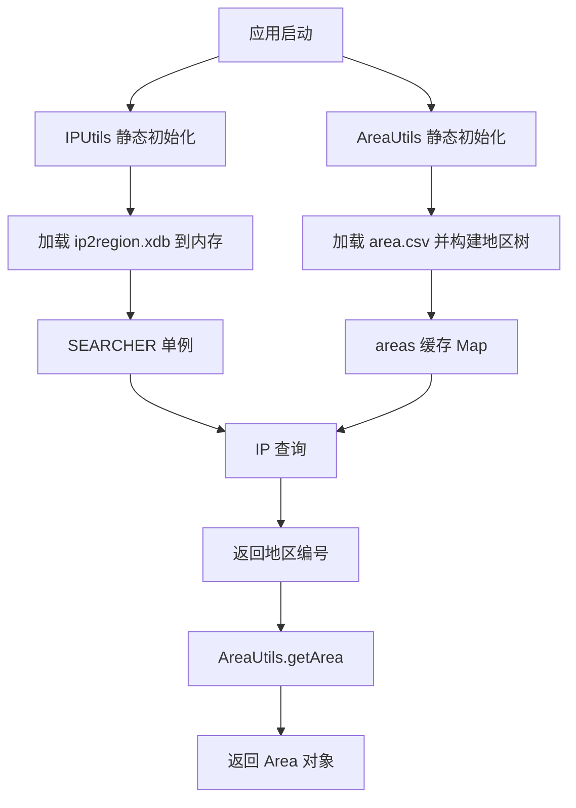
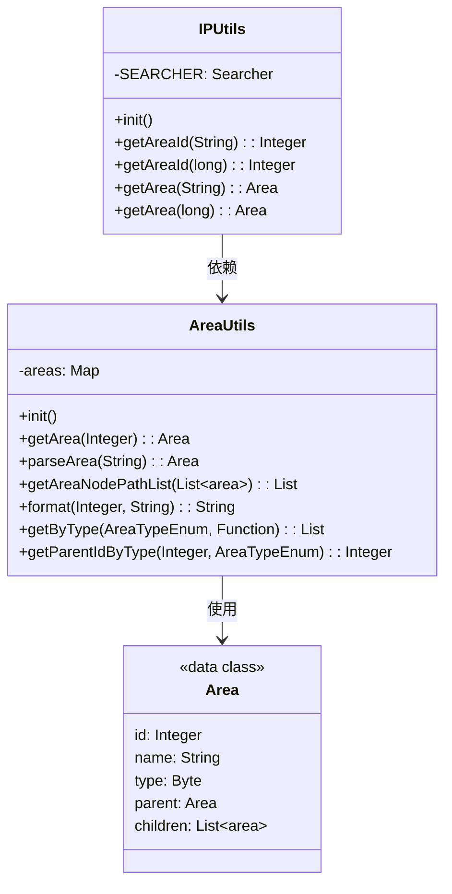

# Utils 模块文档

## 概述

`utils` 模块（`yudao-framework/yudao-spring-boot-starter-biz-ip`）提供了基于 IP2Region 的 IP 地址解析和地区信息查询功能。该模块通过加载内置的 `ip2region.xdb` 数据文件和 `area.csv` 地区表，实现高效的 IP 到地区编号的映射，并进一步提供地区名称的层次化查询和格式化。

主要特性：
- 启动时将 IP2Region 数据库加载到内存，实现毫秒级查询。
- 支持通过 IP 地址字符串或长整型 IP 获取地区编号。
- 通过地区编号获取完整的地区对象（包含父子关系）。
- 提供地区名称的层次化格式化（例如：`上海 上海市 静安区`）。
- 使用 Hutool 工具类进行 CSV 解析和资源加载。

## 核心组件

| 组件 | 所属文件 | 职责 |
|------|----------|------|
| `IPUtils` | `IPUtils.java` | 负责 IP 地址到地区编号的查询，封装了 ip2region.xdb 的搜索逻辑。 |
| `AreaUtils` | `AreaUtils.java` | 负责地区信息的加载、缓存、层次关系构建以及地区名称的格式化和查询。 |

## 架构说明

### 总体结构



### 组件关系



### 数据流

1. **应用启动**  
   - `IPUtils` 静态代码块触发 `init()`，读取 `ip2region.xdb` 并创建 `Searcher` 实例存入 `SEARCHER`。  
   - `AreaUtils` 静态代码块触发 `init()`，读取 `area.csv`，构建 `areas` 映射并建立父子关系。

2. **IP 查询流程**  
   - 调用 `IPUtils.getAreaId(ip)` → 调用底层 `SEARCHER.search(ip)` → 返回地区编号（字符串） → 转换为 `Integer`。  
   - 获得地区编号后，调用 `AreaUtils.getArea(id)` 从 `areas` 缓存中返回对应的 `Area` 对象。  
   - 如需格式化地区名称，可调用 `AreaUtils.format(id, separator)`。

3. **地区层次查询**  
   - `AreaUtils.parseArea(pathStr)` 根据路径字符串（如 “河南省/石家庄市/新华区”）逐级查找子地区。  
   - `AreaUtils.getAreaNodePathList(areas)` 遍历地区树，生成所有节点的全路径名称。

## 依赖说明

- **外部依赖**  
  - `cn.hutool:core`：提供资源读取、CSV 解析、断言等工具。  
  - `org.lionsoul.ip2region:xdb`：IP2Region 的 XDB 格式查询器。  
  - 项目内部：`cn.iocoder.yudao.framework.ip.core.Area`、`cn.iocoder.yudao.framework.ip.core.enums.AreaTypeEnum`（由同一模块提供）。

- **内部依赖**  
  - 无需依赖其他业务模块，属于通用工具包。

## 配置说明

该模块无需额外配置，所有数据文件随 JAR 打包：
- `ip2region.xdb`：IP2Region 精简版数据库。  
- `area.csv`：地区表，包含地区 ID、名称、类型、父 ID 等字段。

数据文件位于 classpath 根目录，通过 `ResourceUtil.getUtf8Reader()` 读取。

## 使用示例

```java
// 1. 通过 IP 地址获取地区编号
Integer areaId = IPUtils.getAreaId("110.242.68.3");
// 2. 获取地区对象
Area area = IPUtils.getArea("110.242.68.3");
// 3. 直接通过地区编号获取地区对象
Area area2 = AreaUtils.getArea(areaId);
// 4. 格式化地区名称（默认空格分隔）
String formatted = AreaUtils.format(areaId);
// 5. 获取省级地区列表
List<Area> provinces = AreaUtils.getByType(AreaTypeEnum.PROVINCE, Function.identity());
```

## 注意事项

- 首次查询会触发静态初始化，耗时取决于数据文件大小（通常几十毫秒）。  
- `SEARCHER` 和 `areas` 均为静态单例，生命周期与 JVM 保持一致，适用于高并发场景。  
- 如果需要更新地区数据，需重新打包更新 `area.csv` 和 `ip2region.xdb` 并重启应用。

## 与其他模块的关系

`utils` 模块为底层工具，可被任何需要 IP 地址解析或地区信息的模块依赖，例如：
- 系统模块的登录日志（记录登录 IP 的归属地）。  
- 业务模块的风控或统计功能（根据 IP 地区进行分析）。  
- 其他自定义工具类（如需要地区格式化的场景）。

由于其通用性，建议将其作为独立的 starter 引入，避免在业务代码中重复实现 IP 解析逻辑。