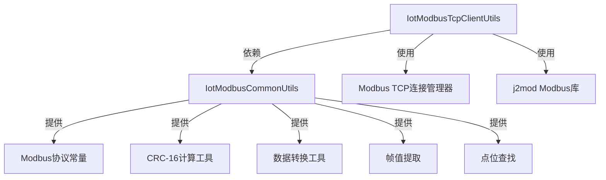

# utils_3 模块文档

## 概述

utils_3 模块是物联网网关中的Modbus通信工具集，提供了完整的Modbus TCP客户端实现和常用协议工具。该模块封装了基于j2mod库的Modbus TCP读写操作，包括功能码处理、CRC校验、数据转换等核心功能，为物联网设备的Modbus通信提供了可靠的底层支持。

## 架构概述

utils_3 模块由两个紧密协作的工具类组成：



### 核心组件

1. **IotModbusTcpClientUtils** (`IotModbusTcpClientUtils.java`)
   - 提供Modbus TCP客户端的读写操作
   - 封装了j2mod库的Modbus事务执行
   - 支持读取线圈、离散输入、保持寄存器和输入寄存器
   - 支持写入线圈和保持寄存器（单个和多个）

2. **IotModbusCommonUtils** (`IotModbusCommonUtils.java`)
   - 提供Modbus协议的常用工具方法
   - 定义了Modbus功能码常量和分类判断
   - 实现了CRC-16/MODBUS计算和校验算法
   - 提供原始值与物模型属性值之间的转换
   - 提供从Modbus帧中提取寄存器/线圈值的功能
   - 提供点位配置的查找功能

## 功能详解

### IotModbusTcpClientUtils

该类是Modbus TCP客户端的主要实现，提供了以下核心方法：

- `read()`: 读取Modbus数据，支持根据点位配置或直接指定参数读取
- `write()`: 写入Modbus数据，根据点位配置自动选择合适的写功能码
- `createReadRequest()`: 根据功能码创建对应的Modbus读取请求
- `createWriteRequest()`: 根据功能码创建对应的Modbus写入请求
- `extractValues()`: 从Modbus响应中提取原始值

### IotModbusCommonUtils

该类提供了Modbus协议的底层支持功能：

#### 功能码处理
- 定义了标准Modbus功能码常量（FC01-FC16）
- 提供了读/写/异常响应的判断方法
- 提供了从异常响应中提取原始功能码的方法
- 提供了根据读功能码获取对应写功能码的方法

#### CRC-16工具
- `calculateCrc16()`: 计算CRC-16/MODBUS值
- `verifyCrc16()`: 校验包含CRC的完整数据

#### 数据转换
- `convertToPropertyValue()`: 将原始寄存器/线圈值转换为物模型属性值
- `convertToRawValues()`: 将物模型属性值转换为原始寄存器值
- 支持多种数据类型：BOOLEAN、INT16、UINT16、INT32、UINT32、FLOAT、DOUBLE
- 支持不同的字节序（ABCD、BADC、CDAB、DCBA等）

#### 帧值提取
- `extractValues()`: 从解码后的Modbus帧中提取寄存器值或线圈值
- `extractRegisterCountFromResponse()`: 从响应帧中推断寄存器数量

#### 点位查找
- `findPoint()`: 根据标识符查找点位配置
- `findPointById()`: 根据点位ID查找点位配置

## 与其他模块的关系

utils_3 模块主要被物联网网关的Modbus通信层使用，为设备与Modbus TCP服务器的通信提供底层支持。它依赖于：

- `IotModbusTcpClientConnectionManager`: 用于获取Modbus TCP连接
- j2mod库: 用于底层Modbus协议实现
- 物联网核心模块的DTO: 如`IotModbusPointRespDTO`和`IotModbusDeviceConfigRespDTO`

## 使用示例

以下是使用utils_3模块进行Modbus TCP通信的基本示例：

```java
// 获取Modbus连接（通常通过连接管理器）
IotModbusTcpClientConnectionManager.ModbusConnection connection = 
    modbusTcpClientConnectionManager.getConnection(deviceConfig);

// 读取保持寄存器
IotModbusPointRespDTO point = ... // 从设备配置获取点位
Future<int[]> readFuture = IotModbusTcpClientUtils.read(connection, slaveId, point);
readFuture.onSuccess(values -> {
    // 处理读取到的值
    Object propertyValue = IotModbusCommonUtils.convertToPropertyValue(values, point);
});

// 写入线圈
int[] valuesToWrite = {1}; // 要写入的值
Future<Boolean> writeFuture = IotModbusTcpClientUtils.write(connection, slaveId, point, valuesToWrite);
writeFuture.onSuccess(success -> {
    if (success) {
        // 写入成功
    }
});
```

## 设计特点

1. **高内聚低耦合**: 两个工具类职责明确，IotModbusTcpClientUtils专注于客户端操作，IotModbusCommonUtils提供通用协议工具
2. **易于扩展**: 通过功能码的switch结构，可以轻松添对新的Modbus功能码支持
3. **错误处理**: 提供了详细的错误信息，包括slaveId、功能码、地址等关键参数，便于故障排查
4. **类型安全**: 支持多种数据类型转换，并在转换过程中保持数值的准确性
5. **灵活的字节序支持**: 支持多种Modbus设备常用的字节序配置

## 依赖说明

- j2mod库: 用于Modbus TCP通信的底层实现
- Lombok: 用于日志记录(@Slf4j)和工具类注解(@UtilityClass)
- Hutool: 用于集合和数组操作
- 框架通用工具: 如ObjectUtils等