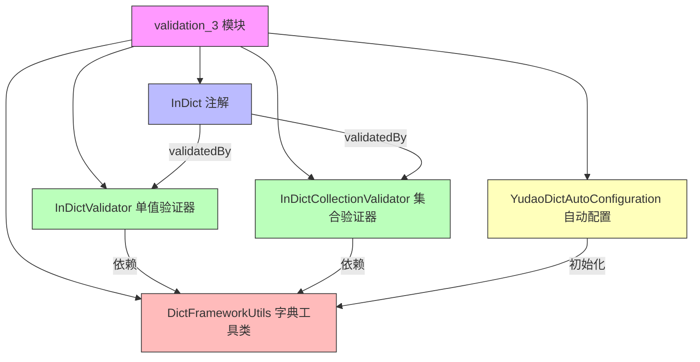
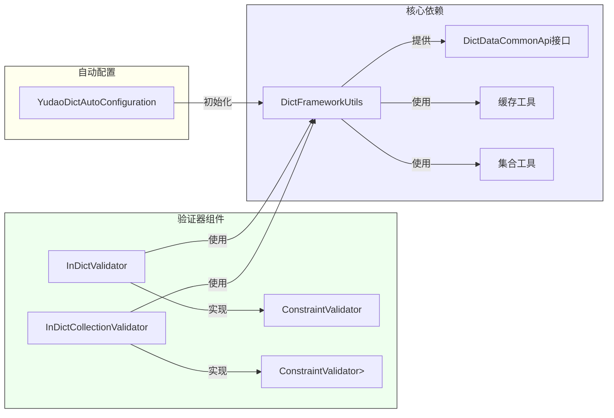
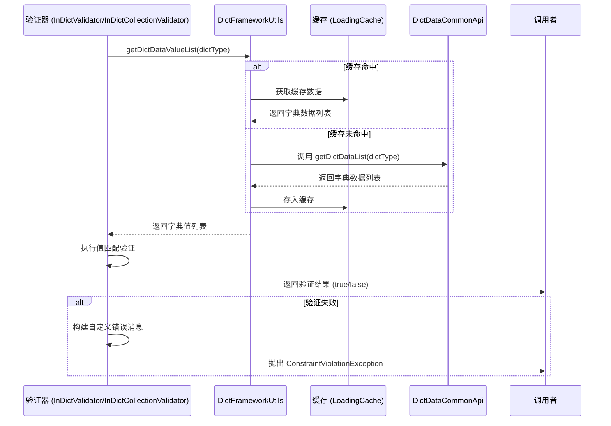

# validation_3 模块文档

## 模块概述

validation_3 模块是 yudao-framework 中用于数据字典验证的 Spring Boot Starter 组件。它提供了基于数据字典的自定义 JSR-303 验证注解，用于验证字段值是否在指定的数据字典范围内。

该模块包含两个主要的验证器实现：
1. `InDictValidator` - 用于单个值的字典验证
2. `InDictCollectionValidator` - 用于集合中所有值的字典验证

这些验证器与 `InDict` 注解配合使用，能够自动从数据字典服务获取对应类型的字典数据，并进行值匹配验证。

## 核心功能

1. **数据字典值验证**：验证字段值是否存在于指定数据字典类型的值列表中
2. **大小写不敏感匹配**：支持忽略大小写的值比较
3. **自定义错误消息**：当验证失败时，提供包含允许值列表的友好错误提示
4. **空值处理**：空值默认视为验证通过（不进行验证）
5. **集合元素验证**：对于集合类型，验证集合中所有元素是否都在字典值范围内
6. **缓存机制**：通过 `DictFrameworkUtils` 利用缓存提高字典数据获取性能

## 架构设计

### 模块结构



### 组件关系



## 详细设计

### InDict 注解

`InDict` 是一个自定义的 JSR-303 约束注解，用于标记需要进行数据字典验证的字段。

**关键属性：**
- `type()`：指定要验证的数据字典类型（必填）
- `message()`：验证失败时的错误消息模板，默认为 "必须在指定范围 {value}"
- `groups()`：验证组，默认为空数组
- `payload()`：有效载荷，默认为空数组

**使用示例：**
```java
@InDict(type = "sex")
private String gender;

@InDict(type = "status", message = "状态值必须在 {value} 范围内")
private Integer status;
```

### InDictValidator 单值验证器

实现了 `ConstraintValidator<InDict, Object>` 接口，用于验证单个对象值是否在指定数据字典中。

**验证流程：**
1. 检查值是否为 null，如果为 null 则直接返回 true（验证通过）
2. 从 `DictFrameworkUtils` 获取指定字典类型的所有值列表
3. 使用大小写不敏比较检查值是否存在于字典值列表中
4. 如果匹配成功，返回 true（验证通过）
5. 如果匹配失败：
   - 禁用默认的错误消息
   - 构建自定义错误消息，包含允许的值列表
   - 添加约束违规并返回 false

**核心实现：**
```java
@Override
public boolean isValid(Object value, ConstraintValidatorContext context) {
    // 为空时，默认不校验，即认为通过
    if (value == null) {
        return true;
    }
    // 校验通过
    final List<String> values = DictFrameworkUtils.getDictDataValueList(dictType);
    boolean match = values.stream().anyMatch(v -> StrUtil.equalsIgnoreCase(v, value.toString()));
    if (match) {
        return true;
    }

    // 校验不通过，自定义提示语句
    context.disableDefaultConstraintViolation(); // 禁用默认的 message 的值
    context.buildConstraintViolationWithTemplate(
            context.getDefaultConstraintMessageTemplate().replaceAll("\\{value}", values.toString())
    ).addConstraintViolation(); // 重新添加错误提示语句
    return false;
}
```

### InDictCollectionValidator 集合验证器

实现了 `ConstraintValidator<InDict, Collection<?>>` 接口，用于验证集合中所有元素是否都在指定数据字典中。

**验证流程：**
1. 检查集合是否为空，如果为空则直接返回 true（验证通过）
2. 从 `DictFrameworkUtils` 获取指定字典类型的所有值列表
3. 检查集合中所有元素是否都存在于字典值列表中（大小写不敏感）
4. 如果所有元素匹配成功，返回 true（验证通过）
5. 如果有元素不匹配：
   - 禁用默认的错误消息
   - 构建自定义错误消息，包含允许的值列表
   - 添加约束违规并返回 false

**核心实现：**
```java
@Override
public boolean isValid(Collection<?> list, ConstraintValidatorContext context) {
    // 为空时，默认不校验，即认为通过
    if (CollUtil.isEmpty(list)) {
        return true;
    }
    // 校验全部通过
    List<String> dbValues = DictFrameworkUtils.getDictDataValueList(dictType);
    boolean match = list.stream().allMatch(v -> dbValues.stream()
            .anyMatch(dbValue -> dbValue.equalsIgnoreCase(v.toString())));
    if (match) {
        return true;
    }

    // 校验不通过，自定义提示语句
    context.disableDefaultConstraintViolation(); // 禁用默认的 message 的值
    context.buildConstraintViolationWithTemplate(
            context.getDefaultConstraintMessageTemplate().replaceAll("\\{value}", dbValues.toString())
    ).addConstraintViolation(); // 重新添加错误提示语句
    return false;
}
```

### DictFrameworkUtils 字典工具类

提供了获取和解析数据字典数据的工具方法，内部使用缓存机制提高性能。

**主要方法：**
- `getDictDataValueList(String dictType)`：获取指定字典类型的所有值列表
- `getDictDataLabelList(String dictType)`：获取指定字典类型的所有标签列表
- `parseDictDataLabel(String dictType, String value)`：根据值解析对应的标签
- `parseDictDataValue(String dictType, String label)`：根据标签解析对应的值

**缓存机制：**
- 使用 Google Guava 的 `LoadingCache` 缓存字典数据
- 缓存过期时间为 1 分钟
- 自动通过 `DictDataCommonApi` 接口获取最新数据
- 提供 `clearCache()` 方法手动清除缓存

### YudaoDictAutoConfiguration 自动配置类

Spring Boot 自动配置类，负责初始化 `DictFrameworkUtils`。

**工作原理：**
1. 当应用启动时，Spring Boot 自动检测并加载此配置类
2. 通过 `@Bean` 方法创建 `DictFrameworkUtils` 实例
3. 在创建过程中调用 `DictFrameworkUtils.init(dictDataApi)` 进行初始化
4. 将 `DictDataCommonApi` 依赖注入到初始化方法中

## 数据流



## 与其他模块的关系

validation_3 模块主要依赖以下模块和组件：

1. **yudao-common 模块**：
   - 使用 `cn.iocoder.yudao.framework.common.util.cache.CacheUtils` 进行缓存操作
   - 使用 `cn.iocoder.yudao.framework.common.util.collection.CollectionUtils` 进行集合转换

2. **yudao-framework/yudao-common 模块的系统服务**：
   - 依赖 `cn.iocoder.yudao.framework.common.biz.system.dict.DictDataCommonApi` 获取字典数据
   - 使用 `cn.iocoder.yudao.framework.common.biz.system.dict.dto.DictDataRespDTO` 作为数据传输对象

3. **Spring 框架**：
   - 实现 JSR-303 验证规范的 `ConstraintValidator` 接口
   - 使用 Spring Boot 自动配置机制

4. **第三方库**：
   - 使用 Hutool 工具库 (`cn.hutool.core.util.StrUtil`, `cn.hutool.core.collection.CollUtil`)
   - 使用 Google Guava 缓存 (`com.google.common.cache.LoadingCache`)

## 使用指南

### 在项目中添加依赖

如果使用 Maven，在 pom.xml 中添加：
```xml
<dependency>
    <groupId>cn.iocoder</groupId>
    <artifactId>yudao-spring-boot-starter-excel</artifactId>
    <version>${yudao.version}</version>
</dependency>
```

### 在实体类中使用验证注解

```java
import cn.iocoder.yudao.framework.dict.validation.InDict;
import jakarta.validation.constraints.NotNull;

public class UserDTO {
    
    @NotNull
    @InDict(type = "gender")
    private String gender;
    
    @NotNull
    @InDict(type = "status")
    private Integer status;
    
    // 集合验证示例
    @NotNull
    @InDict(type = "permission")
    private List<String> permissions;
    
    // Getters and Setters
}
```

### 在Controller方法参数中使用

```java
@RestController
@RequestMapping("/users")
public class UserController {
    
    @PostMapping
    public Result<?> createUser(@Valid @RequestBody UserDTO userDTO) {
        // 如果验证失败，会自动返回参数校验错误
        return userService.createUser(userDTO);
    }
}
```

### 自定义错误消息

```java
public class UserDTO {
    
    @InDict(type = "gender", message = "性别值必须是以下之一: {value}")
    private String gender;
}
```

当验证失败时，错误消息会类似于："性别值必须是以下之一: [男,女,未知]"

## 性能考虑

1. **缓存机制**：字典数据通过 `DictFrameworkUtils` 缓存，有效期为1分钟，减少对字典服务的频繁调用
2. **异步加载**：使用 `CacheUtils.buildAsyncReloadingCache` 实现异步缓存加载，避免阻塞主线程
3. **流式处理**：验证过程使用 Java Stream API，能够高效处理大量数据
4. **早期返回**：空值和匹配成功时直接返回，减少不必要的处理

## 异常处理

1. **空值处理**：null 值和空集合直接视为验证通过，不进行字典查询
2. **字典服务异常**：如果 `DictDataCommonApi` 调用失败，会通过缓存机制的异常传播机制抛出相应异常
3. **验证失败**：验证失败时不会抛出异常，而是返回 false 并设置约束违规信息，由 Bean Validation 框架处理

## 测试建议

1. **单元测试**：
   - 测试 null 值和空集合的验证结果应为 true
   - 测试有效值的验证结果应为 true
   - 测试无效值的验证结果应为 false 且错误消息正确
   - 测试大小写不敏感匹配功能
   - 测试集合验证器中部分元素无效的情况

2. **集成测试**：
   - 测试与实际字典服务的集成
   - 测试缓存失效和更新机制
   - 测试在完整的验证链条中的工作情况

## 与类似功能的对比

### 与 InEnumValidator 的区别

| 特性 | InDictValidator | InEnumValidator |
|------|----------------|----------------|
| 数据来源 | 动态从数据字典服务获取 | 静态从枚举类获取 |
| 数据更新 | 支持运行时更新（通过缓存刷新） | 需要重新部署更新 |
| 使用场景 | 业务动态配置的验证 | 固定不变的枚举验证 |
| 性能 | 依赖缓存，首次查询略慢 | 直接内存访问，最快 |
| 维护成本 | 需要维护字典数据 | 需要维护枚举类 |

### 与手动验证的区别

| 特性 | 使用 InDict 注解 | 手动验证 |
|------|----------------|----------|
| 代码量 | 最少，只需添加注解 | 需要编写验证逻辑代码 |
| 可重用性 | 高，可在多个字段复用 | 低，每个字段需要重复编写 |
| 维护性 | 高，修改注解参数即可 | 低，需要修改验证逻辑代码 |
| 一致性 | 高，统一的验证逻辑和错误消息 | 低，可能因实现者不同而有差异 |
| 集成度 | 高，完美集成到 Bean Validation 框架 | 低，需要手动调用验证方法 |

## 最佳实践

1. **合理设置字典类型**：确保 `type()` 参数指向正确的数据字典类型
2. **考虑空值处理**：根据业务需求决定是否允许空值，当不允许时应结合 `@NotNull` 使用
3. **自定义错误消息**：在需要特定错误提示时，使用 `message` 参数自定义错误消息
4. **集合验证注意事项**：使用集合验证器时，确保理解其验证逻辑是“所有元素都必须在字典范围内”
5. **性能监控**：在高并发场景下监控字典服务的调用频率，确保缓存机制有效工作
6. **单元测试覆盖**：为使用了字典验证的DTO编写完整的单元测试，覆盖各种验证场景

## 结论

validation_3 模块提供了一种优雅、可重用且高性能的方式来进行数据字典值验证。通过将验证逻辑封装在注解和验证器中，它显著减少了样板代码，提高了代码的一致性和可维护性。该模块充分利用了 Spring Boot 的自动配置和 Bean Validation 框架，能够无缝集成到现有的验证流程中。其内置的缓存机制确保了在频繁验证场景下的良好性能，使其成为处理动态字典验证的理想选择。