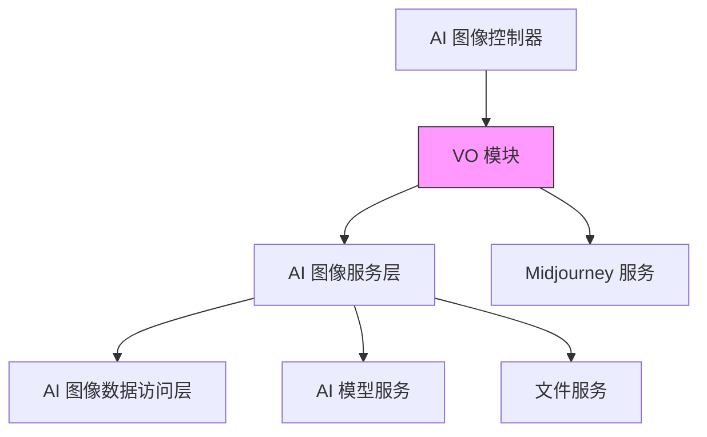
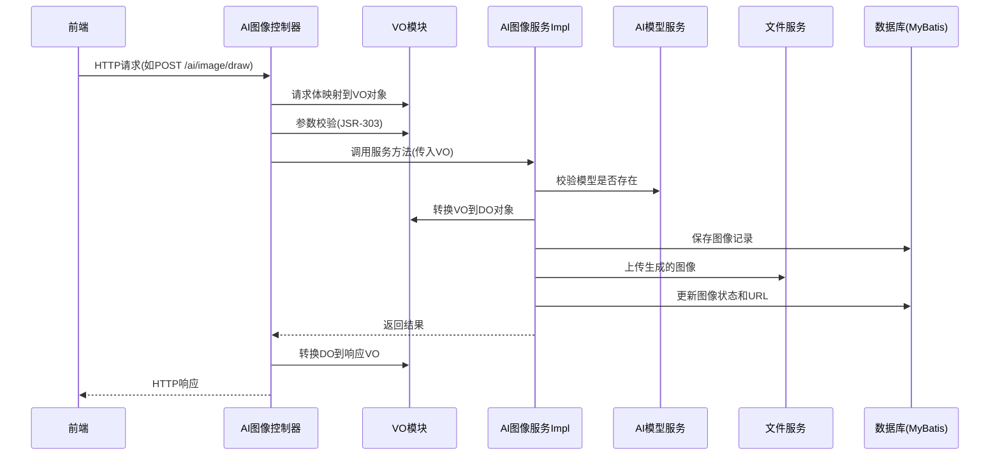

# AI 图像功能 VO 模块文档

## 模块概述

AI 图像功能的 VO (Value Object) 模块位于 `yudao-module-ai/src/main/java/cn/iocoder/yudao/module/ai/controller/admin/image/vo/` 目录下，包含了 AI 图像相关的所有数据传输对象。这些 VO 负责在控制器层与服务层之间传递数据，定义了 API 请求和响应的数据结构。

该模块主要包含以下类型的 VO：
- 请求 VO：用于接收客户端请求数据
- 响应 VO：用于向客户端返回数据
- 分页请求 VO：用于分页查询请求
- 特定平台 VO：如 Midjourney 专用的请求 VO

## 核心组件

### 1. AiImageUpdateReqVO
**位置**: `yudao-module-ai/src/main/java/cn/iocoder/yudao/module/ai/controller/admin/image/vo/AiImageUpdateReqVO.java`

用于更新 AI 图像信息的请求对象。

#### 字段说明
| 字段名 | 类型 | 说明 | 是否必填 | 示例值 |
|--------|------|------|----------|--------|
| id | Long | 图像编号 | 是 | 15583 |
| publicStatus | Boolean | 是否发布 | 否 | true |

#### 使用场景
- 管理员更新图像的发布状态
- 调用接口: `PUT /ai/image/update`

### 2. AiImagePublicPageReqVO
**位置**: `yudao-module-ai/src/main/java/cn/iocoder/yudao/module/ai/controller/admin/image/vo/AiImagePublicPageReqVO.java`

用于获取公开 AI 图像列表的分页请求对象。

#### 字段说明
| 字段名 | 类型 | 说明 | 是否必填 | 示例值 |
|--------|------|------|----------|--------|
| 继承自 PageParam | - | 分页参数 (pageSize, pageNo) | 是 | - |
| prompt | String | 提示词过滤条件 | 否 | 南极的小企鹅 |

#### 使用场景
- 前端展示公开的 AI 生成图像
- 调用接口: `GET /ai/image/public-page`

### 3. AiImageRespVO
**位置**: `yudao-module-ai/src/main/java/cn/iocoder/yudao/module/ai/controller/admin/image/vo/AiImageRespVO.java`

AI 图像的响应对象，用于向前端返回图像详细信息。

#### 字段说明
| 字段名 | 类型 | 说明 | 是否必填 | 示例值 |
|--------|------|------|----------|--------|
| id | Long | 图像编号 | 是 | 1 |
| userId | Long | 用户编号 | 是 | 1 |
| platform | String | AI 平台 | 是 | OpenAI |
| model | String | 使用的模型 | 是 | stable-diffusion-v1-6 |
| prompt | String | 生成图像的提示词 | 是 | 南极的小企鹅 |
| width | Integer | 图像宽度 | 是 | 1024 |
| height | Integer | 图像高度 | 是 | 1024 |
| status | Integer | 绘画状态 | 是 | 10 |
| publicStatus | Boolean | 是否发布 | 是 | true |
| picUrl | String | 图片访问地址 | 否 | https://www.iocoder.cn/1.png |
| errorMessage | String | 错误信息（生成失败时） | 否 | 图片错误信息 |
| options | Map<String, String> | 绘制参数 | 否 | {style: "vivid"} |
| buttons | List<MidjourneyApi.Button> | Midjourney 按钮信息 | 否 | - |
| finishTime | LocalDateTime | 完成时间 | 否 | 2023-01-01 12:00:00 |
| createTime | LocalDateTime | 创建时间 | 是 | 2023-01-01 10:00:00 |

#### 使用场景
- 图像详情展示
- 图像列表项数据
- 调用接口: `GET /ai/image/get-my`, `GET /ai/image/page` 等

### 4. AiImageDrawReqVO
**位置**: `yudao-module-ai/src/main/java/cn/iocoder/yudao/module/ai/controller/admin/image/vo/AiImageDrawReqVO.java`

用于生成 AI 图像的请求对象。

#### 字段说明
| 字段名 | 类型 | 说明 | 是否必填 | 示例值 |
|--------|------|------|----------|--------|
| modelId | Long | 模型编号 | 是 | 1024 |
| prompt | String | 提示词 | 是 | 画一个长城 |
| height | Integer | 图片高度 | 是 | 512 |
| width | Integer | 图片宽度 | 是 | 512 |
| options | Map<String, String> | 平台特定绘制参数 | 否 | {style: "natural"} |

#### 平台特定参数说明
- **OpenAI (DALL-E)**: 支持 style 参数
- **Stability AI**: 支持 seed, cfgScale, steps, sampler, stylePreset, clipGuidancePreset 等参数
- **Silicon Flow**: 基础参数
- **通义万象**: 基础参数

#### 使用场景
- 用户提交图像生成请求
- 调用接口: `POST /ai/image/draw`

### 5. AiImagePageReqVO
**位置**: `yudao-module-ai/src/main/java/cn/iocoder/yudao/module/ai/controller/admin/image/vo/AiImagePageReqVO.java`

用于查询用户私有 AI 图像列表的分页请求对象。

#### 字段说明
| 字段名 | 类型 | 说明 | 是否必填 | 示例值 |
|--------|------|------|----------|--------|
| 继承自 PageParam | - | 分页参数 (pageSize, pageNo) | 是 | - |
| userId | Long | 用户编号过滤 | 否 | 28987 |
| platform | String | 平台过滤 | 否 | OpenAI |
| prompt | String | 提示词过滤 | 否 | 长城 |
| status | Integer | 绘画状态过滤 | 否 | 1 (进行中) |
| publicStatus | Boolean | 是否发布过滤 | 否 | true |
| createTime | LocalDateTime[] | 创建时间范围 | 否 | [2023-01-01 00:00:00, 2023-01-31 23:59:59] |

#### 使用场景
- 用户个人中心查看自己的 AI 生成图像
- 管理员后台查询所有图像
- 调用接口: `GET /ai/image/my-page`, `GET /ai/image/page`

### 6. AiMidjourneyImagineReqVO
**位置**: `yudao-module-ai/src/main/java/cn/iocoder/yudao/module/ai/controller/admin/image/vo/midjourney/AiMidjourneyImagineReqVO.java`

用于 Midjourney 平台生成图像的专用请求对象。

#### 字段说明
| 字段名 | 类型 | 说明 | 是否必填 | 示例值 |
|--------|------|------|----------|--------|
| prompt | String | 提示词 | 是 | 中国神龙 |
| modelId | Long | 模型编号 | 是 | 1 |
| width | Integer | 图片宽度 | 是 | 1024 |
| height | Integer | 图片高度 | 是 | 1024 |
| version | String | Midjourney 版本号 | 是 | 6.0 |
| referImageUrl | String | 参考图 URL（用于图生图） | 否 | https://www.iocoder.cn/x.png |

#### 使用场景
- 通过 Midjourney 生成图像
- 调用接口: `POST /ai/image/midjourney/imagine`

### 7. AiMidjourneyActionReqVO
**位置**: `yudao-module-ai/src/main/java/cn/iocoder/yudao/module/ai/controller/admin/image/vo/midjourney/AiMidjourneyActionReqVO.java`

用于 Midjourney 平台执行图像操作（如放大、变体等）的请求对象。

#### 字段说明
| 字段名 | 类型 | 说明 | 是否必填 | 示例值 |
|--------|------|------|----------|--------|
| id | Long | 原始图像编号 | 是 | 1 |
| customId | String | 操作按钮编号（如 U1, U2, V1, V2 等） | 是 | MJ::JOB::variation::4::06aa3e66-0e97-49cc-8201-e0295d883de4 |

#### 使用场景
- 对已生成的 Midjourney 图像执行后续操作
- 调用接口: `POST /ai/image/midjourney/action`

## 架构设计

### 1. 模块结构
```
vo/
├── AiImageUpdateReqVO.java          # 更新图像请求
├── AiImagePublicPageReqVO.java      # 公开图像分页请求
├── AiImageRespVO.java               # 图像响应对象
├── AiImageDrawReqVO.java            # 图像生成请求
├── AiImagePageReqVO.java            # 私有图像分页请求
└── midjourney/
    ├── AiMidjourneyImagineReqVO.java # Midjourney 生成请求
    └── AiMidjourneyActionReqVO.java  # Midjourney 操作请求
```

### 2. 与其他模块的关系


### 3. 数据流向


## 详细设计说明

### 1. VO 设计原则
- **职责单一**：每个 VO 只负责一种业务场景的数据传输
- **字段精准**：只包含当前操作所需的字段，避免冗余
- **验证明确**：使用 JSR-303 注解进行参数验证
- **文档完整**：使用 Swagger 注解生成 API 文档
- **继承合理**：分页请求继承自通用的 PageParam 类

### 2. 平台适配设计
在 `AiImageDrawReqVO` 中，通过 `options` 字段（Map<String, String>）实现了不同 AI 平台的参数适配：
- OpenAI 平台：支持 style 参数
- Stability AI 平台：支持 seed, cfgScale, steps 等高级参数
- 其他平台：根据具体能力扩展相应参数

这种设计使得系统可以轻松添加新的 AI 平台支持，而无需修改核心请求结构。

### 3. Midjourney 特殊处理
Midjourney 由于其独特的工作流程（任务提交、轮询结果、按钮操作），需要专门的 VO：
- `AiMidjourneyImagineReqVO`：包含版本号和参考图 URL 等 Midjourney 特有字段
- `AiMidjourneyActionReqVO`：通过 customId 标识具体的操作类型（放大、变体等）

### 4. 状态管理
在 `AiImageRespVO` 中，通过 `status` 字段完整地表示图像生成的生命周期：
- IN_PROGRESS (10)：生成中
- SUCCESS (20)：生成成功
- FAIL (30)：生成失败

这种状态机设计使得前端可以根据状态展示不同的 UI（如加载中、成功展示、错误提示）。

## 使用示例

### 1. 生成图像请求
```json
POST /ai/image/draw
{
  "modelId": 1024,
  "prompt": "画一个长城",
  "width": 512,
  "height": 512,
  "options": {
    "style": "vivid"
  }
}
```

### 2. 查询个人图像列表
```http
GET /ai/image/my-page?pageNo=1&pageSize=10&status=20&publicStatus=true
```

### 3. 更新图像发布状态
```json
PUT /ai/image/update
{
  "id": 15583,
  "publicStatus": true
}
```

### 4. Midjourney 生成图像
```json
POST /ai/image/midjourney/imagine
{
  "prompt": "中国神龙",
  "modelId": 1,
  "width": 1024,
  "height": 1024,
  "version": "6.0",
  "referImageUrl": "https://www.iocoder.cn/reference.png"
}
```

### 5. Midjourney 图像操作（放大）
```json
POST /ai/image/midjourney/action
{
  "id": 1,
  "customId": "MJ::JOB::upscale::1::06aa3e66-0e97-49cc-8201-e0295d883de4"
}
```

## 与相关模块的关联

### 1. 与 AI 模型模块的关联
VO 中的 `modelId` 字段关联到 AI 模型管理模块，通过该 ID 可以获取模型的详细信息（平台、模型名称等）。

### 2. 与文件服务模块的关联
生成的图像会通过文件服务上传到存储系统，URL 存储在 `picUrl` 字段中。

### 3. 与 Midjourney 服务的关联
专门的 Midjourney VO 与 Midjourney 服务紧密配合，实现图像生成、状态查询和后续操作的完整流程。

## 最佳实践

### 1. VO 设计建议
- 保持 VO 的精简性，只包含必要字段
- 使用合适的数据类型（如枚举代替魔法数字）
- 为所有字段添加明确的中文注释和 Swagger 注解
- 考虑前端实际使用场景设计字段

### 2. 参数验证
- 使用 JSR-303 注解（@NotNull, @NotEmpty, @Size 等）进行基本验证
- 在服务层进行业务层面的验证（如模型是否存在、用户是否有权限等）
- 验证信息要明确，帮助前端快速定位问题

### 3. 分页设计
- 所有分页请求应继承自统一的 PageParam 类
- 时间范围查询使用数组类型 LocalDateTime[] 表示开始和结束时间
- 避免在 VO 中复杂的业务逻辑，保持其作为纯数据传输对象的特性

### 4. 国际化考虑
- VO 中的字段名应具有语义 clarity
- 错误信息等用户可见内容应在服务层处理国际化
- 枚举值等应考虑多语言映射

## 依赖关系

### 被以下模块依赖
- `AiImageController`：控制器层，直接使用 VO 处理请求和响应
- `AiImageServiceImpl`：服务层，在业务处理过程中转换 VO 和 DO
- `AiMidjourneySyncJob`：Midjourney 同步任务，使用 VO 进行状态更新

### 依赖以下模块
- `cn.iocoder.yudao.framework.common.pojo.PageParam`：分页基类
- `cn.iocoder.yudao.module.ai.framework.ai.core.model.midjourney.api.MidjourneyApi`：Midjourney API 定义
- `org.springframework.ai.openai.OpenAiImageOptions`：OpenAI 图像选项
- `org.springframework.ai.stabilityai.api.StabilityAiImageOptions`：Stability AI 图像选项

## 小结

AI 图像功能的 VO 模块是整个 AI 图像功能的重要组成部分，它：
1. 定义了所有 API 接口的请求和响应数据结构
2. 实现了前端与后端之间的数据契约
3. 提供了清晰的数据验证机制
4. 支持多种 AI 平台的特性扩展
5. 为不同业务场景提供了专门的 VO 设计

通过合理的 VO 设计，使得 AI 图像功能具有良好的可扩展性和可维护性，能够轻松支持新的 AI 平台和功能特性。