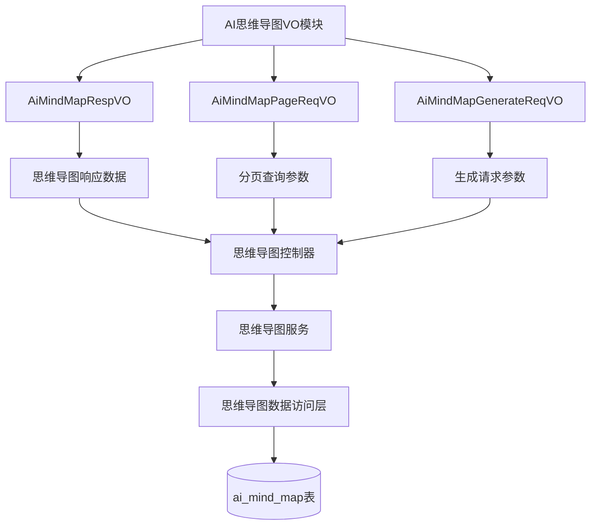
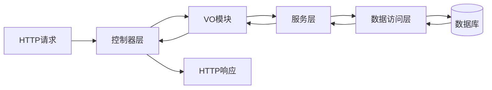
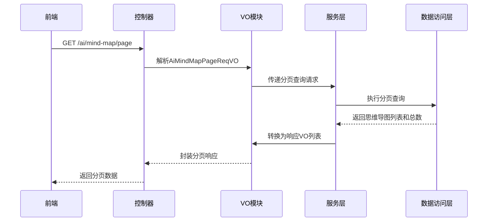
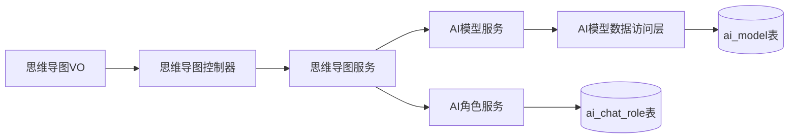
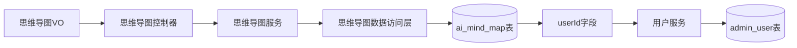

# AI思维导图VO模块文档

## 模块概述

AI思维导图VO模块是Yudao AI平台的一部分，负责定义与AI思维导图功能相关的视图对象（Value Object）。该模块包含用于思维导图生成、分页查询和响应的VO类，为前端与后端之间的数据传输提供标准化接口。

该模块主要包含以下组件：
- `AiMindMapRespVO`：思维导图响应视图对象
- `AiMindMapPageReqVO`：思维导图分页请求视图对象
- `AiMindMapGenerateReqVO`：思维导图生成请求视图对象

这些VO对象与AI思维导图控制器（`AiMindMapController`）和服务层（`AiMindMapServiceImpl`）协同工作，实现思维导图的生成、查询和管理功能。

## 架构设计

### 模块结构



### 组件关系

VO模块作为数据传输层，位于控制器和服务层之间，负责：
1. 将HTTP请求参数封装为VO对象
2. 将服务层数据转换为前端友好的响应格式
3. 提供数据验证和文档说明（通过注解）



## 详细组件说明

### AiMindMapRespVO

思维导图响应视图对象，用于将思维导图数据返回给前端。

**字段说明：**
- `id`：思维导图编号，主键
- `userId`：用户编号，关联用户表
- `prompt`：生成内容提示，用户输入的思维导图主题
- `generatedContent`：生成的思维导图内容（通常为Markdown或JSON格式）
- `platform`：使用的AI平台（如OpenAI、百度文心等）
- `model`：使用的具体模型名称
- `errorMessage`：生成过程中的错误信息（如果有）
- `createTime`：创建时间

**关联关系：**
- 关联用户表（通过userId）
- 关联AI模型表（通过modelId在DO层）

### AiMindMapPageReqVO

思维导图分页请求视图对象，用于分页查询思维导图列表。

**字段说明：**
- `userId`：用户编号，可选过滤条件
- `prompt`：生成内容提示，可选过滤条件
- `createTime`：创建时间范围，支持区间查询
- 继承自`PageParam`，包含分页参数（页码、页大小等）

**使用场景：**
- 后台管理界面的思维导图列表查询
- 支持按用户、提示内容、时间范围过滤

### AiMindMapGenerateReqVO

思维导图生成请求视图对象，用于提交思维导图生成请求。

**字段说明：**
- `prompt`：思维导图内容提示，必填参数，用于指导AI生成思维导图

**验证规则：**
- `prompt`不能为空，通过`@NotBlank`注解进行验证

**使用场景：**
- 前端用户提交思维导图生成请求时使用
- 触发AI服务生成思维导图内容

## 数据流程

### 思维导图生成流程

```mermaid
sequenceDiagram
    participant 前端
    participant 控
    participant VO模块
    participant 服务层
    participant 数据->>控制器: POST /ai/mind-map/generate-stream
    控制器->>VO模块: 解析AiMindMapGenerateReqVO
    VO模块->>服务层: 传递生成请求
    服务层->>AI服务: 调用AI模型生成思维导图
    AI服务-->>服务层: 返回生成内容（流式）
    服务层->>数据访问层: 保存思维导图记录
    数据访问层-->>服务层: 保存结果
    服务层-->>VO模块: 处理结果
    VO模块-->>控制器: 封装响应
    控制器-->>前端: 返回流式生成结果
```

### 思维导图查询流程



## 与其他模块的关联

### 与AI模型模块的关联

思维导图功能依赖于AI模型服务来生成内容：



### 与用户模块的关联

思维导图记录与用户信息关联：



## 接口说明

### 生成思维导图接口

- **路径**：`POST /ai/mind-map/generate-stream`
- **请求体**：`AiMindMapGenerateReqVO`
- **响应**：`Flux<CommonResult<String>>`（流式返回）
- **功能**：根据用户提供的提示词生成思维导图内容，采用流式传输提高响应速度
- **权限**：无需特殊权限，但需要用户登录

### 分页查询思维导图接口

- **路径**：`GET /ai/mind-map/page`
- **请求参数**：`AiMindMapPageReqVO`
- **响应**：`CommonResult<PageResult<AiMindMapRespVO>>`
- **功能**：分页查询思维导图列表，支持多种过滤条件
- **权限**：需要`ai:mind-map:query`权限

### 删除思维导图接口

- **路径**：`DELETE /ai/mind-map/delete`
- **请求参数**：`id`（思维导图编号）
- **响应**：`CommonResult<Boolean>`
- **功能**：删除指定ID的思维导图记录
- **权限**：需要`ai:mind-map:delete`权限

## 数据库设计

思维导图VO对应的数据库表结构（通过AiMindMapDO反推）：

```sql
CREATE TABLE ai_mind_map (
    id BIGINT PRIMARY KEY AUTO_INCREMENT,
    user_id BIGINT NOT NULL COMMENT '用户编号',
    platform VARCHAR(50) NOT NULL COMMENT 'AI平台',
    model_id BIGINT COMMENT '模型编号',
    model VARCHAR(100) COMMENT '模型名称',
    prompt TEXT NOT NULL COMMENT '生成内容提示',
    generated_content TEXT COMMENT '生成的思维导图内容',
    error_message VARCHAR(500) COMMENT '错误信息',
    create_time DATETIME NOT NULL COMMENT '创建时间',
    -- 其他继承字段如更新时间等
);
```

## 异常处理

在思维导图生成过程中可能遇到的异常情况：

1. **模型不存在**：当指定的AI模型不可用时
2. **模型类型错误**：当使用的模型类型不支持思维导图生成时
3. **思维导图不存在**：当尝试访问或删除不存在的思维导图时
4. **生成过程异常**：AI服务调用失败或返回错误时

这些异常在服务层被捕获并转换为适当的错误响应，在VO层通过`通过`errorMessage`字段返回给前端。

## 使用示例

### 生成思维导图请求

```json
{
  "prompt": "Java 学习路线"
}
```

### 响应示例（流式）

```json
{
  "code": 200,
  "msg": "成功",
  "data": "# Java 学习路线\n\n## 基础语法\n- 变量\n- 数据类型\n..."
}
```

### 分页查询请求

```json
{
  "pageNo": 1,
  "pageSize": 10,
  "userId": 123,
  "prompt": "Java",
  "createTime": ["2024-01-01 00:00:00", "2024-12-31 23:59:59"]
}
```

### 响应示例

```json
{
  "code": 200,
  "msg": "成功",
  "data": {
    "list": [
      {
        "id": 3373,
        "userId": 4325,
        "prompt": "Java 学习路线",
        "generatedContent": "# Java 学习路线\n\n## 基础语法\n- 变量\n- 数据类型\n...",
        "platform": "OpenAI",
        "model": "gpt-3.5-turbo-0125",
        "errorMessage": null,
        "createTime": "2024-06-15 10:30:00"
      }
    ],
    "total": 1,
    "pageNo": 1,
    "pageSize": 10
  }
}
```

## 最佳实践

1. **数据验证**：在VO层使用JSR-303注解进行参数验证，确保数据合法性
2. **异常统一处理**：在服务层捕获异常，统一转换为前端可识别的错误格式
3. **流式响应**：对于可能耗时的AI生成操作，使用流式响应提升用户体验
4. **安全考虑**：所有涉及用户数据的操作都需要进行权限检查
5. **国际化支持**：VO中的描述信息应考虑国际化需求
6. **字段文档**：使用Swagger注解为所有字段提供清晰的说明，便于API文档生成

## 依赖关系

VO模块依赖于以下基础组件：
- Lombok：用于简化VO类的getter/setter等 boilerplate 代码
- Swagger/OpenAPI：用于API文档生成和字段说明
- Hibernate Validator：用于参数验证
- Spring Framework：用于web请求处理和依赖注入

## 结论

AI思维导图VO模块为Yudao AI平台的思维导图功能提供了清晰、标准化的数据传输接口。通过定义精确的VO对象，该模块确保了前端与后端之间的数据一致性，同时提供了必要的验证和文档支持。该模块与控制器、服务层和数据访问层紧密协作，实现了思维导图的生成、查询和管理功能，是AI平台重要的组成部分。