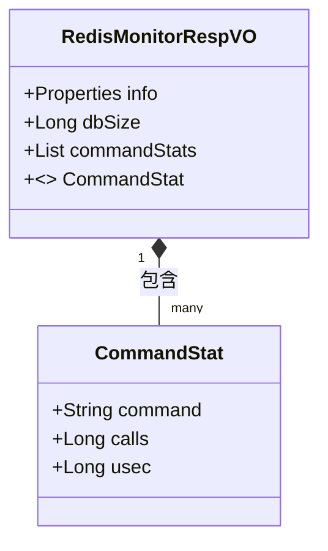

# vo_30 模块文档

## 概述

vo_30 模块定义了 `RedisMonitorRespVO` 类，用于封装 Redis 监控信息的响应对象。该模块位于 `yudao-module-infra` 模块下，具体路径为 `src/main/java/cn/iocoder/yudao/module/infra/controller/admin/redis/vo/RedisMonitorRespVO.java`。主要用于在管理后台展示 Redis 服务器的监控数据，包括 Redis INFO 命令结果、数据库键量以及各命令的执行统计信息。

## 详细说明

### RedisMonitorRespVO

`RedisMonitorRespVO` 是管理后台 Redis 监控接口的响应数据模型，包含以下核心字段：

| 字段名 | 类型 | 说明 | 必填 | 示例 |
|--------|------|------|------|------|
| info | java.util.Properties | Redis INFO 指令的完整结果，具体字段请参考 [Redis 官方文档](https://redis.io/commands/info) | 是 | - |
| dbSize | java.lang.Long | 当前数据库中的键(key)数量 | 是 | 1024 |
| commandStats | java.util.List<CommandStat> | Redis 命令执行统计列表，每个元素代表一种命令的统计信息 | 是 | - |

#### CommandStat (内部类)

`CommandStat` 是 `RedisMonitorRespVO` 的内部静态类，用于表示单个 Redis 命令的执行统计信息：

| 字段名 | 类型 | 说明 | 必填 | 示例 |
|--------|------|------|------|------|
| command | java.lang.String | Redis 命令名称 | 是 | "get" |
| calls | java.lang.Long | 命令调用次数 | 是 | 1024 |
| usec | java.lang.Long | 命令消耗的 CPU 时间（微秒） | 是 | 666 |

### 使用场景

该 VO 通常用于以下场景：
1. 管理后台 Redis 监控页面展示实时服务器状态
2. 性能分析工具中获取命令级别的执行统计
3. 运维告警系统中基于命令频率或 CPU 消耗的阈值检测

### 与其他模块的关系

- 本模块属于 `infra`（基础设施）层，为上层业务模块提供 Redis 监控数据能力
- 实际使用中，该 VO 由 `RedisController`（未在提供的代码中，但可推断路径为 `yudao-module-infra/src/main/java/cn/iocoder/yudao/module/infra/controller/admin/redis/RedisController.java`）返回
- 依赖于底层 Redis 客户端实现（如 Lettuce 或 Jedis）来获取原始监控数据
- 不直接依赖其他业务模块，但为所有需要 Redis 监控的功能提供统一数据格式

## 架构图

以下 Mermaid 图展示了 `RedisMonitorRespVO` 及其内部类 `CommandStat` 的结构关系：

## 注意事项

1. `info` 字段的具体键值取决于 Redis 服务器版本和配置，建议参考 [Redis INFO 命令文档](https://redis.io/commands/info) 了解所有可能的返回字段
2. 在高并发场景下，`commandStats` 列表可能较大，建议在接口实现中考虑分页或过滤机制（实际实现需结合具体 controller）
3. 该 VO 仅用于数据传输，不包含任何业务逻辑
4. 所有时间单位均为微秒（usec），如需转换为秒请除以 1,000,000