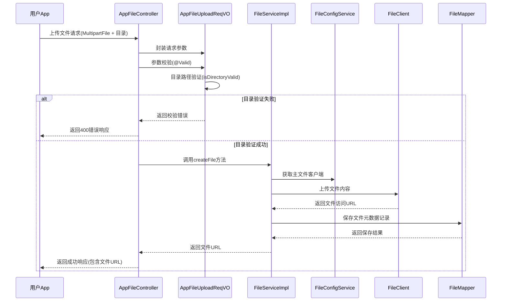

# AppFileUploadReqVO 用户App文件上传请求VO

## 模块概述

AppFileUploadReqVO 是用户端(App)文件上传功能的请求数据传输对象(Data Transfer Object, DTO)，位于 `yudao-module-infra/src/main/java/cn/iocoder/yudao/module/infra/controller/app/file/vo/AppFileUploadReqVO.java`。该VO继承了管理端的文件上传功能，但针对用户App场景进行了简化和优化。

该VO主要用于处理用户App中文件上传请求，包括文件附件和可选的文件目录参数，并提供目录路径的合法性验证。

## 核心功能

1. **文件上传请求封装**：封装用户App文件上传所需的参数
2. **目录路径验证**：提供文件目录的合法性检查机制
3. **参数校验**：使用JSR-303注解进行参数非空校验
4. **API文档生成**：通过Swagger注解自动生成API文档

## 详细设计

### 类定义

```java
@Schema(description = "用户 App - 上传文件 Request VO")
@Data
public class AppFileUploadReqVO {
    // 字段定义...
}
```

### 字段说明

| 字段名 | 类型 | 说明 | 约束 |
|--------|------|------|------|
| file | MultipartFile | 文件附件 | 必填，非空校验 |
| directory | String | 文件目录 | 可选，示例值："XXX/YYY" |

### 方法说明

#### isDirectoryValid()
```java
@AssertTrue(message = "文件目录不正确")
@JsonIgnore
public boolean isDirectoryValid() {
    return FileUploadReqVO.isDirectoryValid(directory);
}
```
- 用于验证文件目录路径的合法性
- 使用 `@AssertTrue` 注解进行参数校验，当目录不合法时返回错误消息"文件目录不正确"
- 使用 `@JsonIgnore` 注确保该方法不会被序列化到JSON响应中
- 实际验证逻辑委托给管理端的 `FileUploadReqVO.isDirectoryValid()` 方法

### 依赖关系

AppFileUploadReqVO 依赖以下组件：
1. **FileUploadReqVO** (管理端文件上传VO)：复用其目录验证逻辑
2. **FilePathUtils** (文件路径工具类)：底层路径验证实现
3. **MultipartFile** (Spring框架)：文件上传处理

## 架构设计

### 模块定位

AppFileUploadReqVO 属于 Infra 模块（基础设施模块）中的文件服务子模块，具体位置：
```
yudao-module-infra
└── src/main/java/cn/iocoder/yudao/module/infra/controller/app/file/vo/
    └── AppFileUploadReqVO.java
```

### 与其他模块的关系

```mermaid
graph TD
    A[AppFileUploadReqVO] --> B[AppFileController]
    A --> C[FileUploadReqVO(管理端)]
    C --> D[FilePathUtils]
    B --> E[FileServiceImpl]
    E --> F[FileConfigService]
    E --> G[FileMapper]
    F --> H[FileClient实现]
    H --> I[本地文件存储]
    H --> J[阿里云OSS]
    H --> K[腾讯COS]
    H --> L[七牛云]
    H --> M[FTP/SFTP]
    H --> N[数据库存储]
```

### 数据流程



## 使用示例

### 前端调用示例
```javascript
// 使用FormData上传文件
const formData = new FormData();
formData.append('file', fileObject); // 文件对象
formData.append('directory', 'avatars/user123'); // 可选目录参数

fetch('/infra/file/upload', {
    method: 'POST',
    body: formData
})
.then(response => response.json())
.then(data => {
    if (data.success) {
        console.log('文件上传成功:', data.data);
        // data.data 为上传后的文件访问URL
    } else {
        console.error('文件上传失败:', data.message);
    }
});
```

### 后端接口定义
在 `AppFileController` 中：
```java
@PostMapping("/upload")
@Operation(summary = "上传文件")
@Parameter(name = "file", description = "文件附件", required = true,
        schema = @Schema(type = "string", format = "binary"))
@PermitAll
public CommonResult<String> uploadFile(@Valid AppFileUploadReqVO uploadReqVO) throws Exception {
    MultipartFile file = uploadReqVO.getFile();
    byte[] content = IoUtil.readBytes(file.getInputStream());
    return success(fileService.createFile(content, file.getOriginalFilename(),
            uploadReqVO.getDirectory(), file.getContentType()));
}
```

## 目录验证规则

AppFileUploadReqVO 通过委托给 `FileUploadReqVO.isDirectoryValid()` 方法实现目录路径验证，具体规则如下：

1. **空目录**：允许（返回根目录）
2. **路径安全性**：禁止以下情况：
   - 以 `/` 或 `\` 开头（绝对路径）
   - 包含反斜杠 `\` 或空字符
   - Windows 盘符路径（如 `C:/test.jpg`）
   - JDK Path 判断的绝对路径
   - 包含空路径段、当前目录 `.` 或上级目录 `..`（防止目录穿越）

### 有效目录示例
- `""` (空字符串，根目录)
- `"avatars"`
- `"images/2023/01"`
- `"user_uploads/documents"`

### 无效目录示例
- `"/absolute/path"` (绝对路径)
- `"path\\with\\backslashes"` (包含反斜杠)
- `"C:/windows/path"` (Windows盘符)
- `"path/../to/parent"` (包含上级目录引用)
- `"path/./current"` (包含当前目录引用)
- `"path//double"` (包含空路径段)

## 异常处理

当目录路径验证失败时，会抛出参数校验异常，返回HTTP 400 Bad Request响应，错误消息为："文件目录不正确"

## 最佳实践

1. **目录规范化**：建议使用小写字母、数字、下划线和连字符组合目录名
2. **避免特殊字符**：目录名中不要使用空格、特殊符号等可能造成问题的字符
3. **层次控制**：建议目录层次不要过深，通常3-4层以内即可
4. **业务隔离**：不同业务类型的文件建议存放在不同的目录下，如：
   - 用户头像：`avatars/{userId}`
   - 商品图片：`products/{productId}/images`
   - 文档文件：`documents/{docType}/{year}/{month}`

## 与管理端文件上传VO的区别

| 特性 | AppFileUploadReqVO (用户端) | FileUploadReqVO (管理端) |
|------|----------------------------|--------------------------|
| 使用场景 | 用户App文件上传 | 管理后台文件上传 |
| 字段数量 | 2个 (file, directory) | 2个 (file, directory) |
| 验证方式 | 委托给管理端验证 | 直接实现验证逻辑 |
| 权限要求 | @PermitAll (公开访问) | 需要管理员权限 |
| API路径 | /infra/file/upload | /infra/file/upload (管理端相同路径但不同控制器) |
| 序列化排除 | 排除验证方法 | 同上 |

## 性能考虑

1. **轻量级设计**：VO仅包含必要字段，避免不必要的数据传输
2. **验证复用**：复用管理端已有的目录验证逻辑，减少代码重复
3. **延迟验证**：目录验证仅在参数校验阶段进行，不会影响正常业务流程
4. **文件处理**：实际文件读取和存储由底层服务处理，VO仅负责参数传递

## 安全性

1. **路径验证**：通过严格的目录路径验证防止路径遍历攻击
2. **文件类型棷查**：虽然在此VO中未直接体现，但后续服务会进行文件类型验证
3. **大小限制**：文件大小限制由底层存储服务或网关层面实现
4. **公开访问控制**：虽然接口是公开的(@PermitAll)，但通过文件目录验证和存储策略控制访问范围

## 未来扩展点

1. **支持更多文件属性**：如添加文件描述、标签等元数据字段
2. **分片上传支持**：为大文件上传添加分片相关参数
3. **断点续传**：添加上传进度和断点续传所需的标识字段
4. **病毒扫描集成**：添加是否需要病毒扫描的标志位
5. **自定义文件名**：支持客户端指定存储时的文件名（而非使用原始文件名）

## 结论

AppFileUploadReqVO 是用户App文件上传功能的核心数据传输对象，通过简化设计和复用管理端验证逻辑，提供了安全、高效的文件上传参数封装能力。其设计遵循了单一职责原则，专注于文件上传请求的参数承载和基本验证，将复杂的文件存储逻辑委托给底层服务层处理，实现了良好的分层架构和代码复用。