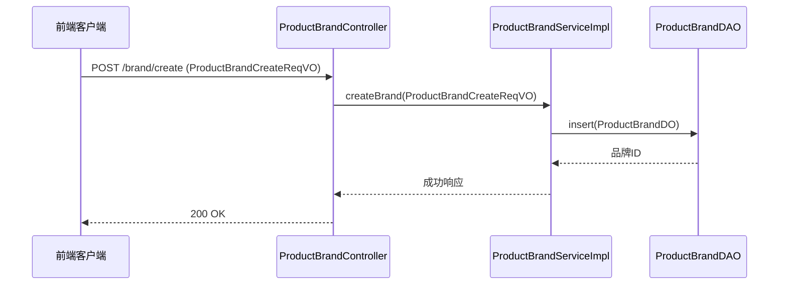

# vo_34 模块文档

## 概述

vo_34 模块包含了商品品牌管理相关的所有 Value Object (VO) 类，用于在产品模块的品牌管理接口中进行数据传输。这些 VO 类定义了创建、更新、查询品牌时的请求和响应数据结构。

## 架构概述

本模块由以下 VO 类组成：

- 请求 VO：
  - `ProductBrandCreateReqVO`：创建品牌的请求参数
  - `ProductBrandUpdateReqVO`：更新品牌的请求参数
  - `ProductBrandListReqVO`：根据品牌名称查询品牌列表的请求参数
  - `ProductBrandPageReqVO`：分页查询品牌列表的请求参数（支持按名称、状态和创建时间范围过滤）

- 响应 VO：
  - `ProductBrandSimpleRespVO`：品牌的精简信息（仅包含 ID 和名称）
  - `ProductBrandRespVO`：品牌的详细信息（包含 ID、名称、创建时间等基础字段）

所有请求 VO（创建和更新）继承自 `ProductBrandBaseVO`（基类），该基类定义了品牌的通用属性（如名称等）。响应 VO `ProductBrandRespVO` 也继承自 `ProductBrandBaseVO` 并额外添加了品牌 ID 和创建时间字段。`ProductBrandSimpleRespVO` 是一个独立的简单 VO 类。

## 详细组件说明

### ProductBrandCreateReqVO
- **用途**：创建品牌时的请求参数
- **字段**：继承自 `ProductBrandBaseVO`（包含品牌名称等通用字段）
- **备注**：无额外字段，所有创建所需字段均在基类中定义

### ProductBrandUpdateReqVO
- **用途**：更新品牌时的请求参数
- **字段**：继承自 `ProductBrandBaseVO`（包含品牌名称等通用字段）以及品牌 ID（用于指定要更新的品牌）
- **备注**：品牌 ID 是必填项，用于定位要更新的品牌记录

### ProductBrandListReqVO
- **用途**：根据品牌名称查询品牌列表的请求参数（不分页）
- **字段**：
  - `name`：品牌名称（可选，用于过滤）

### ProductBrandPageReqVO
- **用途**：分页查询品牌列表的请求参数
- **字段**：
  - `name`：品牌名称（可选，用于过滤）
  - `status`：品牌状态（可选，用于过滤）
  - `createTime`：创建时间范围（可选，用于过滤，格式为数组，包含开始时间和结束时间）
- **备注**：继承自 `PageParam`（通用分页参数类），因此还包含分页相关字段如页码、页大小等

### ProductBrandSimpleRespVO
- **用途**：返回品牌的精简信息（通常用于列表展示或关联显示）
- **字段**：
  - `id`：品牌编号（必填）
  - `name`：品牌名称（必填）

### ProductBrandRespVO
- **用途**：返回品牌的详细信息（通常用于详情页展示）
- **字段**：
  - 继承自 `ProductBrandBaseVO`（包含品牌名称等通用字段）
  - `id`：品牌编号（必填）
  - `createTime`：创建时间（必填）

## 与其他模块的关联

- 本模块的 VO 类主要被产品模块的品牌控制器（`ProductBrandController`）使用，用于处理品牌相关的 API 请求和响应。
- 品牌实体（`ProductBrandDO`）在数据访问层中定义，但本模块仅关注数据传输对象。

## 架构图

以下是本模块中 VO 类之间的关系图（使用 Mermaid 语法）：

```mermaid
classDiagram
    class ProductBrandBaseVO {
        <<abstract>>
        +String name
        // 其他通用字段（如描述、logo等，具体取决于基类实现）
    }
    class ProductBrandCreateReqVO {
        <<extends>> ProductBrandBaseVO
    }
    class ProductBrandUpdateReqVO {
        <<extends>> ProductBrandBaseVO
        +Long id
    }
    class ProductBrandListReqVO {
        +String name
    }
    class ProductBrandPageReqVO {
        <<extends>> PageParam
        +String name
        +Integer status
        +LocalDateTime[] createTime
    }
    class ProductBrandSimpleRespVO {
        +Long id
        +String name
    }
    class ProductBrandRespVO {
        <<extends>> ProductBrandBaseVO
        +Long id
        +LocalDateTime createTime
    }
    class PageParam {
        +Integer pageNum
        +Integer pageSize
        // 其他分页字段
    }
```

注意：`ProductBrandBaseVO` 和 `PageParam` 为外部类，仅在图中展示其关系。

## 数据流示例

以下是创建品牌的典型数据流：

## 结论

vo_34 模块为产品模块的品牌管理提供了统一的数据传输对象，确保了 API 接口的请求和响应数据结构清晰、一致。通过继承和组合，有效减少了代码重复，提高了维护性。