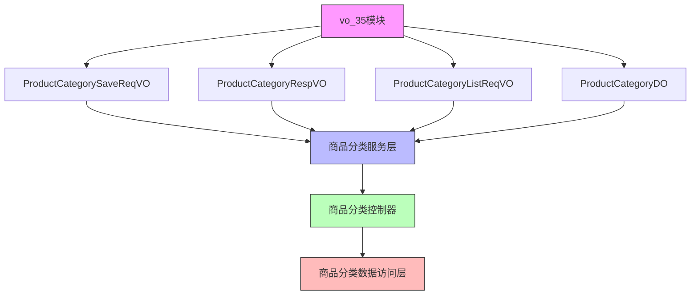

# vo_35 模块文档

## 模块概述

vo_35模块是Yudao Mall商城系统中的商品分类视图对象(VO)模块，位于`yudao-module-mall/yudao-module-product`子系统中。该模块定义了商品分类相关的视图对象，用于前端与后端之间的数据传输。

## 架构概述

## 子模块说明

vo_35模块包含以下核心组件：

1. **ProductCategorySaveReqVO** - 商品分类创建/更新请求VO
2. **ProductCategoryRespVO** - 商品分类响应VO
3. **ProductCategoryListReqVO** - 商品分类列表查询请求VO
4. **ProductCategoryDO** - 商品分类数据对象（虽然严格来说不属于VO层，但与VO紧密关联）

这些VO对象用于：
- 前端传递商品分类数据到后端（请求VO）
- 后端返回商品分类数据给前端（响应VO）
- 前端查询商品分类列表的条件（查询VO）

## 核心组件详情

### ProductCategorySaveReqVO

用于创建或更新商品分类的请求对象，包含所有必填字段和验证规则。

### ProductCategoryRespVO

用于返回商品分类信息的响应对象，包含完整的分类信息包括创建时间。

### ProductCategoryListReqVO

用于查询商品分类列表的请求对象，支持按条件对象，包含可选的过滤条件。

## 与其他模块的关系

vo_35模块主要与以下模块交互：

- [商品分类控制器](../yudao-module-mall/yudao-module-product/src/main/java/cn/iocoder/yudao/module/product/controller/admin/category/ProductCategoryController.md)：处理HTTP请求并使用VO对象进行数据传输
- [商品分类服务](../yudao-module-mall/yudao-module-product/src/main/java/cn/iocoder/yudao/module/product/service/category/ProductCategoryServiceImpl.md)：业务逻辑层，处理VO与DO之间的转换
- [商品分类数据访问层](../yudao-module-mall/yudao-module-product/src/main/java/cn/iocoder/yudao/module/product/dal/dataobject/category/ProductCategoryDO.md)：数据持久层，与数据库交互

## 数据流向

1. 前端发送包含ProductCategorySaveReqVO的POST/PUT请求到商品分类控制器
2. 接收器将VO转换为DO并调用服务层
3. 服务层处理业务逻辑并可能将DO转换为VO返回
4. 控制器将ProductCategoryRespVO返回给前端
5. 前端发送包含ProductCategoryListReqVO的GET请求查询分类列表
6. 控制器将查询结果转换为ProductCategoryRespVO列表返回给前端

## 使用场景

- 商品分类的创建和编辑
- 商品分类列表查询（支持分页、过滤）
- 商品分类状态启用/禁用
- 商品分类排序调整

## 设计特点

1. **数据验证**：使用Jakarta Validation注解进行参数验证（@NotBlank, @NotNull等）
2. **API文档**：使用Swagger/OpenAPI注解(@Schema)自动生成API文档
3. **数据传输**：VO对象专门用于前后端数据传输，避免直接暴露实体对象
4. **层次分明**：清晰分离请求、响应和查询对象，职责单一