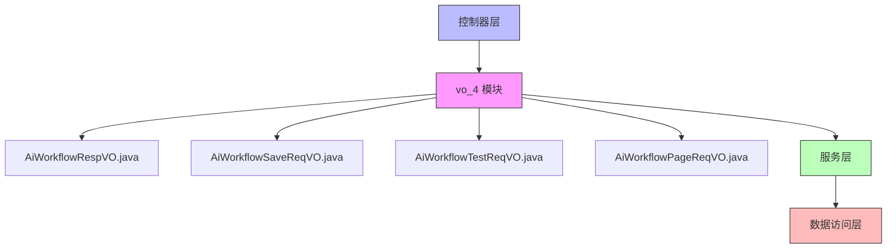
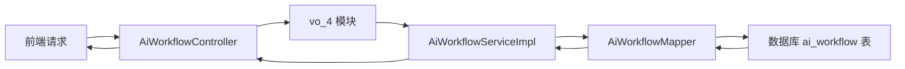

# vo_4 模块文档

## 模块概述

vo_4 模块是 Yudao AI 模块中的工作流功能的值对象（Value Object）层，位于 `yudao-module-ai/src/main/java/cn/iocoder/yudao/module/ai/controller/admin/workflow/vo/` 目录下。该模块定义了用于 AI 工作流管理的各种请求和响应数据传输对象（DTO），用于在控制器层与服务层之间传递数据。

该模块包含以下核心组件：
- `AiWorkflowRespVO`：工作流响应对象，用于返回工作流数据
- `AiWorkflowSaveReqVO`：工作流创建/更新请求对象
- `AiWorkflowTestReqVO`：工作流测试请求对象
- `AiWorkflowPageReqVO`：工作流分页查询请求对象

这些VO对象与工作流控制器（AiWorkflowController）、服务层（AiWorkflowServiceImpl）和数据访问层（AiWorkflowMapper）协同工作，实现AI工作流的完整CRUD操作及测试功能。

## 架构设计

### 模块结构



### 与其他模块的关系

vo_4 模块主要与以下模块交互：
- 控制器层：`AiWorkflowController`（在同一工作流功能模块中）
- 服务层：`AiWorkflowServiceImpl`（在同一工作流功能模块中）
- 数据访问层：`AiWorkflowMapper`（在同一工作流功能模块中）
- 数据对象层：`AiWorkflowDO`（数据对象，在dal层）



## 详细组件说明

### AiWorkflowRespVO

工作流响应对象，用于将工作流数据返回给前端。

**位置**：`yudao-module-ai/src/main/java/cn/iocoder/yudao/module/ai/controller/admin/workflow/vo/AiWorkflowRespVO.java`

**字段说明**：
| 字段名 | 类型 | 说明 | 备注 |
|--------|------|------|------|
| id | Long | 编号 | 必填，示例值：1 |
| code | String | 工作流标识 | 必填，示例值：FLOW |
| name | String | 工作流名称 | 必填，示例值：工作流 |
| remark | String | 备注 | 必填，示例值：工作流 |
| status | Integer | 状态 | 必填，示例值：1 |
| graph | String | 工作流模型 JSON | 必填，示例值：{} |
| createTime | LocalDateTime | 创建时间 | 必填，时间戳格式 |

**关键注解**：
- `@Schema(description = "管理后台 - AI 工作流 Response VO")`：描述该类的用途
- `@Data`：Lombok注解，自动生成getter/setter、equals、hashCode、toString方法
- 每个字段都有`@Schema`注解，用于API文档生成

### AiWorkflowSaveReqVO

工作流创建/更新请求对象，用于接收前端发送的工作流创建或更新数据。

**位置**：`yudao-module-ai/src/main/java/cn/iocoder/yudao/module/ai/controller/admin/workflow/vo/AiWorkflowSaveReqVO.java`

**字段说明**：
| 字段名 | 类型 | 说明 | 备注 |
|--------|------|------|------|
| id | Long | 编号 | 可选，用于更新操作 |
| code | String | 工作流标识 | 必填，不能为空，示例值：FLOW |
| name | String | 工作流名称 | 必填，不能为空，示例值：工作流 |
| remark | String | 备注 | 可选，示例值：FLOW |
| graph | String | 工作流模型 | 必填，不能为空，示例值：{} |
| status | Integer | 状态 | 必填，不能为空，示例值：FLOW |

**验证规则**：
- 使用`@NotEmpty`验证字符串字段不能为空
- 使用`@NotNull`验证状态字段不能为空
- 使用`@Schema`注解提供API文档信息

### AiWorkflowTestReqVO

工作流测试请求对象，用于接收前端发送的工作流测试数据。

**位置**：`yudao-module-ai/src/main/java/cn/iocoder/yudao/module/ai/controller/admin/workflow/vo/AiWorkflowTestReqVO.java`

**字段说明**：
| 字段名 | 类型 | 说明 | 备注 |
|--------|------|------|------|
| id | Long | 工作流编号 | 可选，示例值：1024 |
| graph | String | 工作流模型 | 可选，示例值：{} |
| params | Map<String, Object> | 参数 | 必填，示例值：{} |

**特殊验证**：
- 使用`@AssertTrue`注解实现自定义验证：`isGraphValid()`方法确保要么提供工作流ID，要么提供工作流模型（二者必选其一）
- 使用`@Schema`注解提供API文档信息

### AiWorkflowPageReqVO

工作流分页查询请求对象，用于接收前端发送的分页查询参数。

**位置**：`yudao-module-ai/src/main/java/cn/iocoder/yudao/module/ai/controller/admin/workflow/vo/AiWorkflowPageReqVO.java`

**字段说明**：
| 字段名 | 类型 | 说明 | 备注 |
|--------|------|------|------|
| name | String | 名称 | 可选，示例值：工作流 |
| code | String | 标识 | 可选，示例值：FLOW |
| status | Integer | 状态 | 可选，示例值：1，使用`@InEnum(CommonStatusEnum.class)`验证 |
| createTime | LocalDateTime[] | 创建时间范围 | 可选，使用`@DateTimeFormat`指定格式 |

**继承关系**：
- 继承自`PageParam`类，获得分页相关属性（如页码、页面大小等）

**关注点**：
- 使用`@InEnum`验证状态值是否在允许的枚举范围内
- 使用`@DateTimeFormat`指定日期时间的解析格式

## 业务逻辑说明

### 工作流生命周期

1. **创建工作流**：
   - 前端发送`AiWorkflowSaveReqVO`（无ID）到`/ai/workflow/create`端点
   - 控制器验证参数并调用服务层
   - 服务层检查工作流标识唯一性，然后保存到数据库
   - 返回新创建工作流的ID

2. **更新工作流**：
   - 前端发送`AiWorkflowSaveReqVO`（带ID）到`/ai/workflow/update`端点
   - 控制器验证参数并调用服务层
   - 服务层检查工作流存在性和标识唯一性（排除自身），然后更新数据库
   - 返回成功状态

3. **删除工作流**：
   - 前端发送工作流ID到`/ai/workflow/delete`端点
   - 控制器验证参数并调用服务层
   - 服务层检查工作流存在性，然后从数据库删除
   - 返回成功状态

4. **查询工作流**：
   - 单个查询：前端发送工作流ID到`/ai/workflow/get`端点
   - 分页查询：前端发送`AiWorkflowPageReqVO`到`/ai/workflow/page`端点
   - 服务层执行相应的数据库查询并返回结果
   - 控制器将数据库对象转换为响应VO并返回

5. **测试工作流**：
   - 前端发送`AiWorkflowTestReqVO`到`/ai/workflow/test`端点
   - 服务层确定要使用的工作流模型（来自请求或数据库）
   - 解析工作流模型并构建Tinyflow执行链
   - 使用提供的参数执行工作流并返回结果

### 数据流程

```mermaid
sequenceDiagram
    participant 前端
    participant 控制器 as AiWorkflowController
    participant VO层 as vo_4模块
    participant 服务层 as AiWorkflowServiceImpl
    participant 数据层 as AiWorkflowMapper
    participant 数据库

    %% 创建工作流流程
    前端->>控制器: POST /ai/workflow/create + AiWorkflowSaveReqVO
    控制器->>VO层: 验证请求数据
    VO层-->>控制器: 验证结果
    控制器->>服务层: createWorkflow(reqVO)
    服务层->>服务层: validateCodeUnique(null, code)
    服务层->>数据层: insert(workflowDO)
    数据层-->>数据库: INSERT INTO ai_workflow
    数据库-->>数据层: 生成的ID
    数据层-->>服务层: 插入结果
    服务层-->>控制器: 工作流ID
    控制器-->>前端: CommonResult<Long>

    %% 测试工作流流程
    前端->>控制器: POST /ai/workflow/test + AiWorkflowTestReqVO
    控制器->>VO层: 验证请求数据
    VO层-->>控制器: 验证结果
    控制器->>服务层: testWorkflow(testReqVO)
    服务层->>服务层: 确定graph来源
    alt 有ID
        服务层->>数据层: selectById(id)
        数据层-->>数据库: SELECT * FROM ai_workflow WHERE id = ?
        数据库-->>数据层: 工作流记录
        数据层-->>服务层: 工作流DO
    端
    服务层->>服务层: parseFlowParam(graph)
    服务层->>服务层: tinyflow.toChain().executeForResult(params)
    服务层-->>控制器: 执行结果
    控制器-->>前端: CommonResult<Object>
```

## 异常处理

vo_4模块本身主要通过Bean Validation进行参数验证，异常处理主要在服务层进行：

1. **参数验证异常**：
   - 由Spring MVC自动处理`@NotEmpty`、`@NotNull`等验证注解
   - 返回400 Bad Request响应，包含验证错误信息

2. **业务异常**（在服务层处理）：
   - 工作流不存在：`WORKFLOW_NOT_EXISTS`
   - 工作流标识已存在：`WORKFLOW_CODE_EXISTS`
   - 这些异常由控制器层的全局异常处理器转换为适当的HTTP响应

## 性能考虑

1. **数据库索引**：
   - 建议在`ai_workflow`表的`code`字段上创建唯一索引，以支持快速的标识唯一性检查
   - 在`status`、`name`、`createTime`字段上创建普通索引，以支持分页查询的过滤条件

2. **VO设计**：
   - VO对象轻量级，仅包含必要的字段，减少数据传输开销
   - 使用`LocalDateTime`而非`Date`，避免时区问题
   - 分页查询使用`PageParam`标准化处理，避免重复实现

3. **测试功能优化**：
   - 工作流测试时优先使用请求中提供的graph（如果有），避免不必要的数据库查询
   - 只有当请求中没有提供graph时才从数据库获取工作流模型

## 安全考虑

1. **输入验证**：
   - 所有字符串字段使用`@NotEmpty`防止空值和空白值
   - 状态字段使用`@NotNull`和`@InEnum`确保只能是预定义的值
   - 工作流标识和名称有长度限制（虽然未在VO中显式体现，但通常在数据库层有限制）

2. **权限控制**：
   - 在控制器层使用`@PreAuthorize`注解进行权限验证
   - 不同操作需要不同的权限：
     - 创建：`ai:workflow:create`
     - 更新：`ai:workflow:update`
     - 删除：`ai:workflow:delete`
     - 查询：`ai:workflow:query`
     - 测试：`ai:workflow:test`

3. **数据安全**：
   - 工作流模型（graph）作为JSON字符串存储，在测试时被解析执行
   - 需要确保只有受信任的来源可以提供工作流模型，以防止代码注入攻击
   - 实际应用中可能需要对工作流模型进行安全验证或沙箱执行

## 依赖关系

vo_4模块主要依赖于：
- Lombok：用于`@Data`注解生成getter/setter等方法
- Spring Boot Validation：用于`@NotEmpty`、`@NotNull`等验证注解
- Swagger/OpenAPI：用于`@Schema`注解生成API文档
- Hutool：在`AiWorkflowTestReqVO`中使用`StrUtil`进行字符串工具操作
- Yudao框架通用类：如`PageParam`、`CommonStatusEnum`、`DateUtils`

## 接口规范

### RESTful API端点

| 方法 | 路径 | 操作 | 请求体 | 响应体 | 权限要求 |
|------|------|------|--------|--------|----------|
| POST | /ai/workflow/create | 创建工作流 | AiWorkflowSaveReqVO | CommonResult<Long> | ai:workflow:create |
| PUT | /ai/workflow/update | 更新工作流 | AiWorkflowSaveReqVO | CommonResult<Boolean> | ai:workflow:update |
| DELETE | /ai/workflow/delete | 删除工作流 | id参数 | CommonResult<Boolean> | ai:workflow:delete |
| GET | /ai/workflow/get | 获取单个工作流 | id参数 | CommonResult<AiWorkflowRespVO> | ai:workflow:query |
| GET | /ai/workflow/page | 分页获取工作流 | AiWorkflowPageReqVO | CommonResult<PageResult<AiWorkflowRespVO>> | ai:workflow:query |
| POST | /ai/workflow/test | 测试工作流 | AiWorkflowTestReqVO | CommonResult<Object> | ai:workflow:test |

### 字段约束摘要

| VO类 | 必填字段 | 特殊验证 |
|------|----------|----------|
| AiWorkflowSaveReqVO | code, name, graph, status | code、name、graph不能为空；status不能为空 |
| AiWorkflowTestReqVO | params | 必须提供id或graph中的一个 |
| AiWorkflowPageReqVO | 无必填字段 | status必须是CommonStatusEnum的有效值 |
| AiWorkflowRespVO | 所有字段均为必填（根据Schema定义） | 无额外验证 |

## 最佳实践

1. **VO设计原则**：
   - 仅包含API交互所需的字段，不暴露内部实现细节
   - 使用适当的验证注解确保数据完整性
   - 通过`@Schema`注解提供清晰的API文档

2. **异常处理**：
   - 在VO层进行输入验证，尽早捕获错误
   - 在服务层处理业务规则验证（如唯一性约束）
   - 使用统一的异常处理机制转换为适当的HTTP响应

3. **性能优化**：
   - 避免在VO中包含大型数据结构或复杂对象
   - 分页查询使用标准的PageParam模式
   - 测试功能优化数据库访问（优先使用请求数据）

4. **可维护性**：
   - 保持VO字段与数据库对象的一致性
   - 使用统一的命名约束和注释风格
   - 为所有公共字段提供有意义的描述

## 与其他模块的关联

虽然vo_4模块主要服务于工作流功能，但它与其他模块有一定的关联：

1. **与模型管理模块的关联**：
   - 工作流测试功能需要调用`AiModelService`来获取LLM提供者
   - 工作流模型中的"llmNode"类型节点需要关联到具体的AI模型

2. **与通用框架的关联**：
   - 使用Yudao框架的分页组件（PageParam）
   - 使用Yudao框架的通用枚举（CommonStatusEnum）
   - 使用Yudao框架的日期时间工具类（DateUtils）

3. **与前端的关联**：
   - VO对象直接映射到前端Vue组件的数据模型
   - 通过Swagger生成的API文档指导前端开发

## 未来改进方向

1. **增强验证**：
   - 添加工作流模型（graph）的JSON结构验证
   - 为工作流标识和名称添加长度限制验证
   - 考虑添加自定义验证器以检查工作流模型的有效性

2. **性能优化**：
   - 考虑为工作流模型添加缓存，减少数据库查询
   - 优化分页查询的数据库索引使用

3. **功能扩展**：
   - 添加工作流导入/导出功能（可能需要新的VO）
   - 添加工作流版本控制功能
   - 添加工作流执行历史查询功能

4. **安全增强**：
   - 实现工作流模型的沙箱执行环境
   - 添加工作流模型的安全扫描机制
   - 实现工作流访问的更细粒度权限控制