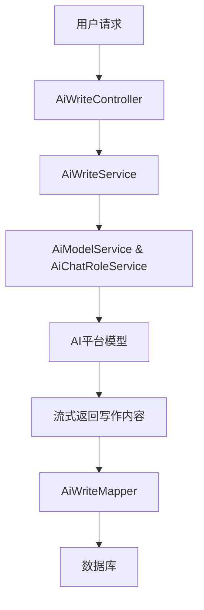

# vo_5 模块文档

## 概述

`vo_5` 模块是系统中的一个AI写作模块，主要用于提供AI写作功能。该模块基于Spring AI框架，集成了多个AI平台（如通义、星火、硅基流动等），支持流式写作生成、写作记录管理等功能。

### 功能特性

- **AI写作生成**：支持流式写作生成，实时返回生成内容。
- **写作记录管理**：支持查询、删除写作记录。
- **多平台支持**：集成多个AI平台，支持不同模型的写作生成。
- **参数化配置**：支持写作类型、长度、格式、语气、语言等参数的配置。

### 模块结构

```
vo_5
├── controller
│   └── admin
│       └── write
│           ├── AiWriteController.java
│           └── vo
│               ├── AiWriteGenerateReqVO.java
│               ├── AiWritePageReqVO.java
│               └── AiWriteRespVO.java
├── service
│   └── write
│       ├── AiWriteService.java
│       └── impl
│           └── AiWriteServiceImpl.java
├── dal
│   ├── dataobject
│   │   └── write
│   │       └── AiWriteDO.java
│   └── mysql
│       └── write
│           └── AiWriteMapper.java
└── enums
    └── write
        └── AiWriteTypeEnum.java
```

---

## 架构设计

### 核心组件

#### 1. **AiWriteController**

**文件位置**: `yudao-module-ai/src/main/java/cn/iocoder/yudao/module/ai/controller/admin/write/AiWriteController.java`

**功能**:
- 提供写作生成（流式）接口，用于实时生成写作内容。
- 提供写作记录的删除和分页查询接口。

**接口列表**:

| 接口名称 | 方法 | 路径 | 描述 |
|---------|------|------|------|
| generateWriteContent | POST | /ai/write/generate-stream | 写作生成（流式） |
| deleteWrite | DELETE | /ai/write/delete | 删除写作 |
| getWritePage | GET | /ai/write/page | 获得写作分页 |

**代码示例**:
```java
@Tag(name = "管理后台 - AI 写作")
@RestController
@RequestMapping("/ai/write")
public class AiWriteController {
    @Resource
    private AiWriteService writeService;

    @PostMapping(value = "/generate-stream", produces = MediaType.TEXT_EVENT_STREAM_VALUE)
    @Operation(summary = "写作生成（流式）", description = "流式返回，响应较快")
    public Flux<CommonResult<String>> generateWriteContent(@RequestBody @Valid AiWriteGenerateReqVO generateReqVO) {
        return writeService.generateWriteContent(generateReqVO, getLoginUserId());
    }

    @DeleteMapping("/delete")
    @Operation(summary = "删除写作")
    @Parameter(name = "id", description = "编号", required = true)
    @PreAuthorize("@ss.hasPermission('ai:write:delete')")
    public CommonResult<Boolean> deleteWrite(@RequestParam("id") Long id) {
        writeService.deleteWrite(id);
        return success(true);
    }

    @GetMapping("/page")
    @Operation(summary = "获得写作分页")
    @PreAuthorize("@ss.hasPermission('ai:write:query')")
    public CommonResult<PageResult<AiWriteRespVO>> getWritePage(@Valid AiWritePageReqVO pageReqVO) {
        PageResult<AiWriteDO> pageResult = writeService.getWritePage(pageReqVO);
        return success(BeanUtils.toBean(pageResult, AiWriteRespVO.class));
    }
}
```

---

#### 2. **AiWriteService**

**文件位置**: `yudao-module-ai/src/main/java/cn/iocoder/yudao/module/ai/service/write/AiWriteService.java`

**功能**:
- 定义写作生成、删除写作、分页查询写作记录的方法。

**核心方法**:

| 方法名称 | 参数 | 返回值 | 描述 |
|---------|------|--------|------|
| generateWriteContent | AiWriteGenerateReqVO, Long | Flux<CommonResult<String>> | 流式写作生成 |
| deleteWrite | Long | void | 删除写作 |
| getWritePage | AiWritePageReqVO | PageResult<AiWriteDO> | 分页查询写作记录 |

**代码示例**:
```java
public interface AiWriteService {
    Flux<CommonResult<String>> generateWriteContent(AiWriteGenerateReqVO generateReqVO, Long userId);
    void deleteWrite(Long id);
    PageResult<AiWriteDO> getWritePage(AiWritePageReqVO pageReqVO);
}
```

---

#### 3. **AiWriteServiceImpl**

**文件位置**: `yudao-module-ai/src/main/java/cn/iocoder/yudao/module/ai/service/write/impl/AiWriteServiceImpl.java`

**功能**:
- 实现写作生成、删除写作、分页查询写作记录的逻辑。
- 调用AI模型生成写作内容，并将结果保存到数据库。

**核心逻辑**:

1. **写作生成**:
   - 获取写作模型和角色设定。
   - 构建Prompt，调用AI模型生成写作内容。
   - 流式返回生成内容，并在完成后更新数据库。

2. **删除写作**:
   - 校验写作记录是否存在。
   - 删除写作记录。

3. **分页查询**:
   - 根据查询条件分页查询写作记录。

**代码示例**:
```java
@Service
@Slf4j
public class AiWriteServiceImpl implements AiWriteService {
    @Resource
    private AiModelService modalService;
    @Resource
    private AiChatRoleService chatRoleService;
    @Resource
    private AiWriteMapper writeMapper;

    @Override
    public Flux<CommonResult<String>> generateWriteContent(AiWriteGenerateReqVO generateReqVO, Long userId) {
        // 1 获取写作模型。尝试获取写作助手角色，没有则使用默认模型
        AiChatRoleDO writeRole = CollUtil.getFirst(
                chatRoleService.getChatRoleListByName(AiChatRoleEnum.AI_WRITE_ROLE.getName()));
        // 1.1 获取写作执行模型
        AiModelDO model = getModel(writeRole);
        // 1.2 获取角色设定消息
        String systemMessage = Objects.nonNull(writeRole) && StrUtil.isNotBlank(writeRole.getSystemMessage())
                ? writeRole.getSystemMessage() : AiChatRoleEnum.AI_WRITE_ROLE.getSystemMessage();
        // 1.3 校验平台
        AiPlatformEnum platform = AiPlatformEnum.validatePlatform(model.getPlatform());
        StreamingChatModel chatModel = modalService.getChatModel(model.getId());

        // 2. 插入写作信息
        AiWriteDO writeDO = BeanUtils.toBean(generateReqVO, AiWriteDO.class, write -> write.setUserId(userId)
                        .setPlatform(platform.getPlatform()).setModelId(model.getId()).setModel(model.getModel()));
        writeMapper.insert(writeDO);

        // 3.1 构建 Prompt，并进行调用
        Prompt prompt = buildPrompt(generateReqVO, model, systemMessage);
        Flux<ChatResponse> streamResponse = chatModel.stream(prompt);

        // 3.2 流式返回
        StringBuffer contentBuffer = new StringBuffer();
        return streamResponse.map(chunk -> {
            String newContent = chunk.getResult() != null ? chunk.getResult().getOutput().getText() : null;
            newContent = StrUtil.nullToDefault(newContent, ""); // 避免 null 的 情况
            contentBuffer.append(newContent);
            // 响应结果
            return success(newContent);
        }).doOnComplete(() -> {
            // 忽略租户，因为 Flux 异步无法透传租户
            TenantUtils.executeIgnore(() ->
                    writeMapper.updateById(new AiWriteDO().setId(writeDO.getId()).setGeneratedContent(contentBuffer.toString())));
        }).doOnError(throwable -> {
            log.error("[generateWriteContent][generateReqVO({}) 发生异常]", generateReqVO, throwable);
            // 忽略租户，因为 Flux 异步无法透传租户
            TenantUtils.executeIgnore(() ->
                    writeMapper.updateById(new AiWriteDO().setId(writeDO.getId()).setErrorMessage(throwable.getMessage())));
        }).onErrorResume(error -> Flux.just(error(ErrorCodeConstants.WRITE_STREAM_ERROR)));
    }

    // 其他方法省略...
}
```

---

#### 4. **AiWriteDO**

**文件位置**: `yudao-module-ai/src/main/java/cn/iocoder/yudao/module/ai/dal/dataobject/write/AiWriteDO.java`

**功能**:
- 定义写作记录的数据库实体。

**字段说明**:

| 字段名 | 类型 | 描述 |
|--------|------|------|
| id | Long | 编号 |
| userId | Long | 用户编号 |
| type | Integer | 写作类型（枚举：AiWriteTypeEnum） |
| platform | String | 平台（枚举：AiPlatformEnum） |
| modelId | Long | 模型编号 |
| model | String | 模型 |
| prompt | String | 生成内容提示 |
| generatedContent | String | 生成的内容 |
| originalContent | String | 原文 |
| length | Integer | 长度提示词（字典：DictTypeConstants.AI_WRITE_LENGTH） |
| format | Integer | 格式提示词（字典：DictTypeConstants.AI_WRITE_FORMAT） |
| tone | Integer | 语气提示词（字典：DictTypeConstants.AI_WRITE_TONE） |
| language | Integer | 语言提示词（字典：DictTypeConstants.AI_WRITE_LANGUAGE） |
| errorMessage | String | 错误信息 |
| createTime | LocalDateTime | 创建时间 |

**代码示例**:
```java
@TableName("ai_write")
@KeySequence("ai_write_seq") // 用于 Oracle、PostgreSQL、Kingbase、DB2、H2 数据库的主键自增。如果是 MySQL 等数据库，可不写。
@Data
public class AiWriteDO extends BaseDO {
    // 字段定义省略...
}
```

---

#### 5. **AiWriteMapper**

**文件位置**: `yudao-module-ai/src/main/java/cn/iocoder/yudao/module/ai/dal/mysql/write/AiWriteMapper.java`

**功能**:
- 提供写作记录的数据库操作方法。

**核心方法**:

| 方法名称 | 参数 | 返回值 | 描述 |
|---------|------|--------|------|
| selectPage | AiWritePageReqVO | PageResult<AiWriteDO> | 分页查询写作记录 |

**代码示例**:
```java
@Mapper
public interface AiWriteMapper extends BaseMapperX<AiWriteDO> {
    default PageResult<AiWriteDO> selectPage(AiWritePageReqVO reqVO) {
        return selectPage(reqVO, new LambdaQueryWrapperX<AiWriteDO>()
                .eqIfPresent(AiWriteDO::getUserId, reqVO.getUserId())
                .eqIfPresent(AiWriteDO::getType, reqVO.getType())
                .eqIfPresent(AiWriteDO::getPlatform, reqVO.getPlatform())
                .betweenIfPresent(AiWriteDO::getCreateTime, reqVO.getCreateTime())
                .orderByDesc(AiWriteDO::getId));
    }
}
```

---

#### 6. **AiWriteTypeEnum**

**文件位置**: `yudao-module-ai/src/main/java/cn/iocoder/yudao/module/ai/enums/write/AiWriteTypeEnum.java`

**功能**:
- 定义写作类型的枚举。

**枚举值**:

| 枚举值 | 类型 | 描述 |
|--------|------|------|
| WRITING | 1 | 撰写 |
| REPLY | 2 | 回复 |

**代码示例**:
```java
@AllArgsConstructor
@Getter
public enum AiWriteTypeEnum implements ArrayValuable<Integer> {
    WRITING(1, "撰写", "请撰写一篇关于 [{}] 的文章。文章的内容格式：{}，语气：{}，语言：{}，长度：{}。请确保涵盖主要内容，不需要除了正文内容外的其他回复，如标题、额外的解释或道歉。"),
    REPLY(2, "回复", "请针对如下内容：[{}] 做个回复。回复内容参考：[{}], 回复格式：{}，语气：{}，语言：{}，长度：{}。不需要除了正文内容外的其他回复，如标题、开头、额外的解释或道歉。");

    private final Integer type;
    private final String name;
    private final String prompt;

    public static final Integer[] ARRAYS = Arrays.stream(values()).map(AiWriteTypeEnum::getType).toArray(Integer[]::new);

    @Override
    public Integer[] array() {
        return ARRAYS;
    }
}
```

---

#### 7. **DictTypeConstants**

**文件位置**: `yudao-module-ai/src/main/java/cn/iocoder/yudao/module/ai/enums/DictTypeConstants.java`

**功能**:
- 定义写作相关的字典类型常量。

**字典类型**:

| 字典类型 | 描述 |
|----------|------|
| AI_WRITE_FORMAT | 写作格式 |
| AI_WRITE_LENGTH | 写作长度 |
| AI_WRITE_LANGUAGE | 写作语言 |
| AI_WRITE_TONE | 写作语气 |

**代码示例**:
```java
public interface DictTypeConstants {
    String AI_WRITE_FORMAT = "ai_write_format"; // 写作格式
    String AI_WRITE_LENGTH = "ai_write_length"; // 写作长度
    String AI_WRITE_LANGUAGE = "ai_write_language"; // 写作语言
    String AI_WRITE_TONE = "ai_write_tone"; // 写作语气
}
```

---

#### 8. **AiAutoConfiguration**

**文件位置**: `yudao-module-ai/src/main/java/cn/iocoder/yudao/module/ai/framework/ai/config/AiAutoConfiguration.java`

**功能**:
- 配置AI模型的Bean，支持多个AI平台的集成。

**核心Bean**:

| Bean名称 | 条件 | 描述 |
|----------|------|------|
| aiModelFactory | 无条件 | AI模型工厂 |
| dashScopeChatModel | `spring.ai.dashscope.api-key` 存在 | 通义聊天模型 |
| douBaoChatClient | `yudao.ai.doubao.enable=true` | 星火聊天模型 |
| siliconFlowChatClient | `yudao.ai.siliconflow.enable=true` | 硅基流动聊天模型 |
| hunYuanChatClient | `yudao.ai.hunyuan.enable=true` | 文心一言聊天模型 |
| xingHuoChatClient | `yudao.ai.xinghuo.enable=true` | 讯飞星火聊天模型 |
| midjourneyApi | `yudao.ai.midjourney.enable=true` | Midjourney API |
| sunoApi | `yudao.ai.suno.enable=true` | Suno API |

**代码示例**:
```java
@Configuration
@EnableConfigurationProperties({ YudaoAiProperties.class,
        QdrantVectorStoreProperties.class, // 解析 Qdrant 配置
        RedisVectorStoreProperties.class, // 解析 Redis 配置
        MilvusVectorStoreProperties.class, MilvusServiceClientProperties.class // 解析 Milvus 配置
})
@Slf4j
public class AiAutoConfiguration {
    @Bean
    public AiModelFactory aiModelFactory() {
        return new AiModelFactoryImpl();
    }

    // 其他Bean定义省略...
}
```

---

## 数据流图



---

## API 说明

### 1. 写作生成（流式）

**接口路径**: `POST /ai/write/generate-stream`

**请求参数**:

| 参数名 | 类型 | 必填 | 描述 |
|--------|------|------|------|
| type | Integer | 是 | 写作类型（枚举：AiWriteTypeEnum） |
| prompt | String | 否 | 写作内容提示 |
| originalContent | String | 否 | 原文 |
| length | Integer | 是 | 长度（字典：DictTypeConstants.AI_WRITE_LENGTH） |
| format | Integer | 是 | 格式（字典：DictTypeConstants.AI_WRITE_FORMAT） |
| tone | Integer | 是 | 语气（字典：DictTypeConstants.AI_WRITE_TONE） |
| language | Integer | 是 | 语言（字典：DictTypeConstants.AI_WRITE_LANGUAGE） |

**响应**:
- 流式返回写作内容。

**代码示例**:
```java
@PostMapping(value = "/generate-stream", produces = MediaType.TEXT_EVENT_STREAM_VALUE)
@Operation(summary = "写作生成（流式）", description = "流式返回，响应较快")
public Flux<CommonResult<String>> generateWriteContent(@RequestBody @Valid AiWriteGenerateReqVO generateReqVO) {
    return writeService.generateWriteContent(generateReqVO, getLoginUserId());
}
```

---

### 2. 删除写作

**接口路径**: `DELETE /ai/write/delete`

**请求参数**:

| 参数名 | 类型 | 必填 | 描述 |
|--------|------|------|------|
| id | Long | 是 | 写作记录编号 |

**响应**:
- 成功：`true`

**代码示例**:
```java
@DeleteMapping("/delete")
@Operation(summary = "删除写作")
@Parameter(name = "id", description = "编号", required = true)
@PreAuthorize("@ss.hasPermission('ai:write:delete')")
public CommonResult<Boolean> deleteWrite(@RequestParam("id") Long id) {
    writeService.deleteWrite(id);
    return success(true);
}
```

---

### 3. 获得写作分页

**接口路径**: `GET /ai/write/page`

**请求参数**:

| 参数名 | 类型 | 必填 | 描述 |
|--------|------|------|------|
| pageNo | Integer | 否 | 页码，从1开始 |
| pageSize | Integer | 否 | 每页条数，最大值为200 |
| userId | Long | 否 | 用户编号 |
| type | Integer | 否 | 写作类型 |
| platform | String | 否 | 平台 |
| createTime | LocalDateTime[] | 否 | 创建时间 |

**响应**:
- 分页写作记录列表。

**代码示例**:
```java
@GetMapping("/page")
@Operation(summary = "获得写作分页")
@PreAuthorize("@ss.hasPermission('ai:write:query')")
public CommonResult<PageResult<AiWriteRespVO>> getWritePage(@Valid AiWritePageReqVO pageReqVO) {
    PageResult<AiWriteDO> pageResult = writeService.getWritePage(pageReqVO);
    return success(BeanUtils.toBean(pageResult, AiWriteRespVO.class));
}
```

---

## 依赖关系

### 依赖模块

- **yudao-framework**: 提供基础框架、工具类、数据库操作等。
- **yudao-module-system**: 提供用户、权限管理等功能。
- **Spring AI**: 提供AI模型集成、流式响应等功能。

### 依赖服务

- **AiModelService**: 提供AI模型管理功能。
- **AiChatRoleService**: 提供AI聊天角色管理功能。

---

## 配置说明

### YudaoAiProperties

**文件位置**: `yudao-module-ai/src/main/java/cn/iocoder/yudao/module/ai/framework/ai/config/YudaoAiProperties.java`

**功能**:
- 配置AI平台的API密钥、模型、温度等参数。

**配置示例**:
```yaml
# application.yml
# application.yml
yudao:
  ai:
    tongyi:
      api-key: "your-api-key"
    xinghuo:
      enable: true
      api-key: "your-api-key"
      model: "v3.5"
    siliconflow:
      enable: true
      api-key: "your-api-key"
      model: "default"
```

---

## 总结

`vo_5` 模块是一个功能完善的AI写作模块，支持多平台AI模型集成、流式写作生成、写作记录管理等功能。通过Spring AI框架，模块能够灵活地扩展支持更多的AI平台和模型。

### 关键特性

- **多平台支持**: 集成多个AI平台，支持不同模型的写作生成。
- **流式响应**: 支持流式写作生成，实时返回生成内容。
- **参数化配置**: 支持写作类型、长度、格式、语气、语言等参数的配置。
- **数据库集成**: 将写作记录保存到数据库，支持分页查询和删除。

### 未来扩展

- 支持更多AI平台的集成。
- 增强写作内容的审核和过滤功能。
- 支持写作内容的导出和分享。

---

**注意**: 该文档基于提供的代码组件生成，可能存在部分细节未完全覆盖，建议结合实际代码和业务需求进行进一步完善。