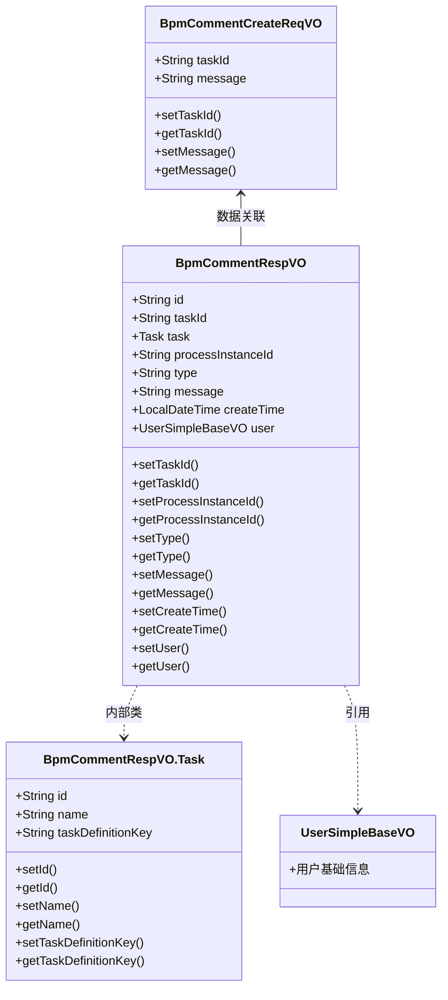
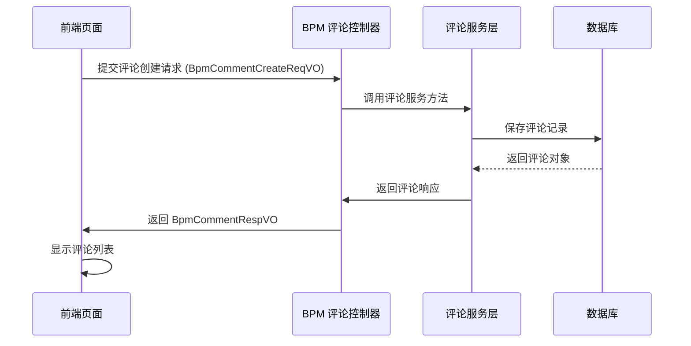
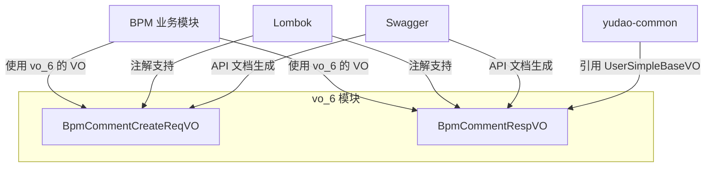

# vo_6 模块文档 - BPM 评论功能

## 1. 模块概述

**vo_6** 是 BPM（业务流程管理）模块中的评论功能子模块，主要负责处理流程任务相关的评论数据的请求对象（Request VO）和响应对象（Response VO）。该模块为 BPM 系统中的评论功能提供统一的数据传输对象，支持在流程任务流转过程中进行评论的创建和展示。

### 核心功能
- 定义评论创建请求参数
- 定义评论响应数据结构
- 封装任务相关信息
- 支持 Swagger API 文档生成

### 模块定位
```
┌─────────────────────────────────────────────────────┐
│                   BPM 模块                          │
│  ┌───────────────────────────────────────────────┐  │
│  │              vo_6 (评论功能)                  │  │
│  │  ├─ BpmCommentRespVO (响应对象)               │  │
│  │  └─ BpmCommentCreateReqVO (创建请求对象)      │  │
│  └───────────────────────────────────────────────┘  │
│                                                     │
│  ┌───────────────────────────────────────────────┐  │
│  │ 其他 BPM 子模块                               │  │
│  │  ├─ definition (流程定义)                     │  │
│  │  ├─ task (任务管理)                           │  │
│  │  ├─ oa (办公自动化)                           │  │
│  │  └─ comment (评论业务逻辑)                    │  │
│  └───────────────────────────────────────────────┘  │
└─────────────────────────────────────────────────────┘
```

## 2. 架构设计

### 2.1 组件关系图



### 2.2 数据流向



## 3. 核心组件说明

### 3.1 BpmCommentCreateReqVO - 评论创建请求对象

**文件路径**: `yudao-module-bpm/src/main/java/cn/iocoder/yudao/module/bpm/controller/admin/comment/vo/BpmCommentCreateReqVO.java`

#### 功能描述
用于前端提交新评论时携带的请求参数，包含任务编号和评论内容两个必填字段。

#### 属性说明

| 属性名 | 类型 | 必填 | 描述 | 示例值 | 校验规则 |
|--------|------|------|------|--------|----------|
| taskId | String | 是 | 任务编号 | "2048" | 不能为空 |
| message | String | 是 | 评论内容 | "请关注报销发票附件" | 不能为空，最大500字符 |

#### 使用场景
- 用户在流程任务详情页点击"评论"按钮后填写评论内容并提交
- 通过 REST API 创建新的流程评论

#### 代码示例
```java
@Schema(description = "管理后台 - 流程评论创建 Request VO")
@Data
public class BpmCommentCreateReqVO {

    @Schema(description = "任务编号", requiredMode = Schema.RequiredMode.REQUIRED, example = "2048")
    @NotEmpty(message = "任务编号不能为空")
    private String taskId;

    @Schema(description = "评论内容", requiredMode = Schema.RequiredMode.REQUIRED, example = "请关注报销发票附件")
    @NotBlank(message = "评论内容不能为空")
    @Size(max = 500, message = "评论内容不能超过 500 个字符")
    private String message;
}
```

### 3.2 BpmCommentRespVO - 评论响应对象

**文件路径**: `yudao-module-bpm/src/main/java/cn/iocoder/yudao/module/bpm/controller/admin/comment/vo/BpmCommentRespVO.java`

#### 功能描述
用于向前端返回评论信息的完整数据结构，包含评论的基本信息、关联的任务详情以及创建人信息。

#### 属性说明

| 属性名 | 类型 | 必填 | 描述 | 示例值 |
|--------|------|------|------|--------|
| id | String | 是 | 评论编号 | "1024" |
| taskId | String | 是 | 任务编号 | "2048" |
| processInstanceId | String | 是 | 流程实例编号 | "4096" |
| type | String | 是 | 评论类型 | "0" |
| message | String | 是 | 评论内容 | "请关注报销发票附件" |
| createTime | LocalDateTime | 是 | 创建时间 | "2024-01-01T10:00:00" |
| user | UserSimpleBaseVO | 否 | 创建人信息 | {用户信息} |
| task | Task | 否 | 任务详细信息 | {任务信息} |

#### Task 内部类属性

| 属性名 | 类型 | 描述 | 示例值 |
|--------|------|------|--------|
| id | String | 任务编号 | "2048" |
| name | String | 任务名称 | "经理审批" |
| taskDefinitionKey | String | 任务定义的标识 | "Activity_one" |

#### 使用场景
- 查询流程评论列表时返回每条评论的完整信息
- 查看单条评论详情时返回详细数据
- 与 BpmCommentCreateReqVO 形成完整的请求-响应闭环

#### 代码示例
```java
@Schema(description = "管理后台 - 流程评论 Response VO")
@Data
public class BpmCommentRespVO {

    @Schema(description = "评论编号", requiredMode = Schema.RequiredMode.REQUIRED, example = "1024")
    private String id;

    @Schema(description = "任务编号", example = "2048")
    private String taskId;

    @Schema(description = "任务")
    private Task task;

    @Schema(description = "流程实例编号", requiredMode = Schema.RequiredMode.REQUIRED, example = "4096")
    private String processInstanceId;

    @Schema(description = "评论类型", requiredMode = Schema.RequiredMode.REQUIRED, example = "0")
    private String type;

    @Schema(description = "评论内容", requiredMode = Schema.RequiredMode.REQUIRED, example = "请关注报销发票附件")
    private String message;

    @Schema(description = "创建时间", requiredMode = Schema.RequiredMode.REQUIRED)
    private LocalDateTime createTime;

    @Schema(description = "创建人")
    private UserSimpleBaseVO user;

    @Schema(description = "任务")
    @Data
    public static class Task {

        @Schema(description = "任务编号", requiredMode = Schema.RequiredMode.REQUIRED, example = "2048")
        private String id;

        @Schema(description = "任务名称", requiredMode = Schema.RequiredMode.REQUIRED, example = "经理审批")
        private String name;

        @Schema(description = "任务定义的标识", requiredMode = Schema.RequiredMode.REQUIRED, example = "Activity_one")
        private String taskDefinitionKey;
    }
}
```

## 4. 与其他模块的交互

### 4.1 依赖关系



### 4.2 相关模块

| 模块名称 | 模块路径 | 说明 |
|----------|----------|------|
| yudao-common | `yudao-framework/yudao-common/...` | 提供基础工具类和 UserSimpleBaseVO 引用 |
| BPM 业务模块 | `yudao-module-bpm/...` | 实际的业务逻辑处理层，使用 vo_6 的 VO 进行数据传输 |
| Swagger | `io.swagger.v3.oas.annotations` | 用于生成 API 文档注释 |
| Lombok | `lombok` | 提供 @Data 等注解简化代码 |

## 5. API 文档说明

vo_6 模块中的两个 VO 类均使用了 `@Schema` 注解，这些注解会被 Swagger 自动解析并生成 API 文档，确保：

1. **字段描述清晰**：每个属性都有中文描述
2. **示例值提供**：关键字段提供了示例值帮助理解
3. **必填项标注**：使用 `requiredMode` 明确标识必填字段
4. **类型提示**：Swagger UI 中会显示正确的数据类型

生成的 API 文档将自动包含这两个 VO 的结构说明，方便前端开发人员对接接口。

## 6. 扩展建议

根据 BPM 系统的未来需求，vo_6 模块可以考虑以下扩展方向：

1. **添加评论更新请求对象**：`BpmCommentUpdateReqVO` 支持编辑已有评论
2. **增加分页查询对象**：`BpmCommentPageReqVO` 支持批量获取评论
3. **添加搜索过滤条件**：支持按任务号、流程实例号、时间范围等过滤评论
4. **集成软删除标记**：在响应对象中添加是否已删除的标识

## 7. 总结

vo_6 模块作为 BPM 评论功能的基础数据传输层，提供了简洁明了的请求和响应对象定义。通过标准化的 VO 设计，确保了前后端数据交互的一致性，并为后续的功能扩展预留了良好的结构基础。该模块虽然简单，但在整个 BPM 系统中扮演着重要的数据契约角色。
