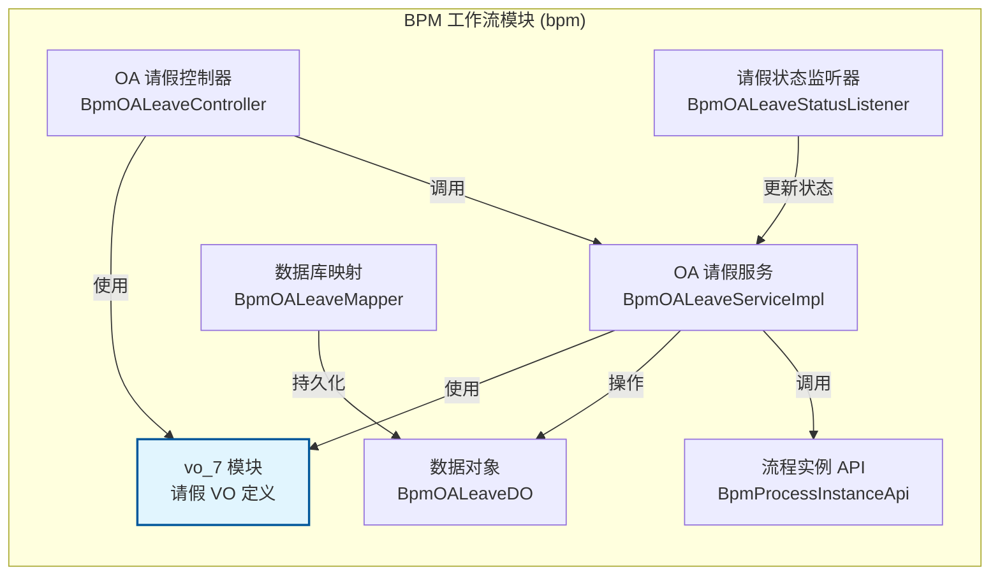
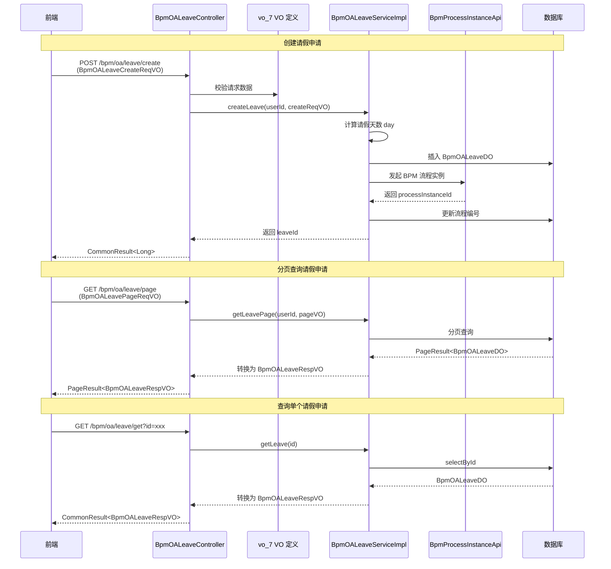

# 请假申请 VO 模块 (vo_7)

## 概述

**vo_7** 模块属于 [BPM 工作流模块](bpm.md) 的 OA 审批子模块，专门负责 **请假申请（Leave Application）** 的数据传输对象（VO）定义。该模块提供了请假申请的创建请求、分页查询请求以及结果响应的数据结构，是 OA 请假流程的前后端数据交互层。

通过该模块，前端可以向后端提交请假申请、查询请假列表，后端则将审批结果、流程状态等信息返回给前端。

## 架构位置

## 核心组件

### 1. BpmOALeaveCreateReqVO — 请假申请创建请求 VO

**文件**: `BpmOALeaveCreateReqVO.java`

用于接收前端提交的请假申请数据，包含以下字段：

| 字段 | 类型 | 说明 |
|------|------|------|
| `startTime` | `LocalDateTime` | 请假开始时间（必填） |
| `endTime` | `LocalDateTime` | 请假结束时间（必填） |
| `type` | `Integer` | 请假类型，参见 `bpm_oa_type` 字典枚举 |
| `reason` | `String` | 请假原因 |
| `startUserSelectAssignees` | `Map<String, List<Long>>` | 发起人自选审批人映射，key 为任务节点 key，value 为审批人用户编号列表 |

> **校验规则**：通过 `@AssertTrue` 注解确保结束时间不早于开始时间。

### 2. BpmOALeaveRespVO — 请假申请响应 VO

**文件**: `BpmOALeaveRespVO.java`

用于向后端向前端返回请假申请的详细信息，包含以下字段：

| 字段 | 类型 | 说明 |
|------|------|------|
| `id` | `Long` | 请假表单主键 |
| `type` | `Integer` | 请假类型，参见 `bpm_oa_type` 字典枚举 |
| `reason` | `String` | 请假原因 |
| `createTime` | `LocalDateTime` | 申请时间 |
| `startTime` | `LocalDateTime` | 请假开始时间 |
| `endTime` | `LocalDateTime` | 请假结束时间 |
| `processInstanceId` | `String` | 关联的流程实例编号 |
| `status` | `Integer` | 审批结果，参见 `BpmProcessInstanceStatusEnum` 枚举 |

### 3. BpmOALeavePageReqVO — 请假申请分页请求 VO

**文件**: `BpmOALeavePageReqVO.java`

用于分页查询请假申请列表，继承自 `PageParam`，提供以下查询条件：

| 字段 | 类型 | 说明 |
|------|------|------|
| `status` | `Integer` | 审批状态筛选 |
| `type` | `Integer` | 请假类型筛选 |
| `reason` | `String` | 原因模糊匹配 |
| `createTime` | `LocalDateTime[]` | 申请时间范围 |

> **继承说明**：`BpmOALeavePageReqVO` 继承自 `PageParam`，自动包含 `pageNo`（页码）和 `pageSize`（每页条数）两个分页参数。

## 数据流

## 模块依赖关系

| 依赖模块/组件 | 说明 |
|-------------|------|
| [BpmOALeaveDO](bpm.md) | 请假申请数据对象（DO），VO 与 DO 之间通过 `BeanUtils` 进行属性拷贝转换 |
| [BpmOALeaveController](bpm.md) | OA 请假控制器，使用 VO 作为入参和出参 |
| [BpmOALeaveServiceImpl](bpm.md) | OA 请假服务实现，处理业务逻辑并操作 VO/DO 转换 |
| [BpmProcessInstanceApi](bpm.md) | 流程实例 API，用于发起 BPM 工作流 |
| `BpmProcessInstanceStatusEnum` | 流程实例状态枚举，用于 `status` 字段 |
| `BpmTaskStatusEnum` | 任务状态枚举，用于 `BpmOALeaveDO.status` |
| `PageParam` | 分页参数基类，`BpmOALeavePageReqVO` 继承自该类 |

## 相关文档

- [BPM 工作流模块](bpm.md) — BPM 模块整体文档
- [OA 请假控制器](bpm.md) — 控制器层详情
- [OA 请假服务](bpm.md) — 服务层详情
- [流程实例 API](bpm.md) — 流程实例 API 详情

## 备注

- 请假天数（`day`）由服务层根据 `startTime` 和 `endTime` 自动计算，不在 VO 中暴露给前端
- 创建请求 VO 中提供了 `startUserSelectAssignees` 字段，支持发起人自选审批人功能
- 所有 VO 类均使用 `@Schema` 注解进行 Swagger 文档描述，便于生成 API 文档
