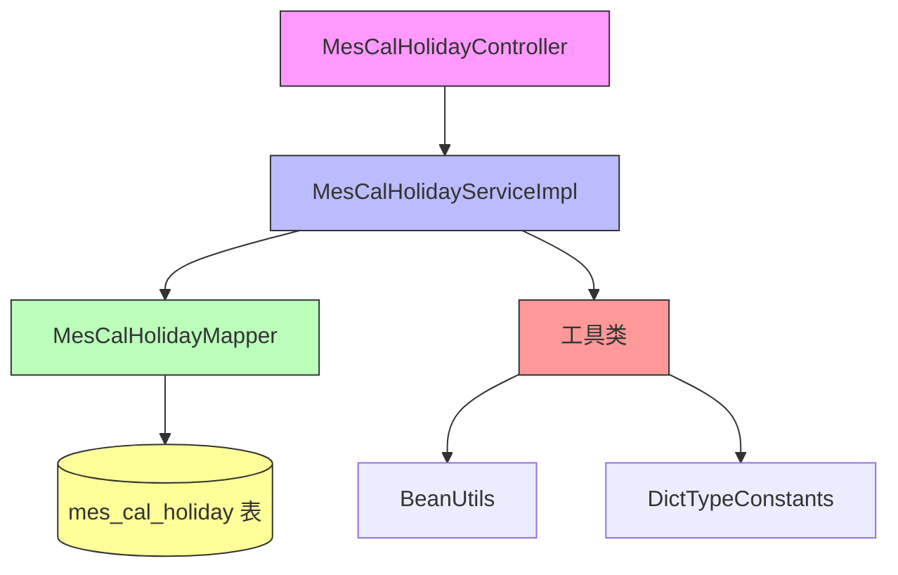
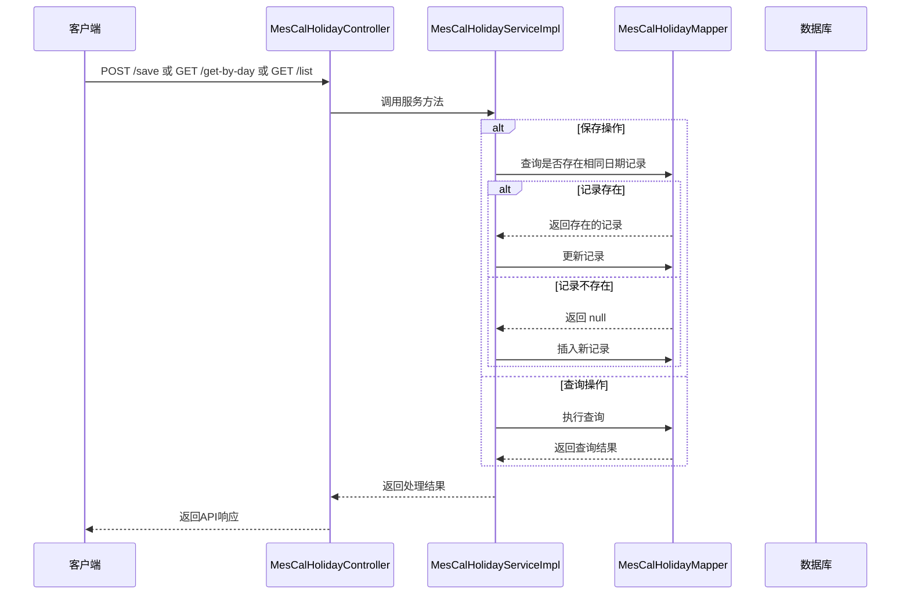

# vo_74 模块文档

## 模块概述

vo_74 模块是 Yudao 框架中 MES（制造执行系统）模块的一部分，专门负责管理假期设置。该模块提供了假期设置的增删改查功能，支持根据日期查询假期信息和批量获取假期列表。

## 架构概述

## 核心功能

### 1. 假期设置管理
- **保存/更新假期设置**：如果指定日期的假期记录已存在则更新，否则插入新记录
- **根据日期查询假期设置**：通过具体日期获取对应的假期信息
- **获取假期设置列表**：支持可选的日期范围过滤，不传参数则返回全量数据

### 2. 数据模型
- **MesCalHolidayDO**：数据库实体类，映射到 `mes_cal_holiday` 表
- **MesCalHolidayRespVO**：API响应值对象，用于返回假期设置数据
- **MesCalHolidaySaveReqVO**：API请求值对象，用于创建/更新假期设置

### 3. API 接口
- `POST /mes/cal/holiday/save`：保存或更新假期设置
- `GET /mes/cal/holiday/get-by-day`：根据日期获取假期设置
- `GET /mes/cal/holiday/list`：获取假期设置列表（支持日期范围过滤）

## 与其他模块的关系

vo_74 模块属于 MES 模块的日历管理子模块，与以下模块存在关联：

- **mes模块**：作为MES模块的一部分，与其他MES子模块（如班次管理、团队管理等）协同工作
- **系统模块**：使用了系统模块的通用工具类和常量定义
- **数据访问层**：通过MyBatis Mapper与数据库进行交互

## 详细组件说明

### MesCalHolidayController
REST控制器，处理假期设置相关的HTTP请求，提供了保存、查询和列表获取三个主要接口。

### MesCalHolidayServiceImpl
服务实现类，包含假期设置的核心业务逻辑：
- upsert逻辑：检查日期是否已存在，存在则更新，否则插入
- 列表查询：支持日期范围过滤
- 单条查询：根据具体日期获取记录

### MesCalHolidayDO
数据对象，映射到数据库表 `mes_cal_holiday`，包含以下字段：
- id：编号（主键）
- day：日期
- type：日期类型（关联字典常量 MES_CAL_HOLIDAY_TYPE）
- remark：备注

### 值对象
- **MesCalHolidayRespVO**：用于API响应，包含与DO相同的字段
- **MesCalHolidaySaveReqVO**：用于API请求，包含创建/更新所需的字段，并添加了验证注解

## 数据流程

## 配置和依赖

- 依赖于MyBatis进行数据库操作
- 使用了Yudao框架的通用工具类（BeanUtils）
- 使用了系统字典常量定义日期类型
- 遵循RESTful API设计原则
- 使用了Swagger/OpenAPI进行API文档标注
- 使用了Lombok简化代码编写
- 使用了Jakarta Validation进行参数验证

## 安全性

所有接口都通过了权限验证：
- 保存操作需要 `mes:cal-holiday:create` 权限
- 查询操作需要 `mes:cal-holiday:query` 权限

## 性能考虑

- 使用了主键索引进行快速查找
- 日期字段上建立了索引以支持范围查询
- 服务方法采用了简单的业务逻辑，响应时间快
- 列表查询支持分页（虽然当前实现未显示分页参数，但可以轻松扩展）

## 未来改进方向

1. 添加分页支持到列表查询接口
2. 增加批量删除功能
3. 添加假期导入/导出功能
4. 增加假期提醒或通知功能
5. 支持更复杂的假期规则（如周期性假期）